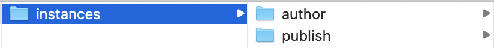
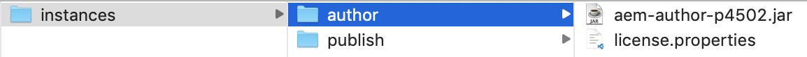
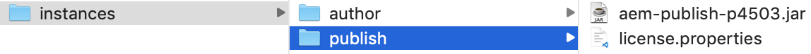
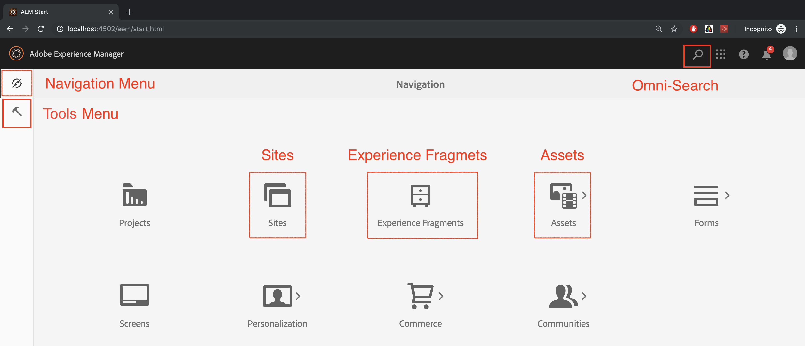

# Integrating Adobe Experience Manager with Adobe Target

In this section, we will discuss how to set up Adobe Experience Manager with Adobe Target for different scenarios. Based on your scenario and organizational requirements.

* **Add Adobe Target JavaScript Library (required for all scenarios)**
    For sites hosted on AEM, you can add Target libraries to your site using, [Launch](https://experienceleague.adobe.com/docs/launch/using/home.html). Launch provides a simple way to deploy and manage all tags necessary to power relevant customer experiences.
* **Add the Adobe Target Cloud Services (required for the Experience Fragments scenario)**
    For AEM customers, who would like to use Experience Fragment offers to create an activity within Adobe Target, you will need to integrate Adobe Target with AEM using the Legacy Cloud Services. This integration is required to push Experience Fragments from AEM to Target as HTML/JSON offers and to keep the offers in sync with AEM. *This integration is required for implementing scenario 1.*

## Prerequisites

* **Adobe Experience Manager (AEM){#aem}**
  * AEM 6.5 (*latest Service Pack is recommended*)
  * Download AEM WKND reference-site packages
    * [aem-guides-wknd.ui.apps-0.0.1-SNAPSHOT.zip](https://github.com/adobe/aem-guides-wknd/releases/download/archetype-18.1/aem-guides-wknd.ui.apps-0.0.1-SNAPSHOT.zip)
    * [aem-guides-wknd.ui.content-0.0.1-SNAPSHOT.zip](https://github.com/adobe/aem-guides-wknd/releases/download/archetype-18.1/aem-guides-wknd.ui.content-0.0.1-SNAPSHOT.zip)
    * [Core Components](https://github.com/adobe/aem-core-wcm-components/releases/download/core.wcm.components.reactor-2.5.0/core.wcm.components.all-2.5.0.zip)
    * [Digital Data Layer](assets/implementation/digital-data-layer.zip)

* **Experience Cloud**
  * Access to your organizations Adobe Experience Cloud - <https://>`<yourcompany>`.experiencecloud.adobe.com
  * Experience Cloud provisioned with the following solutions
    * [Adobe Experience Platform Launch](https://experiencecloud.adobe.com)
    * [Adobe Target](https://experiencecloud.adobe.com)
    * [Adobe I/O Console](https://console.adobe.io)

* **Environment**
  * Java 1.8 or Java 11 (AEM 6.5+ only)
  * Apache Maven (3.3.9 or newer)
  * Chrome

>[!NOTE]
>
> Customer needs to be provisioned with Experience Platform Launch and Adobe I/O from [Adobe support](https://helpx.adobe.com/contact/enterprise-support.ec.html) or reach out to your system administrator

### Set up AEM{#set-up-aem}

AEM author and publish instance is necessary to complete this tutorial. We have the author instance running on `http://localhost:4502` and publish instance running on `http://localhost:4503`. For more information see: [Set up a Local AEM Development Environment](https://helpx.adobe.com/experience-manager/kt/platform-repository/using/local-aem-dev-environment-article-setup.html).

#### Set up AEM Author and Publish Instances

1. Get a copy of the [AEM Quickstart Jar and a license.](https://helpx.adobe.com/experience-manager/6-5/sites/deploying/using/deploy.html#GettingtheSoftware)
2. Create a folder structure on your computer like the following:
    
3. Rename the Quickstart jar to `aem-author-p4502.jar` and place it beneath the `/author` directory. Add the `license.properties` file beneath the `/author` directory.
    
4. Make a copy of the Quickstart jar, rename it to `aem-publish-p4503.jar` and place it beneath the `/publish` directory. Add a copy of the `license.properties` file beneath the `/publish` directory.
    
5. Double click the `aem-author-p4502.jar` file to install the Author instance. This will start the author instance, running on port 4502 on the local computer.
6. Sign In using the credentials below, and upon successful login, you will be directed to the AEM Home Page Screen.
   username : **admin**
   password : **admin**
    
7. Double click the `aem-publish-p4503.jar` file to install a publish instance. You can notice a new tab open up in your browser for your publish instance, running on port 4503 and displaying the WeRetail home page. We will be using the WKND reference site for this tutorial and let's install the packages on author instance.
8. Navigate to AEM Author in your web browser at `http://localhost:4502`. On the AEM Start screen, navigate to *[Tools > Deployment > Packages](http://localhost:4502/crx/packmgr/index.jsp)*.
9. Download and Upload the packages for AEM (listed above under *[Prerequisites > AEM](#aem)*)
    * [aem-guides-wknd.ui.apps-0.0.1-SNAPSHOT.zip](https://github.com/adobe/aem-guides-wknd/releases/download/archetype-18.1/aem-guides-wknd.ui.apps-0.0.1-SNAPSHOT.zip)
    * [aem-guides-wknd.ui.content-0.0.1-SNAPSHOT.zip](https://github.com/adobe/aem-guides-wknd/releases/download/archetype-18.1/aem-guides-wknd.ui.content-0.0.1-SNAPSHOT.zip)
    * [core.wcm.components.all-2.5.0.zip](https://github.com/adobe/aem-core-wcm-components/releases/download/core.wcm.components.reactor-2.5.0/core.wcm.components.all-2.5.0.zip)
    * [digital-data-layer.zip](assets/implementation/digital-data-layer.zip)

    >[!VIDEO](https://video.tv.adobe.com/v/28377?quality=12&learn=on)
10. After installing the packages on AEM Author, select each uploaded package in AEM Package Manager, and select **More > Replicate** to ensure the packages are deployed to AEM Publish.
11. At this point, you have successfully installed your WKND reference site and all additional packages required for this tutorial.

[NEXT CHAPTER](./using-launch-adobe-io.md): In the next chapter, you will be integrating Launch with AEM.
