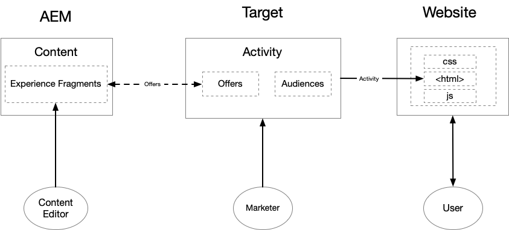
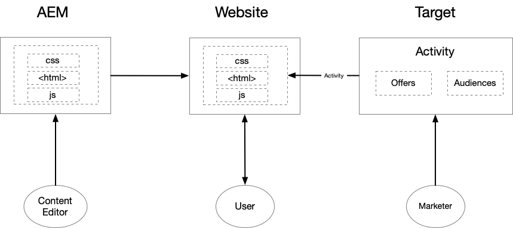
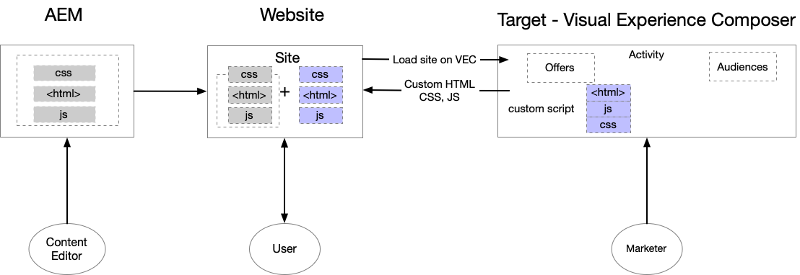

# Getting Started with AEM and Adobe Target {#getting-started-with-aem-target}

AEM and Target are both powerful solutions with seemingly overlapping capabilities. Customers sometimes struggle with understanding how and when to use these products in conjunction to deliver personalized experience. To deliver optimized experience for every end user, different teams within your organization should work closely and define who does what.

In this tutorial, we cover three different scenarios for AEM and Target, which helps you understand what works best for your organization and how different teams collaborate.

* Scenario 1 : Personalization using AEM Experience Fragments
* Scenario 2 : Personalization of Full Web Page Experiences
* Scenario 3 : Personalization using Visual Experience Composer

## Personalization using AEM Experience Fragments {#personalization-using-aem-experience-fragment}

For this scenario, we are going to use AEM and Target. Clearly, both the products have their own strengths, and when it comes to delivering personalized experiences to your site's users, you need **personalized content (content from AEM)** and an **intelligent way (Target)** to serve these content based on a specific user.

AEM helps you create personalized content, bringing together all of your content and assets in a central location to fuel your personalization strategy. AEM lets you easily create content for desktops, tablets, and mobile devices in one place without writing code. There’s no need to create pages for every device—AEM automatically adjusts each experience using your content. You can also export the content from AEM to Adobe Target as offers with push of a button.

We now have personalized content in the form of Offers from AEM in Target. Target lets you deliver these offers at scale based on a combination of rules-based and AI-driven machine learning approaches that incorporate behavioral, contextual, and offline variables.  With Target, you can easily set up and run A/B and Multivariate (MVT) activities to determine the best offers, content, and experiences.

**Experience fragments** represent a huge step forward to link the content/experience creators to the personalization professionals who are driving business outcomes using Target.

* AEM content editor authors personalized content as Experience Fragments and its variations
* AEM exports Experience Fragment HTML to Target​
* Target​ uses AEM Experience Fragment markup as Offers in Activities
* Target delivers Experience Fragment HTML, AEM provides referenced images

    

### To implement this scenario, you need to:

* [Integrate AEM and Adobe Target using Launch and Adobe I/O](./implementation.md#integrating-aem-target-options)
* [AEM and Adobe Target using Legacy Cloud Services](./implementation.md#integrating-aem-target-options)

***After implementing the above integrations, lets explore the [scenario in detail](./personalization-use-case-1.md).***

## Personalization of Full Web Page Experiences

Integrating Adobe Experience Manager with Adobe Target helps you deliver a personalized experience to your site users. Additionally, it also helps you better understand what versions of your website content best improve your conversions during a specified test period. For example, an A/B test compares two or more versions of your website content to see which best lifts your conversions, sales, or other metrics you identify. A marketer can create activities within Adobe Target to understand how users interact with your site's content and how it affects your site metrics.

* Content resides in AEM, and content editors create and manage the site pages
* Target​ uses AEM hosted site pages to run tests and personalization
* Target delivers personalized content
* No net new content is created here
* Applies to both AEM and non-AEM sites

    

### To implement this scenario, you need to:

* [Integrate AEM and Adobe Target using Launch and Adobe I/O](./implementation.md#integrating-aem-target-options)

***After implementing the above integration, lets explore the [scenario in detail](./personalization-use-case-2.md)***

## Personalization using Visual Experience Composer

Marketers can make quick changes on their website without changing any code to run a test using Adobe Target's Visual Experience Composer (VEC). The VEC is WYSIWYG (What you see is what you get) user interface that lets you easily create and test personalized experiences and Offers in the site context. You can create experiences and Offers for Target activities by dragging and dropping, swapping, and modifying the layout and content of a web page (or Offer) or mobile web page.

VEC is one of the main features of Adobe Target. The VEC lets marketers and designers create and change content using a visual interface. Many design choices can be made without requiring direct editing of the code. Editing HTML and JavaScript is also possible using the editing options available in the composer.

* Content resides in AEM, and content editors create and manage the site pages
* Target uses AEM hosted site pages to run tests and personalization
* Target delivers personalized content
* Net new content is created using Adobe Target's VEC
* Applies to both AEM hosted sites and non-AEM hosted sites

    

### To implement this scenario, you need to:

* [Integrate AEM and Adobe Target using Launch and Adobe I/O](./implementation.md#integrating-aem-target-options)

***After implementing the above integration, lets explore the [scenario in detail](./personalization-use-case-3.md)***
