# Personalization using AEM Experience Fragments and Adobe Target

With the ability to export AEM Experience Fragments into Adobe Target as HTML offers, you can combine the ease-of-use and power of AEM with powerful Automated Intelligence (AI) and Machine Learning (ML) capabilities in Target to test and personalize experiences at scale.

AEM brings together all of your content and assets in a central location to fuel your personalization strategy. AEM lets you easily create content for desktops, tablets, and mobile devices in one location without writing code. There is no need to create pages for every device—AEM automatically adjusts each experience using your content.

Target lets you deliver personalized experiences at scale based on a combination of rules-based and AI-driven machine learning approaches that incorporate behavioral, contextual, and offline variables.  With Target, you can easily set up and run A/B and Multivariate (MVT) activities to determine the best offers, content, and experiences.

Experience fragments represent a huge step forward to link content creators with marketers who are driving business outcomes using Target.

## Scenario Overview

WKND site is planning to announce a **SkateFest Challenge** across America through their website and would like to have their site users sign up for the audition conducted in each state. As a marketer, you have been assigned the task to run a campaign on the WKND site home page, with banners messages relevant to the users' location and a link to the event details page. Let us explore the WKND site home page and learn how to create and deliver a personalized experience for a user based on his/her current location.

### Users Involved

For this exercise, the following users need to be involved and to perform some tasks you might need administrative access.

* **Content Producer / Content Editor** (Adobe Experience Manager)
* **Marketer** (Adobe Target / Optimization Team)

### Prerequisites

* **AEM**
  * [AEM author and publish instance](./implementation.md#getting-aem) running on localhost 4502 and 4503 respectively.
* **Experience Cloud**
  * Access to your organizations Adobe Experience Cloud - `https://<yourcompany>.experiencecloud.adobe.com`
  * Experience Cloud provisioned with the following solutions
    * [Adobe Target](https://experiencecloud.adobe.com)

### WKND Site Home Page

 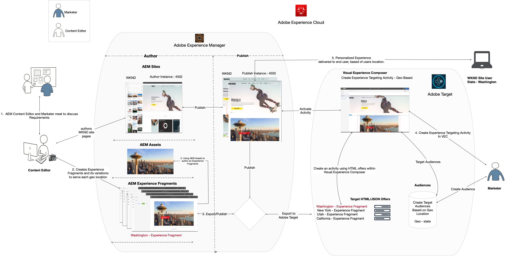

1. Marketer initiates the WKND SkateFest campaign discussion with AEM Content Editor and details the requirements.
   * ***Requirement***: Promote WKND SkateFest campaign on WKND site home page with personalized content for visitors from each state in the United States. Add a new content block beneath the Home Page Carousel containing a background image, text, and a button.
     * **Background Image**: Image should be relevant to the state from which the user is visiting the WKND Site page.
     * **Text**: "Sign Up for the Auditions"
     * **Button**: "Event Details" pointing to the WKND SkateFest Page
     * **WKND SkateFest Page**: a new page with event details, including the audition venue, date, and time.
1. Based on the requirements, AEM Content Editor creates an Experience Fragment for the content block and exports it to Adobe Target as an Offer. To serve personalized content for all states in the United States, content author can create one Experience Fragment master variation and then create 50 other variations, one for each state. Content for each state variation with relevant images and text can then be edited manually. When authoring an Experience Fragment, content editors can quickly access all the assets available within AEM Assets using the Asset Finder option. When an Experience Fragment gets exported to Adobe Target, all its variations are also pushed to Adobe Target as Offers.

1. After exporting Experience Fragment from AEM to Adobe Target as Offers, marketers can create an Activities in Target using these Offers. Based on the WKND site SkateFest campaign, marketer needs to create and deliver a personalized experience to WKND site visitors from each state. To create an Experience Targeting activity, the marketer needs to identify the audiences. For our WKND SkateFest campaign, we need to create 50 separate audiences, based on their location from which they are visiting the WKND website.
   * [Audiences](https://experienceleague.adobe.com/docs/target/using/introduction/target-key-concepts.html#section_3F32DA46BDF947878DD79DBB97040D01) define the target for your activity and are used anywhere where targeting is available. Target audiences are a defined set of visitor criteria. Offers can be targeted to specific audiences (or segments). Only visitors who belong to that audience see the experience that is targeted to them.  For example, you can deliver an offer to an audience made up of visitors who use a particular browser or from a specific geo-location.
   * An [Offer](https://experienceleague.adobe.com/docs/target/using/introduction/target-key-concepts.html#section_973D4CC4CEB44711BBB9A21BF74B89E9) is the content that gets displayed on your webpages during campaigns or activities. When you test your webpages, you measure the success of each experience with different offers in your locations. An Offer can contain different types of content, including:
     * Image
     * Text
     * **HTML**
       * *HTML Offers are used for this scenario's Activity*
     * Link
     * Button

## Content Editor Activities

>[!VIDEO](https://video.tv.adobe.com/v/28596?quality=12&learn=on)

>[!NOTE]
>
>Publish the Experience Fragment before exporting it to Adobe Target.

## Marketer Activities

### Create an Audience with Geo-Targeting {#marketer-audience}

1. Navigate to your organizations [Adobe Experience Cloud](https://experiencecloud.adobe.com/) (`<https://<yourcompany>.experiencecloud.adobe.com`)
1. Log in using your Adobe ID, and make sure you are in the correct Organization.
1. From the solution switcher, click on **Target** and then **launch** Adobe Target.

    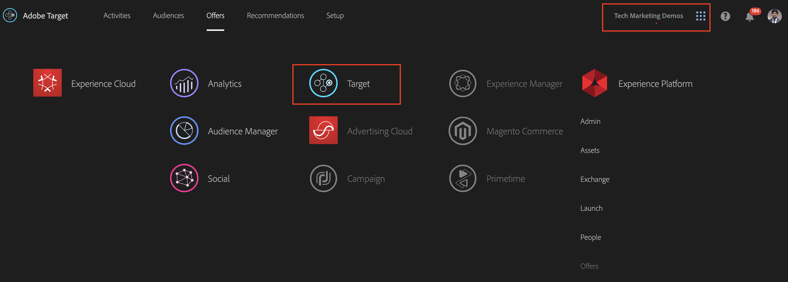

1. Navigate to the **Offers** tab and search for "WKND" offers. You should be able to see the list of Experience Fragments variations, exported from AEM as HTML Offers. Each Offer corresponds to a state. For example, *WKND SkateFest California* is the offer that gets served to a WKND Site visitor from California.

    

1. From the main navigation, click on **Audiences**.

   A Marketer needs to create 50 separate audiences for WKND site visitors coming from each state in the United States of America.

1. To create an audience, click on **Create Audience** button, and provide a name for your audience.

    **Audience Name format : WKND-\<*state*\>**

    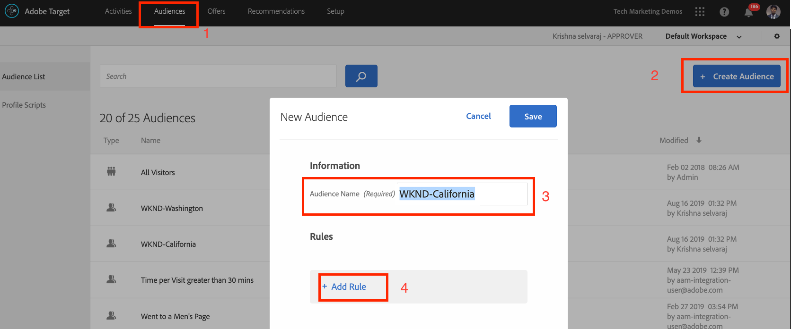

1. Click **Add Rule > Geo**.
1. Click **Select**, then select one of the following options:
    * Country
    * **State** *(Select State for WKND Site SkateFest Campaign)*
    * City
    * Zip Code
    * Latitude
    * Longitude
    * DMA
    * Mobile Carrier

    **Geo** - Use audiences to target users based on their geographical location, including their country, state/province, city, zip/postal code, DMA, or mobile carrier. Geolocation parameters allow you to target activities and experiences based on your visitors' geography. This data is sent with each Target request and is based on the visitor's IP address. Select these parameters just like any targeting values.

    >[!NOTE]
    >A visitor's IP address gets passed with a mbox request, once per visit (session), to resolve geo targeting parameters for that visitor.

1. Select the operator as **matches**, provide an appropriate value (For eg: California) and **Save** your changes. In our case, provide the state name.

    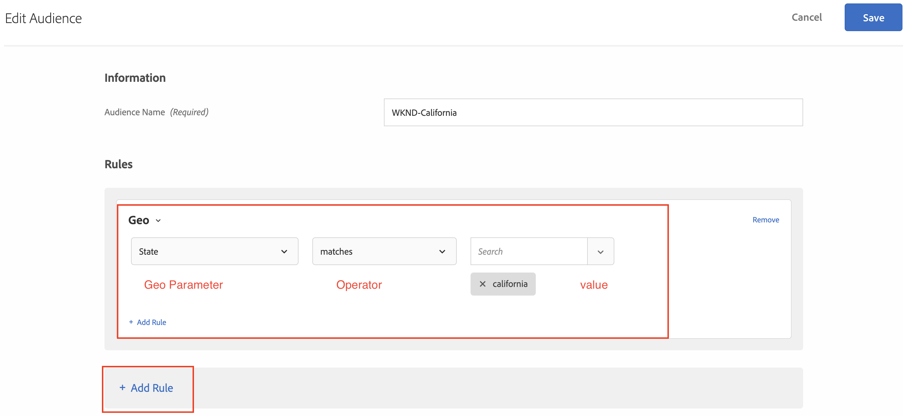

    >[!NOTE]
    >You can have multiple rules assigned to an audience.

1. Repeat steps 6-9 to create audiences for the other states.

    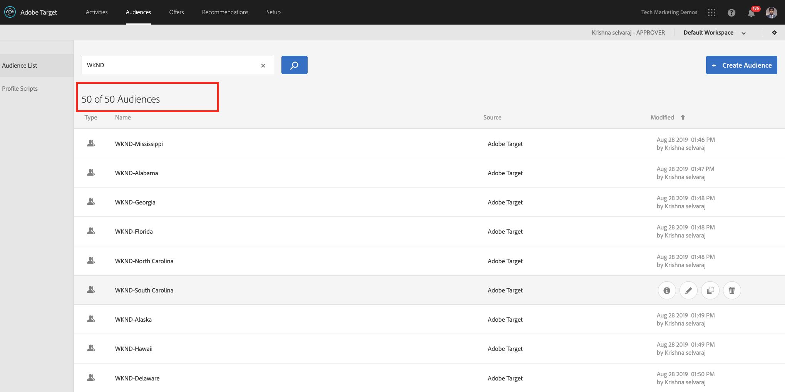

At this point, we have successfully created audiences for all WKND Site visitors across different states in the United States of America and also have the corresponding HTML offer for each state. So now let's create an Experience Targeting activity to target the audience with a corresponding offer for the WKND Site Home Page.

### Create an Activity with Geo-Targeting

1. From your Adobe Target window, navigate to **Activities** tab.
1. Click **Create Activity** and select the **Experience Targeting** activity type.
1. Select the **Web** channel and choose the **Visual Experience Composer**.
1. Enter the **Activity URL** and click **Next** to open the Visual Experience Composer.

    WKND Site Home Page Publish URL: http://localhost:4503/content/wknd/en.html

    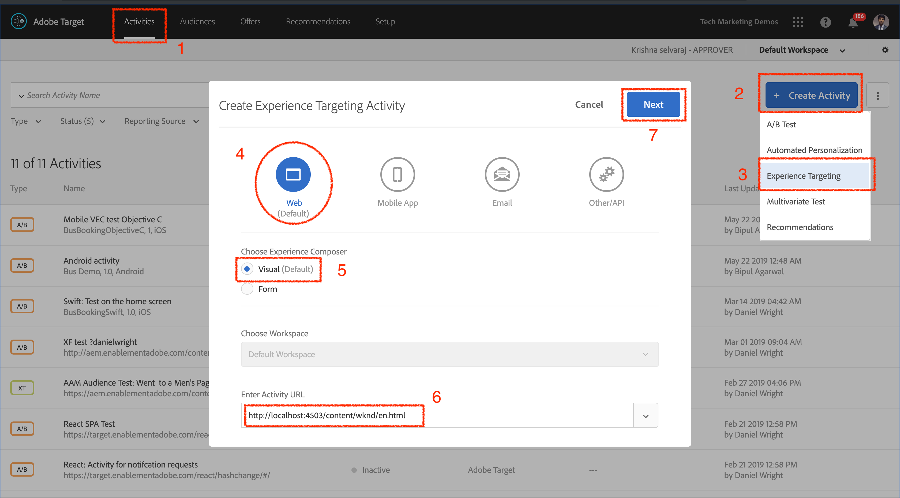

1. For **Visual Experience Composer** to load, enable **Allow Load Unsafe scripts** on your browser and reload your page.

    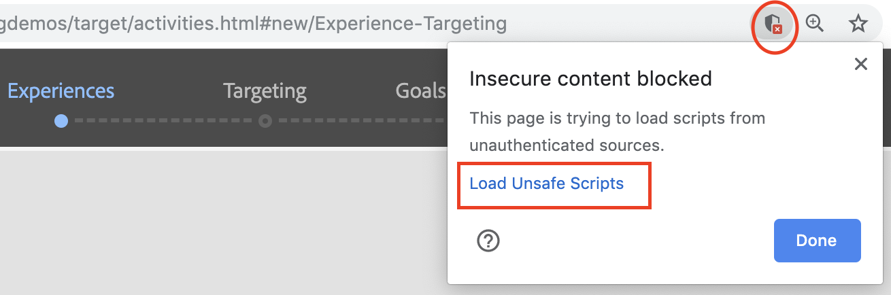

1. Notice the WKND Site home page open in Visual Experience Composer editor.

    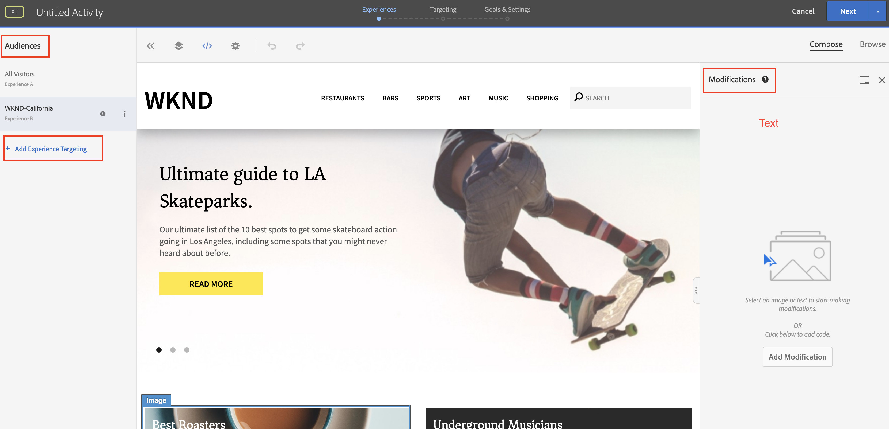

1. To add an audience to your VEC, click on **Add Experience Targeting** under Audiences, and select the WKND-California audience and Click **Next**.

    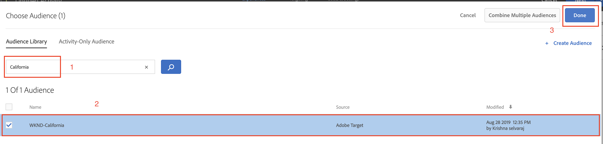

1. Click on the WKND site page within VEC, select the HTML element to add the offer for WKND-California audience, and choose **Replace With** option and then select the **HTML Offer**.

    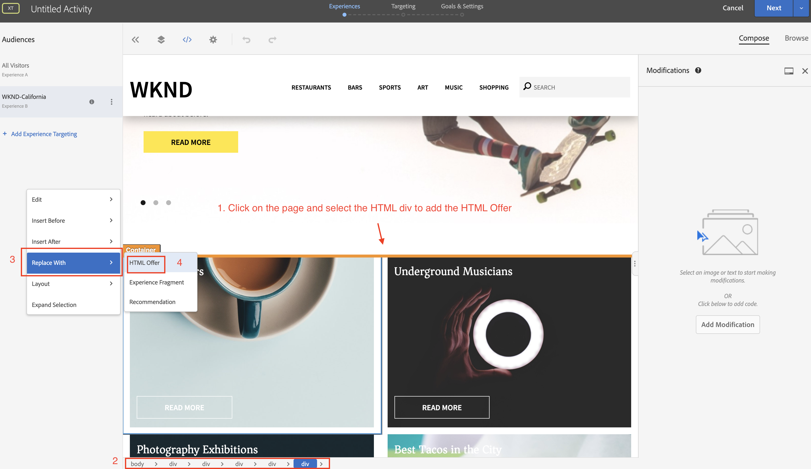

1. Select the **WKND SkateFest California** HTML offer for the **WKND-California** audience from the offer select UI and Click **Done**.
1. You should now be able to see the **WKND SkateFest California** HTML Offer added to your WKND Site page for the WKND-California audience.
1. Repeat steps 7-10 to add Experience Targeting for the other states and choose the corresponding HTML Offer.
1. Click **Next** to continue, and you can see a mapping for Audiences to Experiences.
1. Click **Next** to move to Goals and Settings.
1. Choose your reporting source and identify a primary goal for your activity. For our Scenario, let's select the Reporting Source as **Adobe Target**, measuring activity as **Conversion**, action as viewed a page, and URL pointing to the WKND SkateFest Details page.

    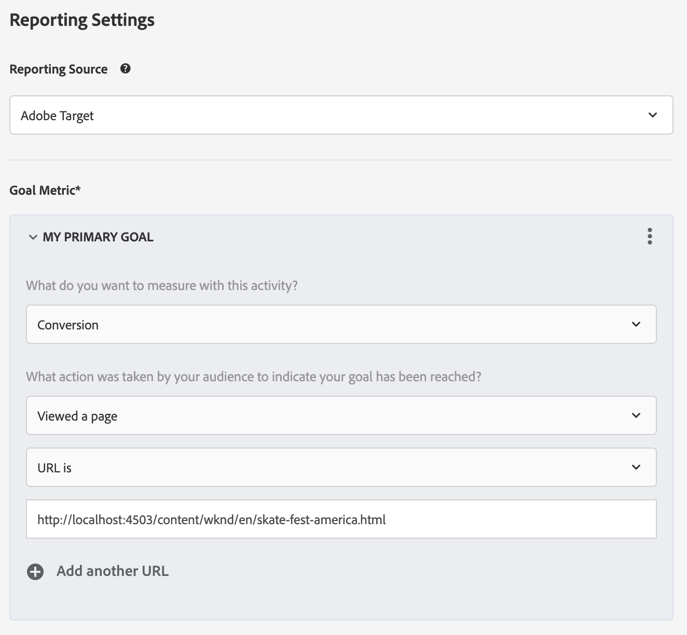

    >[!NOTE]
    >You can also choose Adobe Analytics as your reporting source.

1. Hover over the current activity name, and you can rename it to **WKND SkateFest - USA**, and then **Save and Close** your changes.
1. From the Activity details screen, make sure to **Activate** your activity.

    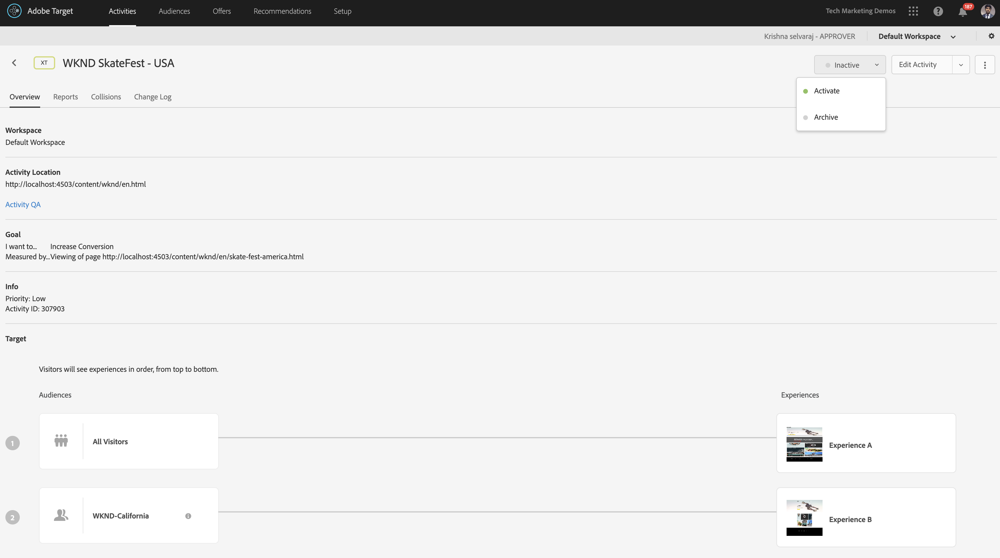

1. Your WKND SkateFest Campaign is now live to all WKND Site visitors.
1. Navigate to the [WKND Site Home Page](http://localhost:4503/content/wknd/en.html), and you should be able to see the WKND SkateFest Offer based off your geo-location (*state: California*).

    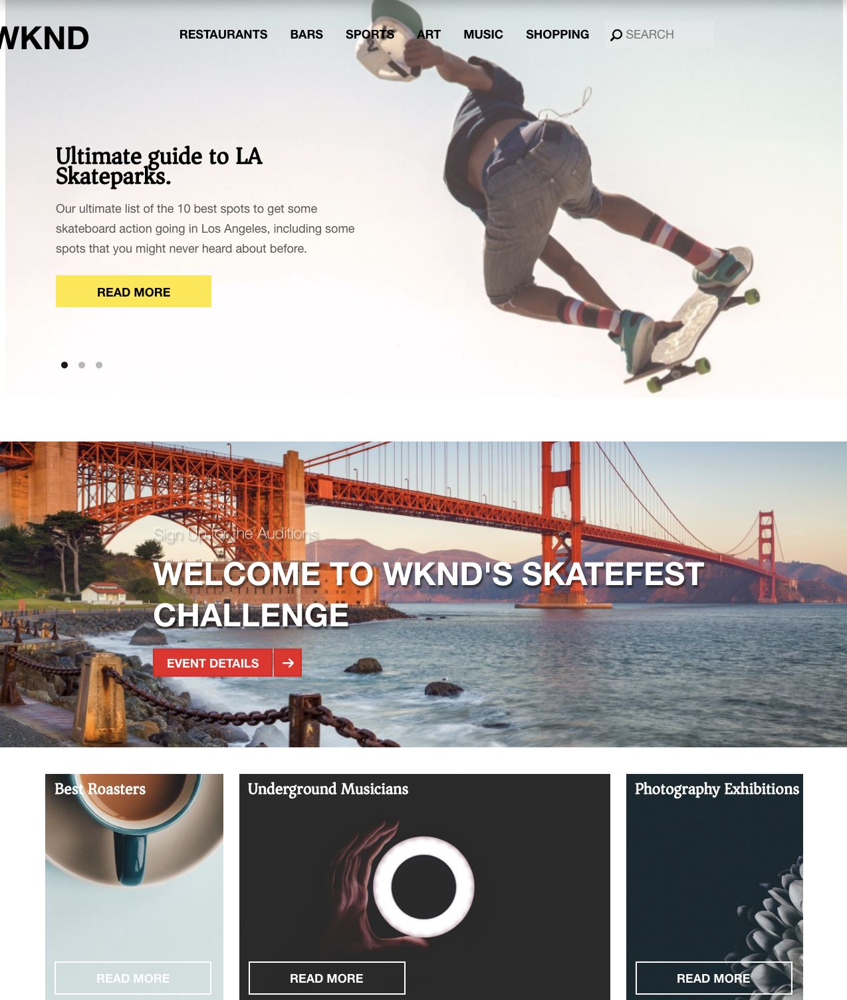

### Target Activity QA

1. Under **Activity Details > Overview** tab, click on the **Activity QA** button, and you can get the direct QA link to all your experiences.

    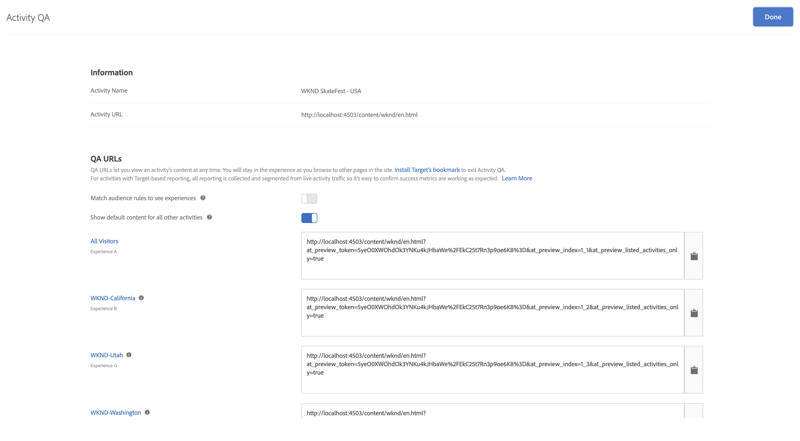

1. Navigate to the [WKND Site Home Page](http://localhost:4503/content/wknd/en.html), and you should be able to see the WKND SkateFest Offer based off your geo-location (state).
1. Watch the video below to understand how an offer gets delivered to your page, how to customize response tokens, and to perform a quality check.

>[!VIDEO](https://video.tv.adobe.com/v/28658?quality=12&learn=on)

## Summary

In this chapter, a content editor was able to create all the content to support the WKND SkateFest campaign within Adobe Experience Manager and export it to Adobe Target as HTML Offers, for creating Experience Targeting, based off users geo-location.
