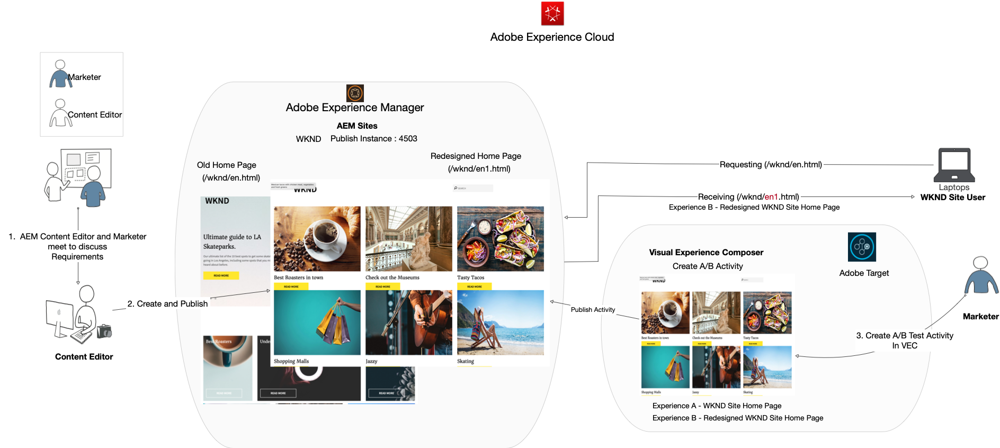
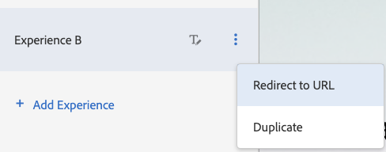
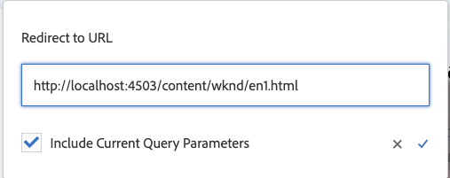
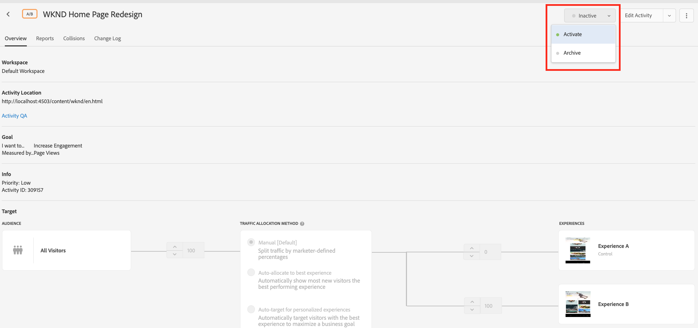
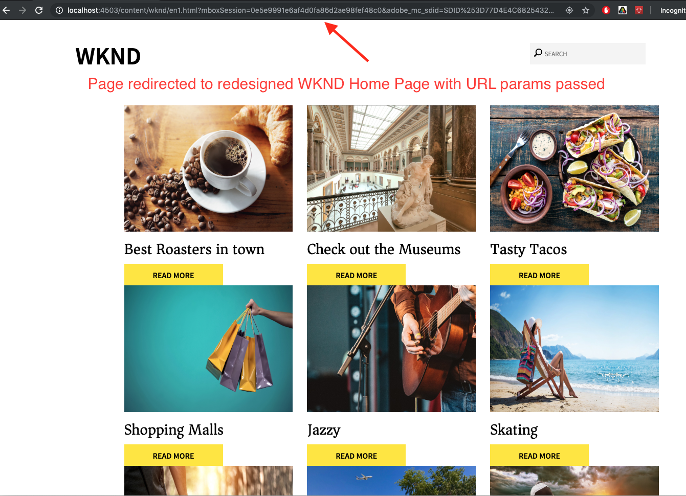

# Personalization of full web page experiences using Adobe Target

In the previous chapter, we learned how to create a geo-location based activity within Adobe Target using content created as Experience Fragments and exported from AEM as HTML Offers.

In this chapter, we'll explore creating activity to redirect your site pages that are hosted on AEM to a new page using Adobe Target.

## Scenario overview

WKND site redesigned their home page and would like to redirect their current home page visitors to the new home page. At the same time, also understand how the redesigned home page helps to improve user engagement and revenue. As a marketer, you have been assigned the task to create an activity to redirect the visitors to the new home page. Let us explore the WKND site home page and learn how to create an activity using Adobe Target.

### Users involved

For this exercise, the following users need to be involved and to perform some tasks you might need administrative access.

* **Content Producer/Content Editor** (Adobe Experience Manager)
* **Marketer** (Adobe Target / Optimization Team)

### WKND site home page

 

### Prerequisites

* **AEM**
  * [AEM author and publish instance](./implementation.md#getting-aem) running on localhost 4502 and 4503 respectively.
  * [AEM integrated with Adobe Target using tags](./using-launch-adobe-io.md#aem-target-using-launch-by-adobe)
* **Experience Cloud**
  * Access to your organizations Adobe Experience Cloud - `https://<yourcompany>.experiencecloud.adobe.com`
  * Experience Cloud provisioned with the following solutions
    * [Adobe Target](https://experiencecloud.adobe.com)

## Content editor activities

1. The Marketer initiates the WKND Home Page redesign discussion with AEM Content Editor and details the requirements.
   * ***Requirement*** : Redesign WKND Site Home Page with card-based design.
2. Based on the requirements, AEM Content Editor then creates a new WKND Site home page with a card-based design and publishes the new home page.

## Marketer activities

1. Marketer creates an A/B target activity with the redirect offer as an Experience and 100% website traffic allotted to the new home page with success goal and metrics added.
   1. From your Adobe Target window, navigate to **Activities** tab.
   2. Click **Create Activity** button and select the activity type as **A/B Test**
    
   3. Select the **Web** channel and choose the **Visual Experience Composer**.
   4. Enter the **Activity URL** and Click **Next** to open the Visual Experience Composer.
    
   5. For **Visual Experience Composer** to load, enable **Allow Load Unsafe scripts** on your browser and reload your page.
    
   6. Notice the WKND Site home page open in Visual Experience Composer editor.
    
   7. Hover over **Experience B** and select view other options.
    
   8. Select **Redirect to URL** option and enter the URL to the new WKND Home Page. (http://localhost:4503/content/wknd/en1.html)
    
   9. **Save** your changes and continue with the next steps of Activity Creation.
   10. Select the **Traffic Allocation Method** as manual and allot 100% traffic to **Experience B**.
    
   11. Click **Next**.
   12. Provide **Goal Metrics** for your Activity and Save and Close your A/B Test.
    
   13. Provide a name (**WKND Home Page Redesign**) for your Activity and save your changes.
   14. From the Activity details screen, make sure to **Activate** your activity.
    
   15. Navigate to WKND Home Page (http://localhost:4503/content/wknd/en.html) and you are redirected to the redesigned WKND Site Home Page (http://localhost:4503/content/wknd/en1.html).
     

## Summary

In this chapter, a marketer was able to create an activity to redirect your site pages that are hosted on AEM to a new page using Adobe Target.
