# Personalization using Visual Experience Composer

In this chapter, we'll explore creating experiences using **Visual Experience Composer** by dragging and dropping, swapping, and modifying the layout and content of a web page from within Target.

## Scenario Overview

WKND site home page displays local activities or best thing to do around a city in the form of card layouts. As a marketer, you have been assigned the task to modify the home page, by re-arranging the card layouts to see how it affects user engagement and drives conversion.

### Users Involved

For this exercise, the following users need to be involved and to perform some tasks you might need administrative access.

* **Content Producer/Content Editor** (Adobe Experience Manager)
* **Marketer** (Adobe Target / Optimization Team)

### WKND Site Home Page

 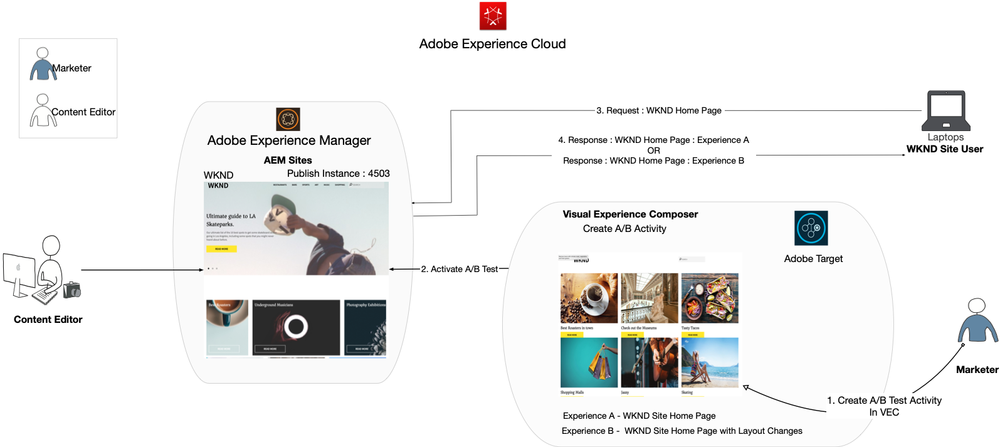

### Prerequisites

* **AEM**
  * [AEM publish instance](./implementation.md#getting-aem) running on 4503
  * [AEM integrated with Adobe Target using Adobe Experience Platform Launch](./using-launch-adobe-io.md#aem-target-using-launch-by-adobe)
* **Experience Cloud**
  * Access to your organizations Adobe Experience Cloud - <https://>`<yourcompany>`.experiencecloud.adobe.com
  * Experience Cloud provisioned with [Adobe Target](https://experiencecloud.adobe.com)

## Marketer Activities

1. The Marketer creates an A/B target activity within Adobe Target.
   1. From your Adobe Target window, navigate to **Activities** tab.
   2. Click **Create Activity** button and select the activity type as **A/B Test**
    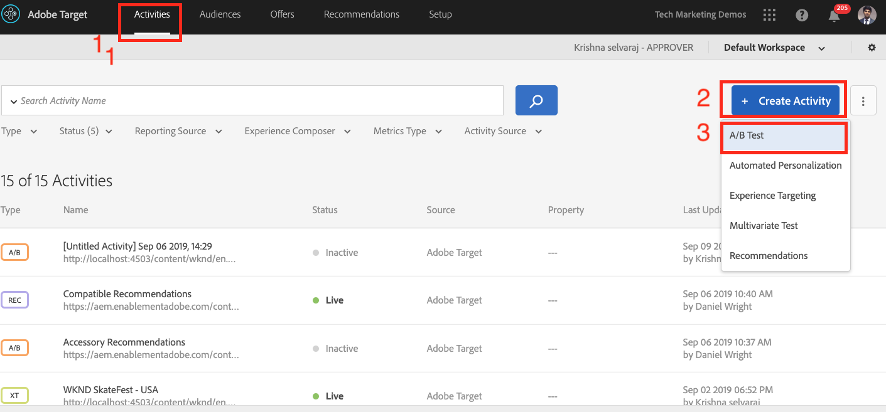
   3. Select the **Web** channel and choose the **Visual Experience Composer**.
   4. Enter the **Activity URL** and Click **Next** to open the Visual Experience Composer.
    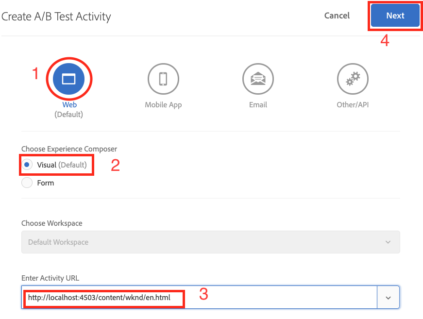
   5. For **Visual Experience Composer** to load, enable **Allow Load Unsafe scripts** on your browser and reload your page.
    
   6. Notice the WKND Site home page open in Visual Experience Composer editor.
    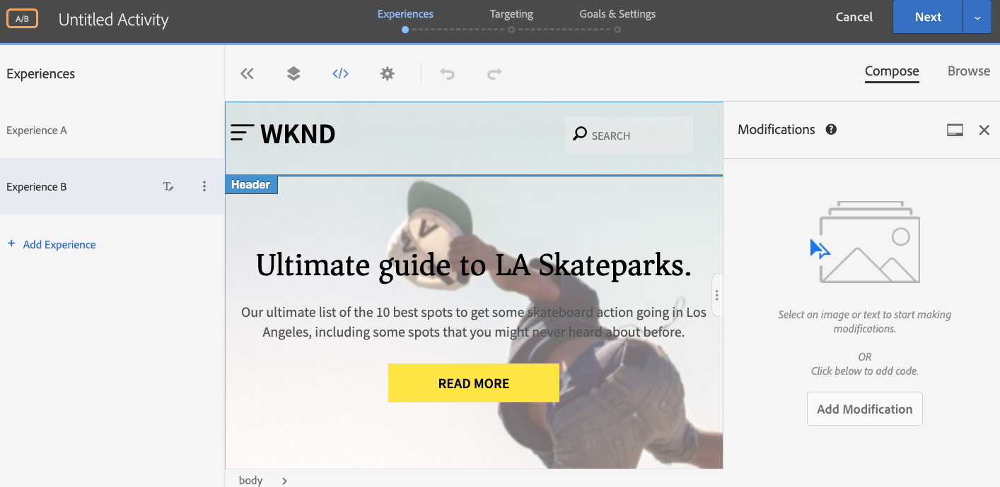
   7. **Experience A** provides the default WKND Home Page, and let's edit the content layout for **Experience B**.
    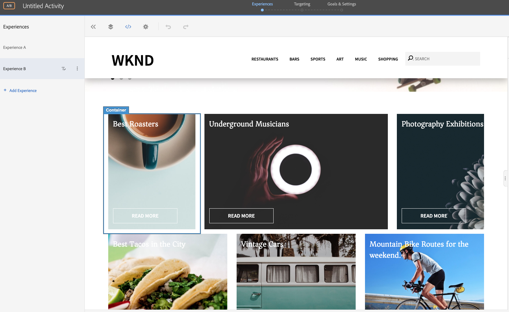
   8. Click on one of the card layout container (*Best Roasters*) and select **Rearrange** option.
    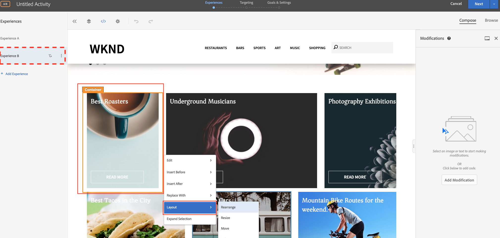
   9. Click on the container that you would like to rearrange and drag-drop it to the desired location. Let's rearrange the *Best Roasters* container from 1st row 1st column to 1st row 3rd column. Now the *Best Roasters* container will be next to *Photography Exhibitions* container.
    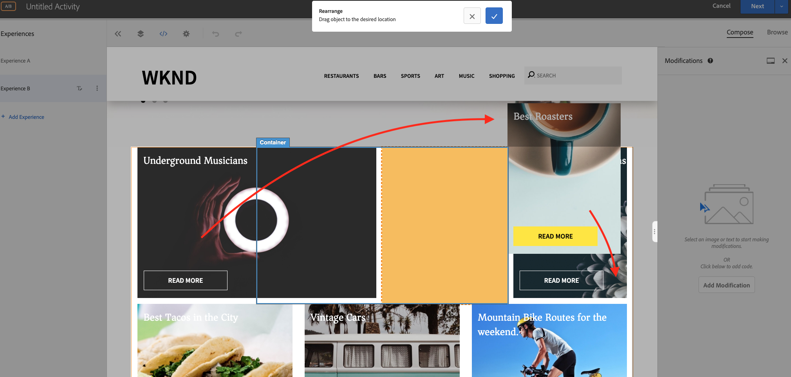
    **After Swap**
    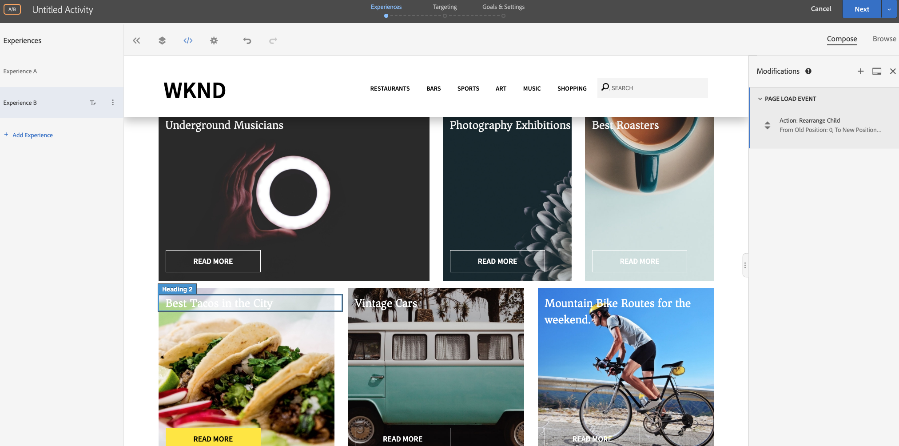
   10. Similarly, rearrange positions for the other card containers.
    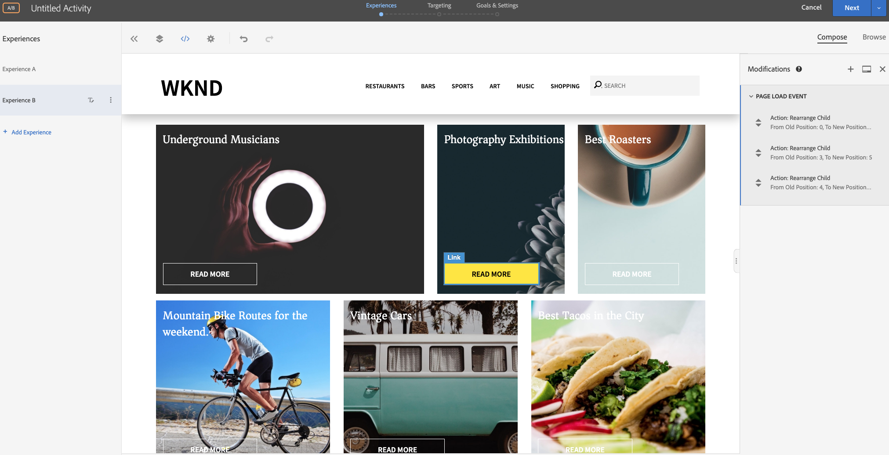
   11. Let's also add a header text beneath the carousel component and above the card layout.
   12. Click on the carousel container and Select the **Inset After > HTML** option to add HTML.
    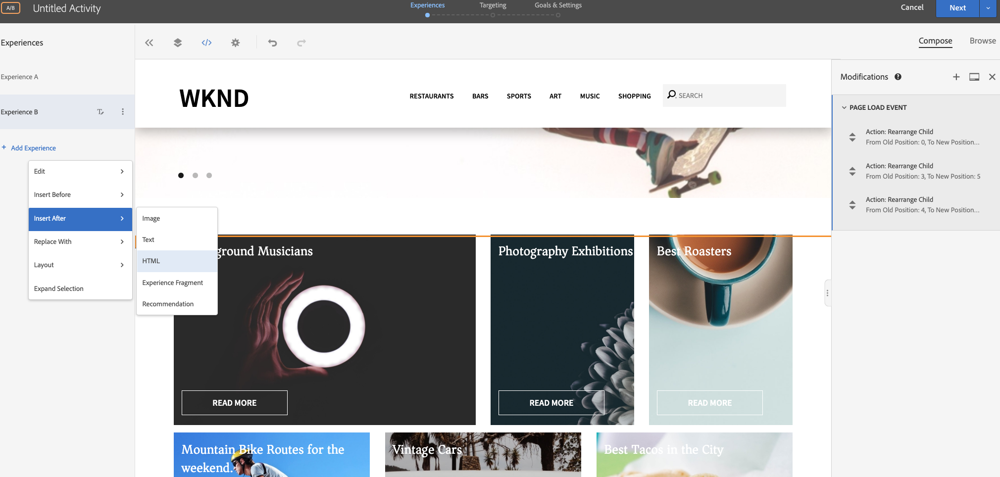

        ``` html
        <h1 style="text-align:center">Check Out the Hot Spots in Town</h1>
        ```

        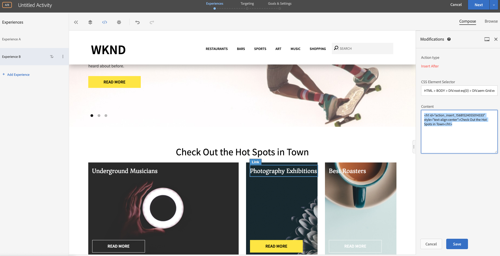
   13. Click **Next** to continue with your activity.
   14. Select the **Traffic Allocation Method** as manual and allot 100% traffic to **Experience B**.
    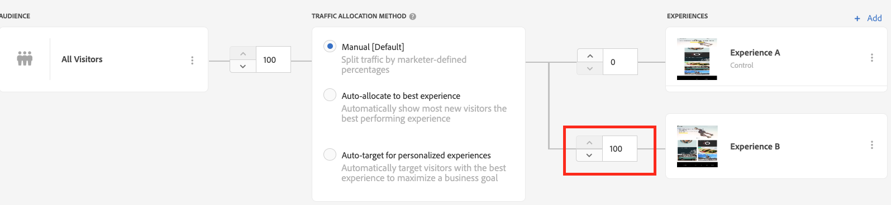
   15. Click **Next**.
   16. Provide **Goal Metrics** for your Activity and Save and Close your A/B Test.
    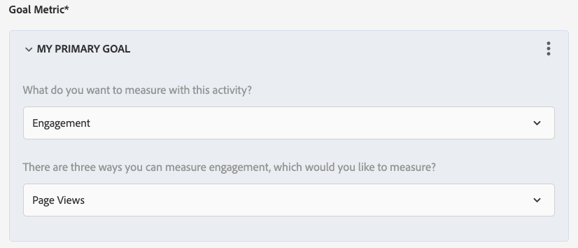
   17. Provide a name (**WKND Home Page Refresh**) for your Activity and save your changes.
   18. From the Activity details screen, make sure to **Activate** your activity.
    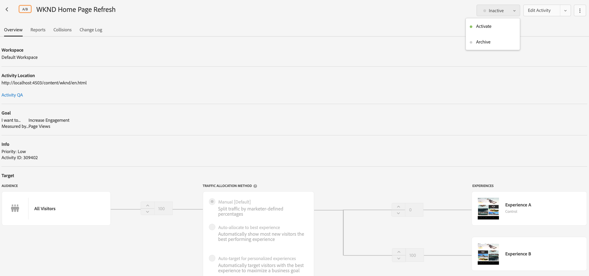
   19. Navigate to WKND Home Page (http://localhost:4503/content/wknd/en.html), and you notice the changes we added to the WKND Home Page Refresh A/B Test activity.
     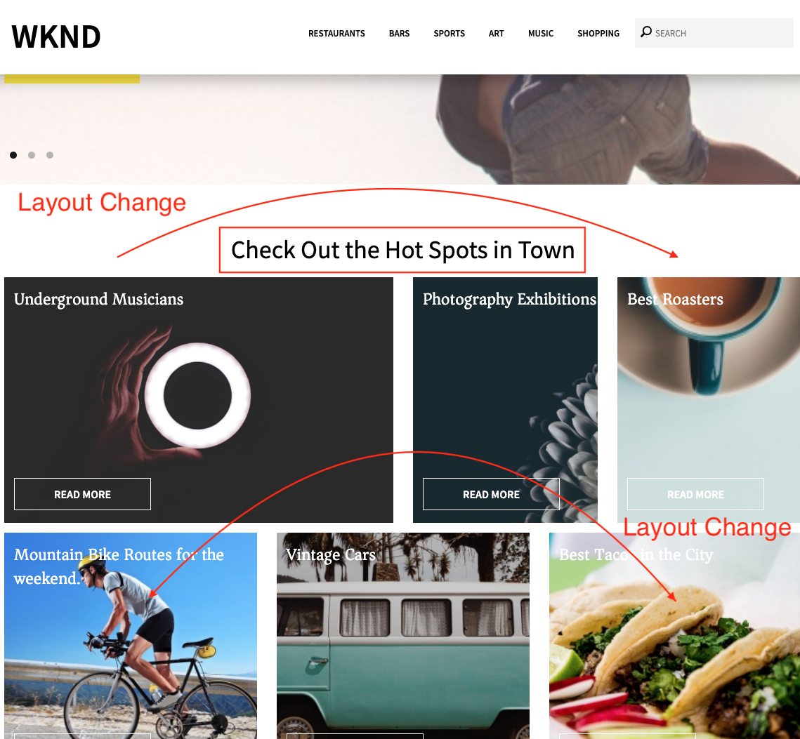
   20. Open your browser console, and inspect the network tab to look for target response for the WKND Home Page Refresh A/B Test activity.
     

## Summary

In this chapter, a marketer was able to create an experience using Visual Experience Composer by dragging and dropping, swapping, and modifying the layout and content of a web page without changing any code to run a test.
