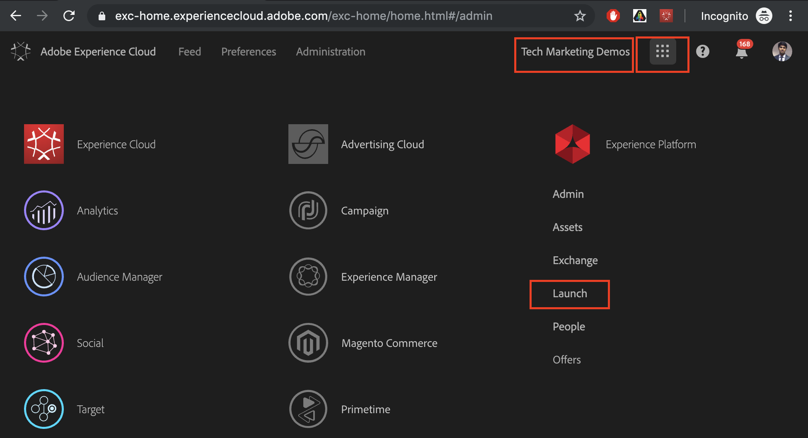
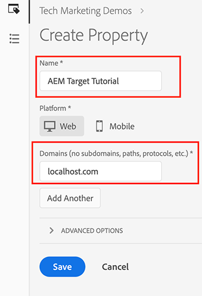
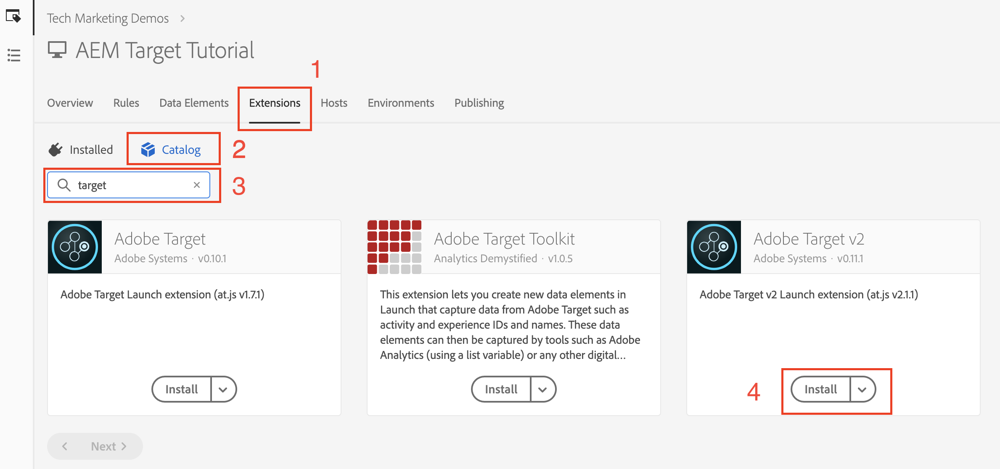
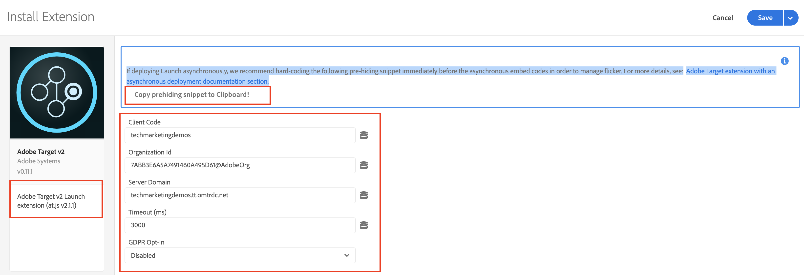
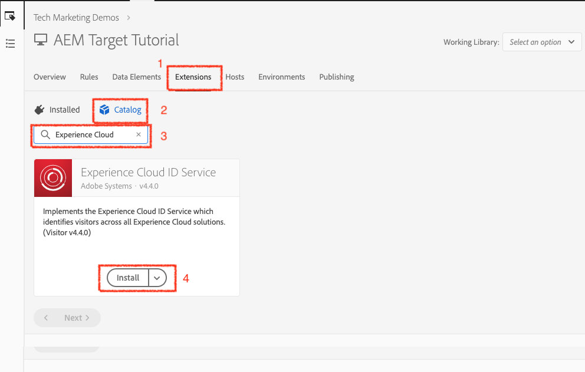
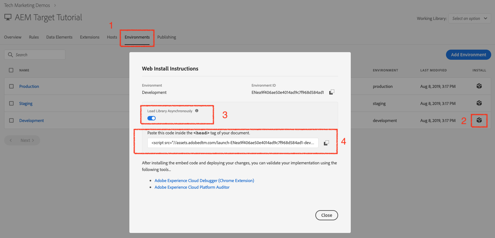
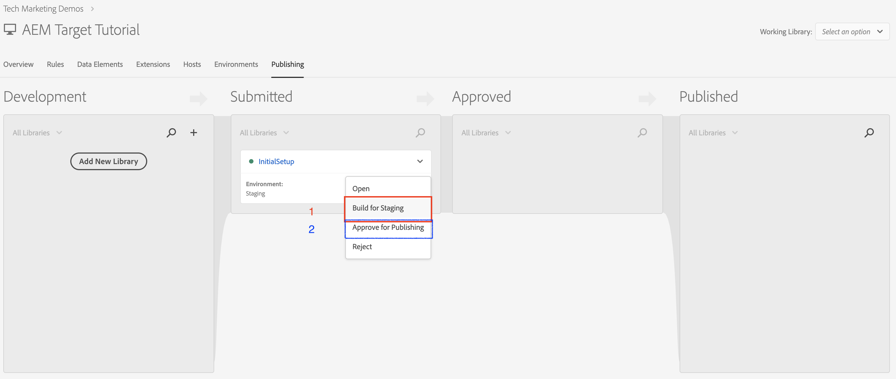
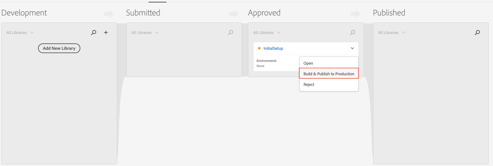

# Using tags via Adobe Developer Console

## Prerequisites

* [AEM author and publish instance](./implementation.md#set-up-aem) running on localhost port 4502 and 4503 respectively
* **Experience Cloud**
  * Access to your organizations Adobe Experience Cloud - `https://<yourcompany>.experiencecloud.adobe.com`
  * Experience Cloud provision with the following solutions
    * [Data Collection](https://experiencecloud.adobe.com)
    * [Adobe Target](https://experiencecloud.adobe.com)
    * [Adobe Developer Console](https://developer.adobe.com/console/)
  
    >[!NOTE]
    >You should have permission to Develop, Approve, Publish, Manage Extensions, and Manage Environments in Data Collection. If you are unable to complete any of these steps because the user interface options are not available to you, reach out to your Experience Cloud Administrator to request access. For more information on tags permissions, [see the documentation](https://experienceleague.adobe.com/docs/experience-platform/tags/admin/user-permissions.html).

* **Chrome browser extensions**
  * Adobe Experience Cloud Debugger(https://chrome.google.com/webstore/detail/adobe-experience-platform/bfnnokhpnncpkdmbokanobigaccjkpob)

## Users involved

For this integration, the following audiences must be involved, and to perform some tasks, you might need administrative access.

* Developer
* AEM Admin
* Experience Cloud Administrator

## Introduction

AEM offers an out of the box integration with tags. This integration allows AEM administrators to easily configure tags via an easy-to-use interface, thereby reducing the level of effort and number of errors, when configuring these two tools. And just by adding Adobe Target extension to tags will help us use all features of Adobe Target on the AEM web page(s).

In this section, we would be cover the following integration steps:

* Tags
  * Create a tags Property
  * Adding Target Extension
  * Create a Data Element
  * Create a Page Rule
  * Setup Environments
  * Build and Publish
* AEM
  * Create a Cloud Service
  * Create

### Tags

#### Create a tags property

A property is a container that you fill with extensions, rules, data elements, and libraries as you deploy tags to your site.

1. Navigate to your organizations [Adobe Experience Cloud](https://experiencecloud.adobe.com/) (`https://<yourcompany>.experiencecloud.adobe.com`)
1. Log in using your Adobe ID, and make sure you are in the right organization.
1. From the solution switcher, click on **Experience Platform**, then the **Data Collection** section, and select **Tags**.

  

1. Make sure you are in the right organization and then proceed with creating a tags property.
  
  
    *For more information on creating properties, see [Create a Property](https://experienceleague.adobe.com/docs/experience-platform/tags/admin/companies-and-properties.html?lang=en#create-or-configure-a-property) in the product documentation.*
1. Click on the **New Property** button
1. Provide a name for your property (For example, *AEM Target Tutorial*)
1. As the domain, enter *localhost.com* since this is the domain where the WKND demo site is running on. Although the '*Domain*' field is required, the tags property will work on any domain where it's implemented. Primary purpose of this field is to pre-populate menu options in the Rule builder.
1. Click the **Save** button.

    

1. Open the property that you just created and click on the Extensions tab.

#### Adding Target extension

The Adobe Target extension supports client-side implementations using Target JavaScript SDK for the modern web, `at.js`. Customers still using Target older library, `mbox.js`, [should upgrade to at.js](https://experienceleague.adobe.com/docs/target-dev/developer/client-side/at-js-implementation/upgrading-from-atjs-1x-to-atjs-20.html) to use tags.

The Target extension consists of two main parts:

* The extension configuration, which manages the core library settings
* Rule actions to do the following:
  * Load Target (at.js)
  * Add Params to All Mboxes
  * Add Params to Global Mbox
  * Fire Global Mbox

1. Under **Extensions**, you can see the list of Extensions that are already installed for your tags property. ([Adobe Launch Core Extension](https://exchange.adobe.com/apps/ec/100223/adobe-launch-core-extension) is installed by default)
2. Click on the **Extension Catalog** option, and search for Target in the filter.
3. Select the latest version of Adobe Target at.js and Click on **Install** option.
    

4. Click on **Configure** button, and you can notice the configuration window with your Target account credentials imported, and the at.js version for this extension.
     

    When Target is deployed via asynchronous tags embed codes, you should hard-code a pre-hiding snippet on your pages before the tags embed codes in order to manage content flicker. We will learn more about the pre-hiding snipper later. You can download the pre-hiding snippet [here](assets/using-launch-adobe-io/prehiding.js)

5. Click **Save** to complete adding the Target extension to your tags property, and you should now be able to see the Target extension listed under the **Installed** extensions list.

6. Repeat the steps above to search for "Experience Cloud ID Service" extension and install it.
   

#### Setup Environments

1. Click on the **Environment** tab for your site property, and you can see the list of environment that gets created for your site property. By default, we have one instance each created for development, staging, and production.

 

#### Build and Publish

1. Click on the **Publishing** tab for your site property, and let's create a library to build, and deploy our changes (data elements, rules) to a development environment.
    >[!VIDEO](https://video.tv.adobe.com/v/28412?quality=12&learn=on)
2. Publish your changes from the Development to a Staging environment.
    >[!VIDEO](https://video.tv.adobe.com/v/28419?quality=12&learn=on)
3. Run the **Build for Staging option**. 
4. Once the build is complete, run **Approve for Publishing**, which moves your changes from a Staging environment to a Production environment.
  
5. Finally, run the **Build and Publish to production** option to push your changes to production.
  
  
### Adobe Experience Manager

>[!VIDEO](https://video.tv.adobe.com/v/28416?quality=12&learn=on)

>[!NOTE]
>
> Grant the Adobe Developer integration the access to select workspaces with the appropriate [role to allow a central team to make API-driven changes in only a few workspaces](https://experienceleague.adobe.com/docs/target/using/administer/manage-users/enterprise/configure-adobe-io-integration.html).

1. Create IMS integration in AEM using credentials from Adobe Developer. (01:12 to 03:55)
2. In Data Collection, create a property. (covered [above](#create-launch-property))
3. Using the IMS integration from Step 1, create tags integration to import your tags property.
4. In AEM, map the tags integration to a site using browser configuration. (05:28 to 06:14)
5. Validate integration manually. (06:15 to 06:33)
6. Using Adobe Experience Cloud Debugger browser plugin. (06:51 to 07:22)

At this point, you have successfully integrated [AEM with Adobe Target using tags](./using-aem-cloud-services.md#integrating-aem-target-options) as detailed in Option 1.

For using AEM Experience Fragment offers to power you personalization activities, lets proceed to the next chapter, and integrate AEM with Adobe Target using the legacy cloud services.
