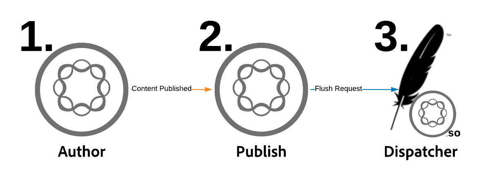
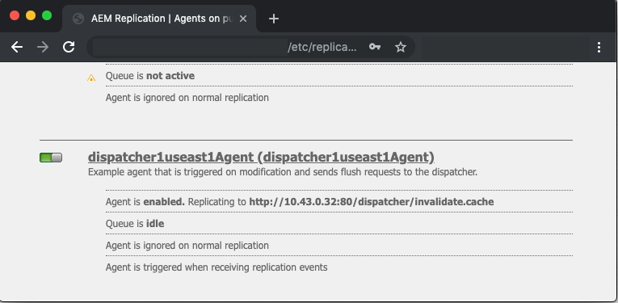
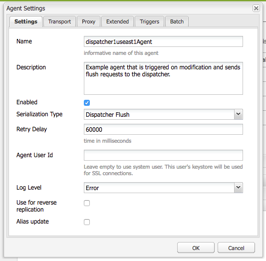
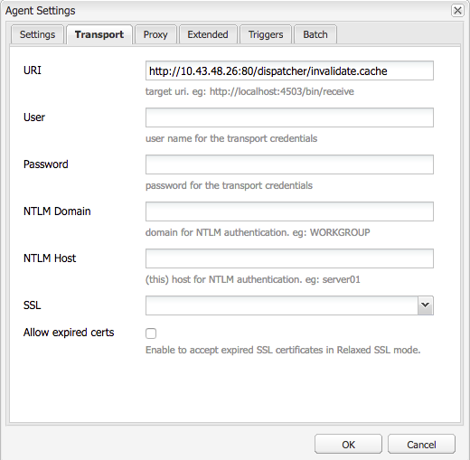
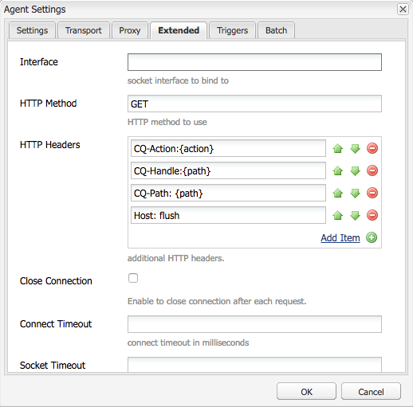
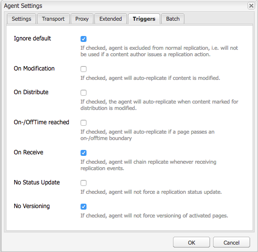
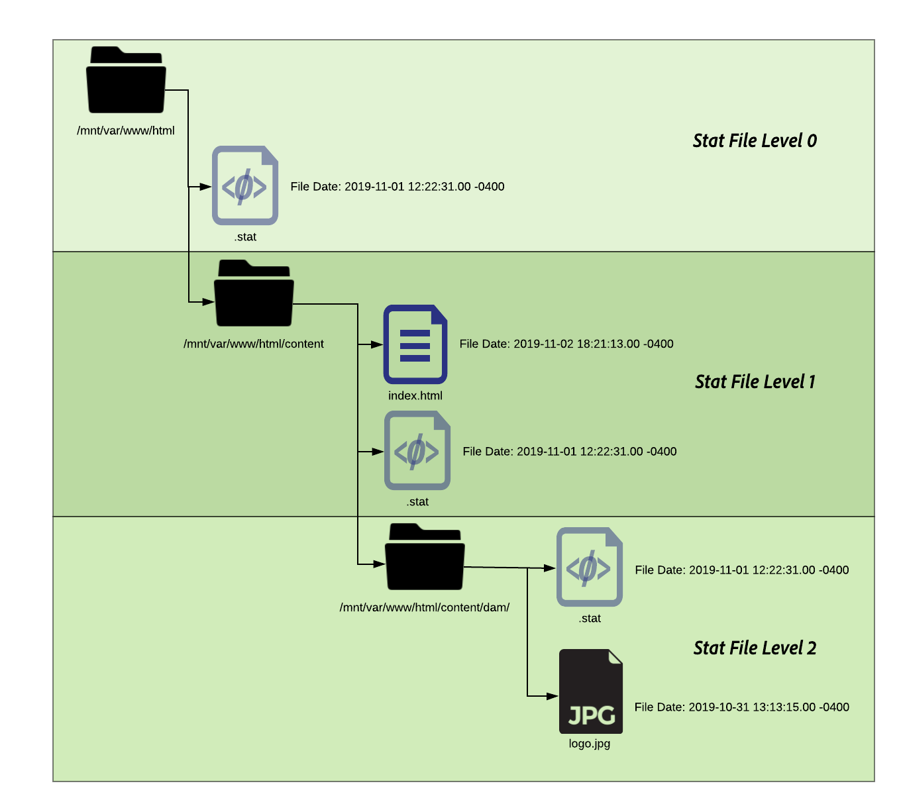

# Dispatcher Vanity URLs

[Table of Contents](./overview.md)

[<- Previous: Using and Understanding Variables](./variables.md)

This document will give guidance on how flushing occurs and explain the mechanism that execute cache flushing and invalidation.


## How it works

### Order of Operation

The typical workflow is best described when content authors will activate a page, when publisher receives the new content it triggers a flush request to the Dispatcher as shown in the following diagram:

This chaining of events, highlights that we only flush items when they are new or have changed.  This ensures that content has been received by the publisher before clearing the cache to avoid race conditions where the flush could occur before the changes are able to be picked up from publisher.

## Replication Agents

On author there is a replication agent configured to point at the publisher that when something is activated it triggers to send the file and all of it's dependencies to the publisher.

When the publisher receives the file it has a replication agent configured to point at the Dispatcher that triggers on the on-receive event.  It will then serialize a flush request and post it to the Dispatcher.

### AUTHOR REPLICATION AGENT

Here are some example screenshots of a configured standard replication agent


There are typically 1 or 2 replication agents configured on the author for each publisher they replicate content to.

First is the standard replication agent that pushes content activations to.

Second is the reverse agent.  This is optional and is setup to check on each publishers outbox to see if there is new content to pull into the author as a reverse replication activity

### PUBLISHER REPLICATION AGENT

Here is an example screenshots of a configured standard flush replication agent


### DISPATCHER FLUSH REPLICATION RECEIVING VIRTUAL HOST

The Dispatcher module looks for particular headers to know when a POST request is something to pass along to AEM renders or if it's a serialized as a flush request and needs to be handled by the Dispatcher handler itself.

Here is a screenshot of the configuration page that shows these values:


The default setting page shows the `Serialization Type` as `Dispatcher Flush` and sets the error level



On the `Transport` tab you can see the `URI` being set to point the IP address of the Dispatcher that will receive the flush requests.  The path `/dispatcher/invalidate.cache` isn't how the module determines if it's a flush it's only an obvious endpoint you can see in the access log to know it was a flush request.  On the `Extended` tab we'll go over the things that are there to qualify that this is a flush request to the Dispatcher module.



The `HTTP Method` for flush requests is just a `GET` request with some special request headers:
- CQ-Action
   - This uses an AEM variable based on the request and the value is typically *activate or delete*
- CQ-Handle
   - This uses an AEM variable based on the request and the value is typically the full path to the item flushed for example `/content/dam/logo.jpg`
- CQ-Path
   - This uses an AEM variable based on the request and the value is typically the full path to the item being flushed for example `/content/dam`
- Host
   - This is where the `Host` Header gets spoofed to target a specific `VirtualHost` that is configured on the dispatcher Apache web server (`/etc/httpd/conf.d/enabled_vhosts/aem_flush.vhost`).  It's hard coded value that matches an entry in the `aem_flush.vhost` file's `ServerName` or `ServerAlias`



On the `Triggers` tab we'll take note of the toggled triggers we use and what they are

- `Ignore default`
   - This is enabled so the replication agent isn't triggered upon a page activation.  This is something that when an author instance were to make a change to a page would trigger a flush.  Because this is a publisher we don't want to trigger off that type of event.
- `On Receive`
   - When a new file is received we want to trigger a flush.  So when the author sends us an updated file we will trigger and send a flush request to Dispatcher.
- `No Versioning`
   - We check this to avoid the publisher from generating new versions because a new file was received.  We'll just replace the file we have and rely on the author to keep track of the versions instead of the publisher.

Now if we look at what a typical flush request looks like in the form of a `curl` command

```
$ curl \ 
-H "CQ-Action: Activate" \ 
-H "CQ-Handle: /content/dam/logo.jpg" \ 
-H "CQ-Path: /content/dam/" \ 
-H "Content-Length: 0" \  
-H "Content-Type: application/octect-stream" \ 
-H "Host: flush" \ 
http://10.43.0.32:80/dispatcher/invalidate.cache
```

This flush example would flush the `/content/dam` path by updating the `.stat` file in that directory.

## The `.stat` file

The flushing mechanism is simple in nature and we want to explain the importance of the `.stat` files that get generated in the document root where the cache files get created.

Inside the `.vhost` and `_farm.any` files we configure a document root directive to specify where the cache is located and where to store / serve files from when a request from an end user comes in.

If you were to run the following command on your Dispatcher server you'd start finding `.stat` files

```
$ find /mnt/var/www/html/ -type f -name ".stat"
```

Here is a diagram of how this file structure will look when you've got items in the cache and have had a flush request sent and processed by the Dispatcher module



### STAT FILE LEVEL

Notice that in each directory there was a `.stat` file present.  This is an indicator that a flush has occured.  In the example above the `statfilelevel` setting was set to `3` inside the corresponding farm configuration file.

The `statfilelevel` setting indicates how many folders deep the module will traverse and update a `.stat` file.  The .stat file is empty it's nothing more than a filename with a datestamp and could even be created manually but running the touch command on the command line of the Dispatcher server.

If the stat file level setting is set too high then each flush request traverses the directory tree touching stat files.  This can become a major performance hit on large cache trees and can impact the overall performance of your Dispatcher.

Setting this file level too low can cause a flush request to clear more than was intended.  Which in turn would cause the cache to churn more often with less requests being served from cache and can cause performance issues.

<div style="color: #000;border-left: 6px solid #2196F3;background-color:#ddffff;"><b>Note:</b>

Set the `statfilelevel` at a reasonable level.  Look at your folder structure and make sure it's setup to allow concise flushes without having to traverse too many directories.   Test it and make sure it fits your needs during a performance test of the system.

A good example is a site that supports languages.  The typical content tree would have the following directories

`/content/brand1/en/us/`

In this example use a stat file level setting of 4.  This will assure when you flush content that lives under the <b>`us`</b> folder that it won't cause the language folders to get flushed as well.
</div>

### STAT FILE TIMESTAMP HANDSHAKE

When a request for content comes in the same routine happens

1. Timestamp of the `.stat` file is compared to the timestamp of the requested file
2. If the `.stat` file is newer than the requested file it deletes the cached content and fetches a new one from AEM and caches that.  Then serves the content
3. If the `.stat` file is older than the requested file it then knows the file is fresh and can serve the content.

### CACHE HANDSHAKE - EXAMPLE 1

In the example above a request for the content `/content/index.html`

The time of the `index.html` file is 2019-11-01 @ 6:21PM

The time of the nearest `.stat` file is 2019-11-01 @ 12:22PM

Understanding what we've read above you can see that the index file is newer than the `.stat` file and the file would be served from cache to the end user who requested it

### CACHE HANDSHAKE - EXAMPLE 2

In the example above a request for the content `/content/dam/logo.jpg`

The time of the `logo.jpg` file is 2019-10-31 @ 1:13PM

The time of the nearest `.stat` file is 2019-11-01 @ 12:22PM

As you can see in this example the file is older than the `.stat` file and will be removed and a fresh one pulled from AEM to replace it in the cache before being served to the end user who requested it.

## Farm File Settings

Documentation is all here for the full set of configuration options: [https://docs.adobe.com/content/help/en/experience-manager-dispatcher/using/configuring/dispatcher-configuration.html#configuring-dispatcher_configuring-the-dispatcher-cache-cache](https://docs.adobe.com/content/help/en/experience-manager-dispatcher/using/configuring/dispatcher-configuration.html#configuring-dispatcher_configuring-the-dispatcher-cache-cache)

We will want to highlight of few of them that pertain to cache flushing

### Flush Farms

There are two key `document root` directories that will cache files from author and publisher traffic.  To keep those directories up to date with fresh content we will need to flush the cache.  Those flush requests don't want to get tangled up with your normal customer traffic farm configurations that might reject the request or do something un-wanted.  Instead we provide two flush farms for this task:

- `/etc/httpd.conf.d/available_farms/001_ams_author_flush_farm.any`
- `/etc/httpd.conf.d/available_farms/001_ams_publish_flush_farm.any`

These farm files don't do anything but flush the document root directories.

```
/publishflushfarm {  
	/virtualhosts {
		"flush"
	}
	/cache {
		/docroot "${PUBLISH_DOCROOT}"
		/statfileslevel "${DEFAULT_STAT_LEVEL}"
		/rules {
			$include "/etc/httpd/conf.dispatcher.d/cache/ams_publish_cache.any"
		}
		/invalidate {
			/0000 {
				/glob "*"
				/type "allow"
			}
		}
		/allowedClients {
			/0000 {
				/glob "*.*.*.*"
				/type "deny"
			}
			$include "/etc/httpd/conf.dispatcher.d/cache/ams_publish_invalidate_allowed.any"
		}
	}
}
```

### Document Root

This configuration entry lives in the following section of the farm file:

```
/myfarm { 
    /cache { 
        /docroot
```

You specify the directory in which you want the Dispatcher to populate and managed as a cache directory.

<div style="color: #000;border-left: 6px solid #2196F3;background-color:#ddffff;"><b>Note:</b>
This directory should match the Apache document root setting for the domain your web server is configured to use.

Having nested docroot folders per each farm that live a sub folders of the Apache document root is a terrible idea for many reasons.
</div>

### Stat Files Level

This configuration entry lives in the following section of the farm file:

```
/myfarm { 
    /cache { 
        /statfileslevel
```

This setting gauges how deep `.stat` files will need to be generated when a flush request comes in.

`/statfileslevel` set at the following number with the document root of `/var/www/html/` would have the following results when flushing `/content/dam/brand1/en/us/logo.jpg`

- 0 - The following stat files would be created
   - `/var/www/html/.stat`
- 1 - The following stat files would be created
   - `/var/www/html/.stat`
   - `/var/www/html/content/.stat`
- 2 - The following stat files would be created
   - `/var/www/html/.stat`
   - `/var/www/html/content/.stat`
   - `/var/www/html/content/dam/.stat`
- 3 - The following stat files would be created
   - `/var/www/html/.stat`
   - `/var/www/html/content/.stat`
   - `/var/www/html/content/dam/.stat`
   - `/var/www/html/content/dam/brand1/.stat`
- 4 - The following stat files would be created
   - `/var/www/html/.stat`
   - `/var/www/html/content/.stat`
   - `/var/www/html/content/dam/.stat`
   - `/var/www/html/content/dam/brand1/.stat`
   - `/var/www/html/content/dam/brand1/en/.stat`
- 5 - The following stat files would be created
   - `/var/www/html/.stat`
   - `/var/www/html/content/.stat`
   - `/var/www/html/content/dam/.stat`
   - `/var/www/html/content/dam/brand1/.stat`
   - `/var/www/html/content/damn/brand1/en/.stat`
   - `/var/www/html/content/damn/brand1/en/us/.stat`


<div style="color: #000;border-left: 6px solid #2196F3;background-color:#ddffff;"><b>Note:</b>

Keep in mind that when the timestamp handshake happens it looks for the closest `.stat` file.

having a `.stat` file level 0 and a stat file only at `/var/www/html/.stat` meanst that content that lives under `/var/www/html/content/dam/brand1/en/us/` would look for the nearest `.stat` file and traverse up 5 folders to find the only `.stat` file that exists at level 0 and compare dates to that.  Meaning that one flush at that high of a level would essentially invalidate all items cached.
</div>

### Invalidation Allowed

This configuration entry lives in the following section of the farm file:

```
/myfarm { 
    /cache { 
        /allowedClients {
```

Inside this configuration is where you put a list of IP addresses that are allowed to send flush requests.  If a flush request comes into the Dispatcher it has to come from a trusted IP.  If you have this misconfigured or send a flush request from an untrusted IP addres you'll see the following error in the log file:

```
[Mon Nov 11 22:43:05 2019] [W] [pid 3079 (tid 139859875088128)] Flushing rejected from 10.43.0.57
```

### Invalidation Rules

This configuration entry lives in the following section of the farm file:

```
/myfarm { 
    /cache { 
        /invalidate {
```

These rules typically indicate as to which files are allowed to be invalidated with a flush request.

To avoid important files from being invalidated with a page activation you can put rules in play that specify which files are ok to invalidate and which ones have to be manually invalidated.  Here is a sample set of configuration that only allow html files to be invalidated:

```
/invalidate { 
   /0000 { /glob "*" /type "deny" } 
   /0001 { /glob "*.html" /type "allow" } 
}
```

## Testing / Troubleshooting

When you activate a page and get the green light that the page activation was successful you should expect that the content you activated will be flushed out of the cache as well.

You refresh your page and see the old stuff! what!? there was a green light?!

Let's follow a few manually step through flushing process to bring us insight of what could be wrong.  From the publisher shell run the following flush request using curl:

```
$ curl -H "CQ-Action: Activate" \ 
-H "CQ-Handle: /content/<PATH TO ITEM TO FLUSH>" \ 
-H "CQ-Path: /content/<PATH TO ITEM TO FLUSH>" \ 
-H "Content-Length: 0" -H "Content-Type: application/octet-stream" \ 
-H "Host: flush" \ 
http://<DISPATCHER IP ADDRESS>/dispatcher/invalidate.cache
```

Example test flush request

```
$ curl -H "CQ-Action: Activate" \ 
-H "CQ-Handle: /content/customer/en-us" \ 
-H "CQ-Path: /content/customer/en-us" \ 
-H "Content-Length: 0" -H "Content-Type: application/octet-stream" \ 
-H "Host: flush" \ 
http://169.254.196.222/dispatcher/invalidate.cache
```

Once you've fired off the request command to the Dispatcher you'll want to see what it's done in the logs and what it's done with the `.stat files`.  Tail the log file and you should see the following entries to confirm the flush request hit the Dispatcher module

```
[Wed Nov 13 16:54:12 2019] [I] [pid 19173:tid 140542721578752] Activation detected: action=Activate [/content/dam/logo.jpg] 
[Wed Nov 13 16:54:12 2019] [I] [pid 19173:tid 140542721578752] Touched /mnt/var/www/html/.stat 
[Wed Nov 13 16:54:12 2019] [I] [pid 19173:tid 140542721578752] Touched /mnt/var/www/html/content/.stat 
[Wed Nov 13 16:54:12 2019] [I] [pid 19173:tid 140542721578752] Touched /mnt/var/www/html/content/dam/.stat 
[Wed Nov 13 16:54:12 2019] [I] [pid 19173:tid 140542721578752] "GET /dispatcher/invalidate.cache" 200 purge [publishfarm/-] 0ms
```

Now that we see the module picked up and acknowledged the flush request we need to see how it affected the `.stat` files.  Run the following command and watch the timestamps update as you issue another flush:

```
$ watch -n 3 "find /mnt/var/www/html/ -type f -name ".stat" | xargs ls -la $1"
```

As you can see from the command output the timestamps of the current `.stat` files

```
-rw-r--r--. 1 apache apache 0 Nov 13 16:54 /mnt/var/www/html/content/dam/.stat 
-rw-r--r--. 1 apache apache 0 Nov 13 16:54 /mnt/var/www/html/content/.stat 
-rw-r--r--. 1 apache apache 0 Nov 13 16:54 /mnt/var/www/html/.stat
```

Now if we re-run the flush again you will watch the timestamps update

```
-rw-r--r--. 1 apache apache 0 Nov 13 17:17 /mnt/var/www/html/content/dam/.stat 
-rw-r--r--. 1 apache apache 0 Nov 13 17:17 /mnt/var/www/html/content/.stat 
-rw-r--r--. 1 apache apache 0 Nov 13 17:17 /mnt/var/www/html/.stat
```

Let's compare our content timestamps against our `.stat` files timestamps

```
$ stat /mnt/var/www/html/content/customer/en-us/.stat 
  File: `.stat' 
  Size: 0           Blocks: 0          IO Block: 4096   regular empty file 
Device: ca90h/51856d    Inode: 17154125    Links: 1 
Access: (0644/-rw-r--r--)  Uid: (   48/  apache)   Gid: (   48/  apache) 
Access: 2019-11-13 16:22:31.000000000 -0400 
Modify: 2019-11-13 16:22:31.000000000 -0400 
Change: 2019-11-13 16:22:31.000000000 -0400 
 
$ stat /mnt/var/www/html/content/customer/en-us/logo.jpg 
File: `logo.jpg' 
  Size: 15856           Blocks: 32          IO Block: 4096   regular file 
Device: ca90h/51856d    Inode: 9175290    Links: 1 
Access: (0644/-rw-r--r--)  Uid: (   48/  apache)   Gid: (   48/  apache) 
Access: 2019-11-11 22:41:59.642450601 +0000 
Modify: 2019-11-11 22:41:59.642450601 +0000 
Change: 2019-11-11 22:41:59.642450601 +0000

```

If you look at any of the timestamps you'll note the content has a newer time than the `.stat` file which tells the module to serve the file from cache because it's newer than the `.stat` file.

Put plainly something updated the timestamps of this file which don't qualify it to be "flushed" or replaced.

[Next -> Vanity URLs](./disp-vanity-url.md)