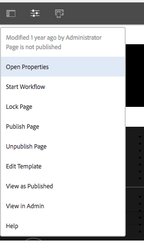
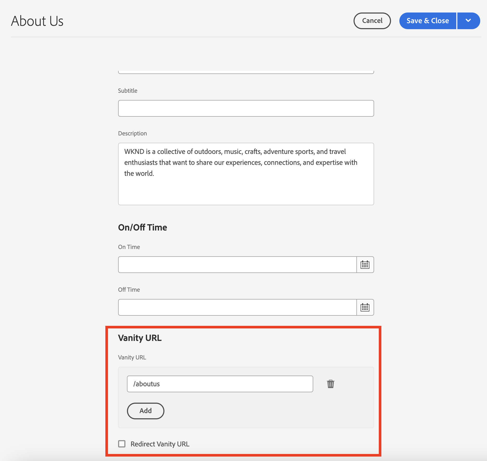
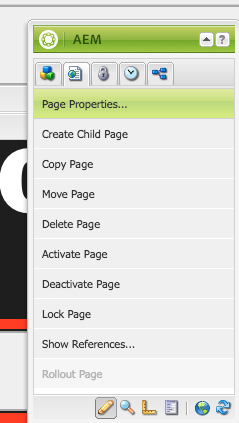
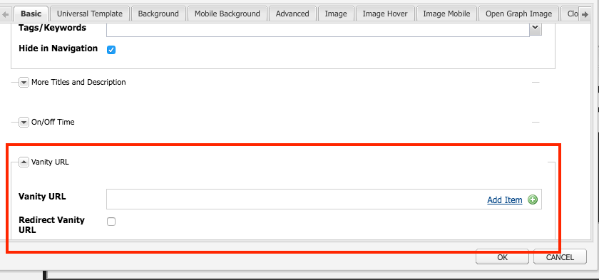
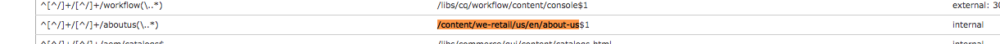
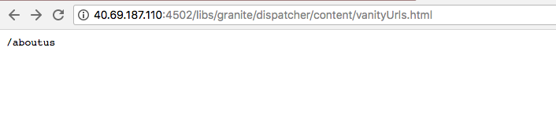

# Dispatcher Vanity URLs

[Table of Contents](./overview.md)

[<- Previous: Dispatcher Flushing](./disp-flushing.md)

## Overview

This document helps you understand how AEM deals with vanity urls and some additional techniques using rewrite rules to map content closer to the edge of delivery

## What are Vanity URLs

When you have content that lives in a folder structure that makes sense it doesn't always live in a URL that's easy to reference. Vanity URLs are like shortcuts. Shorter or unique URLs that reference where the real content lives.

An example: `/aboutus` pointed at `/content/we-retail/us/en/about-us.html`

AEM Authors have an option to set vanity url properties on a piece of content in AEM and publish it.

For this feature to work you have to adjust the Dispatcher filters to allow the vanity through. This becomes unreasonable to do with adjusting the Dispatcher configuration files at the rate that authors would have to set up these vanity page entries.

For this reason, the Dispatcher module has a feature to auto-allow anything listed as a vanity in the content tree.


## How it works

### Authoring Vanity URLs

The author visits a page in AEM, clicks the page properties, and adds entries in the _Vanity URL_ section. Upon saving the changes and activating the page the vanity is assigned to the page.

Authors can also select the _Redirect Vanity URL_ checkbox when adding _Vanity URL_ entries, this causes vanity urls to behave as 302 redirects. It means that the browser is told to go to the new URL (via `Location` response header) and the browser makes a new request to the new URL.

#### Touch UI:





#### Classic Content Finder:






>[!NOTE]
>
>Understand this is prone to name space issues. Vanity entries are global to all pages, this is just one of the short comings you have to plan for workarounds we'll explain a few of those later.


## Resource Resolving / Mapping

Each vanity entry is sling map entry for an internal redirect.

The maps are visible by visiting the AEM instances Felix console ( `/system/console/jcrresolver` )

Here is a screenshot of a map entry created by a vanity entry:


In the above example when we ask the AEM instance to visit `/aboutus` it resolves to `/content/we-retail/us/en/about-us.html`

## Dispatcher auto-allow filters

The Dispatcher in a secure state filters out requests at the path `/` through the Dispatcher because that's the root of the JCR tree.

It's important to make sure that publishers are only allowing content from the `/content` and other safe paths, and so on,  and not paths like `/system`.

Here is the rub, vanity urls live at the base folder of `/` so how do we allow them to reach the publishers while staying secure?

Simple Dispatcher has an auto-filter allow mechanism and you have to install an AEM package and then configure the Dispatcher to point to that package page.

[https://experience.adobe.com/#/downloads/content/software-distribution/en/aem.html?package=/content/software-distribution/en/details.html/content/dam/aem/public/adobe/packages/granite/vanityurls-components](https://experience.adobe.com/#/downloads/content/software-distribution/en/aem.html?package=/content/software-distribution/en/details.html/content/dam/aem/public/adobe/packages/granite/vanityurls-components)

Dispatcher has a configuration section in its farm file:

```
/vanity_urls { 
    /url    "/libs/granite/dispatcher/content/vanityUrls.html" 
    /file   "/tmp/vanity_urls" 
    /delay  300 
}
```

The `/delay` parameter, measured in seconds, does not operate on a fixed interval basis but rather on a condition-based check. The Dispatcher assesses the modification timestamp of the `/file` (which stores the list of recognized vanity URLs) upon receiving a request for an unlisted URL. The `/file` will not be refreshed if the time difference between the current moment and the `/file`'s last modification is less than the `/delay` duration. Refreshing the `/file` occurs under two conditions:

1. The incoming request is for a URL not cached or listed in the `/file`.
1. At least `/delay` seconds have passed since the `/file` was last updated.

This mechanism is designed to protect against Denial of Service (DoS) attacks, which could otherwise overwhelm the Dispatcher with requests, exploiting the Vanity URLs feature.

In simpler terms, the `/file` containing vanity URLs is updated only if a request arrives for a URL not already in the `/file` and if the `/file`'s last modification was longer ago than the `/delay` period.

To explicitly trigger a refresh of the `/file`, you can request a non-existent URL after ensuring the required `/delay` time has passed since the last update. Example URLs for this purpose include:

- `https://dispatcher-host-name.com/this-vanity-url-does-not-exist`
- `https://dispatcher-host-name.com/please-hand-me-that-planet-maestro`
- `https://dispatcher-host-name.com/random-vanity-url`

This approach forces the Dispatcher to update the `/file`, provided the specified `/delay` interval has elapsed since its last modification.

It stores its cache of the response in the `/file` argument so in this example `/tmp/vanity_urls`

So if you visit the AEM instance at the URI you see what it fetches:



It's literally a list, super simple

## Rewrite Rules as Vanity Rules

Why would we mention using rewrite rules instead of the default mechanism built into AEM as describe above?

Explained simply, namespace issues, performance, and higher-level logic that can be handled better.

Let's go over an example of the vanity entry `/aboutus` to its content `/content/we-retail/us/en/about-us.html` using Apache's `mod_rewrite` module to accomplish this.

```
RewriteRule ^/aboutus /content/we-retail/us/en/about-us.html [PT,L,NC]
```

This rule looks for the vanity `/aboutus` and fetch the full path from the renderer with the PT flag (Pass Through).

It also stops processing all the other rules L flag (Last) which means it does not have to traverse a huge list of rules like JCR Resolving has to do.

Along with not having to proxy the request, and wait for the AEM publisher to respond these two elements of this method make it much more performant.

Then the icing on the cake here is the NC flag (No Case-Sensitive) meaning if a customer types the URI with `/AboutUs` instead of `/aboutus` it still works.

To create a rewrite rule to do this you would create a configuration file on the Dispatcher (example: `/etc/httpd/conf.d/rewrites/examplevanity_rewrite.rules`) and include it in the `.vhost` file that handles the domain that needs these vanity urls to apply.

Here is an example code snippet of include inside `/etc/httpd/conf.d/enabled_vhosts/we-retail.vhost`

```
<VirtualHost *:80> 
 ServerName weretail.com 
 ServerAlias www.weretail.com 
        ........ SNIP ........ 
 <IfModule mod_rewrite.c> 
  ReWriteEngine on 
  LogLevel warn rewrite:info 
  Include /etc/httpd/conf.d/rewrites/examplevanity_rewrite.rules 
 </IfModule> 
        ........ SNIP ........ 
</VirtualHost>
```

## Which Method and Where

Using AEM to control vanity entries has the following benefits

- Authors can create them on the fly
- They live with the content and can be packaged up with the content

Using `mod_rewrite` to control vanity entries has the following benefits

- Faster to resolve content
- Closer to the edge of end-user content requests
- More extensibility and options to control how content is mapped on other conditions
- Can be case insensitive

Use both methods but here's the advice and criteria on which one to use when:

- If the vanity is temporary and has low levels of traffic planned then use the AEM built-in feature
- If the vanity is a staple endpoint that doesn't change often and has frequent use then use a `mod_rewrite` rule.
- If the vanity namespace (for example: `/aboutus`) has to be reused for lots of brands on the same AEM instance then use rewrite rules.

>[!NOTE]
>
>If you want to use the AEM vanity feature and avoid namespace you can make a naming convention. Using vanity urls that nested like `/brand1/aboutus`, `brand2/aboutus`, `brand3/aboutus`.

[Next -> Common Logging](./common-logs.md)
