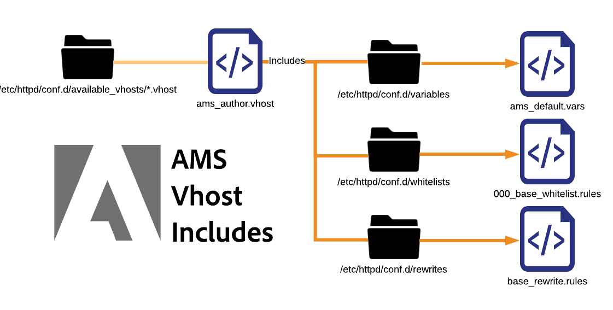
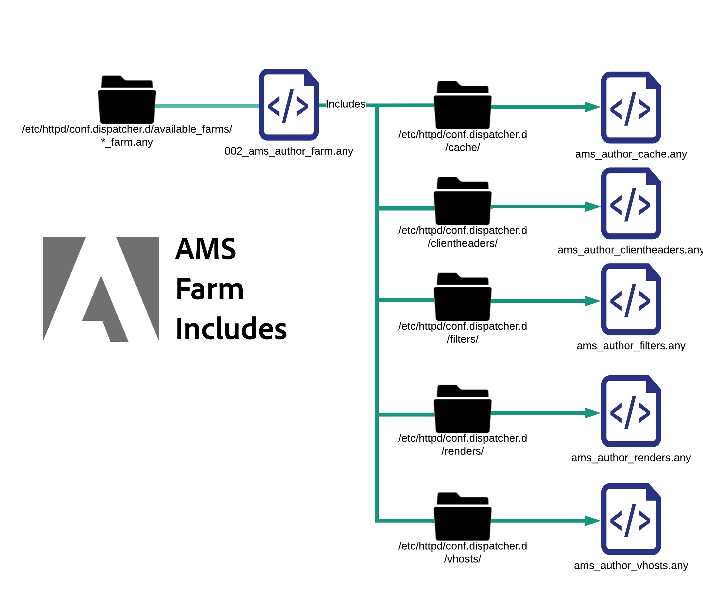

# Explanation of Configuration Files

[Table of Contents](./overview.md)

[<- Previous: Basic File Layout](./basic-file-layout.md)

This document will break down and explain each of the configuration files deployed in a standard built Dispatcher server provisioned in Adobe Managed Services. Their use, naming convention, etc...

## Naming Convention

Apache Web Server doesn't actually care what the file extension is of a file when targeting it with an `Include` or `IncludeOptional` statement.  Naming them properly with names that eliminate conflicts and confusion helps a <b>ton</b>. Names used will describe the scope of where the file is applied it makes life easier. If everything is named `.conf` this gets really confusing. We want to avoid poorly named files and extensions.  Below is a list of the different custom file extensions and naming conventions used in a typical AMS configured Dispatcher.

## Files contained in conf.d/

| File | File Destination | Description |
| ---- | ---------------- | ----------- |
| FILENAME`.conf` | `/etc/httpd/conf.d/` | A default Enterprise Linux install uses this file extension and include folder as a place to override settings declared in httpd.conf and allow you to add addtional functionality at a global level in Apache. |
| FILENAME`.vhost` | Staged: `/etc/httpd/conf.d/available_vhosts/`<br>Active: `/etc/httpd/conf.d/enabled_vhosts/`<br/><br/><b>Note:</b> .vhost files aren't to be copied into the enabled_vhosts folder but use symlinks to a relative path to the available_vhosts/\*.vhost file</u><br><br> | \*.vhost (Virtual Host) files are `<VirtualHosts>`  entries to match hostnames and allow Apache to handle each domain traffic with different rules. From the `.vhost` file, other files like `rewrites`, `whitelisting`, `etc` will be included. |
| FILENAME`_rewrite.rules` | `/etc/httpd/conf.d/rewrites/` | `*_rewrite.rules` files store `mod_rewrite` rules to be included and consumed explicitly by a `vhost` file |
| FILENAME`_whitelist.rules` | `/etc/httpd/conf.d/whitelists/` | `*_ipwhitelist.rules` files are included from inside the `*.vhost` files. It contains IP regex or allow deny rules to allow IP whitelisting. If you're trying to restrict viewing of a virtual host based on IP addresses you'll generate one of these files and include it from your `*.vhost` file |

## Files contained in conf.dispatcher.d/

| File | File Destination | Description |
| --- | --- | --- |
| FILENAME`.any` | `/etc/httpd/conf.dispatcher.d/` | The AEM Dispatcher Apache Module sources it's settings from `*.any` files. The default parent include file is `conf.dispatcher.d/dispatcher.any` |
| FILENAME`_farm.any` | Staged: `/etc/httpd/conf.dispatcher.d/available_farms/`<br>Active: `/etc/httpd/conf.dispatcher.d/enabled_farms/`<br><br><b>Note:</b> these farm files aren't to be copied into the `enabled_farms` folder but use `symlinks` to a relative path to the `available_farms/*_farm.any` file <br/>`*_farm.any` files are included inside the `conf.dispatcher.d/dispatcher.any` file. These parent farm files exist to control module behavior for each render or website type. Files are created in the `available_farms` directory and enabled with a `symlink` into the `enabled_farms` directory.  <br/>It auto-includes them by name from the `dispatcher.any` file.<br/><b>Baseline</b> farm files begin with `000_` to make sure they are loaded first.<br><b>Custom</b> farm files should be loaded after by starting their number scheme at `100_` to assure the proper include behavior. |
| FILENAME`_filters.any` | `/etc/httpd/conf.dispatcher.d/filters/` | `*_filters.any` files are included from inside the `conf.dispatcher.d/enabled_farms/*_farm.any` files. Each farm has a set of rules that change what traffic should be filtered out and not make it to the renderers. |
| FILENAME`_vhosts.any` | `/etc/httpd/conf.dispatcher.d/vhosts/` | `*_vhosts.any` files are included from inside the `conf.dispatcher.d/enabled_farms/*_farm.any` files. These files are a list of hostnames or uri paths to be matched by blob matching to determine which renderer to use to serve that request |
| FILENAME`_cache.any` | `/etc/httpd/conf.dispatcher.d/cache/` | `*_cache.any` files are included from inside the `conf.dispatcher.d/enabled_farms/*_farm.any` files. These files specify which items are cached and which aren't |
| FILENAME`_invalidate_allowed.any` | `/etc/httpd/conf.dispatcher.d/cache/` | `*_invalidate_allowed.any` files are included inside the `conf.dispatcher.d/enabled_farms/*_farm.any` files. They specify which IP addresses are allowed to send flush and invalidation requests. |
| FILENAME`_clientheaders.any` | `/etc/httpd/conf.dispatcher.d/clientheaders/` | `*_clientheaders.any` files are included inside the `conf.dispatcher.d/enabled_farms/*_farm.any` files. They specify which client headers should be passed through to each renderer. |
| FILENAME`_renders.any` | `/etc/httpd/conf.dispatcher.d/renders/` | `*_renders.any` files are included inside the `conf.dispatcher.d/enabled_farms/*_farm.any` files. They specify IP, port, and timeout settings for each renderer. A proper renderer can be a livecycle server or any AEM systems where the Dispatcher can fetch / proxy the requests from |

## Avoided Problems

When following the naming convention you can avoid some pretty easy to make mistakes that can have catastrophic results.  We will cover a few examples.

### Problem Example

As a site Example for ExampleCo two configuration files were created by the developers of the Dispatcher configurations.

<b>/etc/httpd/conf.d/exampleco.conf</b>

```
<VirtualHost *:80> 
    ServerName  "exampleco" 
    ServerAlias "www.exampleco.com" 
    .......... SNIP ............... 
    <IfModule mod_rewrite.c> 
        ReWriteEngine   on 
        LogLevel warn rewrite:trace1 
        Include /etc/httpd/conf.d/rewrites/exampleco.conf 
    </IfModule> 
</VirtualHost>
```

<b>/etc/httpd/conf.d/rewrites/exampleco.conf</b>

```
RewriteRule ^/$ /content/exampleco/en.html [PT,L] 
RewriteRule ^/robots.txt$ /content/dam/exampleco/robots.txt [PT,L]
```

#### `POTENTIAL DANGER - The file names are the same`

If the `vhost` file is accidentally put in the `rewrites` folder and the `rewrites file` is put into the `vhosts` folder.  It would appear to be deployed by filename properly, yet Apache will throw an *ERROR* and the problem will not be immediately apparent.

<b>How this typically becomes an issue</b>

If the `two files` are downloaded to the `same` location they can either `overwrite themselves` or make it indistinguishable making the deployment process a nightmare.

<b>The file extensions are the same and auto-include prone</b>

The file extensions are the same and uses auto-included extension that Apache will `auto include` any `.conf` files in many of it's default folders.

<b>How this typically becomes an issue</b>

If the vhost file with the extension of `.conf` is put in the `/etc/httpd/conf.d/` folder it will try and load it into memory on Apache which is typically ok, but if the rewrite rules file with the extension of `.conf` gets placed in the `/etc/httpd/conf.d/` folder, it will get auto-included and apply globally causing confusing and undesired results.

## Resolution

Name the files base on what they do and safely out of the auto-include rules namespace.

If it's a virtual host file name it with `.vhost` as the extension.

If it's a rewrite rule file, name it with site`_rewrite.rules` as the suffix and extension. This naming convention will make it clear which site it's for and that it's a set of rewrite rules.

If it's a IP whitelist rule file, name it description`_whitelist.rules` as the suffix and extension. This naming convention will give some description of what it's for and that it's a set of IP matching rules.

Using these naming conventions will avoid issues, if a file gets moved into an auto-include directory that it doesn't belong.

For example putting a file named with `.rules`, `.any`, or `.vhost` in the auto-include folder of `/etc/httpd/conf.d/` wouldn't have any affect.

If a deployment change request says "please deploy exampleco_rewrite.rules to production Dispatchers", the person deploying the changes can already know that they aren't adding a new site, they're just updating rewrite rules as indicated by the filename.

### Include Order

When extending functionality and configurations in Apache Webserver installed on Enterpise Linux you have some important include orders you'll want to understand

### Apache Baseline Includes


As seen in the diagram above the httpd binary only looks to the httpd.conf file as it's configuration file.  That file contains the following statements in it:

```
Include conf.modules.d/*.conf 
IncludeOptional conf.d/*.conf
```

### AMS Top Level Includes

When we applied our standard we added some additional file types and includes of our own.

Here is the AMS baseline directories and top level includes


Building off Apache's baseline we show how AMS created some addtional folders and top level includes for `conf.d` folders as well as module specific directories nested under `/etc/httpd/conf.dispatcher.d/`

When Apache loads it will pull in the `/etc/httpd/conf.modules.d/02-dispatcher.conf` and that file will include the binary file `/etc/httpd/modules/mod_dispatcher.so` into it's running state.

```
LoadModule dispatcher_module modules /mod_dispatcher .so
```

To use the module in our `<VirtualHost />` we drop a configuration file into `/etc/httpd/conf.d/` named `dispatcher_vhost.conf` and inside this file you'll see use setup the basic parameters needed for the module to work:

```
<IfModule disp_apache2.c> 
    DispatcherConfig conf.dispatcher.d/dispatcher.any 
    ...SNIP... 
</IfModule>
```

As you can see above this includes the top level `dispatcher.any` file for our Dispatcher module to pick up it's configuration files from `/etc/httpd/conf.dispatcher.d/dispatcher.any`

Pay attention to the contents of this file:

```
/farms { 
    $include "enabled_farms/*_farm.any" 
}
```

The top level `dispatcher.any` file includes all of the enabled farm files that live in `/etc/httpd/conf.dispatcher.d/enabled_farms/` with the file name of `FILENAME_farm.any` which follows our standard naming convention.

Later in the `dispatcher_vhost.conf` file mentioned earlier we also do an include statement to enable each enabled virtual host files that live in `/etc/httpd/conf.d/enabled_vhosts/` with the filename of `FILENAME.vhost` which follows our standard naming convention.

```
IncludeOptional /etc/httpd/conf.d/enabled_vhosts/*.vhost
```

In each of our .vhost files you'll note the Dispatcher module gets initialized as a default file handler for a directory.  Here is an example .vhost file to show the syntax:

```
<VirtualHost *:80> 
 ServerName "weretail" 
 ServerAlias www.weretail.com weretail.com 
 <Directory /> 
  <IfModule disp_apache2.c> 
   ....SNIP.... 
   SetHandler dispatcher-handler 
  </IfModule> 
  ....SNIP.... 
 </Directory> 
 ....SNIP.... 
</VirtualHost>
```

After the top level includes resolve they have other sub includes that are worth mentioning.  Here is a high level diagram on how the farms and vhosts files include other sub elements

### AMS Virtual Host Includes



When any `.vhost` files from `/etc/httpd/conf.d/availabled_vhosts/` directory get symlinked into the `/etc/httpd/conf.d/enabled_vhosts/` directory they will be used in the running configuration.

The `.vhost` files have sub includes based on common pieces we have found.  Things like variables, whitelists, and rewrite rules.

The `.vhost` file will have include statements for each file based on where they need to be included in the `.vhost` file.  Here is an example syntax of a `.vhost` file as a good reference:

```
Include /etc/httpd/conf.d/variables/weretail.vars 
<VirtualHost *:80> 
 ServerName "${MAIN_DOMAIN}" 
 <Directory /> 
  Include /etc/httpd/conf.d/whitelists/weretail*_whitelist.rules 
  <IfModule disp_apache2.c> 
   ....SNIP.... 
   SetHandler dispatcher-handler 
  </IfModule> 
  ....SNIP.... 
 </Directory> 
 ....SNIP.... 
 <IfModule mod_rewrite.c> 
  ReWriteEngine   on 
  LogLevel warn rewrite:trace1 
  Include /etc/httpd/conf.d/rewrites/weretail_rewrite.rules 
 </IfModule> 
</VirtualHost>
```

As you can see in the above example there is an include for the variables needed in this configuration file that are later used.

Inside the file `/etc/httpd/conf.d/variables/weretail.vars` we can see what variables are defined:

```
Define MAIN_DOMAIN dev.weretail.com
```

You can also see a line that includes a list of `_whitelist.rules` files that restrict who can view this content based on different whitelist criteria.  Lets look at the contents of one of the white list files `/etc/httpd/conf.d/whitelists/weretail_mainoffice_whitelist.rules`:

```
<RequireAny> 
  Require ip 192.150.16.0/23 
</RequireAny>
```

You can also see a line that includes a set of rewrite rules.  Let's take a look at the contents of the `weretail_rewrite.rules` file:

```
RewriteRule ^/robots.txt$ /content/dam/weretail/robots.txt [NC,PT] 
RewriteCond %{SERVER_NAME} brand1.weretail.net [NC] 
RewriteRule ^/favicon.ico$ /content/dam/weretail/favicon.ico [NC,PT] 
RewriteCond %{SERVER_NAME} brand2.weretail.com [NC] 
RewriteRule ^/sitemap.xml$ /content/weretail/general/sitemap.xml [NC,PT] 
RewriteRule ^/logo.jpg$ /content/dam/weretail/general/logo.jpg [NC,PT]
```

### AMS Farm Includes



When any FILENAME_farm.any files from `/etc/httpd/conf.dispatcher.d/available_farms/` directory get symlinked into the `/etc/httpd/conf.dispatcher.d/enabled_farms/` directory they will be used in the running configuration.

The farm files have sub includes based on [top level sections of the farm](https://experienceleague.adobe.com/docs/experience-manager-dispatcher/using/configuring/dispatcher-configuration.html?lang=en#defining-farms-farms) like cache, clientheaders, filters, renders, and vhosts.

The `FILENAME_farm.any` files will have include statements for each file based on where they need to be included in the farm file.  Here is an example syntax of a `FILENAME_farm.any` file as a good reference:

```
/weretailfarm {   
 /clientheaders { 
  $include "/etc/httpd/conf.dispatcher.d/clientheaders/ams_publish_clientheaders.any" 
  $include "/etc/httpd/conf.dispatcher.d/clientheaders/ams_common_clientheaders.any" 
 } 
 /virtualhosts { 
  $include "/etc/httpd/conf.dispatcher.d/vhosts/weretail_vhosts.any" 
 } 
 /renders { 
  $include "/etc/httpd/conf.dispatcher.d/renders/ams_publish_renders.any" 
 } 
 /filter { 
  $include "/etc/httpd/conf.dispatcher.d/filters/ams_publish_filters.any" 
  $include "/etc/httpd/conf.dispatcher.d/filters/weretail_search_filters.any" 
 } 
 ....SNIP.... 
 /cache { 
  ....SNIP.... 
  /rules { 
   $include "/etc/httpd/conf.dispatcher.d/cache/ams_publish_cache.any" 
  } 
  ....SNIP.... 
  /allowedClients { 
   /0000 { 
    /glob "*.*.*.*" 
    /type "deny" 
   } 
   $include "/etc/httpd/conf.dispatcher.d/cache/ams_publish_invalidate_allowed.any" 
  } 
 ....SNIP.... 
 } 
}
```

As you can see each section for the weretail farm instead of having all of the syntax needed it's instead using an include statement.

Let's look at the syntax of a few of these includes to get the idea of what each sub include would look like

`/etc/httpd/conf.dispatcher.d/vhosts/weretail_publish_vhosts.any`:

```
"brand1.weretail.com" 
"brand2.weretail.com" 
"www.weretail.comf"
```

As you can see it's a new line separated list of domain names that should render from this farm over the others.

Next let's look at the `/etc/httpd/conf.dispatcher.d/filters/weretail_search_filters.any`:

```
/400 { /type "allow" /method "GET" /path "/bin/weretail/lists/*" /extension "json" } 
/401 { /type "allow" /method "POST" /path "/bin/weretail/search/' /extension "html" }
```

[Next -> Understanding Cache](./understanding-cache.md)
