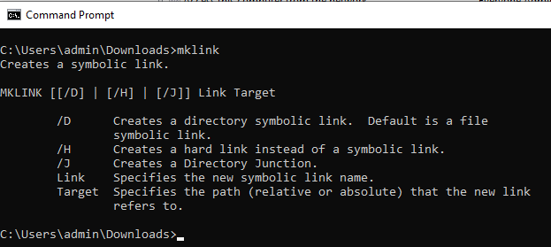
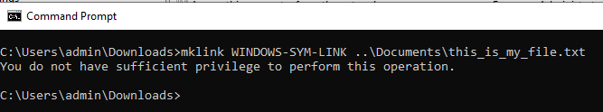
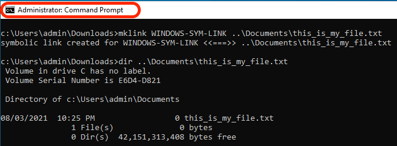
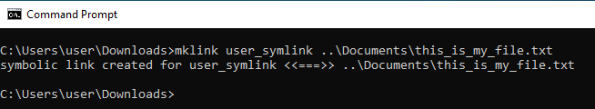
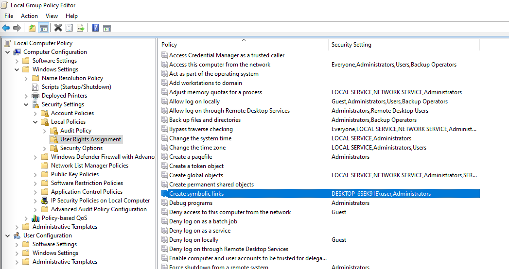
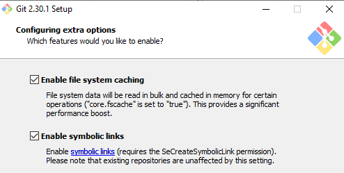

# Adding Symlinks into GIT

[Table of Contents](./overview.md)

[<- Previous: Dispatcher Health Check](./health-check.md)

In AMS you will get a pre-populated GIT repository containing your dispatcher's source code ripe and ready for you to start development and customization.

After you create your first `.vhost` file, or top level `farm.any` file you will need to create a symbolic link from the `available_*` directory to the `enabled_*` directory. Using the proper link type will be key to a successful deployment through the Cloud Manager pipeline. This page will help you know how to do this.

## Dispatcher Archetype

The AEM developer starts their project typically from the [AEM archetype](https://github.com/adobe/aem-project-archetype)

Here is a sample of the area of the source code where you can see the symlinks used:

```
$ tree dispatcher
dispatcher
└── src
   ├── conf.d
.....SNIP.....
    │   └── available_vhosts
    │   │   ├── 000_unhealthy_author.vhost
    │   │   ├── 000_unhealthy_publish.vhost
    │   │   ├── aem_author.vhost
    │   │   ├── aem_flush.vhost
    │   │   ├── aem_health.vhost
    │   │   ├── aem_lc.vhost
    │   │   └── aem_publish.vhost
    └── dispatcher_vhost.conf
    │   └── enabled_vhosts
    │   │   ├── aem_author.vhost -> ../available_vhosts/aem_author.vhost
    │   │   ├── aem_flush.vhost -> ../available_vhosts/aem_flush.vhost
    │   │   ├── aem_health.vhost -> ../available_vhosts/aem_health.vhost
    │   │   └── aem_publish.vhost -> ../available_vhosts/aem_publish.vhost
.....SNIP.....
    └── conf.dispatcher.d
    │   ├── available_farms
    │   │   ├── 000_ams_author_farm.any
    │   │   ├── 001_ams_lc_farm.any
    │   │   └── 002_ams_publish_farm.any
.....SNIP.....
    │   └── enabled_farms
    │   │   ├── 000_ams_author_farm.any -> ../available_farms/000_ams_author_farm.any
    │   │   └── 002_ams_publish_farm.any -> ../available_farms/002_ams_publish_farm.any
.....SNIP.....
17 directories, 60 files
```

As an example the `/etc/httpd/conf.d/available_vhosts/` directory contains the staged potential `.vhost` files we can use in our running configuration.

The enabled `.vhost` files will show up as a relative path `symlinks` inside the `/etc/httpd/conf.d/enabled_vhosts/` directory.

## Creating a symlink

We use symbolic links to the file so the Apache Webserver will treat the destination file as the same file.  We don't want to duplicate the file in both directories.  Instead just a shortcut from one directory (symbolic link) to the other.

Recognize that your deployed configurations will target a Linux host.  Creating a symlink that isn't compatible with the target system will cause failures and unwanted results.

If your workstation isn't a Linux machine, you will probably wonder what commands to use to create these links properly so they can commit them into GIT.

> `TIP:` It's important to use relative links because if you installed a local copy of Apache Webserver and had a different install base the links would still work.  If you use an absolute path then your workstation or other systems would have to match the same exact directory structure.

### OSX / Linux

Symlinks are native to these operating systems and here are some examples of how to create these links.  Open your favorite terminal application and use the following example commands to create the link:

```
$ cd <LOCATION OF CLONED GIT REPO>\src\conf.d\enabled_vhosts
$ ln -s ../available_vhosts/<Destination File Name> <Target File Name>
```

Here is a populated command example for reference:

```
$ git clone https://github.com/adobe/aem-project-archetype.git
$ cd aem-project-archetype/src/main/archetype/dispatcher.ams/src/conf.d/enabled_vhosts/
$ ln -s ../available_vhosts/aem_flush.vhost aem_flush.vhost
```

Here is an example of the link now, if you list out the file using the `ls` command:

```
ls -l
total 0
lrwxrwxrwx. 1 root root 35 Oct 13 21:38 aem_flush.vhost -> ../available_vhosts/aem_flush.vhost
```

### Windows

> `Note:` Turns out MS Windows (better, NTFS) supports symbolic links since... Windows Vista!



> `Warning:` mklink command to create symlinks requires admin privileges to properly run. Even as an Admin account, you will need to run Command Prompt "As Administrator" unless you have developer mode enabled
> <br/>Improper Permissions:
> 
> <br/>Proper Permissions:
> 

Here is the command(s) to create the link:

```
C:\<PATH TO SRC>\enabled_vhosts> mklink <Target File Name> ..\available_vhosts\<Destination File Name>
```


Here is a populated command example for reference:

```
C:\> git clone https://github.com/adobe/aem-project-archetype.git
C:\> cd aem-project-archetype\src\main\archetype\dispatcher.ams\src\conf.d\enabled_vhosts\
C:\aem-project-archetype\src\main\archetype\dispatcher.ams\src\conf.d\enabled_vhosts> mklink aem_flush.vhost ..\available_vhost\aem_flush.vhost
symbolic link created for aem_flush.vhost <<===>> ..\available_vhosts\aem_flush.vhost
```

#### Developer Mode ( Windows 10 )

When put into [Developer Mode](https://docs.microsoft.com/en-us/windows/apps/get-started/enable-your-device-for-development), Windows 10 allows you to more easily test apps you’re developing, use the Ubuntu Bash shell environment, change a variety of developer-focused settings, and do other such things.

Microsoft seems to keep adding features to Developer Mode, or enabling some of those features by default once they reach a more widespread adoption and are considered stable (e.g. with Creators Update, Ubuntu Bash Shell environment does not need anymore Developer Mode).

What about symlinks? With Developer Mode ENABLED, there's no need to run a command prompt with elevated privileges to be able to create symlinks. Therefore, once Developer Mode is enabled, any users can create symlinks.

> After enabling Developer Mode, users should logoff/logon for the changes to take effect.

Now you can see without running as an Administrator the command works



#### Alternative/Programmatic Approach

There's a specific policy that can allow certain users to create symbolic links → [Create symbolic links (Windows 10) - Windows security | Microsoft Docs](https://docs.microsoft.com/en-us/windows/security/threat-protection/security-policy-settings/create-symbolic-links)

PROs:
- This could be leveraged by customers to programmatically allow symbolic links creation to all developers within their Org (i.e. Active Directory) without having to enable Developer Mode manually on each device.
- Additionally, this policy should be available in earlier versions of MS Windows that don't offer Developer Mode.

CONs:
- This policy seems to have no effect on users belonging to the Administrators group. Administrators would still need to run Command prompt with elevated privileges. Weird.

> User logoff/logon will be required for the changes to the local/group policy to take effect.

Run `gpedit.msc`, add/change users as required. Administrators is there by default



#### Enable Symlinks in GIT

Git handles symlinks according to the core.symlinks option 

Source: [Git - git-config Documentation](https://git-scm.com/docs/git-config#Documentation/git-config.txt-coresymlinks)

*If core.symlinks is false, symbolic links are checked out as small plain files that contain the link text. `git-update-index[1]` and `git-add[1]` will not change the recorded type to regular file. Useful on filesystems like FAT that do not support symbolic links.
The default is true, except `git-clone[1]` or `git-init[1] will probe and set core.symlinks false if appropriate when the repository is created.` In most cases, Git will assume Windows is no good for symlinks and will set this to false.*

The behaviour of Git on Windows is well explained here: Symbolic Links · git-for-windows/git Wiki · GitHub

> `Info`: The assumptions listed in the documentation linked above seem to be OK with a possible AEM Developer's setup on Windows, most notably NTFS and the fact that we have only file symlinks vs. Directory symlinks

Here's the good news, since [Git for Windows version 2.10.2](https://github.com/git-for-windows/git/releases/tag/v2.10.2.windows.1) the installer has an [explicit option to enable symbolic link support.](https://github.com/git-for-windows/git/issues/921)

> `Warning`: The core.symlink option can be provided at runtime while cloning the repository, or otherwise could be stored as a global config.



Git for Windows will store global preferences in `"C:\Program Files\Git\etc\gitconfig"` . These settings may not be considered by other Git desktop client apps.
Here's the catch, not all developers will use the Git native client (i.e. Git Cmd, Git Bash), and some of the Git Desktop Apps (e.g. GitHub Desktop, Atlassian Sourcetree) may have different settings/defaults to use System or an embedded Git

Here is a sample of what's inside the `gitconfig` file

```
[diff "astextplain"]
    textconv = astextplain
[filter "lfs"]
    clean = git-lfs clean -- %f
    smudge = git-lfs smudge -- %f
    process = git-lfs filter-process
    required = true
[http]
    sslBackend = openssl
    sslCAInfo = C:/Program Files/Git/mingw64/ssl/certs/ca-bundle.crt
[core]
    autocrlf = true
    fscache = true
    symlinks = true
[pull]
    rebase = false
[credential]
    helper = manager-core
[credential "https://dev.azure.com"]
    useHttpPath = true
[init]
    defaultBranch = master
```

#### Git Command Line Tips

There might be scenarios where you have to create new symbolic links (e.g. adding a new vhost or a new farm).

We have seen in the documentation above that Windows offers a "mklink" command to create symbolic links.

If you work in a Git Bash environment, you can instead use the standard Bash command `ln -s` but it will have to be prefixed by a special instruction like the example here:

```
MSYS=winsymlinks:nativestrict ln -s test_vhost_symlink ../dispatcher/src/conf.d/available_vhosts/default.vhost
```

#### Summary

To have Git handling symlinks correctly (at least for the scope of the current AEM dispatcher configuration baseline) on a Microsoft Windows OS, you will need:

| Item | Minimum Version / Configuration | Recommended Version / Configuration |
|------|---------------------------------|-------------------------------------|
| Operating System | Windows Vista or newer | Windows 10 Creator Update or newer |
| File System | NTFS | NTFS |
| Ability to handle symlinks for the Windows user | `"Create symbolic links"` group / local Policy `under "Group Computer Configuration\Windows Settings\Security Settings\Local Policies\User Rights Assignment"` | Windows 10 Developer Mode enabled |
| GIT | Native client version 1.5.3 | Native Client version 2.10.2 or newer |
| Git Config | `--core.symlinks=true` option when doing a git clone from command line | Git global config<br/>`[core]`<br/>    symlinks = true <br/> Native Git client config path: `C:\Program Files\Git\etc\gitconfig` <br/>Standard location for Git Desktop clients: `%HOMEPATH%\.gitconfig` |

> `Note:` If you already have a local repository, you will need to clone afresh from origin. You can clone to a new location and merge your uncommitted/unstaged local changes manually into the newly cloned repository.
