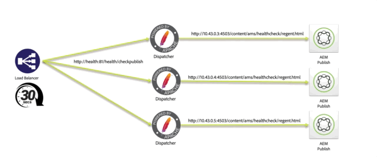
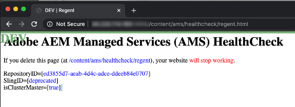
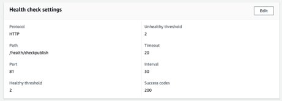
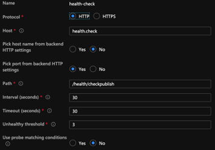
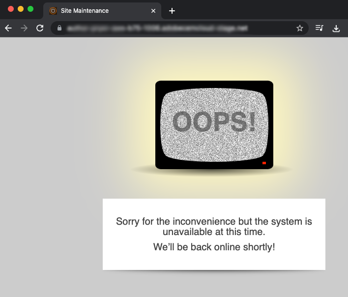

# AMS Dispatcher Health Check

[Table of Contents](./overview.md)

[<- Previous: Read-Only Files](./immutable-files.md)

When you have an AMS baseline installed dispatcher it comes with a few freebies.  One of these features is a set of health check scripts.
These scripts allow the load balancer that fronts the AEM stack to know which legs are healthy and to keep them in service.



## Basic Load Balancer Health Check

When customer traffic comes through the internet to reach your AEM instance they'll go through a load balancer


Each request coming through the load balancer will round robin to each instance.  The load balancer has a health checking mechanism built in to make sure it's sending traffic to a healthy host.

The default check is typically a port check to see if the servers targeted in the load balancer are listening on the port traffic comes in on (i.e. TCP 80 and 443)

> `Note:` While this works it has no real gauge on if AEM is healthy.  It only tests if the Dispatcher (Apache web server) is up and running.

## AMS Health Check

To avoid sending traffic to a healthy dispatcher that is fronting an un-healthy AEM instance, AMS created a few extras that evaluate the health of the leg and not just the Dispatcher.


The health check comprises of the following pieces
- 1 `Load balancer`
- 1 `Apache web server`
- 3 `Apache *VirtualHost* config files`
- 5 `CGI-Bin scripts`
- 1 `AEM instance`
- 1 `AEM package`

We'll cover what each piece is setup to do and their importance

### AEM Package

To indicate if AEM is functioning you need it to do some basic page compilation and serve the page.  Adobe Managed Services created a basic package that contains the test page.  The page tests that the repository is up and that the resources and page template can rendered.


Here is the page.  It will show the repository ID of the installation



> `Note:` We make sure the page isn't cache-able.  It wouldn't check the actual status if each time it just returned a cached page!

This is the light weight endpoint we can test to see that AEM is up and running.

### Load balancer configuration

We configure the load balancers to point to a CGI-BIN endpoint instead of using a port check.





### Apache Health Check Virtual Hosts

#### CGI-BIN Virtual Host `(/etc/httpd/conf.d/available_vhosts/ams_health.vhost)`

This is the `<VirtualHost>` Apache configuration file that enables the CGI-Bin files to be run.

```
Listen 81
<VirtualHost *:81>
    ServerName	"health"
    ...SNIP...
    ScriptAlias /health/ "/var/www/cgi-bin/health/"
</VirtualHost>
```

> `Note:` cgi-bin files are scripts that can be run.  This can be a vulnerable attack vector and these scripts that AMS uses aren't publically accessible only available to the load balancer to test against.


#### Un-Healthy Maintenance Virtual Hosts

- `/etc/httpd/conf.d/available_vhosts/000_unhealthy_author.vhost`
- `/etc/httpd/conf.d/available_vhosts/000_unhealthy_publish.vhost`

These files are named `000_` as the prefix on purpose.  It's intentionaly configured to use the same domain name as the live site.  The intention is for this file to get enabled when the health check detects there is an issue with one of the AEM backends.  Then offer up an error page instead of just a 503 HTTP response code with no page.  It will steal traffic from the normal `.vhost` file because it's loaded before that `.vhost` file while sharing the same `ServerName` or `ServerAlias`.  Resulting in pages destined for a particular domain to go to the unhealthy vhost instead of the default one it's normal traffic flows through.

When the health check scripts run they log out their current health status.  Once a minute there is a cronjob running on the server that looks for un-healthy entries in the log.  If it detects that the author AEM instance isn't healthy it will then enable the symlink:

Log entry:

```
# grep "ERROR\|publish" /var/log/lb/health_check.log
E, [2022-11-23T20:13:54.984379 #26794] ERROR -- : AUTHOR -- Exception caught: Connection refused - connect(2)
I, [2022-11-23T20:13:54.984403 #26794]  INFO -- : [checkpublish]-author:0-publish:1-[checkpublish]
```

Cron picking up the error and reacting:

```
# grep symlink /var/log/lb/health_check_reload.log
I, [2022-11-23T20:34:19.213179 #2275]  INFO -- : ADDING VHOST symlink /etc/httpd/conf.d/available_vhosts/000_unhealthy_author.vhost => /etc/httpd/conf.d/enabled_vhosts/000_unhealthy_author.vhost
```

You can control if author or published sites can have this error page load by configuring the reload mode setting in `/var/www/cgi-bin/health_check.conf`

```
# grep RELOAD_MODE /var/www/cgi-bin/health_check.conf
RELOAD_MODE='author'
```

Valid options:
- author
  - This is the default option.
  - This will put up a maintenance page for author when it's un-healthy
- publish
  - This option will put up a maintenance page for publisher when it's un-healthy
- all
  - This option will put up a maintenance page for author or publisher or both if they become un-healthy
- none
  - This option skips this feature of the health check

When looking at the `VirtualHost` setting for these you'll see they load the same document as an error page for each request that comes when it's enabled:

```
<VirtualHost *:80>
	ServerName	unhealthyauthor
	ServerAlias	${AUTHOR_DEFAULT_HOSTNAME}
	ErrorDocument	503 /error.html
	DocumentRoot	/mnt/var/www/default
	<Directory />
		Options FollowSymLinks
		AllowOverride None
	</Directory>
	<Directory "/mnt/var/www/default">
		AllowOverride None
		Require all granted
	</Directory>
	<IfModule mod_headers.c>
		Header always add X-Dispatcher ${DISP_ID}
		Header always add X-Vhost "unhealthy-author"
	</IfModule>
	<IfModule mod_rewrite.c>
		ReWriteEngine   on
		RewriteCond %{REQUEST_URI} !^/error.html$
		RewriteRule ^/* /error.html [R=503,L,NC]
	</IfModule>
</VirtualHost>
```

The response code is still a `HTTP 503`

```
# curl -I https://we-retail.com/
HTTP/1.1 503 Service Unavailable
X-Dispatcher: dispatcher1useast1
X-Vhost: unhealthy-author
```

Instead of a blank page they'll get this page instead.



### CGI-Bin Scripts

There are 5 different scripts that can be configured in the load balancer settings by your CSE that change the behavior or criteria when to pull a Dispatcher out of the load balancer.

#### /bin/checkauthor

This script when used will check and log any instances it's fronting but only return an error if the `author` AEM instance is unhealthy

> `Note:` Keep in mind that if the publish AEM instance was un-healthy the dispatcher would stay in service to allow traffic to flow to the author AEM instance

#### /bin/checkpublish (default)

This script when used will check and log any instances it's fronting but only return an error if the `publish` AEM instance is unhealthy

> `Note:` Keep in mind that if the author AEM instance was un-healthy the dispatcher would stay in service to allow traffic to flow to the publish AEM instance

#### /bin/checkeither

This script when used will check and log any instances it's fronting but only return an error if the `author` or the `publisher` AEM instance is unhealthy

> `Note:` Keep in mind that if either the publish AEM instance or author AEM instance was un-healthy the dispatcher would pull out of service.  Meaning if one of them was healthy it would also not receive traffic

#### /bin/checkboth

This script when used will check and log any instances it's fronting but only return an error if the `author` and the `publisher` AEM instance are unhealthy

> `Note:` Keep in mind that if the publish AEM instance or author AEM instance was un-healthy the dispatcher wouldn't pull out of service.  Meaning if one of them was un-healthy it would continue to receive traffic and give errors to people requesting resources.

#### /bin/healthy

This script when used will check and log any instances it's fronting but will just return healthy regardless of whether or not AEM is returning an error.

> `Note:` This script is used when the health check is not functioning as desired and allowing an override to keep AEM instances in the load balancer.

[Next -> GIT Symlinks](./git-symlinks.md)
