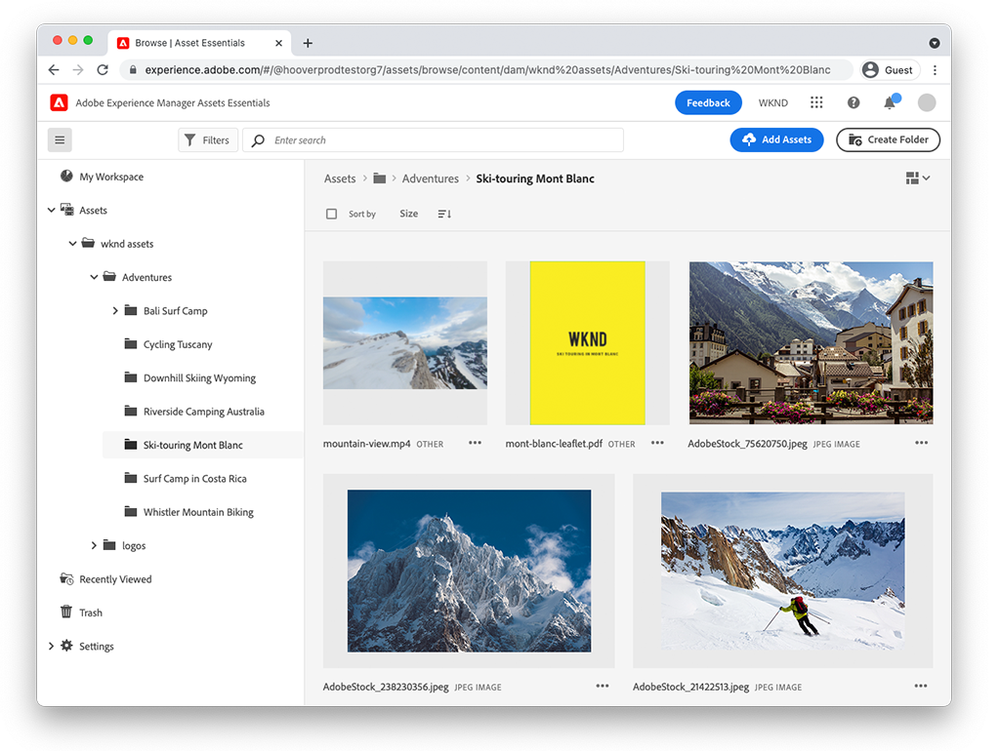
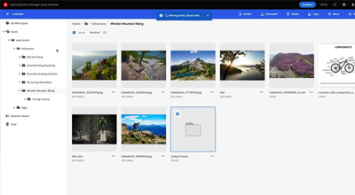
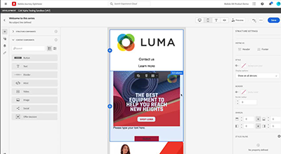

# AEM Assets Essentials

Experience Manager Assets Essentials provides a streamlined user interface for lightweight asset management and collaboration.

Check out our videos on how to use Assets Essentials to manage your assets, as well as how it can be integrated with Adobe Journey Orchestrator!

<table>
<td>
   
   

      <a href="./basics/managing.md">
      <strong>Getting started with Assets Essentials</strong>
      </a>
   

   

      <em>Learn the basics of how Assets Essentials!</em>
   

</td>
<!--
<td>
   
   

      <a href="./provisioning/getting-access.md">
      <strong>Creative Cloud and Assets Essentials</strong>
      </a>
   

   

      <em>Learn how Assets Essentials can integrate with your Creative Cloud Enterprise Libraries!</em>
   

</td>
-->
<td>
   
   

      <a href="https://experienceleague.adobe.com/docs/journey-optimizer/using/create-messages/assets-essentials.html">
      <strong>Adobe Journey Optimizer</strong>
      </a>
   

   

      <em>Learn how Assets Essentials integrates with Adobe Journey Optimizer!</em>
   

</td>
</table>
