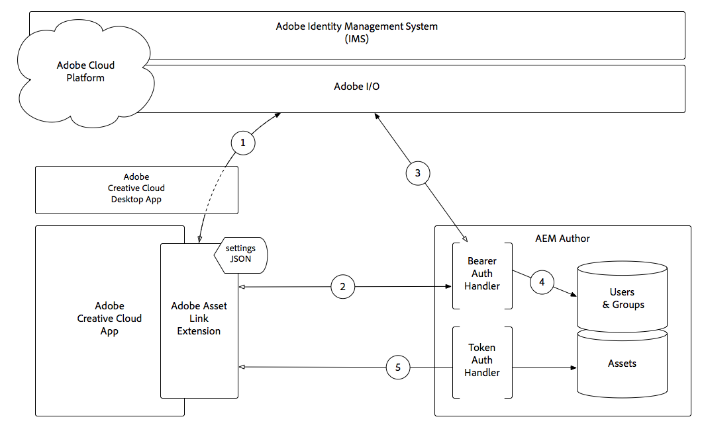

# Adobe Asset Link authentication {#adobe-asset-link-authentication-with-aem-assets}

How Adobe Asset Link authenticates with AEM Author using Adobe Identity Management Services (IMS) and a Bearer token.

1. The Adobe Asset Link extension makes an authorization request, via the Adobe Creative Cloud Desktop App, to Adobe Identity Management Service (IMS), and upon success, receives a Bearer token.
1. Adobe Asset Link extension connects to AEM Author over HTTP(S), including the Bearer token obtained in **Step 1**, using the scheme (HTTP/HTTPS), host, and port provided in the extension's settings JSON.
1. AEM's Bearer Authentication Handler extracts the Bearer token from the request and validates it with Adobe IMS.
1. Once Adobe IMS validates the Bearer token, a user is created in AEM (if it doesn't already exist), and syncs profile and group/membership data from Adobe IMS. The AEM user is issued a standard AEM login token, which is sent back to the Adobe Asset Link extension as a cookie on the HTTP(S) response.
1. Subsequent interactions (browsing, searching, checking in/out assets, and so on) with the Adobe Asset Link extension result in HTTP(S) requests to AEM Author, validated using the AEM login token via the standard AEM Token Authentication Handler.

>[!NOTE]
>
>When a login token expires, steps 1-5 automatically repeat: the extension re-authenticates with the Bearer token and receives a new, valid login token.
