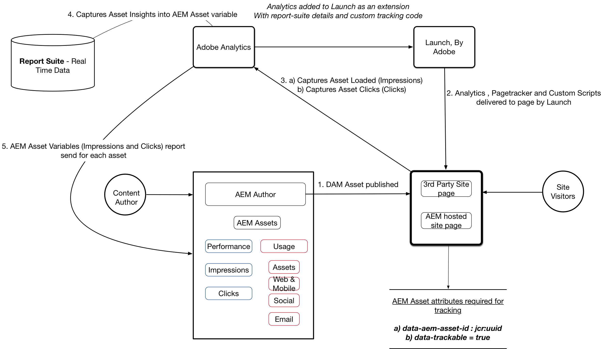

# Set up Asset Insights with AEM Assets and Adobe Experience Platform Launch

In this five-part video series, let's walk through the setup and configuration of Asset Insights for Experience Manager deployed via Adobe Launch.

## Part 1: Asset Insights Overview {#overview}

Asset Insights Overview. Install Core Components, Sample Image Component and other content packages to get your environment ready.

>[!VIDEO](https://video.tv.adobe.com/v/25943?quality=12&learn=on)

### Architecture Diagram {#architecture-diagram}



>[!CAUTION]
>
>Make sure to download the [latest version of Core Components](https://github.com/adobe/aem-core-wcm-components) for your implementation. 

The video uses Core Components v2.2.2 which is not the latest version; be sure to use the latest version before you proceed to the next section.

* Download [Asset Insights Sample Image Content](./assets/asset-insights-launch-tutorial/aem-assets-insights-sample.zip)
* Download [the latest AEM WCM Core Components](https://github.com/adobe/aem-core-wcm-components/releases)

## Part 2 : Enabling Asset Insights Tracking for Sample Image Component {#sample-image-component-asset-insights}

Enhancements to Core Components and using proxy component (Sample Image Component) for Asset Insights. Editing the content page template policies to enable sample image component for reference site.

>[!VIDEO](https://video.tv.adobe.com/v/25944?quality=12&learn=on)

>[!NOTE]
>
>Image Core Component includes the capability to disable UUID tracking by disabling tracking of asset's UUID (unique identifier value for a node created within JCR)

Core Image component uses ***data-asset-id*** attribute within the parent &lt;div&gt; of an image tag to enable/disable this feature. Proxy Component overrides the core component with the following changes.

* Removes the ***data-asset-id*** from the parent div of an &lt;img&gt; element within the image.html
* Adds ***data-aem-asset-id*** directly to the &lt;img&gt; element within the image.html
* Adds ***data-trackable='true'*** value to the &lt;img&gt; element within the image.html
* ***data-aem-asset-id*** and ***data-trackable='true'*** are kept at the same node level

>[!NOTE]
>
>*data-aem-asset-id='image.UUID'* and *data-trackable='true'* are the key attributes that need to be present for Asset Impressions. For Asset Click Insights, in addition to the above data attributes present at the &lt;img&gt; tag, the parent &lt;a&gt; tag must have a valid href value.

## Part 3: Adobe Analytics — Creating Report Suite, enabling Real-Time data collection and AEM Assets Reporting {#adobe-analytics-asset-insights}

Report suite with real-time data collection is created for asset tracking. AEM Assets Insights configuration is set up using Adobe Analytics credentials.

>[!VIDEO](https://video.tv.adobe.com/v/25945?quality=12&learn=on)

>[!NOTE]
>
>Real-Time data collection and AEM Asset Reporting must be enabled for your Adobe Analytics Report Suite. Enabling AEM Asset Reporting reserves analytics variables for tracking asset insights.

For AEM Assets Insights configuration you need the following credentials

* Data Center
* Analytics Company name
* Analytics Username
* Shared Secret (can be obtained from *Adobe Analytics &gt; Admin &gt; Company Settings &gt; Web Service*).
* Report Suite (Make sure to select the right Report Suite that is used for Asset Reporting)

## Part 4: Using Adobe Experience Platform Launch for adding Adobe Analytics extension {#part-using-launch-by-adobe-for-adding-adobe-analytics-extension}

Adding Adobe Analytics Extension, Creating Page Load rules and Integrating AEM with Launch with Adobe IMS technical account.

>[!VIDEO](https://video.tv.adobe.com/v/25946?quality=12&learn=on)

>[!NOTE]
>
>Make sure to replicate all your changes from author instance to publish instance.

### Rule 1 : Page Tracker (pagetracker.js) {#rule-page-tracker-pagetracker-js}

```javascript
//For AEM 6.3
<script type="text/javascript" src="http://localhost:4503/etc/clientlibs/foundation/assetinsights/pagetracker.js"></script>
```

```javascript
//For AEM 6.4
<script type="text/javascript" src="http://localhost:4503/etc.clientlibs/dam/clientlibs/assetinsights/pagetracker.js"></script>
```

Page tracker implements two call backs (registered in asset-embed-code)

* **\<code>assetAnalytics.core.assetLoaded\<code>** : called when 'load' event is dispatched for the asset-DOM-element.
* **\<code>assetAnalytics.core.assetClicked\<code>** : called when 'click' event is dispatched for the asset-DOM-element this is relevant only when the asset-DOM-element has an anchor tag as parent with a valid, external 'href' attribute

Finally, Page tracker implements an initialization function as.

*  **\<code>assetAnalytics.dispatcher.init()\<code>** : called to initialize the Page tracker component. This MUST be invoked before any of the asset-insights-events (Impressions and/or Clicks) are generated from the webpage.
* **\<code>assetAnalytics.dispatcher.init()\<code>** : optionally accepts an AppMeasurement object — if provided, it does not attempt to create an instance of AppMeasurement object.

### Rule 2: Image Tracker — Action 1 (asset-insights.js) {#rule-image-tracker-action-asset-insights-js}

```javascript
/*
 * AEM Asset Insights
 */

var sObj = window.s;
_satellite.notify('in assetAnalytics customInit');
(function initializeAssetAnalytics() {
 if ((!!window.assetAnalytics) && (!!assetAnalytics.dispatcher)) {
 _satellite.notify('assetAnalytics ready');
 /** NOTE:
  Copy over the call to 'assetAnalytics.dispatcher.init()' from Assets Pagetracker
  Be mindful about changing the AppMeasurement object as retrieved above.
  */
 assetAnalytics.dispatcher.init(
                                "",  /** RSID to send tracking-call to */
                                "",  /** Tracking Server to send tracking-call to */
                                "",  /** Visitor Namespace to send tracking-call to */
                                "",  /** listVar to put comma-separated-list of Asset IDs for Asset Impression Events in tracking-call, e.g. 'listVar1' */
                                "",  /** eVar to put Asset ID for Asset Click Events in, e.g. 'eVar3' */
                                "",  /** event to include in tracking-calls for Asset Impression Events, e.g. 'event8' */
                                "",  /** event to include in tracking-calls for Asset Click Events, e.g. 'event7' */
                                sObj  /** [OPTIONAL] if the webpage already has an AppMeasurement object, please include the object here. If unspecified, Pagetracker Core shall create its own AppMeasurement object */
                                );
 sObj.usePlugins = true;
 sObj.doPlugins = assetAnalytics.core.updateContextData;
}
 else {
 _satellite.notify('assetAnalytics not available. Consider updating the Custom Page Code', 4);
 }
})();


```

### Rule 2: Image Tracker — Action 2 (image-tracker.js) {#rule-image-tracker-action-image-tracker-js}

```javascript
/*
 * AEM Asset Insights
 */

document.querySelectorAll('[data-aem-asset-id]').forEach(function(element) {
    assetAnalytics.core.assetLoaded(element);
    var parent = element.parentElement;
    if (parent.nodeName == "A") {
        parent.addEventListener("click", function() {
            assetAnalytics.core.assetClicked(this)
        });
    }
});

```

* assetAnalytics.core.assetLoaded() : is invoked on page load complete and is triggers Asset Impressions for all trackable images
* Analytics Variable that carries the loaded asset list : **contextData['c.a.assets.idList']**
* assetAnalytics.core.assetClicked() : is invoked when the asset DOM element has an anchor tag with valid href value. When an asset is clicked, a cookie is created with the clicked asset ID as its value.**(Cookie name: a.assets.clickedid)**
* Analytics Variable that carries the loaded asset list : **contextData['c.a.assets.clickedid']**
* Source of Origin : **contextData['c.a.assets.source']**

### Console debug statements {#console-debug-statements}

```javascript
//Launch Build Info
_satellite.buildInfo

//Enables debug messages
_satellite.setDebug(true);

//Asset Insight JS Object
assetAnalytics

//List of trackable images
document.querySelectorAll(".cmp-image__image");
```

Two Google Chrome browser extensions are referenced in the video as ways to debug Analytics. Similar extensions are available for other browsers as well.

* [Launch Switch Chrome Extension](https://chrome.google.com/webstore/detail/launch-and-dtm-switch/nlgdemkdapolikbjimjajpmonpbpmipk?hl=en)
* [Adobe Experience Cloud Debugger](https://chrome.google.com/webstore/detail/adobe-experience-platform/bfnnokhpnncpkdmbokanobigaccjkpob)

It is also possible to switch DTM into debug mode with the following Chrome Extension: [Launch and DTM Switch](https://chrome.google.com/webstore/detail/launch-and-dtm-switch/nlgdemkdapolikbjimjajpmonpbpmipk?hl=en). This makes it easier to see if there are any errors related to DTM deployment. In addition, you can manually switch DTM to debug mode via any browser *developer tool -&gt; JS Console* by adding the following snippet:

## Part 5 : Testing Analytic Tracking and Syncing Insight Data{#analytics-tracking-asset-insights}

Configuring AEM Asset Reporting Sync Job Scheduler and Assets Insights Report

>[!VIDEO](https://video.tv.adobe.com/v/25947?quality=12&learn=on)
