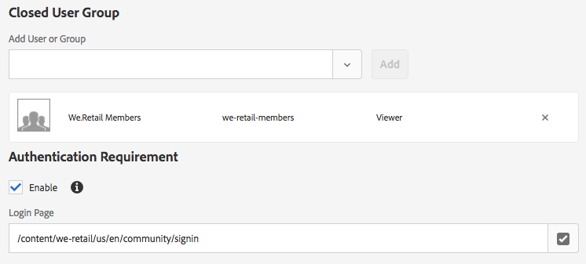

# Using Closed User Groups with AEM Assets{#using-closed-user-groups-with-aem-assets}

Closed User Groups (CUGs) is a feature used to restrict access to content to a select group of users on a published site. This video shows how Closed User Groups can be used with Adobe Experience Manager Assets to restrict access to a specific folder of assets. Support for Closed User Groups with AEM Assets was first introduced in AEM 6.4.

>[!VIDEO](https://video.tv.adobe.com/v/22155?quality=9)

## Closed User Group (CUG) with AEM Assets

* Designed to restrict access to assets on an AEM Publish instance.
* Grants read access to a set of users/groups.
* CUG can only be configured at a folder level. CUG cannot be set on individual assets.
* CUG policies are automatically inherited by any sub-folders and applied assets.
* CUG policies can be overridden by sub-folders by setting a new CUG policy. This should be used sparingly and is not considered a best practice.

## CUG representation in the JCR {#cug-representation-in-the-jcr}



We.Retail Members Group added as a Closed User Group to folder: /content/dam/we-retail/en/beta-products

A mixin of **rep:CugMixin** is applied to **/content/dam/we-retail/en/beta-products** folder. A node of **rep:cugPolicy** is added beneath the folder and we-retail-members is specified as a principal. Another mixin of **granite:AuthenticationRequired** is applied to the beta-products folder and the property** granite:loginPath** specifies the Login Page to be used if a user is not authenticated and attempts to request an asset beneath the **beta-products** folder.

JCR description below:

```xml
/beta-products
    - jcr:primaryType = sling:Folder
    - jcr:mixinTypes = rep:CugMixin, granite:AuthenticationRequired
    - granite:loginPath = /content/we-retail/us/en/community/signin
    + rep:cugPolicy
         - jcr:primaryType = rep:CugPolicy
         - rep:principalNames = we-retail-members

```

## Closed User Groups vs. Access Control Lists {#closed-user-groups-vs-access-control-lists}

Both Closed User Groups (CUG) and Access Control Lists (ACL) are used to control access to content in AEM and based on AEM Security users and groups. However the application and implementation of these features is very different. The following table summarizes the distinctions between the two features.

| |ACL |CUG |
|---|---|---|
| Intended Use |Configure and apply permissions for content on the **current** AEM instance. |Configure CUG policies for content on AEM **author** instance. Apply CUG policies for content on AEM **publish** instance(s). |
| Permission Levels |Defines granted/denied permissions for users/groups for all levels: Read, Modify, Create, Delete, Read ACL, Edit ACL, Replicate. |Grants read access to a set of users/groups. Denies read access to all other users/groups. |
| Replication |ACLs are not replicated with content. |CUG policies are replicated with content. |

## Supporting Links {#supporting-links}

* [Managing Assets and Closed User Groups](https://helpx.adobe.com/experience-manager/6-5/assets/using/managing-assets-touch-ui.html#ClosedUserGroup)
* [Creating a Closed User Group](https://helpx.adobe.com/experience-manager/6-5/sites/administering/using/cug.html)
* [Oak Closed User Group Documentation](https://jackrabbit.apache.org/oak/docs/security/authorization/cug.html)
