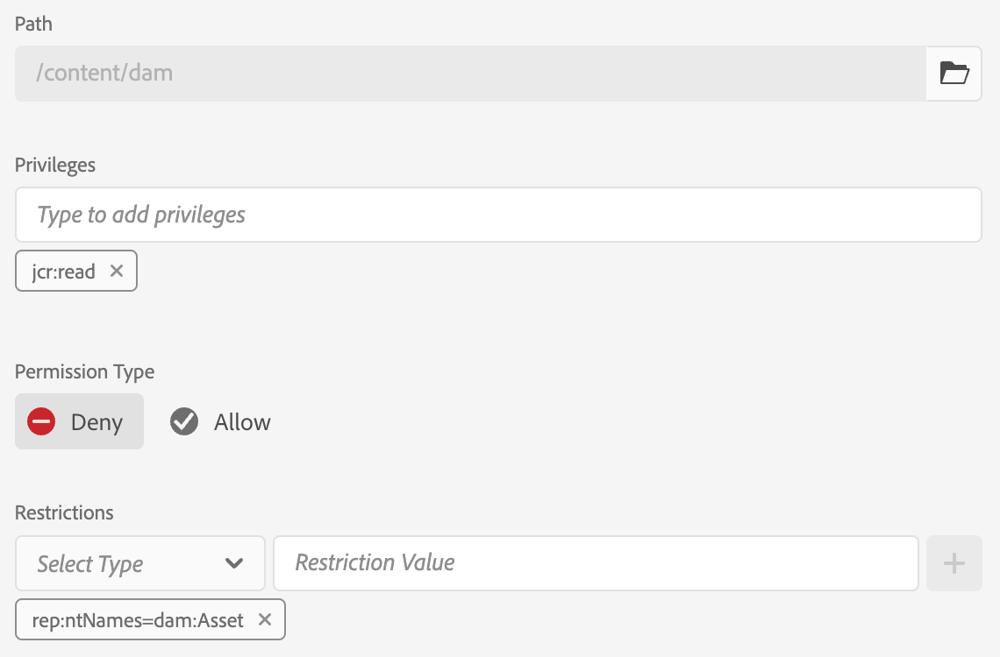
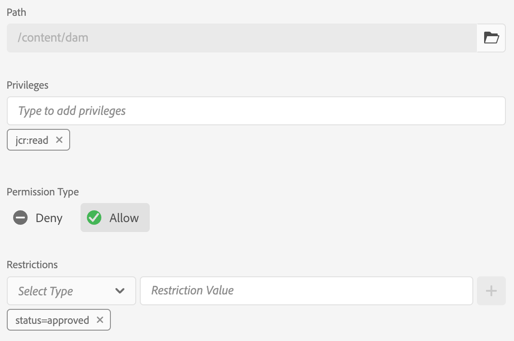
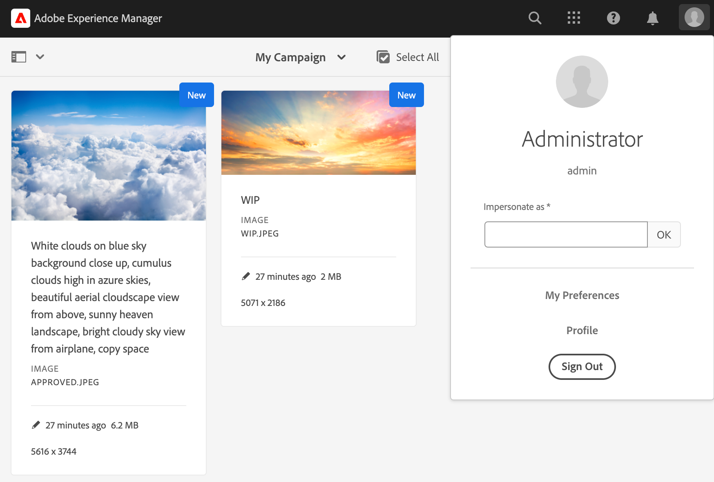
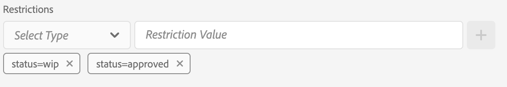
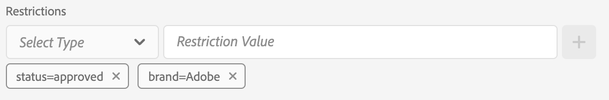
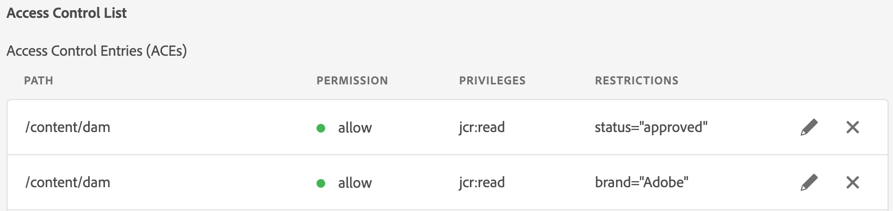

# Metadata-Driven Permissions{#metadata-driven-permissions}

Metadata-Driven Permissions is a feature used to allow access control decisions on AEM Assets Author to be based on asset metadata properties rather than folder structure. With this capability, you can define access control policies that evaluate attributes such as asset status, type, or any custom metadata property you define.

Let's see an example. Creatives upload their work to AEM Assets to the campaign related folder, it might be a work in progress asset which has not been approved for use. We want to make sure that marketeers see only approved assets for this campaign. We can utilize metadata property to indicate that an asset has been approved and can be used by the marketeers.

## How It Works

Enabling Metadata-Driven Permissions involves defining which asset metadata properties will drive access restrictions, such as "status" or "brand." These properties can then be used to create access control entries that specify which user groups have access to assets with specific property values.

## Prerequisites

Access to an AEM as a Cloud Service environment updated to the latest version is required for setting up metadata-driven permissions.


## Development steps

To implement Metadata-Driven Permissions:

1. Determine which asset metadata properties will be used for access control. In our case it going to be a property called `status`.
1. Create an OSGi configuration `com.adobe.cq.dam.assetmetadatarestrictionprovider.impl.DefaultRestrictionProviderConfiguration.cfg.json` in your project.
1.  Paste the following JSON into the created file

    ```json
    {
      "restrictionPropertyNames":[
        "status",
        "brand"
      ],
      "enabled":true
    }
    ```

1. Replace the property names with the required values.


Before adding restriction-based Access Control Entries, a new top-level entry should be added to first deny read access to all groups that are subject to permission evaluation for Assets (e.g. "contributors" or similar):

1. Navigate to the Tools → Security → Permissions screen 
1. Select the "Contributors" group (or other custom group that all users groups belong to)
1. Click "Add ACE" in the upper right corner of the screen
1. Select /content/dam for Path
1. Enter jcr:read for Privileges
1. Select Deny for Permission Type
1. Under Restrictions, select rep:ntNames and enter dam:Asset as the Restriction Value
1. Click Save
   


Access control entries can now be added to grant read access to user groups based on Asset metadata property values.

1. Navigate to the Tools → Security → Permissions screen
1. Select the desired group
1. Click "Add ACE" in the upper right corner of the screen
1. Select /content/dam (or a subfolder) for Path
1. Enter jcr:read for Privileges
1. Select Allow for Permission Type
1. Under Restrictions, select one of the configured Asset metadata property names (the properties defined in the OSGi configuration will be included here)
1. Enter the required metadata property value in the Restriction Value field
1. Click the "+" icon to add the Restriction to the Access Control Entry
1. Click Save



Example folder contains a couple of assets.



Once you configure permissions and set the asset metadata properties accordingly users (Marketeer User in our case) will see only approved asset.


## Benefits and Considerations

The benefits of Metadata-Driven Permissions include:

- Fine-grained control over asset access based on specific attributes.
- Decoupling of access control policies from folder structure, allowing for more flexible asset organization.
- Ability to define complex access control rules based on multiple metadata properties.

>[!NOTE]
>
> It's important to note:
> 
> - Metadata properties are evaluated against the restrictions using String equality (other data types not yet supported, e.g. date)
> - To allow multiple values for a restriction property, additional restrictions can be added to the Access Control Entry by selecting the same property from the "Select Type" dropdown and entering a new Restriction Value (e.g. `status=approved`, `status=wip`) and clicking "+" to add the restriction to the entry
> 
> - Multiple restrictions in a single Access Control Entry with different property names (e.g. `status=approved`, `brand=Adobe`) will be evaluated as an AND condition, i.e. the selected user group will be granted read access to assets with `status=approved AND brand=Adobe`
> 
> - Adding a new Access Control Entry with a metadata property restriction will establish an OR condition for the entries, e.g. a single entry with restriction `status=approved` and a single entry with `brand=Adobe` will be evaluated as `status=approved OR brand=Adobe`
> 
