# Programmatic asset upload to AEM as a Cloud Service

Learn how to upload assets to AEM as a Cloud Service environment using the client application that uses the [aem-upload](https://github.com/adobe/aem-upload) Node.js library.


>[!VIDEO](https://video.tv.adobe.com/v/3476952?quality=12&learn=on)


## What you learn

In this tutorial, you learn:

+ How to use the _direct binary upload_ approach to upload assets to AEM as a Cloud Service environment (RDE, Dev, Stage, Prod) using the [aem-upload](https://github.com/adobe/aem-upload) Node.js library.
+ How to configure and run the [aem-asset-upload-sample](./assets/programmatic-asset-upload/aem-asset-upload-sample.zip) application to upload assets to AEM as a Cloud Service environment.
+ Review the sample application code and understand the implementation details.
+ Understand the best practices for programmatic asset upload to AEM as a Cloud Service environment.

## Understanding the _direct binary upload_ approach

The _direct binary upload_ approach lets you upload files from your source system _directly to cloud storage_ in AEM as a Cloud Service environment using a _presigned URL_. It eliminates the need to route binary data through AEM's Java processes, resulting in faster uploads and reduced server load.

Before running the sample application, let's understand direct binary upload flow.

In direct binary upload flow, the binary data is uploaded directly to cloud storage with presigned URLs. The AEM as a Cloud Service is responsible for lightweight processing like generating the presigned URLs and notifying AEM Asset Compute Serviceabout the upload completion. The following logical flow diagram illustrates the direct binary upload flow.

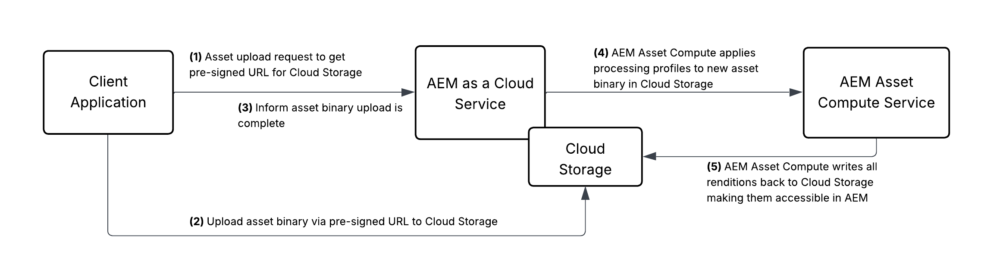

### The aem-upload library

The [aem-upload](https://github.com/adobe/aem-upload) Node.js library abstracts the implementation details of the _direct binary upload_ approach. It provides two classes to orchestrate the upload process:   

+ **FileSystemUpload** - Use it when uploading files from the local file system, including support for directory structures
+ **DirectBinaryUpload** - Use it for more fine-grained control over the binary upload process, such as uploading from streams or buffers

>[!CAUTION]
>
>There is NO equivalent of the [aem-upload](https://github.com/adobe/aem-upload) library in Java. The client application must be written in Node.js to use the _direct binary upload_ approach. For additional information, see the [Experience Manager Assets APIs and operations](https://experienceleague.adobe.com/en/docs/experience-manager-cloud-service/content/assets/admin/developer-reference-material-apis#use-cases-and-apis) page.

## Sample application

Use the [aem-asset-upload-sample](./assets/programmatic-asset-upload/aem-asset-upload-sample.zip) application to learn the programmatic asset upload process. The sample application demonstrates the use of both `FileSystemUpload` and `DirectBinaryUpload` classes from the [aem-upload](https://github.com/adobe/aem-upload) library.

### Prerequisites

Before running the sample application, ensure you have the following prerequisites:

+ AEM as a Cloud Service author environment such as Rapid Development Environment (RDE), Dev environment, etc.
+ Node.js (latest LTS version)
+ Basic understanding of Node.js and npm

>[!CAUTION]
>
> You can NOT use the AEM as a Cloud Service SDK (aka local AEM instance) to test the programmatic asset upload process. You must use a AEM as a Cloud Service environment such as Rapid Development Environment (RDE), Dev environment, etc.

### Download the sample application

1. Download the [aem-asset-upload-sample](./assets/programmatic-asset-upload/aem-asset-upload-sample.zip) application zip file and extract it.

    ```bash
    $ unzip aem-asset-upload-sample.zip
    ```

1. Open the extracted folder in your favorite code editor.

    ```bash
    $ cd aem-asset-upload-sample
    $ code .
    ```

1. Using the code editor terminal, install the dependencies.

    ```bash
    $ npm install
    ```

    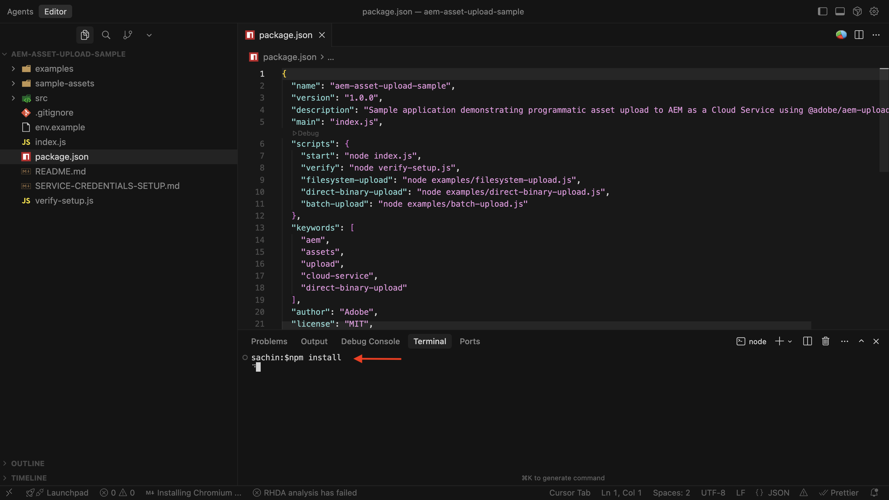

### Configure the sample application

Before running the sample application, you must configure it with necessary AEM as a Cloud Service environment details like AEM Author URL, _authentication method_ and asset folder path.

There are _multiple authentication methods_ supported by the [aem-upload](https://github.com/adobe/aem-upload) Node.js library. The following table summarizes the supported _authentication methods_ and their purpose.

| | Basic authentication | [Local development token](https://experienceleague.adobe.com/en/docs/experience-manager-learn/getting-started-with-aem-headless/authentication/local-development-access-token) | [Service credentials](https://experienceleague.adobe.com/en/docs/experience-manager-learn/getting-started-with-aem-headless/authentication/service-credentials) | [OAuth S2S](https://developer.adobe.com/developer-console/docs/guides/authentication/ServerToServerAuthentication/) | [OAuth Web App](https://developer.adobe.com/developer-console/docs/guides/authentication/UserAuthentication/implementation#oauth-web-app-credential) | [OAuth SPA](https://developer.adobe.com/developer-console/docs/guides/authentication/UserAuthentication/implementation#oauth-single-page-app-credential) |
|---|---|---|---|---|---|---|
| Is supported?| &check; | &check; | &check; | &cross; | &cross; | &cross; |
| Purpose| Local development | Local development | Production | N/A | N/A | N/A |

To configure the sample application, follow the steps below:

1. Copy the `env.example` file to `.env` file.

    ```bash
    $ cp env.example .env
    ```

1. Open the `.env` file and update the `AEM_URL` environment variable with the AEM as a Cloud Service author URL. 

1. Choose the authentication method from the following options and update the corresponding environment variables.

>[!BEGINTABS]

>[!TAB Basic authentication]

To use basic authentication, you need to create a user in AEM as a Cloud Service environment.

1. Log in to your AEM as a Cloud Service environment.

1. Navigate to the **Tools** > **Security** > **Users** and click the **Create** button.

    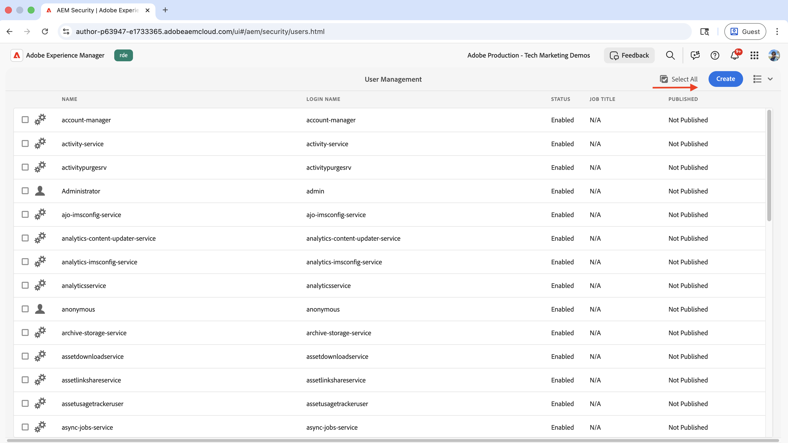

1. Enter the user details

    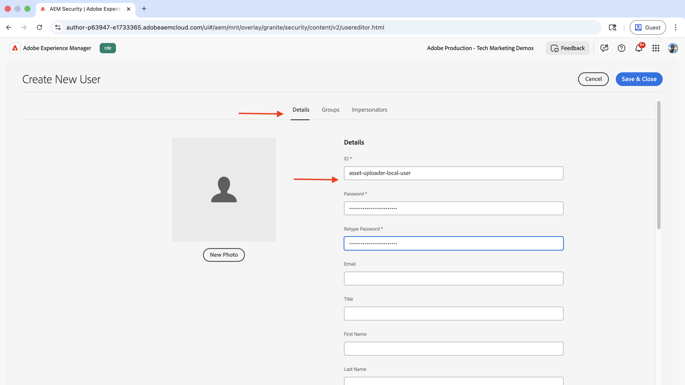

1. In the **Groups** tab, add the **DAM Users** group. Click the **Save and Close** button.

    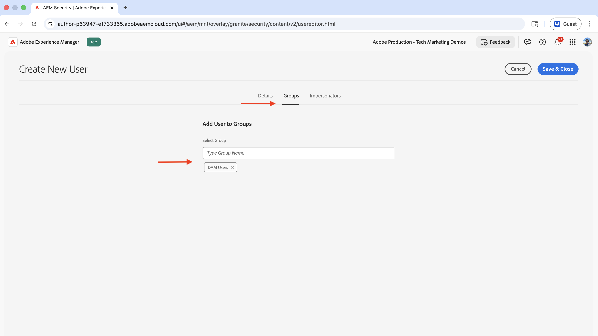

1. Update the `AEM_USERNAME` and `AEM_PASSWORD` environment variables with the username and password of the created user.

>[!TAB Local development token]

To get the local development token, you need to use the **AEM** Developer Console. The generated token is of JSON Web Token (JWT) type. 

1. Log in to [Adobe Cloud Manager](https://experience.adobe.com/#/@aem/cloud-manager) and navigate to the desired **Environment** details page. Click the **"..."** and select **Developer Console**.

    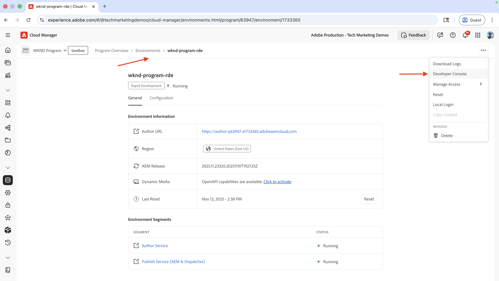

1. Log in to the AEM Developer Console and use the _New Console_ button to switch to the newer console.

1. From the **Tools** section, select **Integrations** and click the **Get local token** button. 

    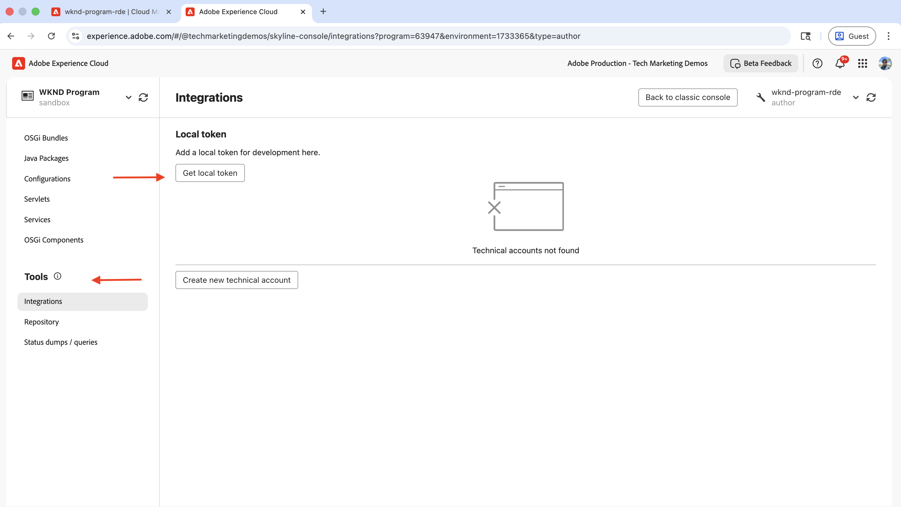

1. Copy the token value and update the `AEM_BEARER_TOKEN` environment variable with the token value.

Note that the local development token is valid for 24 hours and is issued for the user who generated the token.

>[!TAB Service credentials]

To get the service credentials, you need to use the **AEM** Developer Console. It is used to generate the token of JSON Web Token (JWT) type using the [jwt-auth](https://www.npmjs.com/package/@adobe/jwt-auth) npm module.

1. Log in to [Adobe Cloud Manager](https://experience.adobe.com/#/@aem/cloud-manager) and navigate to the desired **Environment** details page. Click the **"..."** and select **Developer Console**.

    

1. Log in to the AEM Developer Console and use the _New Console_ button to switch to the newer console.

1. From the **Tools** section, select **Integrations** and click the **Create new technical account** button.

    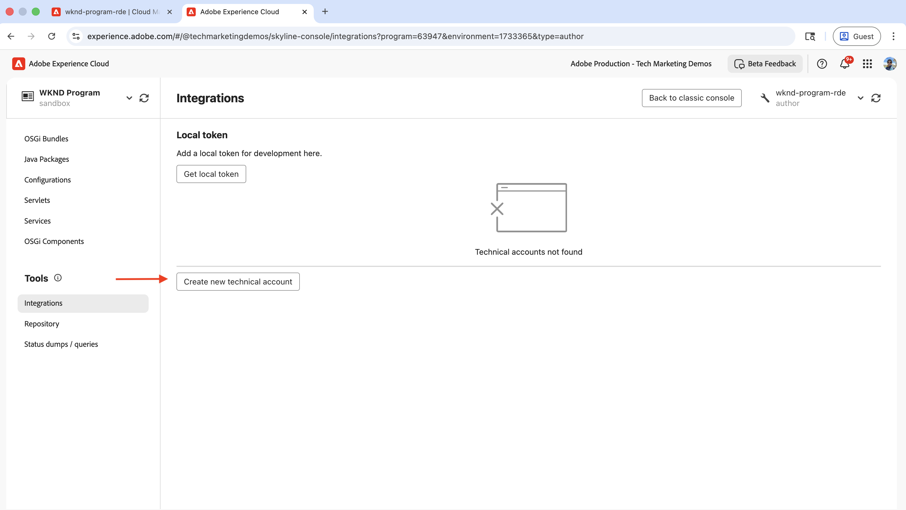

1. Click the **View** option to copy the service credentials JSON.

    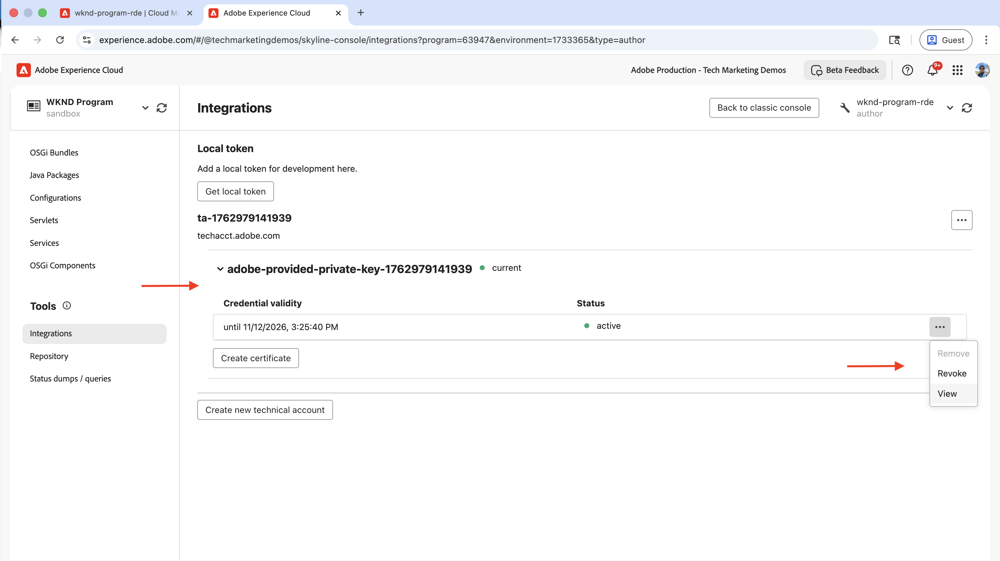

1. Create a `service-credentials.json` file in the root of the sample application and paste the service credentials JSON into the file.

1. Update the `AEM_SERVICE_CREDENTIALS_FILE` environment variable with the path to the service-credentials.json file.

1. Make sure that the service credential user has the necessary permissions to upload assets to AEM as a Cloud Service environment. For more information, see [Configure access in AEM](https://experienceleague.adobe.com/en/docs/experience-manager-learn/getting-started-with-aem-headless/authentication/service-credentials#configure-access-in-aem) page.

>[!ENDTABS]

Here is complete sample `.env` file with all three authentication methods configured.

```
# AEM Environment Configuration
# Copy this file to .env and fill in your AEM as a Cloud Service details

# AEM as a Cloud Service Author URL (without trailing slash)
# Example: https://author-p12345-e67890.adobeaemcloud.com
AEM_URL=https://author-p63947-e1733365.adobeaemcloud.com

# Upload Configuration
# Target folder in AEM DAM where assets will be uploaded
TARGET_FOLDER=/content/dam

# DirectBinaryUpload Remote URLs (required for DirectBinaryUpload example)
# URLs for remote files to upload in the DirectBinaryUpload example
# These demonstrate uploading from remote sources (URLs, CDNs, APIs)
REMOTE_FILE_URL_1=https://placehold.co/600x400/red/white?text=Adobe+Experience+Manager+Assets

################################################################
# Authentication - Choose one of the following methods:
################################################################

# Method 1: Service Credentials (RECOMMENDED for production)
# Download service credentials JSON from AEM Developer Console and save it locally
# Then provide the path to the file here
AEM_SERVICE_CREDENTIALS_FILE=./service-credentials.json

# Method 2: Bearer Token Authentication (for manual testing)
AEM_BEARER_TOKEN=eyJhbGciOiJSUzI1NiIsIng1dSI6Imltc19uYTEta2V5LWF0LTEuY2VyIiwia2lkIjoiaW1zX25hM....fsdf-Rgt5hm_8FHutTyNQnkj1x1SUs5OkqUfJaGBaKBKdqQ

# Method 3: Basic Authentication (for development/testing only)
AEM_USERNAME=asset-uploader-local-user
AEM_PASSWORD=asset-uploader-local-user

# Optional: Enable detailed logging
DEBUG=false
```

### Run the sample application

The sample application showcases three different ways to upload sample assets to AEM as a Cloud Service environment. 

1. **FileSystemUpload** - Upload files from a local file system with directory structure support and auto-folder creation
1. **DirectBinaryUpload** - Uploads a [remote file](https://placehold.co/600x400/red/white?text=Adobe+Experience+Manager+Assets). The file binary is buffered in memory before uploading to AEM as a Cloud Service environment.
1. **Batch Upload** - Uploads multiple files from a local file system in batches with automatic retry logic and error recovery. Behind the scenes, it uses the `FileSystemUpload` class to upload files from the local file system.

To be uploaded assets are located in the `sample-assets` folder and contains `img`, `video` and `doc` sub-folders each containing a few sample assets.

1. To run the sample application, use the following command:

  ```bash
  $ npm start
  ```

1. Enter the desired option _number_ from the following choices:

  ```
  ╔════════════════════════════════════════════════════════════╗
  ║      AEM Asset Upload Sample Application                   ║
  ║      Demonstrating @adobe/aem-upload library               ║
  ╚════════════════════════════════════════════════════════════╝

  Choose an upload method:

  1. FileSystemUpload - Upload files from local filesystem with auto-folder creation
  2. DirectBinaryUpload - Upload from remote URLs/streams to AEM
  3. Batch Upload - Upload multiple files in batches with retry logic
  4. Exit
  ```

The following tabs show the sample application run, its output and uploaded assets in AEM as a Cloud Service environment for each upload method.

>[!BEGINTABS]

>[!TAB FileSystemUpload]

1. The sample application output for `FileSystemUpload` option:

  ```bash
  ...
  Upload Summary:
  ──────────────────────────────────────────────────
  Total files: 5
  Successful: 5
  Failed: 0
  Total time: 2.67s
  ──────────────────────────────────────────────────
  ✓ 
  All files uploaded successfully!
  ```

1. Assets uploaded using `FileSystemUpload` option in AEM as a Cloud Service environment:

    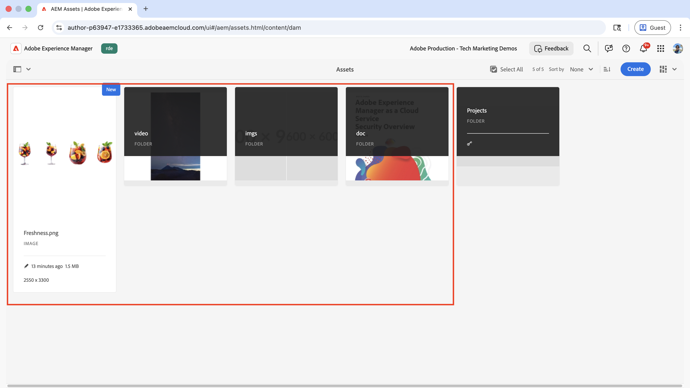

>[!TAB DirectBinaryUpload]

1. The sample application output for `DirectBinaryUpload` option:

  ```bash
  ...
  Upload Summary:
  ──────────────────────────────────────────────────
  Total files: 1
  Successful: 1
  Total time: 561ms
  ──────────────────────────────────────────────────

  ✅ Successfully uploaded to AEM: https://author-p63947-e1733365.adobeaemcloud.com/ui#/aem/assets.html/content/dam?appId=aemshell
    → remote-file-1.png
      Source: https://placehold.co/600x400/red/white?text=Adobe+Experience+Manager+Assets
  ✓ 
  All files uploaded successfully!
  ```

1. Assets uploaded using `DirectBinaryUpload` option in AEM as a Cloud Service environment:

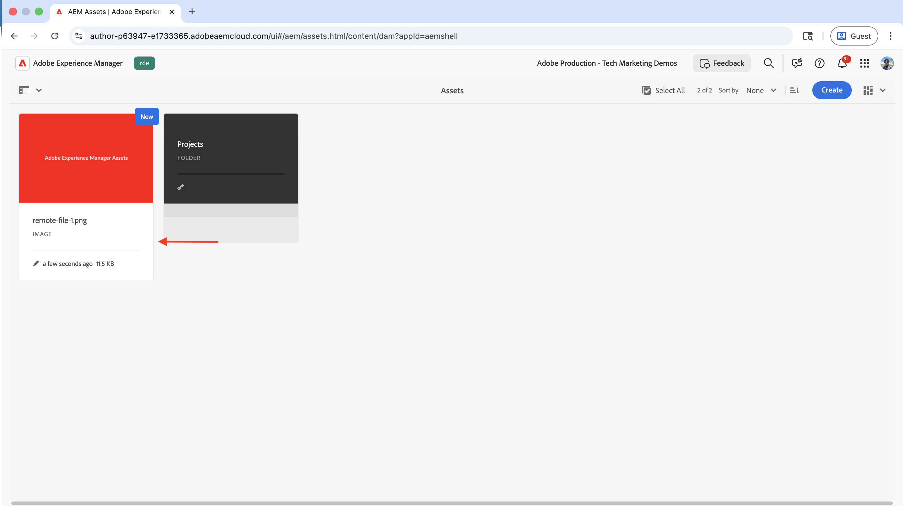

>[!TAB Batch Upload]

1. The sample application output for `Batch Upload` option:

  ```bash
  ...
  ℹ Found 4 item(s) to upload in batches (directories + files)
  ℹ Batch size: 2 (small for demo, use 10-50 for production)

  ...

  ✓ Batch 2 completed in 2.79s

  Upload Summary:
  ──────────────────────────────────────────────────
  Total files: 5
  Successful: 5
  Failed: 0
  Total time: 4.50s
  ──────────────────────────────────────────────────
  ✓ 
  All files uploaded successfully!
  ```

1. Assets uploaded using `Batch Upload` option in AEM as a Cloud Service environment:

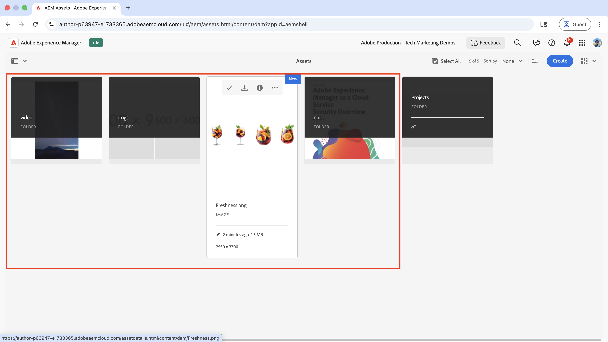

>[!ENDTABS]

## Review the sample application code

The main entry point of the sample application is the `index.js` file. It contains the `promptUser` function that prompts the user for a choice and executes the selected example.

```javascript

/**
 * Prompts user for choice and executes the selected example
 */
function promptUser() {
  rl.question(chalk.bold('Enter your choice (1-4): '), async (answer) => {
    console.log('');

    try {
      switch (answer.trim()) {
        case '1':
          console.log(chalk.bold.green('\n▶ Running FileSystemUpload Example...\n'));
          await filesystemUpload.main();
          break;

        case '2':
          console.log(chalk.bold.green('\n▶ Running DirectBinaryUpload Example...\n'));
          await directBinaryUpload.main();
          break;

        case '3':
          console.log(chalk.bold.green('\n▶ Running Batch Upload Example...\n'));
          await batchUpload.main();
          break;

        case '4':
          rl.close();
          return;

        default:
          console.log(chalk.red('\n✗ Invalid choice. Please enter 1, 2, 3, or 4.\n'));
      }

      // After example completes, ask if user wants to continue
      rl.question(chalk.bold('\nPress Enter to return to menu or Ctrl+C to exit...'), () => {
        displayMenu();
        promptUser();
      });

    } catch (error) {
      console.error(chalk.red('\n✗ Error:'), error.message);
      rl.question(chalk.bold('\nPress Enter to return to menu...'), () => {
        displayMenu();
        promptUser();
      });
    }
  });
}
```

For complete code, please refer to the `index.js` file from the sample application.

The following tabs show the implementation details of each upload method.

>[!BEGINTABS]

>[!TAB FileSystemUpload]

The `FileSystemUpload` class is used to upload files from the local file system with directory structure support and auto-folder creation.

```javascript
...
// Initialize FileSystemUpload
const upload = new FileSystemUpload();

const startTime = Date.now();
const spinner = createSpinner('Preparing upload...');

// Upload options for this specific upload
// For FileSystemUpload, the url should include the target folder path
const fullUrl = `${options.url}${targetFolder}`;

const uploadOptions = new FileSystemUploadOptions()
  .withUrl(fullUrl)
  .withDeepUpload(true);  // Enable recursive upload of subdirectories

// Add HTTP options including headers (auth is already in headers from config)
uploadOptions.withHttpOptions({
  headers: {
    ...options.headers,
    'X-Upload-Source': 'FileSystemUpload-Example'
  }
});

spinner.stop();

// Attach progress event handlers to the upload instance
handleUploadProgress(upload);

// Perform the upload and wait for completion
// Upload the contents (subdirectories and files) not the parent folder
const uploadResult = await upload.upload(uploadOptions, uploadPaths);
const totalTime = Date.now() - startTime;

// Analyze results using shared function
const analysis = analyzeUploadResult(uploadResult);

// Display summary
displayUploadSummary(analysis, totalTime);
...
```

For complete code, please refer to the `examples/filesystem-upload.js` file from the sample application.

>[!TAB DirectBinaryUpload]

The `DirectBinaryUpload` class is used to upload a remote file to AEM as a Cloud Service environment.

```javascript
...
/**
 * Creates upload file objects for DirectBinaryUpload from remote URLs
 * @param {Array<Object>} remoteFiles - Array of objects with url, fileName, targetFolder
 * @returns {Array<Object>} Array of upload file objects
 */
async function createUploadFilesFromUrls(remoteFiles) {
  const uploadFiles = [];
  
  for (const remoteFile of remoteFiles) {
    logInfo(`Fetching: ${remoteFile.fileName} from ${remoteFile.url}`);
    try {
      const fileBuffer = await fetchRemoteFile(remoteFile.url);
      uploadFiles.push({
        fileName: remoteFile.fileName,
        fileSize: fileBuffer.length,
        blob: fileBuffer,  // DirectBinaryUpload uses 'blob' for buffers
        targetFolder: remoteFile.targetFolder,
        targetFile: `${remoteFile.targetFolder}/${remoteFile.fileName}`,
        sourceUrl: remoteFile.url  // Track source URL for display in summary
      });
      logSuccess(`Downloaded: ${remoteFile.fileName} (${formatBytes(fileBuffer.length)})`);
    } catch (error) {
      logError(`Failed to fetch ${remoteFile.fileName}: ${error.message}`);
    }
  }
  
  return uploadFiles;
}

...

    // Initialize DirectBinaryUpload
    const upload = new DirectBinaryUpload();

    // Fetch remote files and create upload objects
    const uploadFiles = await createUploadFilesFromUrls(remoteFiles);

...    

    // Upload options for each file
    const uploadOptions = new DirectBinaryUploadOptions()
        .withUrl(fullUrl)
        .withUploadFiles([uploadFile]);
    
    // Add HTTP options (auth is already in headers from config)
    uploadOptions
        .withHttpOptions({
        headers: {
            ...options.headers,
            'X-Upload-Source': 'DirectBinaryUpload-Example'
        }
        })
        .withMaxConcurrent(5);

    // Upload individual file and wait for completion
    const uploadResult = await upload.uploadFiles(uploadOptions);
```

For complete code, please refer to the `examples/direct-binary-upload.js` file from the sample application.

>[!TAB Batch Upload]

It splits the files into batches and uploads them in batches with automatic retry logic and error recovery. Behind the scenes, it uses the `FileSystemUpload` class to upload files from the local file system.

```javascript
...
async function uploadInBatches(paths, options, targetFolder, batchSize = 2) {
  const allResults = [];
  const totalPaths = paths.length;
  const totalBatches = Math.ceil(totalPaths / batchSize);

  logInfo(`Processing ${totalPaths} item(s) in ${totalBatches} batch(es)`);

  for (let i = 0; i < totalPaths; i += batchSize) {
    const batchNumber = Math.floor(i / batchSize) + 1;
    const batch = paths.slice(i, i + batchSize);
    
    console.log(`\n${'='.repeat(50)}`);
    logInfo(`Batch ${batchNumber}/${totalBatches} - Uploading ${batch.length} item(s)`);
    console.log('='.repeat(50));

    const batchStartTime = Date.now();
    let retryCount = 0;
    const maxRetries = 3;
    let batchResults = null;

    // Retry logic for failed batches
    while (retryCount <= maxRetries) {
      try {
        // Create a fresh upload instance for each retry to avoid duplicate event listeners
        const upload = new FileSystemUpload();
        
        const fullUrl = `${options.url}${targetFolder}`;
        
        const uploadOptions = new FileSystemUploadOptions()
          .withUrl(fullUrl)
          .withDeepUpload(true);  // Enable recursive upload of subdirectories
        
        // Add HTTP options including headers (auth is already in headers from config)
        uploadOptions.withHttpOptions({
          headers: {
            ...options.headers,
            'X-Upload-Source': 'Batch-Upload-Example',
            'X-Batch-Number': batchNumber
          }
        });

        // Track progress - attach listeners to upload instance
        upload.on('foldercreated', (data) => {
          logSuccess(`Created folder: ${data.folderName} at ${data.targetFolder}`);
        });
        
        let currentFile = '';
        upload.on('filestart', (data) => {
          currentFile = data.fileName;
          logInfo(`Starting: ${currentFile}`);
        });

        upload.on('fileprogress', (data) => {
          const percentage = ((data.transferred / data.fileSize) * 100).toFixed(1);
          process.stdout.write(
            `\r  Progress: ${percentage}% - ${formatBytes(data.transferred)}/${formatBytes(data.fileSize)}`
          );
        });

        upload.on('fileend', (data) => {
          process.stdout.write('\n');
          logSuccess(`Completed: ${data.fileName}`);
        });

        upload.on('fileerror', (data) => {
          // Only show in DEBUG mode (may be retries)
          if (process.env.DEBUG === 'true') {
            process.stdout.write('\n');
            const errorMsg = data.error?.message || data.message || 'Unknown error';
            logWarning(`Error (may retry): ${data.fileName} - ${errorMsg}`);
          }
        });

        // Perform upload and wait for batch completion
        const uploadResult = await upload.upload(uploadOptions, batch);
        
        const batchEndTime = Date.now();
        const batchTime = batchEndTime - batchStartTime;
        
        logSuccess(`Batch ${batchNumber} completed in ${formatTime(batchTime)}`);
        
        // Extract detailed results from the upload result
        batchResults = uploadResult.detailedResult || [];
        break; // Success, exit retry loop

      } catch (error) {
        retryCount++;
        if (retryCount <= maxRetries) {
          logWarning(`Batch ${batchNumber} failed. Retry ${retryCount}/${maxRetries}...`);
          await new Promise(resolve => setTimeout(resolve, 2000 * retryCount)); // Exponential backoff
        } else {
          logError(`Batch ${batchNumber} failed after ${maxRetries} retries: ${error.message}`);
          // Mark all files in batch as failed
          batchResults = batch.map(file => ({
            fileName: path.basename(file),
            error: error,
            success: false
          }));
        }
      }
    }

    if (batchResults) {
      allResults.push(...batchResults);
    }
  }

  return allResults;
}
```

For complete code, please refer to the `examples/batch-upload.js` file from the sample application.

>[!ENDTABS]

Also, the `README.md` file from the sample application contains the detailed documentation for the sample application.

## Best practices

1. **Choose the right authentication method:**
Use service credentials for production environments, Local development token and Basic authentication for development/testing only. Make sure that the service credential user has the necessary permissions to upload assets to AEM as a Cloud Service environment.

1. **Choose the right upload method:**
Use FileSystemUpload for local files with automatic folder creation, DirectBinaryUpload for streams/buffers/remote URLs with fine-grained control, and Batch Upload pattern for production environments with 1000+ files requiring retry logic.

1. **Structure DirectBinaryUpload file objects correctly**
Use the blob property (not buffer) with required fields: { fileName, fileSize, blob: buffer, targetFolder } and remember that DirectBinaryUpload does NOT auto-create folders.

1. **Sample application as a reference:**
The sample application is a good reference for the implementation details of the programmatic asset upload process. You can use it as a starting point for your own implementation.
