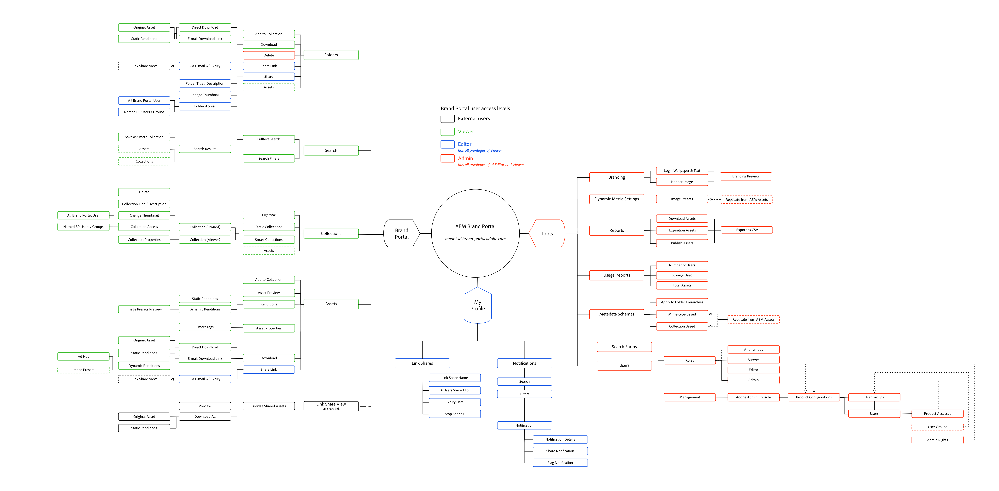
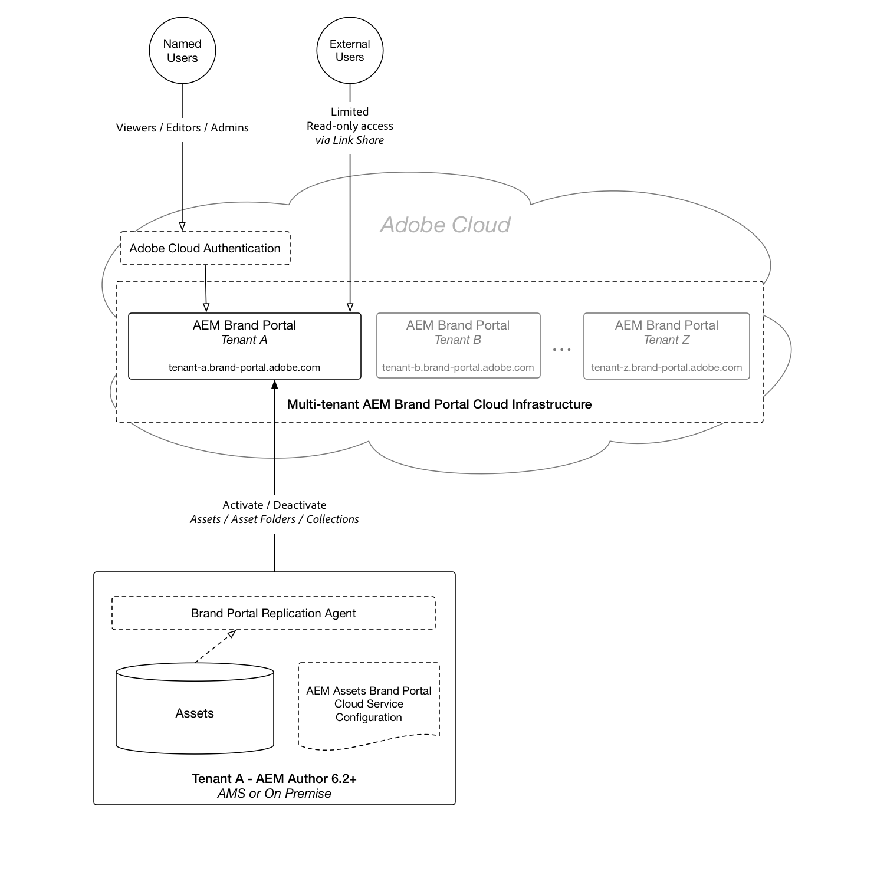

# Understanding Brand Portal with AEM Assets{#understanding-brand-portal-with-aem-assets}

Materials for both the functional and technical understanding AEM Assets Brand Portal.

## AEM Assets Brand Portal feature map {#aem-assets-brand-portal-feature-map}

*Adobe Docs includes [Brand Portal documentation](https://helpx.adobe.com/experience-manager/brand-portal/using/brand-portal.html) that explains in detail how to use capabilities in Brand Portal.*

Click to Download [Brand Portal Feature Map](assets/brand_portal_-_featuremap-2017-11-08-1.png)
The above is a logical feature map of AEM Asset Brand Portal (SaSS service) as of November 08, 2017.

Note the access levels defined are defined and managed within Brand Portal and not in AEM Author.

External users refers to users accessing Brand Portal via the Link Share, authenticating via the Link Share secret tokens. External users may or may not have accounts on the Brand Portal instance.

## AEM Assets Brand Portal's integration architecture {#aem-assets-brand-portal-s-integration-architecture}

Download [Brand Portal Integration Architecture](assets/brand-portal---integration-architecture.png)

AEM Assets Brand Portal is an Adobe provided SaSS service that facilitates the secure, scalable and controlled distribution of approved brand assets via an internet facing web property.

AEM Assets is used in conjunction with AEM Author 6.2 or greater, which publishes the approved assets to Brand Portal. Brand Portal users are managed via the Adobe Cloud, and are not AEM users, nor are they managed in AEM Author itself.

>[!NOTE]
>
>AEM Author uses replication to the Brand Portal cloud service, therefore all the general considerations with respect to the publication of assets apply.
>
>Bulk publication of assets, usually via large Folder publication, can result in:
>
>* Large Sling job queues
>* Increased Network and Disk I/O on AEM Author
>* Negative performance impact of AEM Author's performance during the replication
>
>AEM Author replicates the entire asset: metadata and original, static, custom, and PTIFF renditions to Brand Portal, so the total payload size per asset may be larger than immediately obvious.
>
>Prior to any bulk publication in AEM (including to Brand Portal), test and ensure the AEM Author instance is properly sized to handle the increased load, and/or perform these activities during periods of low activity.

## AEM Assets Brand Portal authentication and user management {#aem-assets-brand-portal-authentication-and-user-management}

As an Adobe hosted cloud service, AEM Assets Brand Portal leverages the authentication and authorization management tools provided by the Adobe AdminConsole. The following are the supported authentication and authorization schemes:

* [SSO integration](https://helpx.adobe.com/enterprise/using/set-up-identity.html) with customer IDP via SAML  
* Ad hoc user management
* Bulk user management via CSV
* Bulk user management via User Management APIs
* Bulk user management via the User Sync tool

Details on user management is available on the [Enterprise User Management support page](https://helpx.adobe.com/enterprise/help/users.html).
