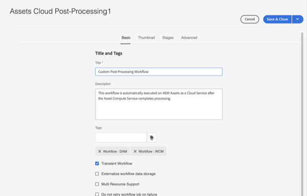
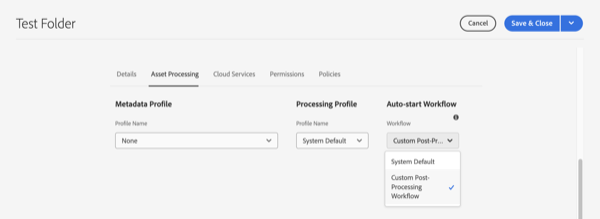

# Auto-start Workflows

Auto-start workflows extend asset processing in AEM as a Cloud Service by automatically invoking custom workflow upon upload or re-processing once the asset processing is complete.

>[!VIDEO](https://video.tv.adobe.com/v/37323?quality=12&learn=on)
> `Notice`: Use Auto-start Workflows for customizing assets post-processing rather than using Workflow Launchers. Auto-start workflows are _only_ invoked once an asset is complete processing instead of launchers which may be invoked multiple times during asset processing.

## Customizing the Post-Processing Workflow

To customize the Post-Processing workflow, copy the default Assets Cloud Post-Processing [workflow model](../../foundation/workflow/use-the-workflow-editor.md). 

1. Start at the Workflow Models screen by navigating to _Tools_ > _Workflow_ > _Models_
2. Find and select the _Assets Cloud Post-Processing_ workflow model 
    
3. Select the _Copy_ button to create your custom workflow
4. Select your now workflow model (which will be called _Assets Cloud Post-Processing1_) and click the _Edit_ button to edit the workflow
5. From the Workflow Properties, give your custom Post-Processing workflow a meaningful name 
    
6. Add the steps to meet your business requirements, in this case adding a task when assets are complete processing. Make sure that the last step of the workflow is always the _Workflow Complete_ step 
    
    > `Note`: Auto-start workflows run with every asset upload or reprocess so carefully consider the scaling implication of workflow steps, especially for bulk operations such as [Bulk Imports](../../cloud-service/migration/bulk-import.md) or migrations.
7. Select the _Sync_ button to save your changes and synchronize the Workflow model

## Using a Custom Post-Processing Workflow

Custom Post-Processing are configured on folders. To configure a Custom Post-Processing Workflow on a folder:

1. Select the folder for which you want to configure the workflow and edit the folder properties
2. Switch to the _Asset Processing_ tab
3. Select your Custom Post-Processing workflow in the _Auto-start Workflow_ selection box 
    
4. Save your changes

Now your custom Post-Processing Workflow will be run for all assets uploaded or reprocessed under that folder.