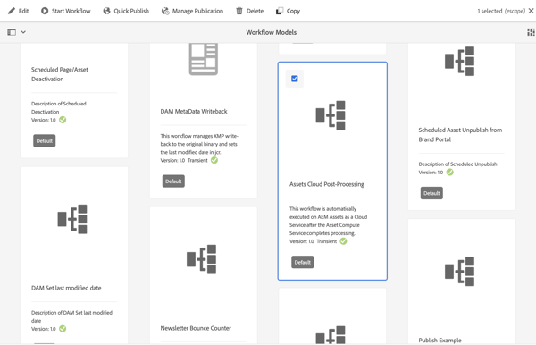
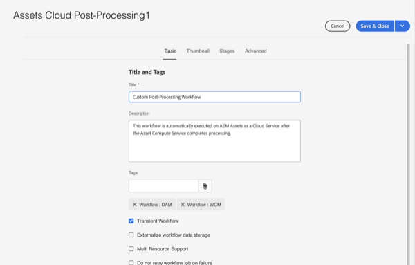
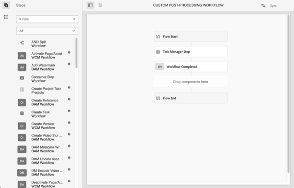
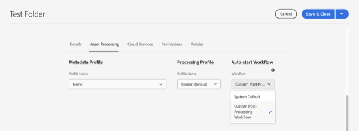

# Auto-start workflows {#auto-start-workflows}

Standard asset processing doesn't cover every business need, such as a custom approval step or a notification tied to a specific asset type. Auto-start workflows close this gap: AEM triggers your custom workflow automatically, right after it finishes processing an asset from an upload or a reprocess job. This adds business logic to asset processing without any extra steps for the person who uploads the file.

>[!BEGINTABS]

>[!TAB Admin view]

>[!VIDEO](https://video.tv.adobe.com/v/37323?quality=12&learn=on)

>[!NOTE]
>
>Use auto-start workflows to customize asset post-processing rather than workflow launchers. Auto-start workflows only run once an asset finishes processing, while launchers can run multiple times during processing.

## Customize the post-processing workflow

To customize the post-processing workflow, copy the default Assets Cloud Post-Processing [workflow model](../../foundation/workflow/use-the-workflow-editor.md).

1. Start at the Workflow Models screen by navigating to _Tools_ > _Workflow_ > _Models_
2. Find and select the _Assets Cloud Post-Processing_ workflow model 
    
3. Select the _Copy_ button to create your custom workflow
4. Select your new workflow model (which will be called _Assets Cloud Post-Processing1_) and click the _Edit_ button to edit the workflow
5. From the Workflow Properties, give your custom post-processing workflow a meaningful name 
    
6. Add the steps to meet your business requirements, in this case a task when assets finish processing. Make sure that the last step of the workflow is always the _Workflow Complete_ step 
    

    >[!NOTE]
    >
    >Auto-start workflows run with every asset upload or reprocess, so consider the scaling impact of workflow steps carefully, especially for bulk operations such as [Bulk Imports](../../cloud-service/migration/bulk-import.md) or migrations.

7. Select the _Sync_ button to save your changes and synchronize the Workflow model

## Use a custom post-processing workflow

Custom post-processing workflows are configured on folders. To configure one on a folder:

1. Select the folder for which you want to configure the workflow and edit the folder properties
2. Switch to the _Asset Processing_ tab
3. Select your custom post-processing workflow in the _Auto-start Workflow_ selection box 
    
4. Save your changes

Your custom post-processing workflow now runs for every asset uploaded or reprocessed under that folder.

>[!ENDTABS]
