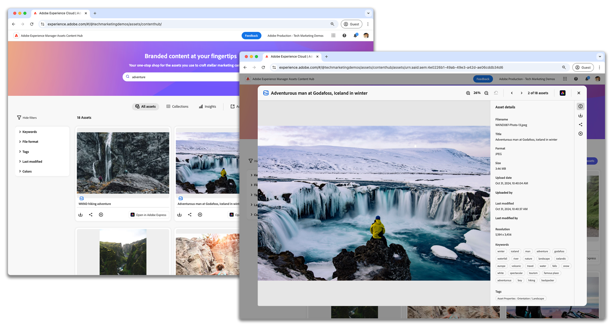

# AEM Assets Content Hub

{align=center}

Learn how to upload assets, apply tags, and understand the approval workflow in Adobe Experience Manager Assets as a Cloud Service Content Hub.

## Content Hub videos

This video series covers everything you need to work effectively with AEM Assets Content Hub. From managing assets to collaborating with your team, each video provides clear steps and practical tips to help you make the most of AEM Assets Content Hub in your daily work.

<!-- CARDS

* https://experienceleague.adobe.com/en/docs/experience-manager-learn/assets/content-hub/set-up {title = Set up}
* https://experienceleague.adobe.com/en/docs/experience-manager-learn/assets/content-hub/configure {title = Configure}
* https://experienceleague.adobe.com/en/docs/experience-manager-learn/assets/content-hub/add-assets {title = Add assets}
* https://experienceleague.adobe.com/en/docs/experience-manager-learn/assets/content-hub/download-assets {title = Download assets}
* https://experienceleague.adobe.com/en/docs/experience-manager-learn/assets/content-hub/image-variants {title = Create image variants}
* https://experienceleague.adobe.com/en/docs/experience-manager-learn/assets/content-hub/collections {title = Collections}
* https://experienceleague.adobe.com/en/docs/experience-manager-learn/assets/content-hub/share {title = Sharing}

-->
<!-- START CARDS HTML - DO NOT MODIFY BY HAND -->

    

        

            

                <figure class="image x-is-16by9">
                    
                </figure>
            

            

                

                    

                        <a href="https://experienceleague.adobe.com/en/docs/experience-manager-learn/assets/content-hub/set-up" target="_blank" rel="referrer" title="Set up">Set up</a>
                    

                    
Learn how to set up the Adobe Experience Manager Assets Content Hub on AEM as a Cloud Service.

                

                <a href="https://experienceleague.adobe.com/en/docs/experience-manager-learn/assets/content-hub/set-up" target="_blank" rel="referrer" class="spectrum-Button spectrum-Button--outline spectrum-Button--primary spectrum-Button--sizeM" style="align-self: flex-start; margin-top: 1rem;">
                    Watch
                </a>
            

        

    

    

        

            

                <figure class="image x-is-16by9">
                    
                </figure>
            

            

                

                    

                        <a href="https://experienceleague.adobe.com/en/docs/experience-manager-learn/assets/content-hub/configure" target="_blank" rel="referrer" title="Configure">Configure</a>
                    

                    
Learn how to navigate the available tabs and customize configuration options to meet your organization's needs.

                

                <a href="https://experienceleague.adobe.com/en/docs/experience-manager-learn/assets/content-hub/configure" target="_blank" rel="referrer" class="spectrum-Button spectrum-Button--outline spectrum-Button--primary spectrum-Button--sizeM" style="align-self: flex-start; margin-top: 1rem;">
                    Watch
                </a>
            

        

    

    

        

            

                <figure class="image x-is-16by9">
                    
                </figure>
            

            

                

                    

                        <a href="https://experienceleague.adobe.com/en/docs/experience-manager-learn/assets/content-hub/add-assets" target="_blank" rel="referrer" title="Add assets">Add assets</a>
                    

                    
Learn how to upload assets, apply tags, and understand the approval workflow in Adobe Experience Manager Assets Content Hub.

                

                <a href="https://experienceleague.adobe.com/en/docs/experience-manager-learn/assets/content-hub/add-assets" target="_blank" rel="referrer" class="spectrum-Button spectrum-Button--outline spectrum-Button--primary spectrum-Button--sizeM" style="align-self: flex-start; margin-top: 1rem;">
                    Learn more
                </a>
            

        

    

    

        

            

                <figure class="image x-is-16by9">
                    
                </figure>
            

            

                

                    

                        <a href="https://experienceleague.adobe.com/en/docs/experience-manager-learn/assets/content-hub/download-assets" target="_blank" rel="referrer" title="Download assets">Download assets</a>
                    

                    
Learn how to navigate, search for assets, filter the assets, and download them in Adobe Experience Manager Assets Content Hub.

                

                <a href="https://experienceleague.adobe.com/en/docs/experience-manager-learn/assets/content-hub/download-assets" target="_blank" rel="referrer" class="spectrum-Button spectrum-Button--outline spectrum-Button--primary spectrum-Button--sizeM" style="align-self: flex-start; margin-top: 1rem;">
                    Watch
                </a>
            

        

    

    

        

            

                <figure class="image x-is-16by9">
                    
                </figure>
            

            

                

                    

                        <a href="https://experienceleague.adobe.com/en/docs/experience-manager-learn/assets/content-hub/image-variants" target="_blank" rel="referrer" title="Create image variants">Create image variants</a>
                    

                    
Learn how to create and edit image variants using Adobe Express within the Experience Manager Assets Content Hub.

                

                <a href="https://experienceleague.adobe.com/en/docs/experience-manager-learn/assets/content-hub/image-variants" target="_blank" rel="referrer" class="spectrum-Button spectrum-Button--outline spectrum-Button--primary spectrum-Button--sizeM" style="align-self: flex-start; margin-top: 1rem;">
                    Watch
                </a>
            

        

    

    

        

            

                <figure class="image x-is-16by9">
                    
                </figure>
            

            

                

                    

                        <a href="https://experienceleague.adobe.com/en/docs/experience-manager-learn/assets/content-hub/collections" target="_blank" rel="referrer" title="Collections">Collections</a>
                    

                    
Learn how to create and use collections in AEM Assets Content Hub to streamline asset access, and promote collaborative resource sharing, ensuring efficient and organized teamwork across various projects.

                

                <a href="https://experienceleague.adobe.com/en/docs/experience-manager-learn/assets/content-hub/collections" target="_blank" rel="referrer" class="spectrum-Button spectrum-Button--outline spectrum-Button--primary spectrum-Button--sizeM" style="align-self: flex-start; margin-top: 1rem;">
                    Watch
                </a>
            

        

    

    

        

            

                <figure class="image x-is-16by9">
                    
                </figure>
            

            

                

                    

                        <a href="https://experienceleague.adobe.com/en/docs/experience-manager-learn/assets/content-hub/share" target="_blank" rel="referrer" title="Sharing">Sharing</a>
                    

                    
Learn how to share assets and collections with team members in AEM Assets Content Hub, promoting effective teamwork and secure asset sharing.

                

                <a href="https://experienceleague.adobe.com/en/docs/experience-manager-learn/assets/content-hub/share" target="_blank" rel="referrer" class="spectrum-Button spectrum-Button--outline spectrum-Button--primary spectrum-Button--sizeM" style="align-self: flex-start; margin-top: 1rem;">
                    Watch
                </a>
            

        

    

<!-- END CARDS HTML - DO NOT MODIFY BY HAND -->

## Content Hub documentation

Explore Content Hub's product documentation to help you understand and make full use of AEM Assets Content Hub. These resources provide detailed guidance on using its features and functions, ensuring you have the support you need for efficient asset management.

<!-- CARDS

* https://experienceleague.adobe.com/en/docs/experience-manager-cloud-service/content/assets/content-hub/product-overview {title=Content Hub documentation} {description=This documentation serves as your entry point to learn about Content Hub's key benefits, access methods, and how to provide feedback on the available options.}
* https://experienceleague.adobe.com/en/docs/experience-manager-cloud-service/content/assets/content-hub/deploy-content-hub {description=Learn how to deploy and activate Content Hub, providing users with various privileges, including asset uploads and administrator access.}
* https://experienceleague.adobe.com/en/docs/experience-manager-cloud-service/content/assets/content-hub/frequently-asked-questions-content-hub {title = Content Hub FAQs}

-->
<!-- START CARDS HTML - DO NOT MODIFY BY HAND -->

    

        

            

                <figure class="image x-is-16by9">
                    
                </figure>
            

            

                

                    

                        <a href="https://experienceleague.adobe.com/en/docs/experience-manager-cloud-service/content/assets/content-hub/product-overview" target="_blank" rel="referrer" title="Content Hub documentation">Content Hub documentation</a>
                    

                    
This documentation serves as your entry point to learn about Content Hub's key benefits, access methods, and how to provide feedback on the available options.

                

                <a href="https://experienceleague.adobe.com/en/docs/experience-manager-cloud-service/content/assets/content-hub/product-overview" target="_blank" rel="referrer" class="spectrum-Button spectrum-Button--outline spectrum-Button--primary spectrum-Button--sizeM" style="align-self: flex-start; margin-top: 1rem;">
                    Learn more
                </a>
            

        

    

    

        

            

                <figure class="image x-is-16by9">
                    
                </figure>
            

            

                

                    

                        <a href="https://experienceleague.adobe.com/en/docs/experience-manager-cloud-service/content/assets/content-hub/deploy-content-hub" target="_blank" rel="referrer" title="Deploy Content Hub">Deploy Content Hub</a>
                    

                    
Learn how to deploy and activate Content Hub, providing users with various privileges, including asset uploads and administrator access.

                

                <a href="https://experienceleague.adobe.com/en/docs/experience-manager-cloud-service/content/assets/content-hub/deploy-content-hub" target="_blank" rel="referrer" class="spectrum-Button spectrum-Button--outline spectrum-Button--primary spectrum-Button--sizeM" style="align-self: flex-start; margin-top: 1rem;">
                    Learn more
                </a>
            

        

    

    

        

            

                <figure class="image x-is-16by9">
                    
                </figure>
            

            

                

                    

                        <a href="https://experienceleague.adobe.com/en/docs/experience-manager-cloud-service/content/assets/content-hub/frequently-asked-questions-content-hub" target="_blank" rel="referrer" title="Content Hub FAQs">Content Hub FAQs</a>
                    

                    
Get responses to some of the most frequently asked questions (FAQs) for Content Hub.

                

                <a href="https://experienceleague.adobe.com/en/docs/experience-manager-cloud-service/content/assets/content-hub/frequently-asked-questions-content-hub" target="_blank" rel="referrer" class="spectrum-Button spectrum-Button--outline spectrum-Button--primary spectrum-Button--sizeM" style="align-self: flex-start; margin-top: 1rem;">
                    Learn more
                </a>
            

        

    

<!-- END CARDS HTML - DO NOT MODIFY BY HAND -->

 
 
