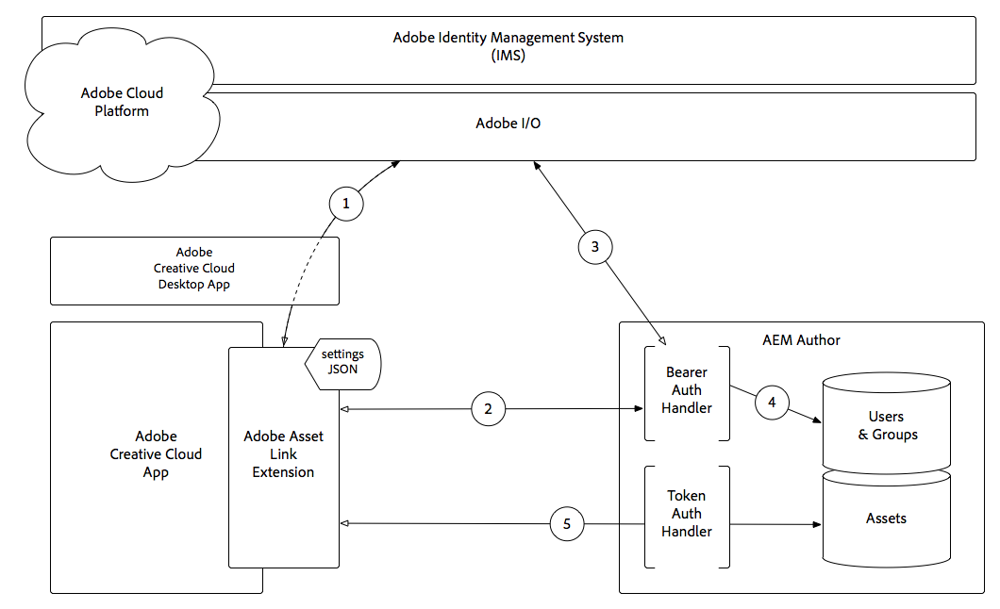

# Understanding Adobe Asset Link authentication with AEM Assets{#understanding-adobe-asset-link-authentication-with-aem-assets}

How Adobe Asset Link authentication works in the context of Adobe Identity Management Services (IMS) and Adobe Experience Manager Author.

Download [Adobe Asset Link Architecture](assets/adobe-asset-link-article-understand-1.png)

1. The Adobe Asset Link extension makes an authorization request, via the Adobe Creative Cloud Desktop App, to Adobe Identity Manage Service (IMS), and upon success, receives a Bearer token.
2. Adobe Asset Link extension connects to AEM Author over HTTP(S), including the Bearer token obtained in **Step 1**, using the scheme (HTTP/HTTPS), host and port provided in the extension’s settings JSON.
3. AEM’s Bearer Authentication Handler extracts the Bearer token from the request and validates it against Adobe IMS.
4. Once Adobe IMS validates the Bearer token, a user is created in AEM (if it doesn’t already exist), and syncs profile and group/memberships data from Adobe IMS. The AEM user is issued a standard AEM login token, which is sent back to the Adobe Asset Link extension as a Cookie on the HTTP(S) response.
5. Subsequent interactions (ie. browsing, searching, checking in/out assets, etc.) with the Adobe Asset Link extension results in HTTP(S) requests to AEM Author which are validated using the AEM login token, using the standard AEM Token Authentication Handler.

>[!NOTE]
>
>Upon expiry of login token, **Steps 1-5** will automatically invoke, authenticating the Adobe Asset Link extension using the Bearer token, and re-issues a new, valid login token.

## Additional Resources {#additional-resources}

* [Adobe Asset Link website](https://www.adobe.com/creativecloud/business/enterprise/adobe-asset-link.html)