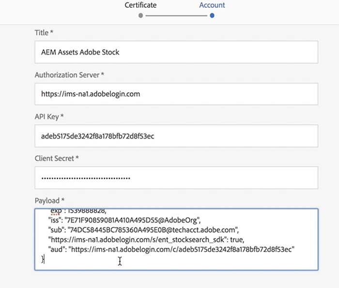
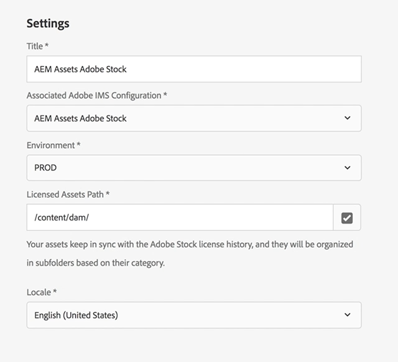

# Set up Adobe Stock with AEM Assets{#set-up-adobe-stock-with-aem-assets}

AEM 6.4.2 provides users the ability to search, preview, save and license Adobe Stock assets directly from AEM. This video covers quick walkthrough of how to set up Adobe Stocks with AEM Assets using Adobe I/O Console.

>[!VIDEO](https://video.tv.adobe.com/v/25043/?quality=9)

>[!NOTE]
>
>For Adobe Stock Cloud service configuration, you must select the PROD Environment and Licensed asset path point to /content/dam. Environment field would be removed in the next AEM release and the licensed asset path is part of an upcoming feature and support for this field will be introduced in the next AEM release.

>[!NOTE]
>
>The integration requires an [enterprise Adobe Stock plan](https://landing.adobe.com/en/na/products/creative-cloud/ctir-4625-stock-for-enterprise/index.html) and AEM 6.4 with at least [Service Pack 2](https://www.adobeaemcloud.com/content/marketplace/marketplaceProxy.html?packagePath=/content/companies/public/adobe/packages/cq640/servicepack/AEM-6.4.2.0) deployed. For AEM 6.4 service pack details, see these [release notes](https://helpx.adobe.com/experience-manager/6-4/release-notes/sp-release-notes.html). You would also need admin permissions to [Adobe I/O Console](https://console.adobe.io/), [Adobe Admin Console](https://adminconsole.adobe.com/) and Adobe Experience Manager to set up the integration.

## Installations {#installations}

* For AEM 6.4, you need to install the [AEM Service Pack 2](https://www.adobeaemcloud.com/content/marketplace/marketplaceProxy.html?packagePath=/content/companies/public/adobe/packages/cq640/servicepack/AEM-6.4.2.0) and then re-install the cq-dam-stock-integration-content-1.0.4.zip file.
* Make sure you have admin permissions on [Adobe I/O Console](https://console.adobe.io/), [Adobe Admin Console](https://adminconsole.adobe.com/) and Adobe Experience Manager to set up the integration.

## Set up Adobe IMS Configuration using Adobe I/O Console {#set-up-adobe-ims-configuration-using-adobe-i-o-console}

1. Create an Adobe IMS Technical Account Configuration under **Tools &gt; Security**
2. Select the *Cloud Solution* as *Adobe Stock* and create a new certificate or re-use an existing certificate for the configuration.
3. Navigate to Adobe I/O Console and create a new Service Account integration for *Adobe Stock*. 
4. Upload the certificate from Step2 to your Adobe Stock Service Account integration. 
5. Choose the required Adobe Stock profile configuration and complete the service integration.
6. Use the integration details to complete the Adobe IMS Technical Account configuration
7. Make sure you can receive the access token using the Adobe IMS Technical Account.

## Set up Adobe Stock Cloud Services {#set-up-adobe-stock-cloud-services}

1. Create a new cloud service configuration for Adobe Stock under **Tools > CLoud Services.**
2. Select the *Adobe IMS Configuration* created in the above section for your *Adobe Stock Cloud* configuration

3. Make sure you select the **ENVIRONMENT** as PROD. Staging environment is not supported and will be removed in the next release of AEM. 
4. **Licensed Asset path** can be pointed to any directory under /content/dam. Feature support for this field will be added in the next release of AEM
5. Select your locale and complete the setup. 
6. You can also add users/groups to your Adobe Stock Cloud service to enable access for specific users or groups.

### Documents and Useful Resources {#documents-and-useful-resources}

* [Adobe I/O Console Integration API](https://www.adobe.io/apis/cloudplatform/console/authentication/gettingstarted.html)
* [Adobe Stock API Docs](https://www.adobe.io/apis/creativecloud/stock/docs.html)