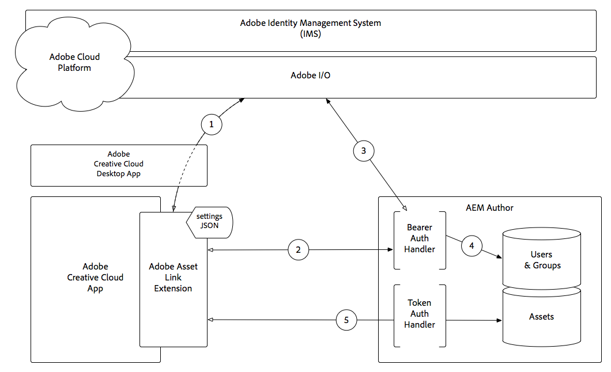

# Using Adobe Asset Link Extension with AEM Assets{#using-adobe-asset-link-extension-with-aem-assets}

Adobe Experience Manager assets can now be used by designers and creative users within their favorite Adobe Creative Cloud desktop applications. Adobe Asset Link extension for Adobe Creative Cloud Enterprise extends the capability to search and browse, sort, preview, upload assets, check out, modify, check-in and view metadata of AEM assets within Creative Cloud tools like Adobe Photoshop, InDesign, and Illustrator.

## Adobe Asset Link 1.1

Adobe Asset Link v1.1 now provides InDesign direct linking support between Adobe Asset Link and AEM Assets. With InDesign direct linking support, you can now place (Place Linked or Place Copy) or drag-n-drop digital assets into InDesign from AEM Assets via the Adobe Asset Link panel. Also, introduces the *For Placement Only* (FPO) rendition.

>[!VIDEO](https://video.tv.adobe.com/v/28988/?quality=12&learn=on)

>[!NOTE]
>
>Use your Adobe Creative Cloud Enterprise ID or Federated ID only. Make sure you [configure AEM for Adobe Asset Link](https://helpx.adobe.com/enterprise/using/configure-aem-for-aal-prerelease.html).

### Adobe Asset Link Capabilities

* Adobe Asset Link is an extension that works within PS, AI, ID and provides direct access to digital assets that reside in AEM Assets  
* Creatives will be logged into AEM automatically using their Adobe IMS Enterprise ID or Federated ID
* Creatives can browse digital assets that reside in AEM Assets in addition to searching across AEM Assets and Creative Cloud Assets
* Creatives can access file details for assets residing in AEM Assets; thumbnail, basic metadata, and versions from within the panel
* Creatives can place, download or drag-n-drop assets into their layout
* Creatives can modify assets by checking them out from AEM Assets and working on them (WIP) within their Creative Cloud Assets account
* Creatives can check an asset back into AEM Assets after they have finished modifying it, and the new version will be reflected in AEM Assets
* Supports Creative Cloud 2020, 2019 and 2018 InDesign, Photoshop and Illustrator desktop apps
* A user can perform an asset search from the Adobe Asset Link In-App panel and sort them based on size, alphabetically and by relevance
* Users can access and browse AEM Assets collections and smart collections directly from the Asset Link panel
* Add newly created assets to AEM Assets directly from the panel
* A user can Drag and drop assets directly into InDesign frames

### Placing AEM Assets into InDesign

You can place an asset to your InDesign layout using one of the below options:

* **Place Copy** - Embedding an asset (using the Place Copy option) places a copy of the original asset into your InDesign layout after downloading the binaries to your local system. Adobe Asset Link does not maintain any link between the embedded copy and the original asset. If the original asset is modified in AEM Assets, you must delete the embedded asset from the InDesign file, and re-embed the asset from AEM Assets.

* **Place Linked** - When working with InDesign documents, you now have the option to reference the assets from AEM Assets in addition to directly embedding the assets (using the Place Copy option in the context menu). Referencing assets lets you collaborate with other users and incorporate any updates made to the original asset in AEM Assets. To reference an asset from AEM Assets, use the Place Linked option in the context menu.

### For Placement Only (FPO) Resolution

When large asset files are placed into InDesign Documents from AEM Assets using Adobe Asset Link, creatives users need to wait for few seconds after initiating the place operation. This impacts the overall user experience. With Adobe Asset Link you can now temporarily place a low resolution image of the original asset from AEM Assets, thereby reducing the time taken to place an image. At the same time, it increases the overall user experience and productivity. The lower resolution image is placed temporarily and when the final output is required for printing or publishing, you need to replace the FPO renditions with the originals. If you want to replace multiple FPO images with respective original images, navigate to **_Windows > Links_** panel and then download the original assets. After the original images are downloaded, choose Replace all FPO's With Originals.

>[!NOTE]
>
> *For Placement Only (FPO)* rendition works only for Place Linked option. You should also enable FPO rendition support within the AEM Assets *Dam Update Asset* workflow.

FPO renditions are lightweight substitutes of the original assets. They have the same aspect ratio, but are of smaller size compared to the original images. Currently, InDesign supports importing FPO renditions for the following image types only:

* JPEG
* GIF
* PNG
* TIFF
* PSD
* BMP

If an FPO rendition is not available for a specific asset in AEM Assets, the original high-resolution asset is referenced instead. For FPO images, the status FPO is displayed in the InDesign Links panel.

## Understanding Adobe Asset Link authentication with AEM Assets{#understanding-adobe-asset-link-authentication-with-aem-assets}

How Adobe Asset Link authentication works in the context of Adobe Identity Management Services (IMS) and Adobe Experience Manager Author.

Download [Adobe Asset Link Architecture](assets/adobe-asset-link-article-understand-1.png)

1. The Adobe Asset Link extension makes an authorization request, via the Adobe Creative Cloud Desktop App, to Adobe Identity Manage Service (IMS), and upon success, receives a Bearer token.
2. Adobe Asset Link extension connects to AEM Author over HTTP(S), including the Bearer token obtained in **Step 1**, using the scheme (HTTP/HTTPS), host and port provided in the extension’s settings JSON.
3. AEM’s Bearer Authentication Handler extracts the Bearer token from the request and validates it against Adobe IMS.
4. Once Adobe IMS validates the Bearer token, a user is created in AEM (if it doesn’t already exist), and syncs profile and group/memberships data from Adobe IMS. The AEM user is issued a standard AEM login token, which is sent back to the Adobe Asset Link extension as a Cookie on the HTTP(S) response.
5. Subsequent interactions (ie. browsing, searching, checking in/out assets, etc.) with the Adobe Asset Link extension results in HTTP(S) requests to AEM Author which are validated using the AEM login token, using the standard AEM Token Authentication Handler.

>[!NOTE]
>
>Upon expiry of login token, **Steps 1-5** will automatically invoke, authenticating the Adobe Asset Link extension using the Bearer token, and re-issues a new, valid login token.

## Additional Resources{#additional-resources}

* [Adobe Asset Link website](https://www.adobe.com/creativecloud/business/enterprise/adobe-asset-link.html)