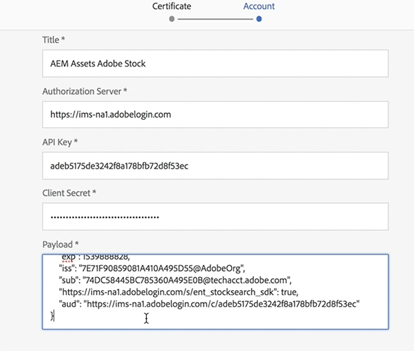
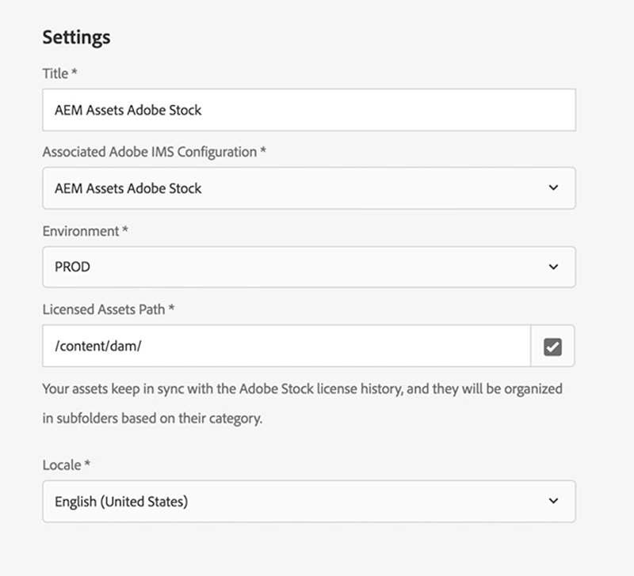

# Using Adobe Stock with AEM Assets{#using-adobe-stock-assets-with-aem-assets}

AEM 6.4.2 provides users the ability to search, preview, save and license Adobe Stock assets directly from AEM. Organizations can now integrate their Adobe Stock Enterprise plan with AEM Assets to make sure that licensed assets are now broadly available for their creative and marketing projects, with the powerful asset management capabilities of AEM.

>[!VIDEO](https://video.tv.adobe.com/v/24678?quality=12&learn=on)

>[!NOTE]
>
>The integration requires an [enterprise Adobe Stock plan](https://landing.adobe.com/en/na/products/creative-cloud/ctir-4625-stock-for-enterprise/index.html) and AEM 6.4 with at least Service Pack 2 deployed. For AEM 6.4 service pack details, see these [release notes](https://helpx.adobe.com/experience-manager/6-4/release-notes/sp-release-notes.html).

Adobe Stock and AEM Assets integration allow content authors and marketers to easily license and use stock assets for creative or marketing purposes. You can perform a Stock asset search either using Omni Search, by adding the location filter as Adobe Stock or by navigating through AEM Assets main navigation and clicking on the Search Adobe Stock Coral UI Icon.

## Capabilities

### Search and Save

* Perform Adobe Stock asset search without leaving AEM workspace. 
* Save Adobe Stock assets for preview, without licensing the asset. 
* Ability to license and save Adobe Stock assets to AEM Assets
* Ability to search for similar assets from Adobe Stock within AEM Assets UI
* View a selected asset from Stock Search within AEM Assets on Adobe Stock website
* Licensed asset files are marked with a blue licensed badge for easy identification

### Asset Metadata

* Licensed asset gets stored within AEM Assets. Asset properties contain Stock metadata under a separate asset metadata tab
* Ability to add License references to asset metadata

### Asset Stock Profile

* A user can select Adobe Stock profile under *User > My Preferences > Stock Configuration*
* Mandatory and Optional references can be added to the Asset Licensing window.
* Ability to choose language preference for Asset Licensing window based on the region.

### Filter

* A user can filter stock assets based on Asset Type, Orientation and View Similar
* Asset type includes Photos, Illustrations, Vectors, Videos, Templates, 3D, Premium, Editorial
* Orientation includes Horizontal, Vertical, and Square.
* View Similar filter requires Adobe Stock File number

### Access Control

* Admins can provide permissions to certain users/groups to license stock assets when setting up Adobe Stock cloud service configuration.
* If a specific user/group does not have permission to license stock assets, *Stock Asset Search / Asset licensing* capability would be disabled.

## Set up Adobe Stock with AEM Assets{#set-up-adobe-stock-with-aem-assets}

AEM 6.4.2 provides users the ability to search, preview, save and license Adobe Stock assets directly from AEM. This video covers quick walkthrough of how to set up Adobe Stocks with AEM Assets using Adobe I/O Console.

>[!VIDEO](https://video.tv.adobe.com/v/25043?quality=12&learn=on)

>[!NOTE]
>
>For Adobe Stock Cloud service configuration, you must select the Production environment and Licensed asset path point to `/content/dam`. Environment field is now removed in AEM.

>[!NOTE]
>
>The integration requires an [enterprise Adobe Stock plan](https://landing.adobe.com/en/na/products/creative-cloud/ctir-4625-stock-for-enterprise/index.html) and AEM 6.4 with at least [Service Pack 2](https://experience.adobe.com/#/downloads/content/software-distribution/en/aem.html?fulltext=AEM*+6*+4*+Service*+Pack*&2_group.propertyvalues.property=.%2Fjcr%3Acontent%2Fmetadata%2Fdc%3Aversion&2_group.propertyvalues.operation=equals&2_group.propertyvalues.0_values=target-version%3Aaem%2F6-4&3_group.propertyvalues.property=.%2Fjcr%3Acontent%2Fmetadata%2Fdc%3AsoftwareType&3_group.propertyvalues.operation=equals&3_group.propertyvalues.0_values=software-type%3Aservice-and-cumulative-fix&orderby=%40jcr%3Acontent%2Fmetadata%2Fdc%3Atitle&orderby.sort=asc&layout=list&p.offset=0&p.limit=24) deployed. For AEM 6.4 service pack details, see these [release notes](https://helpx.adobe.com/experience-manager/6-4/release-notes/sp-release-notes.html). You would also need admin permissions to [Adobe I/O Console](https://console.adobe.io/), [Adobe Admin Console](https://adminconsole.adobe.com/) and Adobe Experience Manager to set up the integration.

### Installation {#installations}

* For AEM 6.4, you need to install the [AEM Service Pack 2](https://experience.adobe.com/#/downloads/content/software-distribution/en/aem.html?fulltext=AEM*+6*+4*+Service*+Pack*&2_group.propertyvalues.property=.%2Fjcr%3Acontent%2Fmetadata%2Fdc%3Aversion&2_group.propertyvalues.operation=equals&2_group.propertyvalues.0_values=target-version%3Aaem%2F6-4&3_group.propertyvalues.property=.%2Fjcr%3Acontent%2Fmetadata%2Fdc%3AsoftwareType&3_group.propertyvalues.operation=equals&3_group.propertyvalues.0_values=software-type%3Aservice-and-cumulative-fix&orderby=%40jcr%3Acontent%2Fmetadata%2Fdc%3Atitle&orderby.sort=asc&layout=list&p.offset=0&p.limit=24) and then re-install the cq-dam-stock-integration-content-1.0.4.zip file.
* Make sure you have admin permissions on [Adobe I/O Console](https://console.adobe.io/), [Adobe Admin Console](https://adminconsole.adobe.com/) and Adobe Experience Manager to set up the integration.

#### Set up Adobe IMS Configuration using Adobe I/O Console {#set-up-adobe-ims-configuration-using-adobe-i-o-console}

1. Create an Adobe IMS Technical Account Configuration under **Tools &gt; Security**
2. Select the *Cloud Solution* as *Adobe Stock* and create a new certificate or re-use an existing certificate for the configuration.
3. Navigate to Adobe I/O Console and create a new Service Account integration for *Adobe Stock*. 
4. Upload the certificate from Step2 to your Adobe Stock Service Account integration. 
5. Choose the required Adobe Stock profile configuration and complete the service integration.
6. Use the integration details to complete the Adobe IMS Technical Account configuration
7. Make sure you can receive the access token using the Adobe IMS Technical Account.

#### Set up Adobe Stock Cloud Services {#set-up-adobe-stock-cloud-services}

1. Create a new cloud service configuration for Adobe Stock under **Tools > CLoud Services.**
2. Select the *Adobe IMS Configuration* created in the above section for your *Adobe Stock Cloud* configuration

3. Make sure you select the **ENVIRONMENT** as PROD. 
4. **Licensed Asset path** can be pointed to any directory under `/content/dam`. 
5. Select your locale and complete the setup. 
6. You can also add users/groups to your Adobe Stock Cloud service to enable access for specific users or groups.

### Additional Resources

* [Enterprise Stock Plan](https://landing.adobe.com/en/na/products/creative-cloud/ctir-4625-stock-for-enterprise/index.html)
* [AEM 6.4 Service Pack 2 Release notes](https://experienceleague.adobe.com/docs/experience-manager-65/release-notes/release-notes.html)
* [Integrate AEM and Adobe Stock](https://experienceleague.adobe.com/docs/experience-manager-65/assets/using/aem-assets-adobe-stock.html)
* [Adobe I/O Console Integration API](https://www.adobe.io/apis/cloudplatform/console/authentication/gettingstarted.html)
* [Adobe Stock API Docs](https://www.adobe.io/apis/creativecloud/stock/docs.html)
