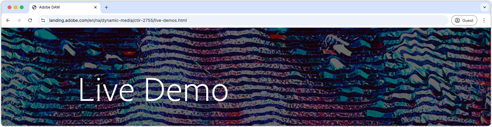

# Using Dynamic Media with AEM Assets {#understanding-aem-dynamic-media}

This multi part video series gives you an overview of how media content is managed and accessed using Adobe Experience Manager Dynamic Media as a content serving service. Dynamic Media lets you manage and publish dynamic digital experiences — a feature unique to Experience Manager Assets. Our framework and suite of components allow marketers to customize and deliver interactive, multimedia experiences across all devices.

## Dynamic Media live demo

Explore the possibilities of Adobe Dynamic Media with our [**Live Demo**](https://landing.adobe.com/en/na/dynamic-media/ctir-2755/live-demos.html), where cutting-edge solutions come to life. Learn how [**Dynamic Assets**](https://landing.adobe.com/en/na/dynamic-media/ctir-2755/dynamic-assets.html) streamline workflows and elevate content management, and discover [**Interactive Experiences**](https://landing.adobe.com/en/na/dynamic-media/ctir-2755/interactive-experiences.html) that captivate audiences across every channel. [See how Dynamic Media can transform your content strategy](https://landing.adobe.com/en/na/dynamic-media/ctir-2755/live-demos.html)!

## Dynamic Media overview

>[!VIDEO](https://video.tv.adobe.com/v/27144?quality=12&learn=on)

>[!NOTE]
>
>Functionality demonstrated here is available with Dynamic Media DMS7 run mode, our currently supported run mode, not necessarily DMHybrid run mode, which DMS7 has replaced.

This video describes how media content is managed and accessed using Adobe Experience Manager Dynamic Media as a content serving service. Dynamic Media operates on a single Master Asset methodology where you upload an image asset or video asset that can be requested to fulfill an unlimited set of needed consumable variations or derivative renditions. Included:

* Single Master Asset to URL product deliverable explained
* Image processing options
* Content viewer options
* Copy URLs to images and responsive viewers
* Smart Crop variations to URLs

## Use with AEM Sites

>[!VIDEO](https://video.tv.adobe.com/v/27145?quality=12&learn=on)

>[!NOTE]
>
>Functionality demonstrated here is available with Dynamic Media DMS7 run mode, our currently supported run mode, not necessarily DMHybrid run mode, which DMS7 has replaced. This video references concepts described in Part 1 video (Dynamic Media Overview).

This video describes how media content is managed in Adobe Experience Manager Dynamic Media and can be easily used in AEM Sites, with a component, for simple and automatically cropped to optimize based on responsive page width. Easily create interactive image banner and generate copy URL to use in any Content Management System.

* AEM Sites Dynamic Media component flexibility
* Downloading locally with Image Presets
* Creating and publishing Interactive Banner

## Build a Mixed Media Collection

>[!VIDEO](https://video.tv.adobe.com/v/27146?quality=12&learn=on)

>[!NOTE]
>
>Functionality demonstrated here is available with Dynamic Media DMS7 run mode, our currently supported run mode, not necessarily DMHybrid run mode, which DMS7 has replaced. This video references concepts described in Part 1 video (Dynamic Media Overview).

This video describes the simple creation process for a Mixed Media viewer collection of media assets, including a Spin set, Video and collection of product images. Add content to the Mixed Media Set and create a customized viewer to choose from in the final Copy URL or AEM Sites component.

* Create Spin Set from appropriate product photos
* Upload and encode mater video for Dynamic Media Video
* Create Mixed Media Set from Spin Set, Video and photos
* Edit and use custom Mixed Media viewer

## Image Presets

>[!VIDEO](https://video.tv.adobe.com/v/27320?quality=12&learn=on)

This video describes how Image Presets are created and what is an image preset, a URL shortener to a series of Image Server arguments that operate on an image whenever a URL requests it. Learn valuable techniques to extend and edit Image Presets.

* Image Preset shortener hiding collection of explicit Image Server commands
* Use only one pixel dimension -width OR height- to conform new resized images without padding
* Always use sharpening
* URL Modifier field to add extra commands to resizing Image Preset

## Advanced URL modifiers

>[!VIDEO](https://video.tv.adobe.com/v/27319?quality=12&learn=on)

This video describes going beyond resizing images to take advantage of features of the source file itself- background transparency, built in clipping paths and crops and text as variables- with Dynamic Media's URL modifiers.

* Using URL modifiers in Dynamic Media Modifier field
* Changing background color on images with transparency
* Clipping to an image Path
* Cropping to an image Path
* Creating a Text Template from a Photoshop file

## JPEG file size management

>[!VIDEO](https://video.tv.adobe.com/v/27404?quality=12&learn=on)

>[!NOTE]
>
>Image QUALITY is measured in percentages of inverse compression, where 100% Quality is least compressed resulting in high quality images but relatively large file sizes. Jpeg compression is a lossy compression scheme where compression settings determine image quality and file size.

Balance jpeg image quality against the resulting file size (in kilobytes) to enhance page load speed, using 2 commands to adjust jpeg compression settings. QLT defines the image quality by adjusting jpeg compression quality settings. JPEG Size command allows you to designate what file size needs to be achieved using compression.

## Closed captioning

>[!VIDEO](https://video.tv.adobe.com/v/28074?quality=12&learn=on)

Easily add Closed Captioning to Dynamic Media video by appending the Copy URL to point to an additional Closed Captioning file document, a web.VTT sidecar file, containing the CC info for any video.

