# Dynamic Media Templates {#dynamic-media-templates}

Create real time customizable templates for your banners and flyers using [!DNL Dynamic Media] templates, a WYSIWYG template editor. Publish your [!DNL Dynamic Media] template and use it in downstream applications. A [!DNL Dynamic Media] template includes image, text, shape, and countdown timer layers. Add parameters to the image, text, shape, and countdown timer layers of the template and use [[!DNL Dynamic Media] URLs](https://experienceleague.adobe.com/en/docs/commerce-admin/content-design/wysiwyg/storage/catalog-urls-dynamic-media) to reposition and resize the layer and update its content in real-time. 

>[!VIDEO](https://video.tv.adobe.com/v/3451727/?learn=on&enablevpops)

Some of the key features include:

* **[!DNL Dynamic Media] WYSIWYG Template Editor:** Create customizable banners with image, text, shape, and countdown timer layers.

* **Layer Parameterization:** Define dynamic key-value pairs for layers to enable real-time updates.
* **[!DNL Dynamic Media] URL Support:** Use [!DNL Dynamic Media] URLs for templates, integrating personalized values from Adobe and non-Adobe applications.
* **Layer Visibility Control:** Dynamically hide or show layers as needed.
* **Smart Text Resizing:** Automatically adjust text size to fit designated areas.
* **Countdown Timer Layer:** Add countdown timers to templates and configure their end time, display units (Days, Hours, Mins), suffix, fallback text, and CTA.

Some of the key benefits of [!DNL Dynamic Media] templates include:

* **Optimize 1:1 Personalization:** Tailor content to real-time customer signals.
* **Reduce Manual Effort:** Automate and accelerate content creation and management.
* **Ensure Consistent Omnichannel Experiences:** Maintain brand consistency across channels.
* **Reuse Content Effectively:** Avoid single-use content and scale with dynamic, parameterized templates.
* **Mitigate Risks:** Update pricing, discounts, and links in real-time.
* **Enhance Customer Engagement:** Drive interactive, contextually relevant experiences.

>[!NOTE]
>
>Customers with subscriptions to the Enhanced Security SKU cannot use any [!DNL Dynamic Media] capabilities, including [!DNL Dynamic Media] Templates, on that Cloud Services program.

Learn to create a [!DNL Dynamic Media] template step by step in this video:

>[!VIDEO](https://video.tv.adobe.com/v/3443281)

## Before you begin{#prerequisites-for-dynamic-media-wysiwyg-template}

Fulfil the following requirements to create a [!DNL Dynamic Media] template and generate its delivery URL:

1. Access to [!DNL Dynamic Media].
1. On the [!DNL Assets View] homepage, you have a folder in **[!UICONTROL Dynamic Media Assets]** to save your template. [Create a folder](https://experienceleague.adobe.com/en/docs/experience-manager-cloud-service/content/assets/assets-view/add-delete-assets-view) in **[!UICONTROL Assets]** to replicate that folder in **[!UICONTROL Dynamic Media Assets]**.
1. [Sync the images available in your [!DNL AEM Assets] instance with [!DNL Dynamic Media] to use them for creating the template](https://experienceleague.adobe.com/en/docs/experience-manager-cloud-service/content/assets/dynamicmedia/config-dm).
1. Publish the images to use in creating the template to generate the delivery URL of the template after creating it. The delivery URL can be used in downstream applications.
1. To use a font other than the default [!UICONTROL Adobe Sans F2] font in the template's text layer, [upload and publish the font file to AEM and Dynamic Media simultaneously](https://experienceleague.adobe.com/en/docs/experience-manager-cloud-service/content/assets/assets-view/publish-assets-to-aem-and-dm?lang=en#dynamic-media-publish-mode-set-to-upon-activation). [The supported font file formats are, AFM, OTF, PFB, PFM, PhotoFont, TTC, TTF](https://experienceleague.adobe.com/en/docs/dynamic-media-classic/using/upload-publish/uploading-files#supported-asset-file-formats). Also, ensure to [reprocess](/help/assets/reprocessing-assets-view.md) the existing fonts to use them. See [Fonts](https://experienceleague.adobe.com/en/docs/dynamic-media-classic/using/support-files/fonts) for more information.<!--(On [!DNL Assets View] home page, click **[!UICONTROL Assets]**, navigate to the font file location, select the font file one at a time and click **[!UICONTROL Reprocess]**)-->
1. verify the following in the Touch UI:
   * On the **[!UICONTROL Edit [!DNL Dynamic Media] Configuration page]**, **[!UICONTROL [!DNL Dynamic Media] sync mode]** that is set to **[!UICONTROL Disabled by default]**, is not applied to all AEM folders (**[!UICONTROL Sync all content]** is unchecked). See [configuring Dynamic Media Cloud Service](https://experienceleague.adobe.com/en/docs/experience-manager-cloud-service/content/assets/dynamicmedia/config-dm) for more information.
   * **[!UICONTROL [!DNL Dynamic Media] sync mode]** is set to **[!UICONTROL Enable for subfolders]** for the destination folder or subfolder where you will save the template after creation. See [configuring [!DNL Dynamic Media] Cloud Service](https://experienceleague.adobe.com/en/docs/experience-manager-cloud-service/content/assets/dynamicmedia/config-dm) for more information.
 
## Create [!DNL Dynamic Media] template{#how-to-create-dynamic-media-template}

Execute the following steps to create a [!DNL Dynamic Media] template:

<!--
1. Navigate to your [!DNL Assets View] and [create a folder](https://experienceleague.adobe.com/en/docs/experience-manager-cloud-service/content/assets/assets-view/add-delete-assets-view) in **[!UICONTROL Assets]**. The folder tree in **[!UICONTROL Assets]** replicates in **[!UICONTROL Dynamic Media Assets]**. Save your [!DNL Dynamic Media] template in this [!UICONTROL Dynamic Media Assets] folder. 
1. Select **[!UICONTROL Assets]** and [upload and publish your images to [!DNL AEM] and [!DNL Dynamic Media] simultaneously](https://experienceleague.adobe.com/en/docs/experience-manager-cloud-service/content/assets/assets-view/publish-assets-to-aem-and-dm#dynamic-media-publish-mode-set-to-upon-activation) to use them in creating the template. Publishing images is required to generate the template's delivery URL, after creating the template. The delivery URL can be used in downstream applications.
1. [Execute these asset uploading and publishing steps](https://experienceleague.adobe.com/en/docs/experience-manager-cloud-service/content/assets/assets-view/publish-assets-to-aem-and-dm?lang=en#dynamic-media-publish-mode-set-to-upon-activation) to upload and publish a font file to AEM and Dynamic Media simultaneously to use it in creating the template. [!UICONTROL Adobe Sans F2] is the only default font available in the text layer. [The supported font file formats are, AFM, OTF, PFB, PFM, PhotoFont, TTC, TTF](https://experienceleague.adobe.com/en/docs/dynamic-media-classic/using/upload-publish/uploading-files#supported-asset-file-formats). Ensure to [reprocess](/help/assets/reprocessing-assets-view.md) the existing fonts to use them in creating the template (On [!DNL Assets View] home page, click **[!UICONTROL Assets]**, navigate to the font file location, select the font file one at a time and click **[!UICONTROL Reprocess]**). See [Fonts](https://experienceleague.adobe.com/en/docs/dynamic-media-classic/using/support-files/fonts) to know more about fonts.
-->

1. [Create a blank canvas](#create-a-canvas)
1. [Add images to the canvas](#add-images-to-the-canvas)
1. [Add text layers to the canvas](#add-text-to-the-canvas)
1. [Add shapes to the canvas](#add-shapes-to-the-canvas)
1. [Add countdown timer to the canvas](#add-countdown-timer-to-the-canvas)
1. [Edit or delete a layer](#edit-or-delete-a-layer)
1. [Parameterise layers](#parameterise-a-layer)

### Create a blank canvas{#create-a-canvas}

Execute these steps to create a blank canvas: 

1. Navigate to [!DNL Assets View], select **[!UICONTROL Dynamic Media Assets]** available in the left panel and navigate to your folder to save your template in that folder.

   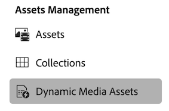

1. Select **[!UICONTROL Create Template]**. The **[!UICONTROL New Template]** dialog box displays.

   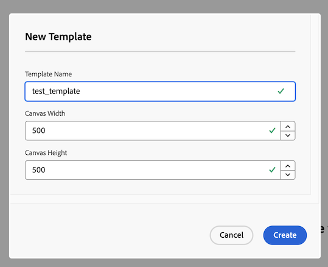

   >[!NOTE]
   >
   >  The template is saved in the location where you create it. On the [!DNL Assets View] home page, select **[!UICONTROL Dynamic Media Assets]** and click **[!UICONTROL Create Template]** to save the template in **[!UICONTROL Dynamic Media Assets]** root folder.
 
1. Specify a template name, define the canvas width and height, and click **[!UICONTROL Create]**. A blank canvas displays with menu options on both sides to use for creating the template. Hover over the menu options to see their tooltip. 
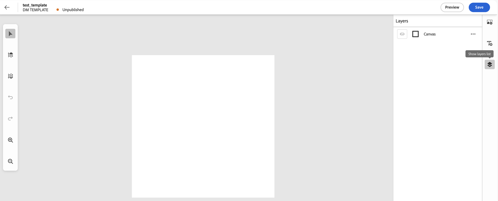

   >[!NOTE]
   >
   > The allowed width and height range is from 50 to 5000.

**Menu options on the right pane:** Use these options to add the necessary images and text layers to the canvas.

* : Click to add images to the canvas.
* : Click to add texts to the canvas.
* : Click to see the list of all layers (image, text, shape, and countdown timer) on the canvas. Every layer added to the canvas is represented as a separate layer.
* : Click to add a countdown timer layer to the canvas.

**Menu options on the left pane:** Use these options for the following common editor actions.

* : Select  and click a layer on the canvas to select it.
* : Click  or use keyboard shortcut, **Ctrl** + **`]`** (Windows) or **Cmd** + **`]`** (Mac) to bring a selected layer forward. 
* : Click  or use keyboard shortcut, **Ctrl** + **`[`** (Windows) or **Cmd** + **`[`** (Mac) to send a selected layer backward.
* : Click  or use keyboard shortcut, **Ctrl** + **Z** (Windows) or **Cmd** + **Z** (Mac) to undo the last action.
* : Click  or use keyboard shortcut, **Ctrl** + **Y** (Windows) or **Cmd** + **Y** (Mac) to redo the last action.
* : Click  or use keyboard shortcut, **Ctrl** + **+** (Windows) or **Cmd** + **+** (Mac) to zoom in the canvas.
* : Click  or use keyboard shortcut, **Ctrl** + **-** (Windows) or **Cmd** + **-** (Mac) to zoom out the canvas.
* Press **backspace** or **delete** to delete the selected layer if no text or property is being edited.

Click  and select more options () on the Canvas layer to edit the canvas dimensions anytime while creating the template.
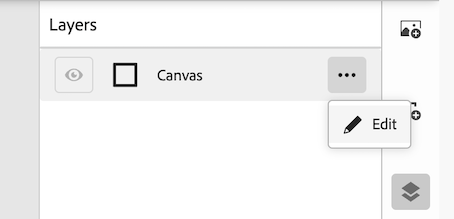

   >[!NOTE]
   >
   > Templates allow a maximum of 20 layers, including the Canvas.

### Add images to the canvas{#add-images-to-the-canvas}

Execute these steps to add images to the canvas:

1. Click  to open the [Asset Selector](https://experienceleague.adobe.com/en/docs/experience-manager-cloud-service/content/assets/manage/asset-selector/overview-asset-selector) panel. The panel displays the images in your AEM Assets instance that are synced to [!DNL Dynamic Media]. 
1. Browse the panel or use keywords in the search bar to find a specific image.
1. Drag and drop an image on the canvas to use it. See the [**[!UICONTROL Properties Panel]**](#reposition-resize-delete-a-layer) for resizing or repositioning a layer on the canvas.
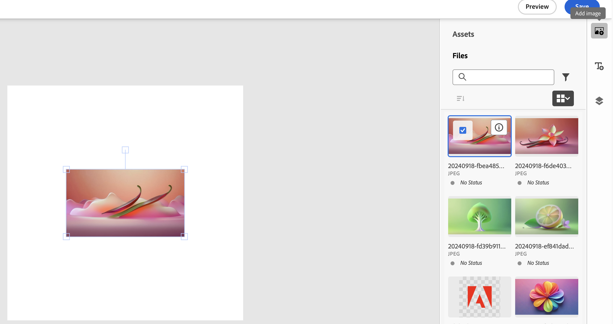
1. Enable the **[!UICONTROL Uniform Radius]** toggle and use the **[!UICONTROL Corner Radius]** slider to adjust the roundness of all four corners of an image uniformly. Disable the toggle to customize the corner roundness by assigning specific radius values to each corner.
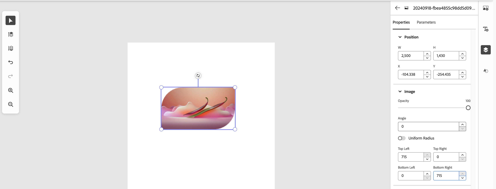

### Add text layers to the canvas{#add-text-to-the-canvas}

Execute these steps to add text layers to the canvas:

1. Click  to add a text layer to the canvas and open the Properties panel. 
1. Select the layer and click the text to update it. 
1. Select **[!UICONTROL Smart Text Resize]** in the Properties panel to automatically adjust the text length and font size to optimally fit in the designated area. 

>[!NOTE]
>
>The Design canvas and Preview/Delivery output may show minor differences in text position or size due to differences in rendering technologies.

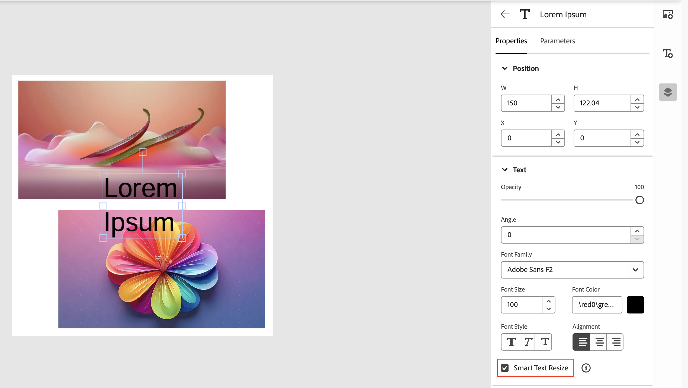

See the [**[!UICONTROL Properties Panel]**](#reposition-resize-delete-a-layer) to reposition, resize, rotate or delete the layer. Format your text to the required font, size, color, style, alignment (in the layer) by changing their values in the respective fields under the **[!UICONTROL Text]** section of the panel. The **[!UICONTROL Font Family]** field displays [!UICONTROL Adobe Sans F2] default font, the reprocessed existing fonts and the newly uploaded and published fonts. See point 5 in the [Before you begin](#prerequisites-for-dynamic-media-wysiwyg-template) section above for more information.

[Format specific parts of text](#apply-formatting-to-substring) and [parameterize them to control them independently](#substring-parameterisation).

#### Format selective text {#apply-formatting-to-substring}

Execute the following steps to format specific parts of a string:

1. Select one or more characters in the string to format.
1. Format the selection using the [properties panel](#properties-panel). The following formatting options are applicable to substrings and their parts:
   * **Font Style**: Bold, italic, underline, subscript, and superscript using the **[!UICONTROL Font Style]** option.
   * **Font Properties**: Change font family, color, size, and line spacing using the respective panel options.
   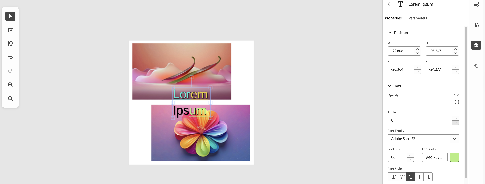

>[!NOTE]
>
>If a multi-line text layer contains substrings with different font sizes and a custom line spacing is applied, the preview or delivery output may not exactly match the Canvas View. In some cases, the generated output may display reduced spacing between lines.

Each formatted string part displays as a substring in the substring selector, available within the parameters panel. [Add parameters to these formatted parts to format them dynamically using the template's delivery URL](#substring-parameterisation).

### Add shapes to the canvas {#add-shapes-to-the-canvas}

Execute these steps to add shapes to the canvas:

1. Click , select a shape (rectangle or circle) to add it to the canvas. Use the shape's [[!UICONTROL Properties Panel]](#reposition-resize-delete-a-layer) to reposition, resize, rotate or delete the layer. 
1. Scroll to the **[!UICONTROL Style]** section of the panel, define a hex code in the **[!UICONTROL Shape Color]** field or use the color picker to fill color in the selected shape. 
1. Enable the **[!UICONTROL Uniform Radius]** toggle and use the **[!UICONTROL Corner Radius]** slider to adjust the roundness of all four corners of the rectangle uniformly. Disable the toggle to customize the corner roundness by assigning specific radius values to each corner.
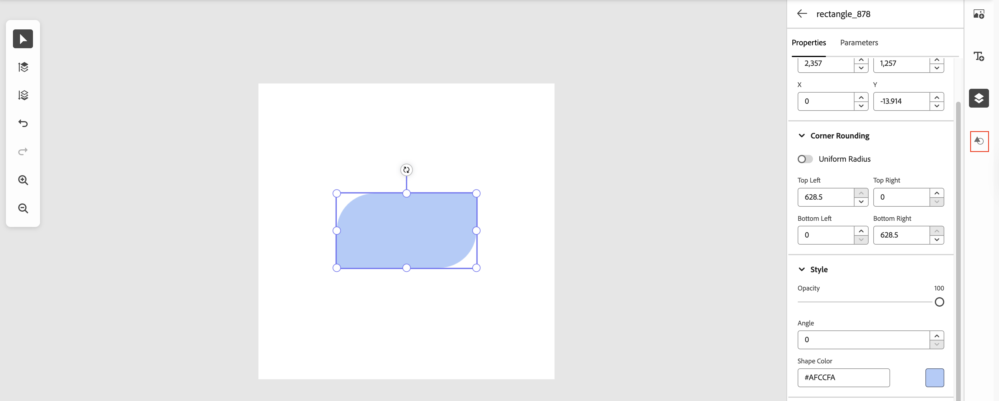
1. [Add the **[!UICONTROL Hide]** parameter to the selected layer](#parameterise-a-layer) to show or hide the layer in the template in real time using the template URL. 
1. Select the layer to [add a [!UICONTROL CTA] link](#add-CTA-in-dynamic-media-templates) to it, allowing users to click the shape as a hyperlink in the live template.

### Add countdown timer to the canvas {#add-countdown-timer-to-the-canvas}

Execute these steps to add a countdown timer layer to the canvas:

1. Click  to add a countdown timer layer to the canvas. The countdown timer layer is added, and the **[!UICONTROL Properties]** panel opens automatically.

2. Select the countdown timer layer to configure its properties.

3. Use the **[!UICONTROL Position]** section to reposition, resize, rotate, or hide the countdown timer layer.

4. Use the **[!UICONTROL Text]** section to configure the appearance of the countdown timer text, such as font family, font size, text color, alignment, opacity, and rotation.

5. Scroll to the **[!UICONTROL Timer]** section and configure the countdown timer settings, such as specifying the end time, enabling or disabling time units, defining suffix text, and specifying fallback text.

6. Use the **[!UICONTROL CTA]** section to specify a destination URL and make the countdown timer layer clickable.

   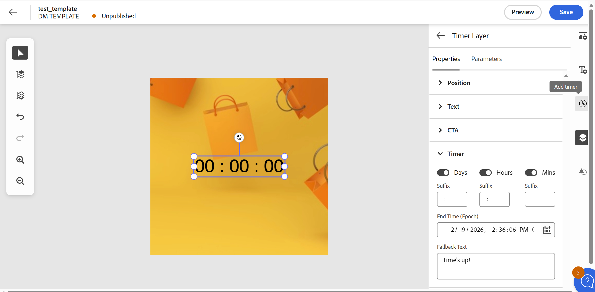

See the [**[!UICONTROL Properties Panel]**] to reposition, resize, rotate, delete, or parameterise the countdown timer layer.

>[!NOTE]
>
>The Countdown Timer layer is currently available only in Beta environments. This feature may not be available in all environments.

### Edit or delete a layer {#edit-or-delete-a-layer}

Execute these steps to edit or delete a canvas layer:

1. Click  and select the layer either on the canvas or from the Layers list.
1. Click **[!UICONTROL more options]** () to edit or delete the layer. 
1. Click **[!UICONTROL Delete]** to delete the layer. 
1. Click **[!UICONTROL Edit]** to edit the layer using the [**[!UICONTROL Properties Panel]**](#reposition-resize-delete-a-layer).
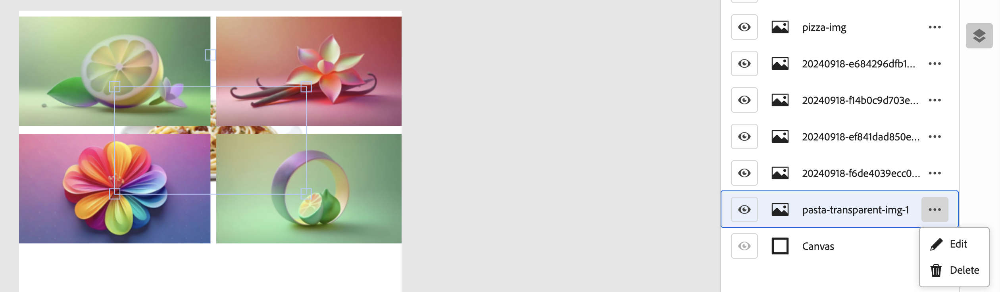

### Properties panel {#properties-panel}

[!UICONTROL Properties] panel includes sections to [reposition](#reposition-resize-delete-a-layer), [resize](#reposition-resize-delete-a-layer) and [rotate](#reposition-resize-delete-a-layer) a layer. It also provides color fill options for [shape layers](#add-shapes-to-the-canvas), [text formatting options](#text-formatting-options-on-properties-panel) for [text layers](#add-text-to-the-canvas), countdown timer configuration options for [countdown timer layers](#add-countdown-timer-to-the-canvas), and an option to [add a [!UICONTROL CTA] link](#add-CTA-in-dynamic-media-templates) to any selected layer.

To navigate to a layer's properties panel, click  and select the layer from the list to display its [!UICONTROL Properties] panel. 

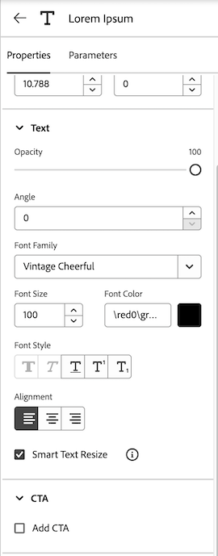

From the [!UICONTROL Properties] panel of a layer, select another layer on the canvas to navigate to its [!UICONTROL Properties] panel.
 
#### Reposition, resize, rotate or delete a layer{#reposition-resize-delete-a-layer}

See these common layer editing actions to edit an image, text, shape, or countdown timer layer:

* **Reposition the layer:** Drag the layer to move it anywhere on the canvas. This action updates the X and Y values in the properties panel. X and Y are the coordinates of the layer's center on the canvas plane.
* **Resize the layer:** Select the layer and drag its edge handles to resize it. This action updates the W (width) and H (height) values in the properties panel.
* **Rotate the layer:** Drag the square handle placed vertically above the layer to rotate it around its center. This action updates the angle values in the properties panel. 
* **Delete the layer:** Press **Backspace** or **delete** and then click **[!UICONTROL Confirm]** to delete a selected layer.

#### Text formatting options{#text-formatting-options-on-properties-panel}

Format your text to the required font, size, color, style, alignment (within the layer) by changing their values in the respective fields under the **[!UICONTROL Text]** section on the panel.
Ensure to include **[!UICONTROL Smart Text Resize]**. [!UICONTROL Smart Text Resize] works on [Copyfitting](https://experienceleague.adobe.com/en/docs/dynamic-media-developer-resources/image-serving-api/image-serving-api/http-protocol-reference/text-formatting/r-copy-fitting) algorithm to optimally fill text in the text area and prevents text overflow and minimizes extra space at the bottom of the text.

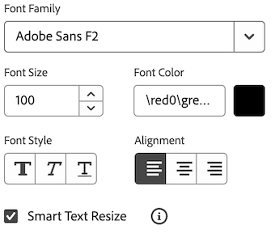

#### Countdown timer properties {#countdown-timer-properties}

Configure the countdown timer settings using the **[!UICONTROL Timer]** section in the [!UICONTROL Properties] panel. These settings control the countdown timer display, expiration behavior, and optional hyperlink functionality.

Use the following options:

* **Days, Hours, Mins** – Enable or disable specific time units to control which values appear in the countdown timer. When enabled, the selected units display in the countdown timer.

* **Suffix** – Specify additional text displayed after each enabled time unit. For example, you can use suffix values such as "d", "h", or "m", or separators such as ":" to customize the display format.

* **End Time (Epoch)** – Specifies the exact expiration date and time of the countdown timer. The countdown updates dynamically and displays the remaining time until the specified end time.

* **Fallback Text** – Specifies the text displayed after the countdown timer reaches its expiration time. For example, you can display a message such as "Time's up!" or "Offer expired".

To make the countdown timer layer clickable, use the **[!UICONTROL CTA]** section and specify a destination URL.

### Parameterise layers {#parameterise-a-layer}

After creating a template with multiple layers of images, texts, shapes, and countdown timers, parameterise the selected layers. When a layer or its property is parameterised, it gets a key-value pair (also called as parameter). This parameter can be included in the template URL to update the layer's position, size or content in real time resulting in template customisation in no time.

To parameterise a layer:

1. click , select a layer and click **[!UICONTROL Parameters]**. The **[!UICONTROL Parameters]** panel displays.
1. Toggle **[!UICONTROL Include Parameter]** to parameterise a property. See the [Parameters panel option](#parameterisation-options-or-allowed-parameters) to know the property's behavior after parameterisation.
1. **Optional:** Rename the parameter name. A parameter name has a layer name followed by a suffix. For a selected layer all its parameterized properties share the same layer name followed by a varying suffix. Rename the layer name by following the semantic naming convention so that when you include the parameter in the URL, the parameter name self explains about the layer's content or its purpose.
1. Click **[!UICONTROL Save]**.
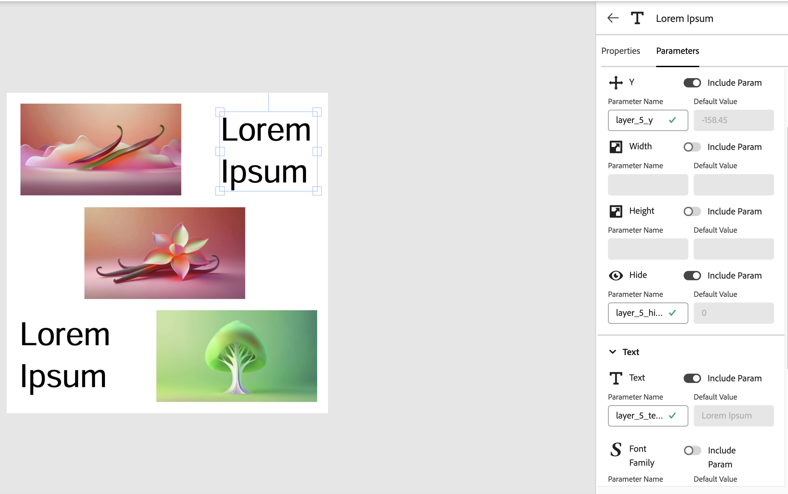
To switch between the Parameter panel of an image and text layer, select the layer on the canvas and click **[!UICONTROL Parameters]**.

#### Parameters panel option {#parameterisation-options-or-allowed-parameters} 

The parameterised properties can be included as URL parameters in the template URL to edit the template in real time using the URL. 

##### Layer parameters{#layer-parameters}

The following are layer parameters that apply to both image and text layers.

**[!UICONTROL X]:** Include to move the layer horizontally along its centerline, parallel to the X-axis of the template plane, by changing the parameter's value in the URL.
**[!UICONTROL Y]:** Include to move the layer vertically along its centerline, parallel to the Y-axis of the template plane, by changing the parameter's value in the URL. 
**[!UICONTROL Width]:** Include to adjust the layer's width by changing the parameter's value in the URL.
**[!UICONTROL Height]:** Include to adjust the layer's height by changing the parameter's value in the URL.
**[!UICONTROL Hide]:** Include to hide or show the layer in the template using 0 (show) and 1 (hide).

##### Image parameter{#image-parameter}

Include **[!UICONTROL Source]** parameter to replace the layer's image with a new image by changing the image path in the parameter's value in the URL.
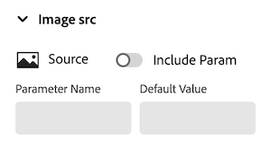

##### Text formatting parameters{#text-formatting-parameters}

Include the following parameters to edit the text, its font, color and size from the delivery URL by updating the parameter values in the URL:

**[!UICONTROL Text]:** Include to update text from the URL.
**[!UICONTROL Font Family]:** Include to update the text's font from the URL.
**[!UICONTROL Font Size]:** Include to update the text's font size from the URL.
**[!UICONTROL Text color]:** Include to update the text's font color from the URL.

##### Countdown Timer parameters {#countdown-timer-parameters}

For countdown timer layers, the following parameters can be included to dynamically update the timer via URL:

* **[!UICONTROL End Time]**: Include to set the countdown's end time. Use a Unix epoch timestamp or predefined date-time format as the parameter value.  
* **[!UICONTROL Fallback Text]**: Include to display text after the countdown ends (e.g., "Time's up!").  
* **Optional timer parameters**:  
  * `countdown_show_days`, `countdown_show_hours`, `countdown_show_mins` - Set 1/0 to show or hide specific time units.  
  * `countdown_cta` – Optional CTA link to redirect after countdown completion.
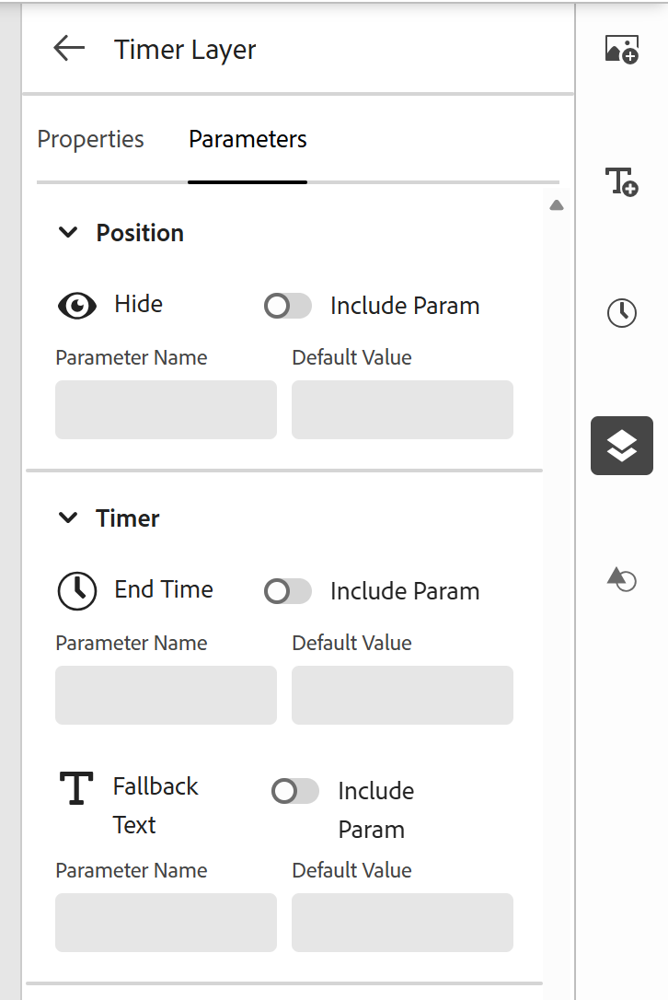

These parameters allow real-time updates to the countdown timer directly from the template URL.

##### Parameterize substrings{#substring-parameterisation}

In the **[!UICONTROL Parameters]** panel, scroll to the **[!UICONTROL Substring Parameters]** section. This section includes a **substring selector** that displays the complete string (selected text layer) with consistent formatting or its formatted parts as separate substrings. Select a substring to [parameterize its text, font family, font size, and color](#text-formatting-parameters).
Use the substring selector to [split substrings](#split-substring) to parameterize its individual parts or [merge substrings](#merge-substring) to apply uniform parameters.

###### Split substring{#split-substring}

To parameterize a specific part of a substring, pull out the part to make it a separate substring for individual selection and parameterization. Execute the following steps to split a substring into separate substrings:

1. In the substring selector, select the characters within a substring  to separate it.
1. Click  to pull out the selection and make it a separate substring within the **substring selector**. 
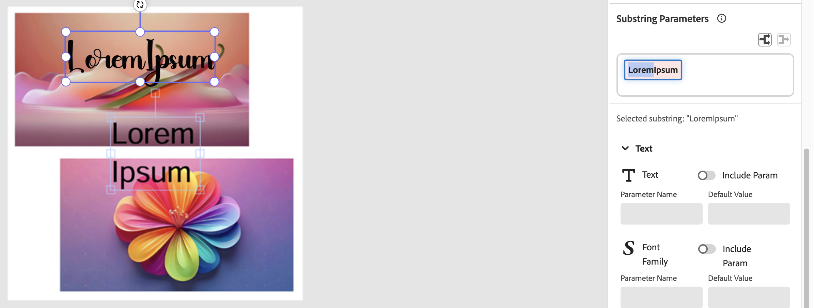
You can select the required substring to [parameterize its text, font family, font size, and color](#text-formatting-parameters).

###### Merge substring{#merge-substring}

Merging substrings removes their existing individual parameters and enables you to apply consistent parameters across the newly formed substring.
Execute the following steps to merge two adjacent substrings to apply uniform parameters to the resulting substring:

1. In the substring selector, select characters across two adjacent substrings with same formatting.
1. Click  to merge the substrings.

   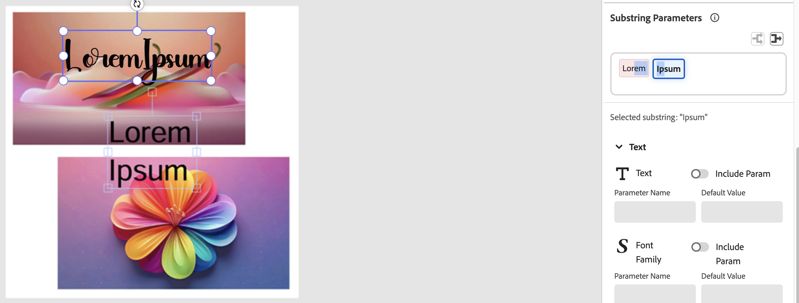

   You can apply uniform parameters to the newly formed substring.

   >[!NOTE]
   >
   >Only substrings with identical formatting can be merged.

### Group layers to control their visibility simultaneously{#group-layers}

Another way to keep your templates flexible, is by using a single parameter name to control multiple layers. This strategy is helpful for the visibility (hide or show layers) parameter, to update the design or graphics from a single template.

Follow these steps to assign the same name to the [!UICONTROL Hide] parameters () of multiple layers, allowing you to hide or show them simultaneously.

1. Navigate to the [**[!UICONTROL Properties Panel]**](#parameterise-a-layer) of a layer.
1. Toggle the **[!UICONTROL Hide]** Parameter if not parameterised earlier.
1. **Optional:** Rename the **[!UICONTROL Hide]** Parameter.
1. Copy the **[!UICONTROL Hide]** Parameter name. 
1. Go to the Parameter panel of other layers by selecting them from the canvas and toggle their **[!UICONTROL Hide]** Parameter if not parameterised.
1. Replace their **[!UICONTROL Hide parameter]** name with the copied name.
1. Click **[!UICONTROL Save]** to group the layers. 
1. Execute step 3 and then 4 in the [**[!UICONTROL Preview and Publish]**](#preview-and-publish-template-and-copy-template-deliver-url) section to see your changes. 

## Preview and publish the Dynamic Media template to copy the delivery URL {#preview-and-publish-dynamic-media-template-and-copy-template-deliver-url}

Execute these steps to preview and publish the template and copy the delivery URL:

1. On the canvas page, click **[!UICONTROL Preview]**. You can also navigate to **[!UICONTROL Assets View]** **>** **[!UICONTROL Dynamic Media Assets]** **>** find and select your template **>** click **[!UICONTROL Edit Template]** **>** click **[!UICONTROL Preview]**. The preview page displays the template, its parameters (parameterized layers and properties), publish status, and the **[!UICONTROL Publish]** option.
1. Select parameters from the **[!UICONTROL Template Parameters]** panel to edit their values and instantly update the content, size, position, or text formatting of the corresponding template layer in the preview. For example: 
   1. Select a text layer and edit its text.
   1. Select an image layer, click , select an image from the asset selector, and click **[!UICONTROL Refresh]**. 
   1. Select a countdown timer layer to modify the end time, display units, suffix, fallback text, or CTA

   The template updates immediately, displaying the edited text and replacing the previous image with the new one. Additionally, the image parameter value reflects the new image path. Similarly, you can resize a layer by adjusting its values, and the changes are applied to the template in real time. 
1. Select the **[!UICONTROL Hide]** parameter for [grouped layers](#group-layers) from the list to show or hide them together in the template. 
1. **Optional:** Change the **[!UICONTROL Hide]** parameter value between 0 and 1 and click **[!UICONTROL Refresh]** to see the changes. Layers with the same **[!UICONTROL Hide]** parameter hides or displays together. Similarly, you can control the layers' visibility from the URL.

   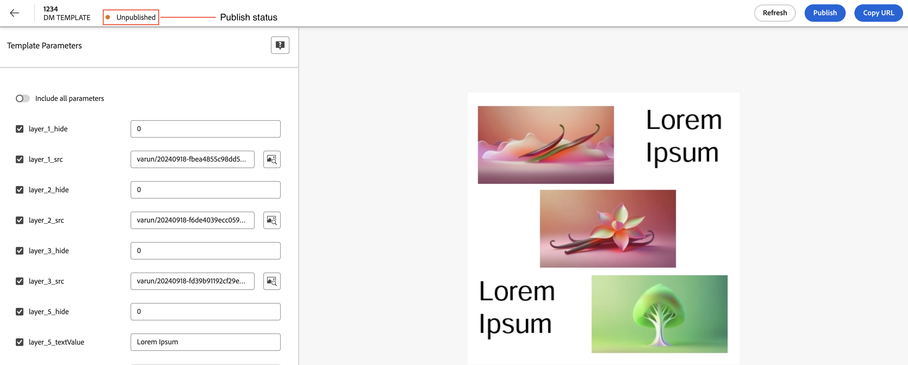
   You can also toggle **[!UICONTROL Include all parameters]** to edit all of the displayed parameter values and see the updates in the template preview.
   <br>
1. To publish the template from the preview page, click **[!UICONTROL Publish]**  and confirm to publish. A **[!UICONTROL Publish Complete]** message displays and the publish status updates to **[!UICONTROL Published]**.

### Copy the delivery URL

The selected parameters on the **[!UICONTROL Preview]** page become the URL parameters in the template URL.

Ensure the images in the template are already published to AEM and Dynamic Media to generate the delivery URL of the template.

Execute the following steps to copy the delivery URL of the template:

1. Click **[!UICONTROL Copy URL]**. The **[!UICONTROL Copy URL]** dialog box displays. Select and copy the displayed URL. The first parameter in the URL starts after a question mark **([!UICONTROL ?])** and a key-value pair starts with **[!UICONTROL $]** and ends with **[!UICONTROL &]**. The key and value are separated by an equals sign **([!UICONTROL =])**, with the key on the left and the value on the right. 
1. Paste this URL in your browser tab and see your live template. Customize the template in real time by updating the required parameter's value (Key's value) in the URL directly as demonstrated in [step 2](#preview-and-publish-template-and-copy-template-deliver-url) of **Preview and Publish** section.  
1. Use this URL for rapid merchandising of your products or services. You can share this URL with your customers or integrate it into your website or any downstream third-party application to display the banner and make real-time updates to it to reflect the ongoing offers.

## Make real-time updates to the Dynamic Media template from the URL {#update-the-template-from-the-url}

Editing parameters directly in the URL can be tedious. To simplify: 

1. Copy the URL and paste it into a notepad. 
1. Use Cmd+F (Mac) or Ctrl+F (Windows) to find and edit the parameter values. Such as:
   * Find and replace image paths for image layers.
   * Find the layer's [parameterized](#parameterise-a-layer) coordinates, width and height, to adjust their values. 
   * Edit text, font, color, size, or alignment for text layers. 
   * Change visibility values between 0 and 1. 

Paste this updated URL in your browser to view the changes. 

## Edit the Dynamic Media template {#edit-the-template}

Edit the template by following these steps:

1. On the [!DNL Assets view], click **[!UICONTROL Dynamic Media Assets]**.
2. Navigate to the template location.
3. Select the template.
4. Click **[!UICONTROL Edit Template]**. The template canvas displays the template and the list of all its layers in the Layers panel. Start editing your template as per your requirements.

## Add Call to Action (CTA) link to your Dynamic Media template layer {#add-CTA-in-dynamic-media-templates}

Turn any image, text or shape layer of your [!DNL Dynamic Media] template into a hyperlink by adding a CTA link to it that directs users to a target page. 

Execute these steps to add a CTA link to a layer:

1. Navigate to your template location, select the template and click  **[!UICONTROL Edit Template]**. The template displays on the canvas.
1. Select the template layer and [navigate to its properties panel](#edit-or-delete-a-layer) to add a CTA link to it.
1. On the properties panel, select **[!UICONTROL Add CTA]**, specify the destination URL in the **[!UICONTROL URL]** field and click **[!UICONTROL Save]**. 

   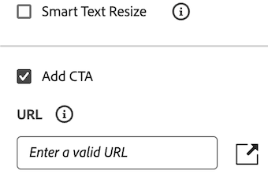

1. Click **[!UICONTROL Preview]** and select **[!UICONTROL Publish]** to publish your template, if not published earlier. 
1. Navigate to the folder where this template is saved, select this template and click  **[!UICONTROL Details]**.
1. Click **[!UICONTROL Copy Options]** and select **[!UICONTROL Copy Embed Code]**. Ensure to publish the template images to [!DNL AEM and Dynamic Media] to copy the embed code.
    
   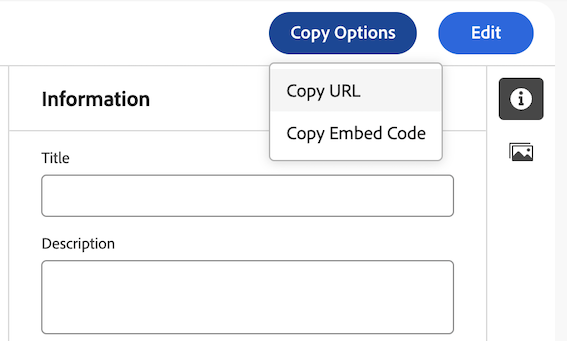

   The following is an example of the Embed Code:

   ``` json
    <div class="adobe-dynamicmedia-template-embed-container">
    >" src="<Image Source>>" alt="adobe dynamicmedia template" usemap="#adobe-dynamicmedia-template-map" width="800" height="300">
    <map name="adobe-dynamicmedia-template-map">
    <area shape="rect" coords="417,-60,817,340" href="https://business.adobe.com/products.html" alt="Layer with CTA" title="https://business.adobe.com/products.html" target="_blank">
    <area shape="rect" coords="6,206.57,129,231.43" href="https://business.adobe.com/products.html" alt="Layer with CTA" title="https://business.adobe.com/products.html" target="_blank">
    </map>
    </div>
   ```

1. Add the copied embed code to your site's HTML file and run it in your browser to display the template.

1. Click the CTA element on the template to navigate to the destination page.

Watch this step by step video to learn how to add a CTA link to a template layer.

>[!VIDEO](https://video.tv.adobe.com/v/3457616)

## Important points to note {#important-points-to-note}

* After creating a template with parameterized image layers for dynamic updates, ensure that the images intended for future updates share the same dimensions as the parameterized images. This ensures the images fit perfectly within the layers without overflowing or leaving empty spaces. Currently, the template does not support automatic dimension adjustments to fit images into the layers.
* There is no substring support in a text layer. The user cannot apply different font properties on substring of a text layer.
* Support of multiple [!DNL Dynamic Media] companies is not currently available with [!DNL Dynamic Media] Templates.
* In case of copy or move, Destination Selector shows all the folders (including non-[!DNL Dynamic Media] synced folders). Also, currently, it does not display the [!DNL Dynamic Media] Template assets (both of these are limitations of the destination selector).
* Any update operation on a folder (for example, Publish or Delete) from Assets section impacts the [!DNL Dynamic Media] Templates available within that folder. 
* Trash does not work for [!DNL Dynamic Media] Templates. If an asset is moved to trash and then restored, the asset is restored in AEM but not on [!DNL Dynamic Media]. The same is valid for [!DNL Dynamic Media] Templates.

## See also

* Explore [[!DNL Dynamic Media] and its capabilities](/help/assets/dynamic-media/dynamic-media.md)
* Explore [[!DNL Dynamic Media] with OpenAPI capabilities](/help/assets/dynamic-media-open-apis-overview.md)