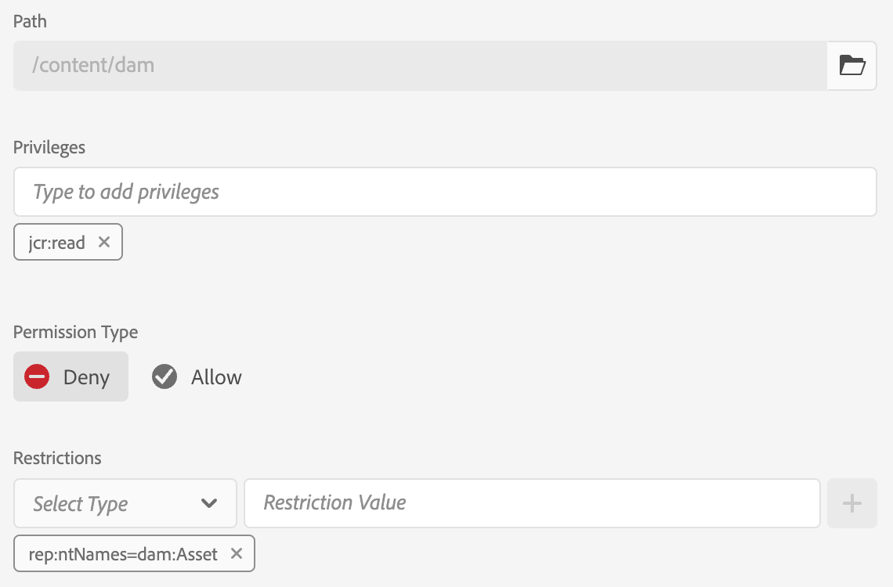
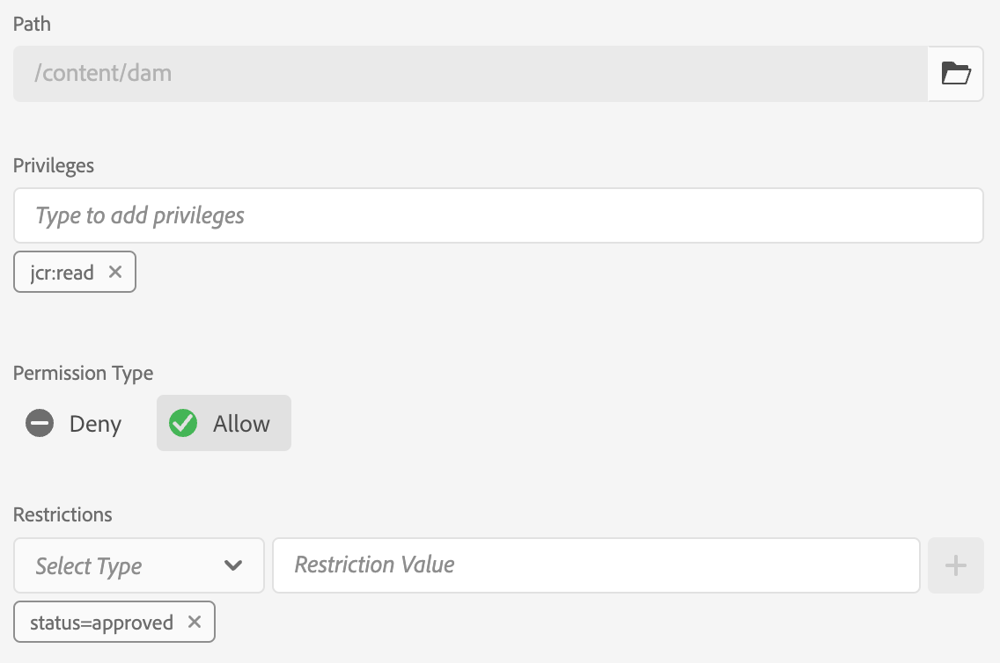
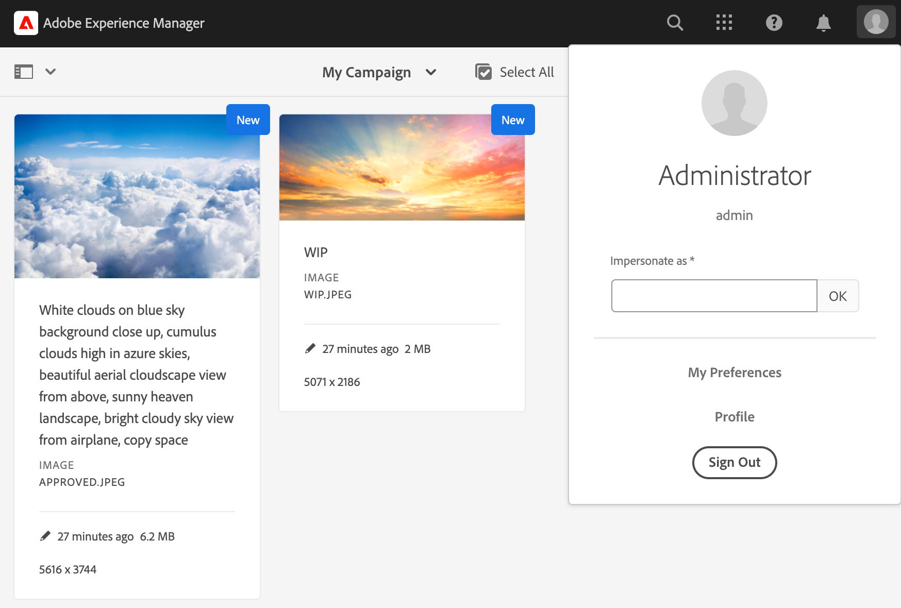
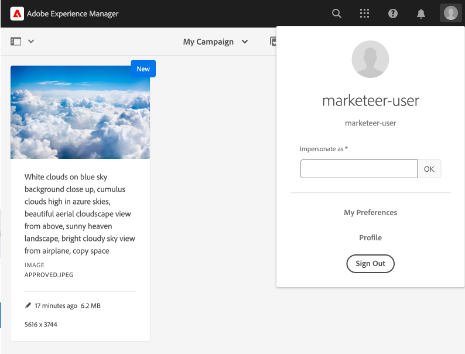
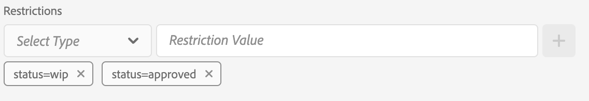
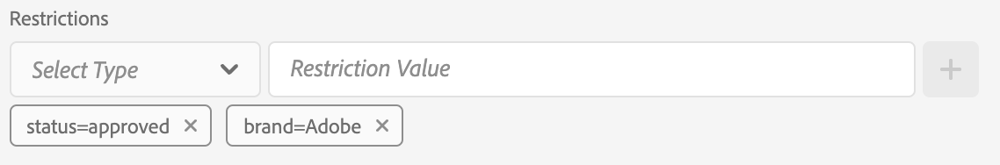
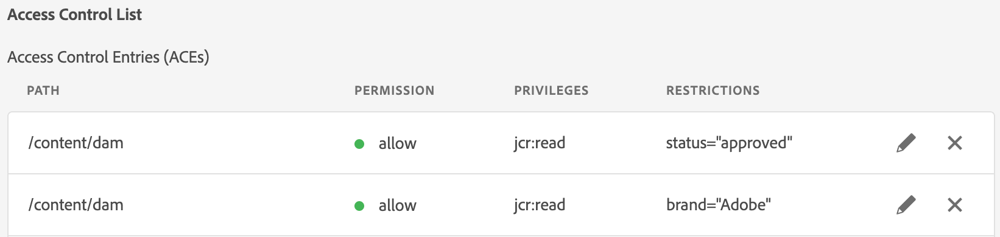

# Metadata-driven permissions {#metadata-driven-permissions}

Folder structure does not always match how you want to restrict access to assets. Metadata-driven permissions let you grant or deny access based on an asset's metadata, such as its status or brand, instead of its location in a folder. This way, marketers see only approved assets, even when work-in-progress and approved files sit in the same folder. You avoid a folder rebuild just to separate content by approval state.

>[!BEGINTABS]

>[!TAB Admin view]

Let's see an example. Creatives upload their work to AEM Assets to the campaign related folder, it might be a work in progress asset which has not been approved for use. We want to make sure that marketeers see only approved assets for this campaign. We can utilize a metadata property to indicate that an asset has been approved and can be used by the marketeers.

## How it works

Enabling Metadata-Driven Permissions involves defining which asset content or metadata properties will drive access restrictions, such as "status" or "brand." These properties can then be used to create access control entries that specify which user groups have access to assets with specific property values.

## Prerequisites

* Access to an AEM as a Cloud Service environment updated to the latest version.

* The user or the user group must have `jcr:modifyAccessControl` to set metadata-driven permissions.

## OSGi configuration {#configure-permissionable-properties}

To implement Metadata-Driven Permissions a developer must deploy an OSGi configuration to AEM as a Cloud Service, that enables specific asset content or metadata properties to power metadata-driven permissions.

1. Determine which asset content or metadata properties will be used for access control. The property names are the JCR property names on the asset's `jcr:content` or `jcr:content/metadata` resource. In our case it going to be a property called `status`.
1. Create an OSGi configuration `com.adobe.cq.dam.assetmetadatarestrictionprovider.impl.DefaultRestrictionProviderConfiguration.cfg.json` in your AEM Maven project.
1. Paste the following JSON into the created file:

    ```json
    {
      "restrictionPropertyNames":[
        "status",
        "brand"
      ],
      "restrictionContentPropertyNames":[
        "dam:rightsManaged"
      ],
      "enabled":true
    }
    ```

1. Replace the property names with the required values.  The `restrictionContentPropertyNames` configuration property is used to enable permissions on `jcr:content` resource properties, while the `restrictionPropertyNames` configuration property enables permissions on `jcr:content/metadata` resource properties for assets.

## Reset base asset permissions

Before adding restriction-based Access Control Entries, a new top-level entry should be added to first deny read access to all groups that are subject to permission evaluation for Assets (e.g. "contributors" or similar):

1. Navigate to the __Tools → Security → Permissions__ screen 
1. Select the __Contributors__ group (or other custom group that all users groups belong to)
1. Click __Add ACE__ in the upper right corner of the screen
1. Select `/content/dam` for __Path__
1. Enter `jcr:read` for __Privileges__
1. Select `Deny` for __Permission Type__
1. Under Restrictions, select `rep:ntNames` and enter `dam:Asset` as the __Restriction Value__
1. Click __Save__
   


## Grant access to assets by metadata

Access control entries can now be added to grant read access to user groups based on the [configured Asset metadata property values](#configure-permissionable-properties).

1. Navigate to the __Tools → Security → Permissions__ screen
1. Select the user groups that should have access to the assets
1. Click __Add ACE__ in the upper right corner of the screen
1. Select `/content/dam` (or a subfolder) for __Path__
1. Enter `jcr:read` for __Privileges__
1. Select `Allow` for __Permission Type__
1. Under __Restrictions__, select one of the [configured Asset metadata property names in the the OSGi configuration](#configure-permissionable-properties)
1. Enter the required metadata property value in the __Restriction Value__ field
1. Click the __+__ icon to add the Restriction to the Access Control Entry
1. Click __Save__



## Metadata-driven permissions in effect

Example folder contains a couple of assets.



Once you configure permissions and set the asset metadata properties accordingly, users (Marketeer User in our case) will see only approved asset.



## Benefits and considerations

Benefits of Metadata-Driven Permissions include:

* Fine-grained control over asset access based on specific attributes.
* Decoupling of access control policies from folder structure, allowing for more flexible asset organization.
* Ability to define complex access control rules based on multiple content or metadata properties.

>[!NOTE]
>
> It's important to note:
> 
> * Properties are evaluated against the restrictions using __String equality__ (`=`)  (other data types or operators are not yet supported, for greater than (`>`) or Date properties)
> * To allow multiple values for a restriction property, additional restrictions can be added to the Access Control Entry by selecting the same property from the "Select Type" dropdown and entering a new Restriction Value (e.g. `status=approved`, `status=wip`) and clicking "+" to add the restriction to the entry
> 
> * __AND restrictions__ are supported, via multiple restrictions in a single Access Control Entry with different property names (e.g. `status=approved`, `brand=Adobe`) will be evaluated as an AND condition, i.e. the selected user group will be granted read access to assets with `status=approved AND brand=Adobe`
> 
> * __OR restrictions__ are supported by adding a new Access Control Entry with a metadata property restriction will establish an OR condition for the entries, e.g. a single entry with restriction `status=approved` and a single entry with `brand=Adobe` will be evaluated as `status=approved OR brand=Adobe`
> 

>[!ENDTABS]
