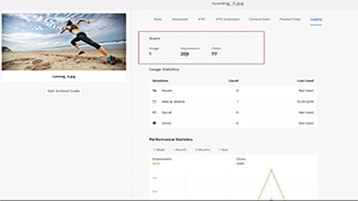
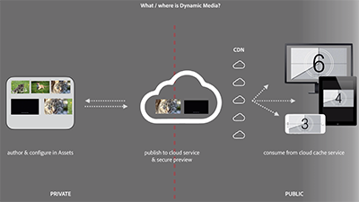
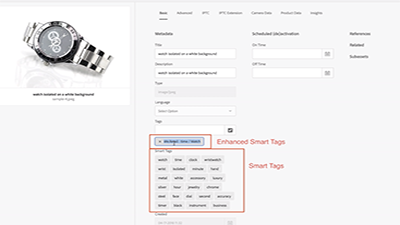

# Overview {#overview}

Adobe Experience Manager Assets is a digital asset management tool on AEM Platform that allows users to create, manage and share their digital assets (images, videos, documents and audio clips) in a web-based repository. This user guide contains videos and tutorials on the many features and capabilities of AEM Assets.

## What's New

* **[Use Brand Portal Asset Sourcing (Video)](./brand-portal/brand-portal-feature-video-use.md#asset-sourcing)**
     
    *Learn about how 3rd parties can upload assets to Brand Portal and sync them back to Experience Manager Author*

* **[Using Adobe Asset Link (Video)](./creative-cloud/adobe-asset-link-feature-video-use.md)**
     
    *Learn about how designers and creative users can collaborate using their favorite Adobe Creative Cloud desktop applications*

* **[Using Connected Assets (Video)](./deployment/connected-assets-feature-video-use.md)**
     
    *Learn how AEM Sites author can seamlessly access digital assets hosted on a different instance of AEM*

* **[Using Dynamic Media Smart Crop (Video)](./dynamic-media/smart-crop-feature-video-use.md)**
     
     *Smart Crop uses Adobe Sensei to eliminate the time-consuming and costly tasks of cropping content for responsive design*

## Staff Picks

<table>
<td>
   
   

      <a href="./analytics/asset-insights-launch-tutorial-setup.md">
      <strong>Using AEM Asset Insights with Launch</strong>
      </a>
   

   

      <em>Gain insights into how AEM Assets are used</em>
   

</td>
<td>
   
   

      <a href="./dynamic-media/dynamic-media-overview-feature-video-use.md">
      <strong>Dynamic Media Overview</strong>
      </a>
   

   

      <em>Manage and access media content using Dynamic Media</em>
   

</td>
<td>
   
   

      <a href="./metadata/enhanced-smart-tags-feature-video-use.md">
      <strong>Using Enhanced Smart Tags</strong>
      </a>
   

   

      <em>Enhance asset search using Smart Tags</em>
   

</td>
</table>

## Additional Resources

* [Experience League - Explore AEM](https://experienceleague.adobe.com/#recommended/solutions/experience-manager)
* [AEM Assets Documentation](https://helpx.adobe.com/experience-manager/6-5/assets/user-guide.html)
* [AEM as a Cloud Service Tutorials](/help/cloud-service/overview.md)
* [AEM Sites Tutorials](/help/sites/overview.md)
* [AEM Forms Tutorials](/help/forms/overview.md)
* [AEM Foundation Tutorials](/help/foundation/overview.md)
