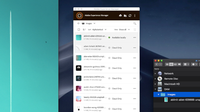
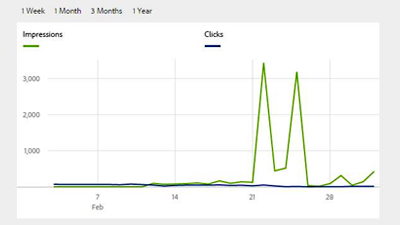
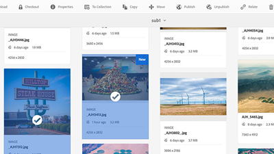

# AEM Assets Videos and Tutorials {#overview}

Adobe Experience Manager (AEM) Assets is a digital asset management tool on AEM Platform that allows users to create, manage, and share their digital assets (images, videos, documents, and audio clips) in a web-based repository. This user guide contains videos and tutorials on the many features and capabilities of AEM Assets.

## What's New

* **[Relate and Unrelate (Video)](./authoring/relate-unrelate.md)**
    *Learn how to establish and manage relationships between assets in AEM*

* **[Publish Assets (Video)](./sharing/publish.md)**
    *Learn the ins and outs of publishing assets from AEM Author to AEM Publish*

* **[Watermarks (Video)](./advanced/watermarks.md)**
    *Learn how to watermark asset renditions in AEM as a Cloud Service*

* **[Baseline permissions (Video)](./configuring/baseline-permissions.md)**
    *Learn how, and why it's important, to configure AEM Assets with baseline permissions*

* **[Auto-start workflows (Video)](./configuring/auto-start-workflows.md)** 
    *Explore how to automatically invoke AEM workflow on uploaded or reprocessed assets*

## Staff Picks

<table>
<td>
   
   

      <a href="./creative-workflows/aem-desktop-app.md">
      <strong>Using AEM Desktop App</strong>
      </a>
   

   

      <em>Access assets in AEM directly from the desktop</em>
   

</td>
<td>
   
   

      <a href="./advanced/asset-insights-launch-tutorial.md">
      <strong>Using AEM Asset Insights with Launch</strong>
      </a>
   

   

      <em>Gain insights into how assets are used</em>
   

</td>
<td>
   
   

      <a href="./dynamic-media/dynamic-media-overview-feature-video-use.md">
      <strong>Dynamic Media Overview</strong>
      </a>
   

   

      <em>Manage and access media content using Dynamic Media</em>
   

</td>
</table>

## Additional Resources

* [Experience League - Explore AEM](https://experienceleague.adobe.com/#recommended/solutions/experience-manager)
* [AEM Assets Documentation](https://experienceleague.adobe.com/docs/experience-manager-65/assets/home.html?lang=en)
* [AEM as a Cloud Service Tutorials](/help/cloud-service/overview.md)
* [AEM Sites Tutorials](/help/sites/overview.md)
* [AEM Forms Tutorials](/help/forms/overview.md)
* [AEM Foundation Tutorials](/help/foundation/overview.md)
