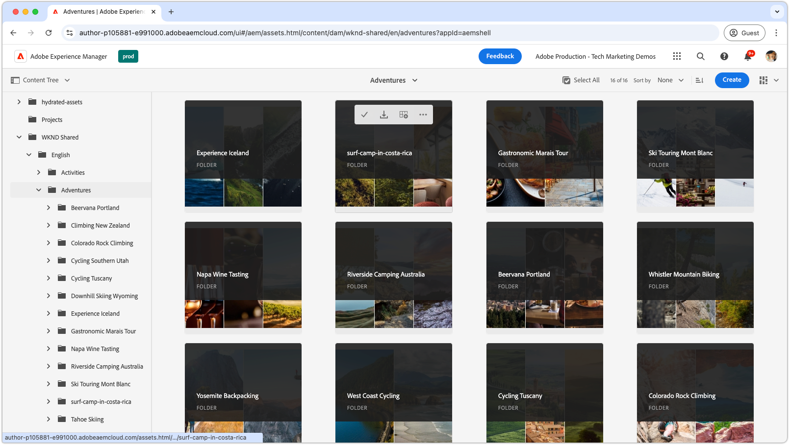

# Video playlists for Admin view 

{align="center"}

Explore these playlists to master the AEM Assets as a Cloud Service Admin view—covering configuration, optimization, usage, and seamless integration with creative workflows. Get the insights you need to succeed with AEM Assets as a Cloud Service.

## Configure Admin view

Get started with essential setup and configurations to make AEM Assets as a Cloud Service work seamlessly for your team and projects.

<!-- CARDS

* https://experienceleague.adobe.com/en/playlists/experience-manager-all-configure-administrative-access
* https://experienceleague.adobe.com/en/playlists/experience-manager-assets-configure-administrators

-->
<!-- START CARDS HTML - DO NOT MODIFY BY HAND -->

    

        

            

                <figure class="image x-is-16by9">
                    
                </figure>
            

            

                

                    

                        <a href="https://experienceleague.adobe.com/en/playlists/experience-manager-all-configure-administrative-access" target="_blank" rel="referrer" title="Configure Administrative Access to Experience Manager">Configure Administrative Access to Experience Manager</a>
                    

                    
Explore how users authenticate using Adobe IMS to AEM as a Cloud Service, and how Adobe IMS Users, User Groups, and Product Profiles are used to control access to AEM and its features and functionalities.

                

                <a href="https://experienceleague.adobe.com/en/playlists/experience-manager-all-configure-administrative-access" target="_blank" rel="referrer" class="spectrum-Button spectrum-Button--outline spectrum-Button--primary spectrum-Button--sizeM" style="align-self: flex-start; margin-top: 1rem;">
                    Watch
                </a>
            

        

    

    

        

            

                <figure class="image x-is-16by9">
                    
                </figure>
            

            

                

                    

                        <a href="https://experienceleague.adobe.com/en/playlists/experience-manager-assets-configure-administrators" target="_blank" rel="referrer" title="Configure AEM Assets">Configure AEM Assets</a>
                    

                    
Learn how to establish a solid foundation for your AEM Assets implementation by configuring the core concerns, from setting up a baseline content architecture and taxonomy to customizing metadata and asset processing.

                

                <a href="https://experienceleague.adobe.com/en/playlists/experience-manager-assets-configure-administrators" target="_blank" rel="referrer" class="spectrum-Button spectrum-Button--outline spectrum-Button--primary spectrum-Button--sizeM" style="align-self: flex-start; margin-top: 1rem;">
                    Watch
                </a>
            

        

    

<!-- END CARDS HTML - DO NOT MODIFY BY HAND -->

## Get started with Admin view

Navigate the admin interface like a pro — learn the tools and techniques to manage assets efficiently.

<!-- CARDS

* https://experienceleague.adobe.com/en/playlists/experience-manager-assets-get-started-business-users  
* https://experienceleague.adobe.com/en/playlists/experience-manager-assets-understand-metadata
* https://experienceleague.adobe.com/en/playlists/experience-manager-assets-optimize-search
* https://experienceleague.adobe.com/en/playlists/experience-manager-assets-use-smart-tags

-->
<!-- START CARDS HTML - DO NOT MODIFY BY HAND -->

    

        

            

                <figure class="image x-is-16by9">
                    
                </figure>
            

            

                

                    

                        <a href="https://experienceleague.adobe.com/en/playlists/experience-manager-assets-get-started-business-users" target="_blank" rel="referrer" title="Get Started with AEM Assets Admin View for Business Users">Get Started with AEM Assets Admin View for Business Users</a>
                    

                    
Explore the basics of AEM Assets Admin view, including navigation, how assets are organized and modeled, along with basic operations such as create, update and delete.

                

                <a href="https://experienceleague.adobe.com/en/playlists/experience-manager-assets-get-started-business-users" target="_blank" rel="referrer" class="spectrum-Button spectrum-Button--outline spectrum-Button--primary spectrum-Button--sizeM" style="align-self: flex-start; margin-top: 1rem;">
                    Watch
                </a>
            

        

    

    

        

            

                <figure class="image x-is-16by9">
                    
                </figure>
            

            

                

                    

                        <a href="https://experienceleague.adobe.com/en/playlists/experience-manager-assets-understand-metadata" target="_blank" rel="referrer" title="Understand Asset Metadata in AEM Assets">Understand Asset Metadata in AEM Assets</a>
                    

                    
Learn everything you need to know about AEM Assets' asset metadata.

                

                <a href="https://experienceleague.adobe.com/en/playlists/experience-manager-assets-understand-metadata" target="_blank" rel="referrer" class="spectrum-Button spectrum-Button--outline spectrum-Button--primary spectrum-Button--sizeM" style="align-self: flex-start; margin-top: 1rem;">
                    Watch
                </a>
            

        

    

    

        

            

                <figure class="image x-is-16by9">
                    
                </figure>
            

            

                

                    

                        <a href="https://experienceleague.adobe.com/en/playlists/experience-manager-assets-optimize-search" target="_blank" rel="referrer" title="Optimize Search in AEM Assets">Optimize Search in AEM Assets</a>
                    

                    
Learn how top optimize search experience in AEM Assets

                

                <a href="https://experienceleague.adobe.com/en/playlists/experience-manager-assets-optimize-search" target="_blank" rel="referrer" class="spectrum-Button spectrum-Button--outline spectrum-Button--primary spectrum-Button--sizeM" style="align-self: flex-start; margin-top: 1rem;">
                    Watch
                </a>
            

        

    

    

        

            

                <figure class="image x-is-16by9">
                    
                </figure>
            

            

                

                    

                        <a href="https://experienceleague.adobe.com/en/playlists/experience-manager-assets-use-smart-tags" target="_blank" rel="referrer" title="Use Smart Tags to Enhance Asset Discovery">Use Smart Tags to Enhance Asset Discovery</a>
                    

                    
Learn how to use Smart Tags in AEM Assets to make your assets discoverable.

                

                <a href="https://experienceleague.adobe.com/en/playlists/experience-manager-assets-use-smart-tags" target="_blank" rel="referrer" class="spectrum-Button spectrum-Button--outline spectrum-Button--primary spectrum-Button--sizeM" style="align-self: flex-start; margin-top: 1rem;">
                    Watch
                </a>
            

        

    

<!-- END CARDS HTML - DO NOT MODIFY BY HAND -->

## Connect creative workflows with AEM Assets

Unlock smooth collaboration by integrating AEM Assets as a Cloud Service with your creative tools, ensuring cohesive and efficient workflows.

<!-- CARDS

* https://experienceleague.adobe.com/en/playlists/experience-manager-assets-create-renditions-content-automation
* https://experienceleague.adobe.com/en/playlists/experience-manager-assets-use-creative-operations-with-content-automation

-->
<!-- START CARDS HTML - DO NOT MODIFY BY HAND -->

    

        

            

                <figure class="image x-is-16by9">
                    
                </figure>
            

            

                

                    

                        <a href="https://experienceleague.adobe.com/en/playlists/experience-manager-assets-create-renditions-content-automation" target="_blank" rel="referrer" title="Create Custom Renditions with AEM Content Automation">Create Custom Renditions with AEM Content Automation</a>
                    

                    
Discover how to use the Content Automation add-on to integrate Adobe Experience Manager Assets as a Cloud service with Adobe Creative Cloud service APIs for efficient asset processing.

                

                <a href="https://experienceleague.adobe.com/en/playlists/experience-manager-assets-create-renditions-content-automation" target="_blank" rel="referrer" class="spectrum-Button spectrum-Button--outline spectrum-Button--primary spectrum-Button--sizeM" style="align-self: flex-start; margin-top: 1rem;">
                    Watch
                </a>
            

        

    

    

        

            

                <figure class="image x-is-16by9">
                    
                </figure>
            

            

                

                    

                        <a href="https://experienceleague.adobe.com/en/playlists/experience-manager-assets-use-creative-operations-with-content-automation" target="_blank" rel="referrer" title="Use Creative Operations with AEM Assets Content Automation">Use Creative Operations with AEM Assets Content Automation</a>
                    

                    
Learn how to use the Content Automation add-on to perform Creative Cloud operations on Adobe Experience Manager Assets.

                

                <a href="https://experienceleague.adobe.com/en/playlists/experience-manager-assets-use-creative-operations-with-content-automation" target="_blank" rel="referrer" class="spectrum-Button spectrum-Button--outline spectrum-Button--primary spectrum-Button--sizeM" style="align-self: flex-start; margin-top: 1rem;">
                    Watch
                </a>
            

        

    

<!-- END CARDS HTML - DO NOT MODIFY BY HAND -->

