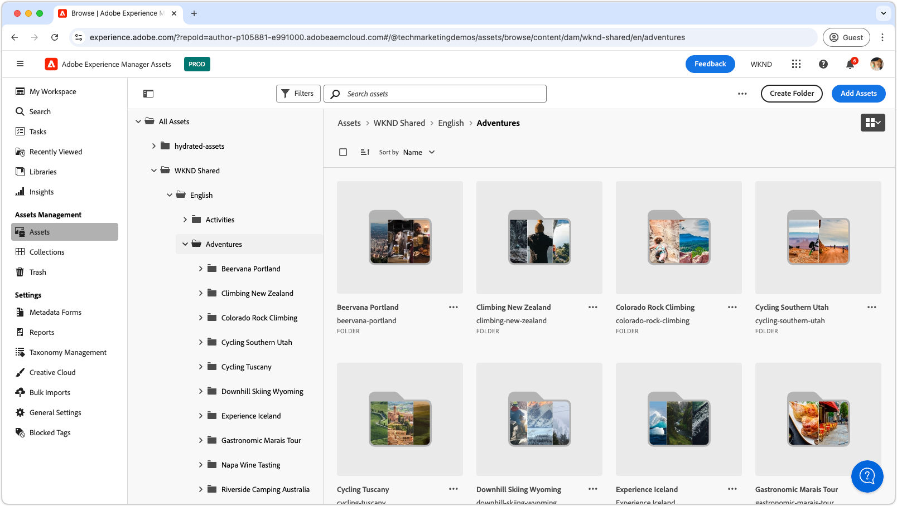

# Video playlists for Assets view

{align="center"}

Explore these playlists to master the AEM Assets as a Cloud Service Assets view—covering configuration, optimization, usage, and seamless integration with creative workflows. Get the insights you need to succeed with AEM Assets as a Cloud Service.

## Configure Assets view

Get started with essential setup and configurations to make AEM Assets as a Cloud Service work seamlessly for your team and projects.

<!-- CARDS

* https://experienceleague.adobe.com/en/playlists/experience-manager-all-configure-administrative-access
* https://experienceleague.adobe.com/en/playlists/experience-manager-assets-get-started-assets-essentials

-->
<!-- START CARDS HTML - DO NOT MODIFY BY HAND -->

    

        

            

                <figure class="image x-is-16by9">
                    
                </figure>
            

            

                

                    

                        <a href="https://experienceleague.adobe.com/en/playlists/experience-manager-all-configure-administrative-access" target="_blank" rel="referrer" title="Configure Administrative Access to Experience Manager">Configure Administrative Access to Experience Manager</a>
                    

                    
Explore how users authenticate using Adobe IMS to AEM as a Cloud Service, and how Adobe IMS Users, User Groups, and Product Profiles are used to control access to AEM and its features and functionalities.

                

                <a href="https://experienceleague.adobe.com/en/playlists/experience-manager-all-configure-administrative-access" target="_blank" rel="referrer" class="spectrum-Button spectrum-Button--outline spectrum-Button--primary spectrum-Button--sizeM" style="align-self: flex-start; margin-top: 1rem;">
                    Watch
                </a>
            

        

    

    

        

            

                <figure class="image x-is-16by9">
                    
                </figure>
            

            

                

                    

                        <a href="https://experienceleague.adobe.com/en/playlists/experience-manager-assets-get-started-assets-essentials" target="_blank" rel="referrer" title="Get Started with AEM Assets Essentials">Get Started with AEM Assets Essentials</a>
                    

                    
Learn how AEM Assets Essentials can streamline asset management for your department.

                

                <a href="https://experienceleague.adobe.com/en/playlists/experience-manager-assets-get-started-assets-essentials" target="_blank" rel="referrer" class="spectrum-Button spectrum-Button--outline spectrum-Button--primary spectrum-Button--sizeM" style="align-self: flex-start; margin-top: 1rem;">
                    Watch
                </a>
            

        

    

<!-- END CARDS HTML - DO NOT MODIFY BY HAND -->

## Get started with Assets view

Navigate the Assets view interface like a pro — learn the tools and techniques to manage assets efficiently.

<!-- CARDS

* https://experienceleague.adobe.com/en/playlists/experience-manager-assets-generate-image-assets-with-adobe-firefly
* https://experienceleague.adobe.com/en/playlists/experience-manager-assets-assets-view-search-use

-->
<!-- START CARDS HTML - DO NOT MODIFY BY HAND -->

    

        

            

                <figure class="image x-is-16by9">
                    
                </figure>
            

            

                

                    

                        <a href="https://experienceleague.adobe.com/en/playlists/experience-manager-assets-generate-image-assets-with-adobe-firefly" target="_blank" rel="referrer" title="Generate Image Assets Using Adobe Firefly">Generate Image Assets Using Adobe Firefly</a>
                    

                    
Learn how AEM Assets can increase content velocity using Adobe Firefly and Gen AI.

                

                <a href="https://experienceleague.adobe.com/en/playlists/experience-manager-assets-generate-image-assets-with-adobe-firefly" target="_blank" rel="referrer" class="spectrum-Button spectrum-Button--outline spectrum-Button--primary spectrum-Button--sizeM" style="align-self: flex-start; margin-top: 1rem;">
                    Watch
                </a>
            

        

    

    

        

            

                <figure class="image x-is-16by9">
                    
                </figure>
            

            

                

                    

                        <a href="https://experienceleague.adobe.com/en/playlists/experience-manager-assets-assets-view-search-use" target="_blank" rel="referrer" title="Search in the AEM Assets Assets View to Find Assets">Search in the AEM Assets Assets View to Find Assets</a>
                    

                    
Learn how AEM Assets Assets view search can help you find assets quickly and easily.

                

                <a href="https://experienceleague.adobe.com/en/playlists/experience-manager-assets-assets-view-search-use" target="_blank" rel="referrer" class="spectrum-Button spectrum-Button--outline spectrum-Button--primary spectrum-Button--sizeM" style="align-self: flex-start; margin-top: 1rem;">
                    Watch
                </a>
            

        

    

<!-- END CARDS HTML - DO NOT MODIFY BY HAND -->

## Connect creative workflows with AEM Assets

Unlock smooth collaboration by integrating AEM Assets as a Cloud Service with your creative tools, ensuring cohesive and efficient workflows.

<!-- CARDS

* https://experienceleague.adobe.com/en/playlists/experience-manager-assets-manage-creative-workflows-with-workfront-and-assets-essentials

-->
<!-- START CARDS HTML - DO NOT MODIFY BY HAND -->

    

        

            

                <figure class="image x-is-16by9">
                    
                </figure>
            

            

                

                    

                        <a href="https://experienceleague.adobe.com/en/playlists/experience-manager-assets-manage-creative-workflows-with-workfront-and-assets-essentials" target="_blank" rel="referrer" title="Manage Creative Workflows Using Workfront and Assets Essentials">Manage Creative Workflows Using Workfront and Assets Essentials</a>
                    

                    
Learn how Adobe Workfront and Experience Manager Assets Essentials help your organization manage the creative workflow.

                

                <a href="https://experienceleague.adobe.com/en/playlists/experience-manager-assets-manage-creative-workflows-with-workfront-and-assets-essentials" target="_blank" rel="referrer" class="spectrum-Button spectrum-Button--outline spectrum-Button--primary spectrum-Button--sizeM" style="align-self: flex-start; margin-top: 1rem;">
                    Watch
                </a>
            

        

    

<!-- END CARDS HTML - DO NOT MODIFY BY HAND -->

