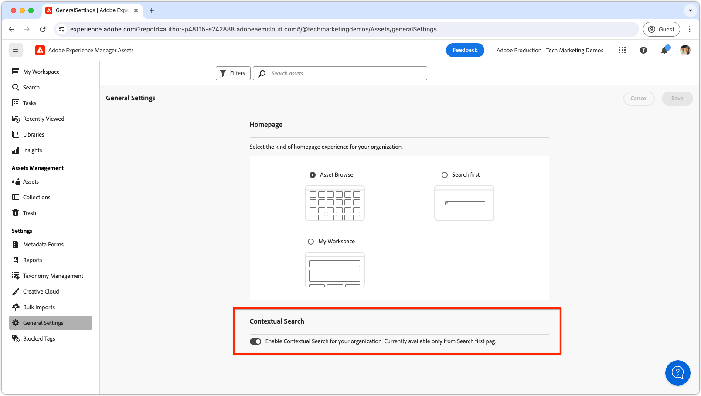

# Contextual search

Learn how to use Contextual Search in Adobe Experience Manager Assets to efficiently find assets with natural language queries.

>[!VIDEO](https://video.tv.adobe.com/v/3428667/?learn=on)

## Toggle contextual search

To enable or disable contextual search for all users, AEM administrators can do so by navigating to the __General Settings__ and toggling the __Contextual Search__ switch to the desired setting.

By default, contextual search is enabled for all users.

