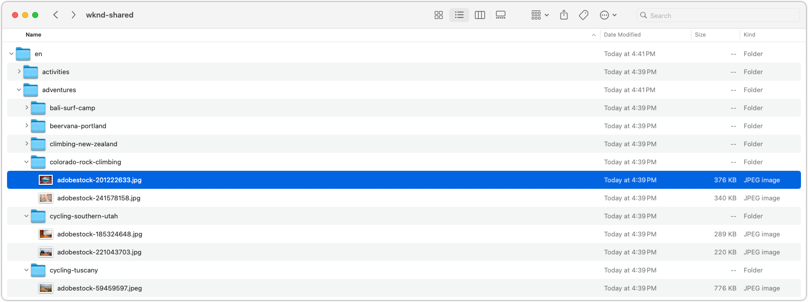

# Export assets

Learn how to export assets to your local machine using a customizable Node.js script. This export script provides an example of how to programmatically download assets from AEM using [AEM Assets HTTP APIs](https://experienceleague.adobe.com/en/docs/experience-manager-cloud-service/content/assets/admin/mac-api-assets), specifically focusing on the original renditions to ensure the highest quality. It's designed to replicate AEM Assets' folder structure on your local drive, making easy to back up or migrate assets.

The script only downloads asset's original renditions, without associated metadata, unless that metadata has been embedded into the asset as XMP. This means any descriptive information, categorizations, or tags stored in AEM but not integrated into the asset files are not included in the download. Other renditions can be downloaded as well by modifying the script to include them.

The script is typically run against AEM Author, however can be run against AEM Publish as well, as long as the AEM Assets HTTP API endpoints and asset renditions are accessible via Dispatcher.

Before running the script you must configure it with your AEM instance URL, user credentials (access token), and the path to the folder you want to export.

## Export script

The script, written as a JavaScript module, is part of a Node.js project, as it has a dependency on `node-fetch`. You can [download the project as a zip file](./assets/export/export-aem-assets-script.zip), or copy the script below into an empty Node.js project of type `module`, and run `npm install node-fetch` to install the dependency.

This script walks the AEM Assets folder tree, downloading assets and folders to a local folder on your machine. It uses the [AEM Assets HTTP API](https://experienceleague.adobe.com/en/docs/experience-manager-cloud-service/content/assets/admin/mac-api-assets) to fetch the folder and asset data, and downloads the original renditions of the assets.

```javascript
// export-assets.js

import fetch from 'node-fetch';
import { promises as fs } from 'fs';
import path from 'path';

// Do not process the contents of these well-known AEM system folders
const SKIP_FOLDERS = ['/content/dam/appdata', '/content/dam/projects', '/content/dam/_CSS', '/content/dam/_DMSAMPLE' ];

/**
 * Determine if the folder should be processed based on the entity and AEM path.
 * 
 * @param {Object} entity the AEM entity that should represent a folder returned from AEM Assets HTTP API
 * @param {String} aemPath the path in AEM of this source
 * @returns true if the entity should be processed, false otherwise
 */
function isValidFolder(entity, aemPath) {
    if (aemPath === '/content/dam') {
        // Always allow processing /content/dam 
        return true;
    } else if (!entity.class.includes('assets/folder')) {
        return false;
    } if (SKIP_FOLDERS.find((path) => path === aemPath)) {
        return false;
    } else if (entity.properties.hidden) {
        return false;
    }
    
    return true;
}

/**
 * Determine if the entity is downloadable.
 * @param {Object} entity the AEM entity that should represent an asset returned from AEM Assets HTTP API
 * @returns true if the entity is downloadable, false otherwise
 */
function isDownloadable(entity) {
    if (entity.class.includes('assets/folder')) {
        return false;
    } else if (entity.properties.contentFragment) {
        return false;
    }

    return true;
}

/**
 * Helper function to get the link from the entity based on the relationship name.
 * @param {Object} entity the entity from the AEM Assets HTTP API
 * @param {String} rel the relationship name
 * @returns 
 */
function getLink(entity, rel) {
    return entity.links.find(link => link.rel.includes(rel));
}

/**
 * Helper function to fetch JSON data from the AEM Assets HTTP API.
 * @param {String} url the AEM Assets HTTP API URL to fetch data from
 * @returns the JSON response of the AEM Assets HTTP API
 */
async function fetchJSON(url) {
    const response = await fetch(url, {
        method: 'GET',
        headers: {
            'Authorization': `Bearer ${AEM_ACCESS_TOKEN}`,
            'Content-Type': 'application/json'
        }
    });

    if (!response.ok) {
        throw new Error(`Error: ${response.status}`);
    }

    return response.json();
}

/**
 * Helper function to download a file from AEM Assets.
 * @param {String} url the URL of the asset rendition to download
 * @param {String} outputPath the local path to save the downloaded file
 */
async function downloadFile(url, outputPath) {
    const response = await fetch(url, {
        method: 'GET',
        headers: {
            'Authorization': `Bearer ${AEM_ACCESS_TOKEN}`,
        }
    });

    if (!response.ok) {
        throw new Error(`Failed to download file: ${response.statusText}`);
    }

    const arrayBuffer = await response.arrayBuffer();
    await fs.writeFile(outputPath, Buffer.from(arrayBuffer));

    console.log(`Downloaded asset: ${outputPath}`);
}

/**
 * Main entry
 * @param {Object} options the options for downloading assets
 * @param {String} options.folderUrl the URL of the AEM folder to download
 * @param {String} options.localPath the local path to save the downloaded assets
 * @param {String} options.aemPath the AEM path of the folder to download
 */
async function downloadAssets({apiUrl, localPath = LOCAL_DOWNLOAD_FOLDER, aemPath = '/content/dam'}) {    
    if (!apiUrl) {
        // Handle the initial call to the script, which should just provide the AEM path
        // Construct the proper AEM Assets HTTP API URL as it uses a truncated AEM path
        const prefix = "/content/dam/";
        let apiPath = aemPath.startsWith(prefix) ? aemPath.substring(prefix.length) : aemPath;    

        if (!apiPath.startsWith('/')) {
            apiPath = '/' + apiPath;
        }

        apiUrl = `${AEM_HOST}/api/assets.json${apiPath}`
    }
    
    const data = await fetchJSON(apiUrl);
    const entities = data.entities || [];

    // Process folders first
    for (const folder of entities.filter(entity => entity.class.includes('assets/folder'))) {
        const newLocalPath = path.join(localPath, folder.properties.name);
        const newAemPath = path.join(aemPath, folder.properties.name);

        if (!isValidFolder(folder, newAemPath)) {
            continue;
        }

        await fs.mkdir(newLocalPath, { recursive: true });
    
        await downloadAssets({
            apiUrl: getLink(folder, 'self')?.href, 
            localPath: newLocalPath, 
            aemPath: newAemPath
        });
    }

    let downloads = [];

    // Process assets
    for (const asset of entities.filter(entity => entity.class.includes('assets/asset'))) {
        const assetLocalPath = path.join(localPath, asset.properties.name);
        if (isDownloadable(asset)) {
            downloads.push(downloadFile(getLink(asset, 'content')?.href, assetLocalPath));
        }

        // Process in batches of MAX_CONCURRENT_DOWNLOADS
        if (downloads.length >= MAX_CONCURRENT_DOWNLOADS) {
            await Promise.all(downloads);
            downloads = [];
        }
    }

    // Wait for the remaining downloads to finish
    await Promise.all(downloads);
    downloads = [];

    // Handle pagination
    const nextUrl = getLink(data, 'next');
    if (nextUrl) {
        await downloadAssets({
            apiUrl: nextUrl?.href,
            localPath,
            aemPath
        });
    }
}

/***** SCRIPT CONFIGURATION *****/

// AEM host is the URL of the AEM environment to download the assets from
const AEM_HOST = 'https://author-p123-e456.adobeaemcloud.com';

// AEM access token used to access the AEM host. 
// This access token must have read access to the folders and assets to download.
const AEM_ACCESS_TOKEN = "eyJhbGciOiJS...zCprYZD0rSjg6g";

// The root folder in AEM to download assets from.
const AEM_ASSETS_FOLDER = '/content/dam/wknd-shared';

// The local folder to save the downloaded assets.
const LOCAL_DOWNLOAD_FOLDER = './exported-assets';

// The number of maximum concurrent downloads to avoid overwhelming the client or server. 10 is typically a good value.
const MAX_CONCURRENT_DOWNLOADS = 10;

/***** SCRIPT ENTRY POINT *****/

console.time('Download AEM assets');

await downloadAssets({
    aemPath: AEM_ASSETS_FOLDER, 
    localPath: LOCAL_DOWNLOAD_FOLDER
}).catch(console.error);

console.timeEnd('Download AEM assets');
```

## Configure the export

With the script downloaded, update the configuration variables at the bottom of the script.

The `AEM_ACCESS_TOKEN` can be obtained using the steps in the [Token-based authentication to AEM as a Cloud Service](https://experienceleague.adobe.com/en/docs/experience-manager-learn/getting-started-with-aem-headless/authentication/overview) tutorial. Often the 24 hours developer token is sufficient, as long as the export takes less than 24 hours to complete, and the user generating the token has read access to the assets to export.

```javascript
...
/***** SCRIPT CONFIGURATION *****/

// AEM host is the URL of the AEM environment to download the assets from
const AEM_HOST = 'https://author-p123-e456.adobeaemcloud.com';

// AEM access token used to access the AEM host. 
// This access token must have read access to the folders and assets to download.
const AEM_ACCESS_TOKEN = "eyJhbGciOiJS...zCprYZD0rSjg6g";

// The root folder in AEM to download assets from.
const AEM_ASSETS_FOLDER = '/content/dam/wknd-shared';

// The local folder to save the downloaded assets.
const LOCAL_DOWNLOAD_FOLDER = './export-assets';

// The number of maximum concurrent downloads to avoid overwhelming the client or server. 10 is typically a good value.
const MAX_CONCURRENT_DOWNLOADS = 10;
```

## Export the assets

Run the script using Node.js to export the assets to your local machine.

Depending on the number of assets and their sizes, the script may take some time to complete. As the script executes, it [logs the progress](#output) to the console.

```shell
$ node export-assets.js
```

## Export output

The export script logs the progress to the console, indicating the assets that are being downloaded. When the script completes, the assets are saved to the local folder specified in the configuration, and the log concludes with the total time taken to download the assets.

```plaintext
...
Downloaded asset: exported-assets/wknd-shared/en/magazine/skitouring/skitouring3sjoeberg.jpg
Downloaded asset: exported-assets/wknd-shared/en/magazine/skitouring/skitouring5sjoeberg.jpg
Downloaded asset: exported-assets/wknd-shared/en/magazine/skitouring/skitouring6sjoeberg.jpg
Downloaded asset: exported-assets/wknd-shared/en/magazine/western-australia/wa_camping_adobe.pdf
Downloaded asset: exported-assets/wknd-shared/en/magazine/western-australia/adobestock-156407519.jpeg
Downloaded asset: exported-assets/wknd-shared/en/magazine/western-australia/adobe-waadobe-wa-mg-3094.jpg
Downloaded asset: exported-assets/wknd-shared/en/magazine/western-australia/adobe-waadobe-wa-mg-3851.jpg
Downloaded asset: exported-assets/wknd-shared/en/magazine/western-australia/adobe-waadobe-wa-b6a7083.jpg
Downloaded asset: exported-assets/wknd-shared/en/magazine/western-australia/adobe-waadobe-wa-b6a6978.jpg
Download AEM assets: 24.770s
```

The exported assets can be found in the local folder specified in the configuration `LOCAL_DOWNLOAD_FOLDER`. The folder structure mirrors the AEM Assets folder structure, with the assets downloaded to the appropriate subfolders. These files can be uploaded to [supported cloud storage providers](https://experienceleague.adobe.com/en/docs/experience-manager-cloud-service/content/assets/assets-view/bulk-import-assets-view), for [bulk import](https://experienceleague.adobe.com/en/docs/experience-manager-learn/cloud-service/migration/bulk-import) into other AEM instances, or for backup purposes.


