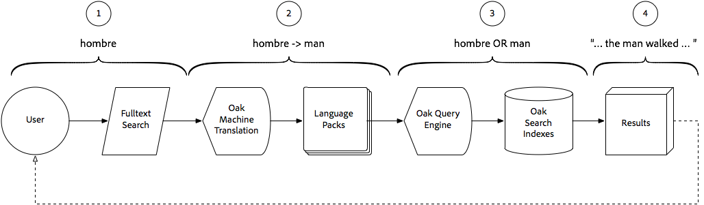

# Using Smart Translation Search with AEM Assets{#using-smart-translation-search-with-aem-assets}

Smart Translation Search enables cross-language search and discovery automatically across AEM content, both Assets and Pages, supporting more than 50 languages and reducing the need for manual content translation.

>[!VIDEO](https://video.tv.adobe.com/v/21297?quality=12&learn=on)

AEM Smart Translation Search allows users to perform searches for content in AEM using non-English terms, to match the assets in AEM that have equivalent English terms on them.

Smart Translation Search is a perfect compliment to AEM Smart Tags which are applied to assets in English.

This video assumes [AEM Smart Translation Search](smart-translation-search-technical-video-setup.md) has been set up.

## How Smart Translation Search works {#how-smart-translation-search-works}

1. AEM user performs a full-text search, providing a localized search term (Eg. the Spanish term for 'man', 'hombre').
2. The Smart Translation Search, provided by the Apache Oak Machine Translation OSGi bundle, is engaged and evaluates if the provided search terms can be translated using the registered Language Packs.
3. All translated terms from Step #2 are collected, and the query is augmented internally to include them as search terms. This augmented set of search terms if evaluated normally against AEM's search indexes locating relevant matches.
4. The search results that match the original term ('hombre') or the translated term ('man') are collected and returned the user as the search results.

## Additional Resources{#additional-resources}

* [Set up Smart Translation Search with AEM Assets](smart-translation-search-technical-video-setup.md)
* [Apache Joshua Language Packs](https://cwiki.apache.org/confluence/display/JOSHUA/Language+Packs)
