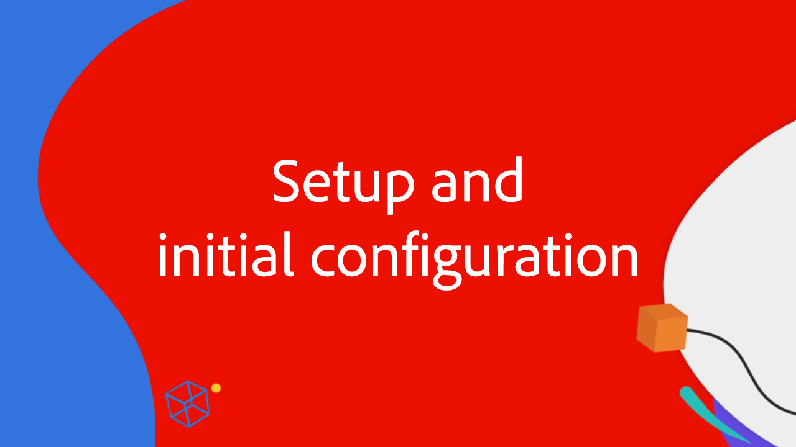
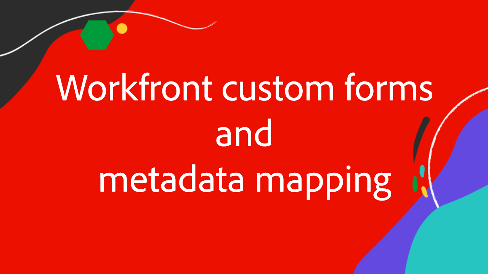
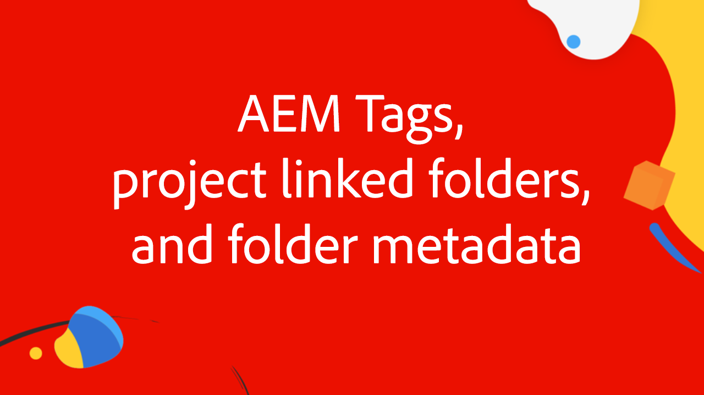
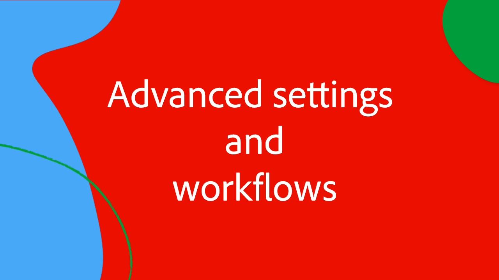

# Workfront for Experience Manager enhanced connector Expert Series

Join Adobe's Workfront and Experience Manager Assets experts in this four part videos series, as they demonstrate and discuss the ins and outs of the Workfront for Experience Manager enhanced connector.

This four part expert series follows a group of Adobe experts - from product managers, to consultants, and Adobe partners - discussing:

1. [Performing the initial setup configurations in Workfront and AEM](./setup.md)
2. [Configuring metadata sync between Workfront custom forms and AEM](./custom-forms.md)
3. [Using AEM Tags, project linked folders, Adobe Asset Link and folder metadata schemas to maximize value](./aem-tags-project-linked-folders-and-folder-metadata.md)
4. [Using advanced AEM workflow to streamline business processes across AEM and Workfront, and other advanced settings](./advanced-settings-and-workflows.md)

<table>
  <td>
      
      

         <a href="./setup.md"><strong>Set up and initial configuration</strong></a>
          <em>Part 1/4</em>
      

      

         
         Learn how to set up and perform the initial configuration of the Workfront for Experience Manager enhanced connector.
      

   </td>
   <!-- Workfront custom forms and metadata mapping -->
   <td>
      
      

         <a href="./custom-forms.md"><strong>Workfront custom forms and metadata mapping</strong></a>
          <em>Part 2/4</em>
      

      

         
         Learn about Workfront custom forms and how they are mapped to Experience Manager Assets metadata schemas to sync data.
      

    </td>
    <!-- AEM Tags, project linked folders, and folder metadata -->
    <td>
      
      

         <a href="./aem-tags-project-linked-folders-and-folder-metadata.md"><strong>AEM Tags, project linked folders, and folder metadata</strong></a>
          <em>Part 3/4</em> 
      

      

         
            Learn how to drive AEM taxonomy from Workfront, use project linked folders, and data to AEM asset folder metadata.
      

   </td>   
   <!-- Advanced workflows -->
    <td>
      
      

         <a href="./advanced-settings-and-workflows.md"><strong>Advanced settings and workflows</strong></a>
          <em>Part 4/4</em>
      

      

         
            Learn how about advanced settings for the Workfront for AEM enhanced connector, manage data sync using advanced workflows.
      

   </td>
  </tr>  
</tbody></table>
