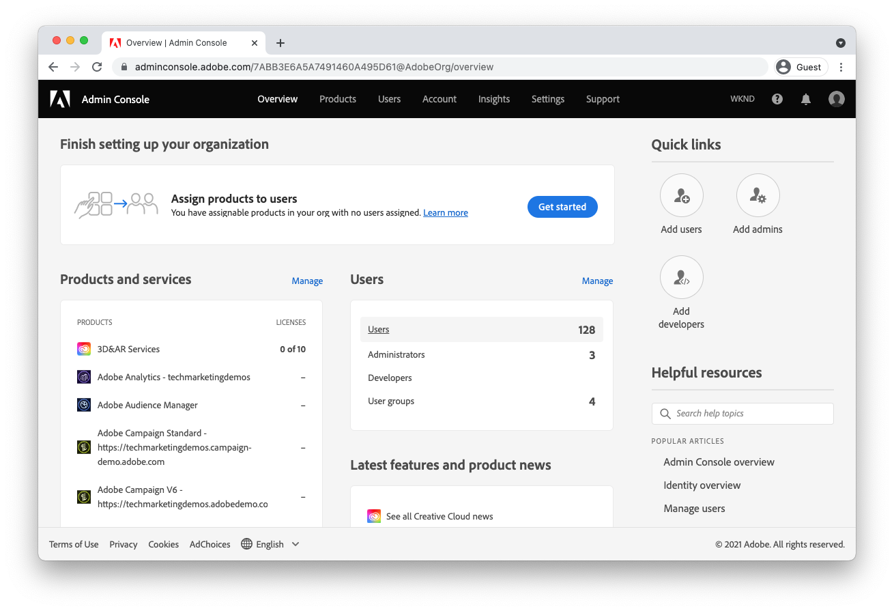

# Configuring access to AEM as a Cloud Service

>[!CONTEXTUALHELP]
>id="aemcloud_adobeims_overview"
>title="Introduction to Adobe IMS"
>abstract="AEM as a Cloud Service leverages Adobe IMS (Identity Management System) to facilitate the log in of its users, both administrators and regular users, to AEM Author service. Learn how Adobe IMS users, groups and product profiles are used in concert with AEM groups and permissions to provide fine-grained access to AEM Author service."

AEM as a Cloud Service is the cloud-native way of leveraging the AEM applications, and as such, leverages Adobe IMS (Identity Management System) to facilitate the log in of its users, both administrators and regular users, to AEM Author service. 

Learn how Adobe IMS users, groups and product profiles are used in concert with AEM groups and permissions to provide fine-grained access to AEM Author service.  

## Adobe IMS users

Users requiring access to AEM Author service are managed as [Adobe IMS users](https://helpx.adobe.com/enterprise/using/set-up-identity.html) in [Adobe's AdminConsole](https://adminconsole.adobe.com). Learn about what Adobe IMS users are, and how they are accessed and managed in Admin Console.

[Learn about Adobe IMS users](./adobe-ims-users.md)

## Adobe IMS user groups

Users accessing AEM Author service should be organized into logical groups using [Adobe IMS user groups](https://helpx.adobe.com/enterprise/using/user-groups.html) in [Adobe's AdminConsole](https://adminconsole.adobe.com). Adobe IMS user groups do not provide direct permissions or access to AEM (this is the job of [Adobe IMS product profiles](#adobe-ims-product-profiles)), however, they are a great way to define logical groupings of users that can in turn be translated to specific levels of access in AEM Author service, using AEM groups and permissions.

[Learn about Adobe IMS user groups](./adobe-ims-user-groups.md)

## Adobe IMS product profiles

[Adobe IMS product profiles](https://helpx.adobe.com/enterprise/using/manage-permissions-and-roles.html), managed in [Adobe's AdminConsole](https://adminconsole.adobe.com), are the mechanic that provides [Adobe IMS users](#adobe-ims-users) access to log in to AEM Author service with a base level of access.

+ The __AEM Users__ product profile affords users read-only access to AEM via membership in AEM's Contributors group.
+ The __AEM Administrators__ product profile affords users full, administrative access to AEM.

[Learn about Adobe IMS product profiles](./adobe-ims-product-profiles.md)

## AEM users groups and permissions

Adobe Experience Manager builds on Adobe IMS users, user groups, and product profiles in order to provide users customizable access to AEM. Learn how to construct AEM groups and permissions and how they work in concert with Adobe IMS abstractions to provide seamless and customizable access to AEM.

[Learn about AEM user, groups, and permissions](./aem-users-groups-and-permissions.md)

## Access and permissions walk-through

An abridged walkthough configuring Adobe IMS users, user groups and product profiles in Adobe AdminConsole, and how to leverage these Adobe IMS abstractions in AEM Author to define and manage specific group based permissions.

[AEM access and permissions walk-through](./walk-through.md)

## Additional Adobe Admin Console resources

The following documentation cover [Adobe Admin Console](https://adminconsole.adobe.com)-specific details and concerns that may help in a better understanding of the Adobe Admin Console and using it to manage users and access across Experience Cloud products.

+ [Adobe Admin Console Identity overview](https://helpx.adobe.com/enterprise/using/identity.html)
+ [Adobe Admin Console Admin roles](https://helpx.adobe.com/enterprise/using/admin-roles.html)
+ [Adobe Admin Console Developer roles](https://helpx.adobe.com/enterprise/using/manage-developers.html)