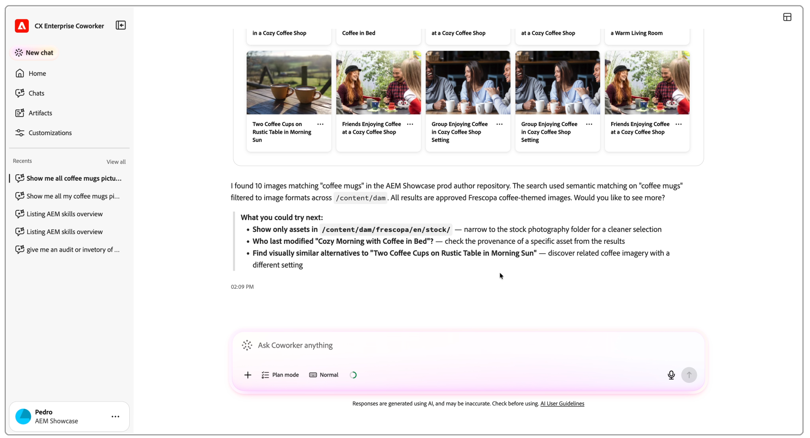

# CX Enterprise Coworker and AEM

Coworker is Adobe's conversational AI, deeply integrated with CX Enterprise applications like AEM. It's trained on Adobe best practices for getting work done fast and right, so instead of clicking through multiple screens and tools, you describe what you want in plain language, for example, "generate three hero images for the fall campaign" or "check this page against our brand guidelines", and Coworker plans the work, runs it across your connected Adobe applications, and shows you the results for review.

For AEM, this means less time spent clicking through the UI and more time spent reviewing and approving what Coworker produces. You stay in control at every step, while Coworker handles the planning, execution, and follow-through.

See [Coworker Chat overview](https://experienceleague.adobe.com/en/docs/cx-enterprise-ai/experience-cloud-ai/coworker/chat/overview) for a full introduction to Coworker Chat, its capabilities, and supported applications.

## AEM and Coworker in action

<!--
CARDS

* https://experienceleague.adobe.com/en/docs/cx-enterprise-ai/experience-cloud-ai/coworker/chat/use-cases/content-advisor/generate-assets
  {title = Generate marketing assets}
  {description = Ask Coworker to generate channel-ready assets for your AEM content directly from a chat prompt.}
  {cta = Watch}

* https://experienceleague.adobe.com/en/docs/cx-enterprise-ai/experience-cloud-ai/coworker/chat/use-cases/content-advisor/brand-compliance
  {title = Check brand compliance}
  {description = Ask Coworker to review AEM content against your brand guidelines before it goes live.}
  {cta = Watch}
-->
<!-- START CARDS HTML - DO NOT MODIFY BY HAND -->

    

        

            

                <figure class="image x-is-16by9">
                    
                </figure>
            

            

                

                    

                        <a href="https://experienceleague.adobe.com/en/docs/cx-enterprise-ai/experience-cloud-ai/coworker/chat/use-cases/content-advisor/generate-assets" target="_blank" rel="referrer" title="Generate marketing assets">Generate marketing assets</a>
                    

                    
Ask Coworker to generate channel-ready assets for your AEM content directly from a chat prompt.

                

                <a href="https://experienceleague.adobe.com/en/docs/cx-enterprise-ai/experience-cloud-ai/coworker/chat/use-cases/content-advisor/generate-assets" target="_blank" rel="referrer" class="spectrum-Button spectrum-Button--outline spectrum-Button--primary spectrum-Button--sizeM" style="align-self: flex-start; margin-top: 1rem;">
                    Watch
                </a>
            

        

    

    

        

            

                <figure class="image x-is-16by9">
                    
                </figure>
            

            

                

                    

                        <a href="https://experienceleague.adobe.com/en/docs/cx-enterprise-ai/experience-cloud-ai/coworker/chat/use-cases/content-advisor/brand-compliance" target="_blank" rel="referrer" title="Check brand compliance">Check brand compliance</a>
                    

                    
Ask Coworker to review AEM content against your brand guidelines before it goes live.

                

                <a href="https://experienceleague.adobe.com/en/docs/cx-enterprise-ai/experience-cloud-ai/coworker/chat/use-cases/content-advisor/brand-compliance" target="_blank" rel="referrer" class="spectrum-Button spectrum-Button--outline spectrum-Button--primary spectrum-Button--sizeM" style="align-self: flex-start; margin-top: 1rem;">
                    Watch
                </a>
            

        

    

<!-- END CARDS HTML - DO NOT MODIFY BY HAND -->
