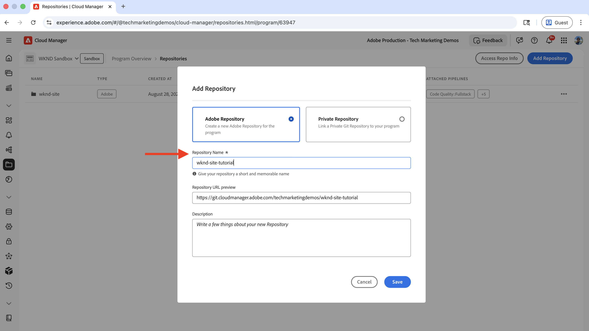
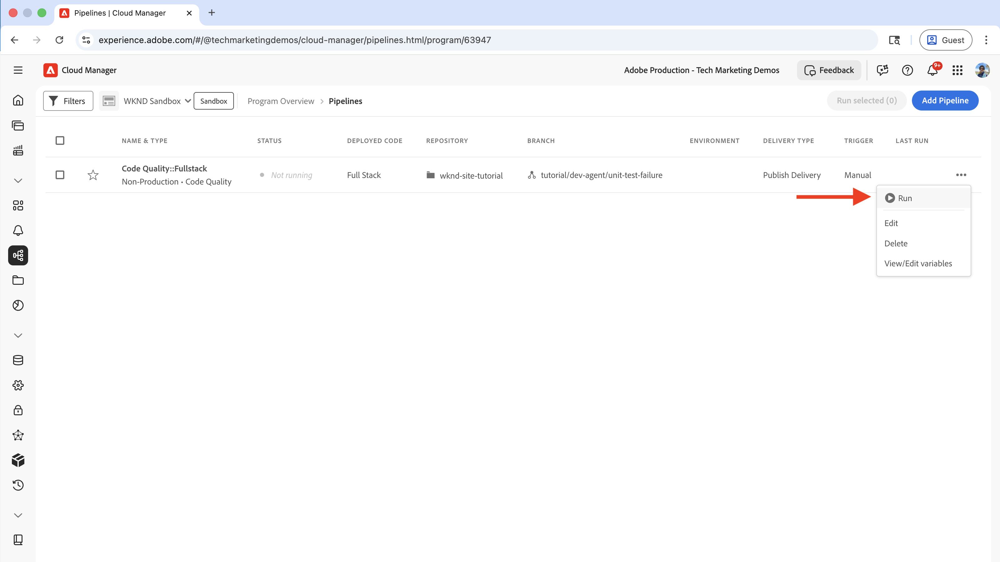
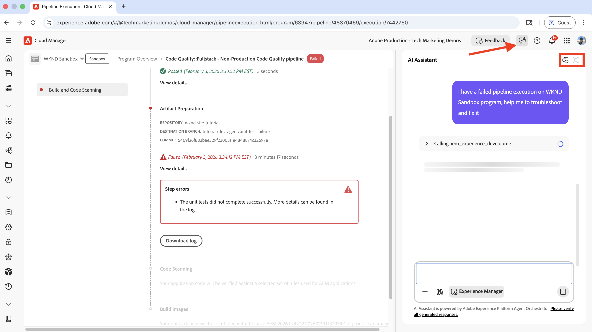
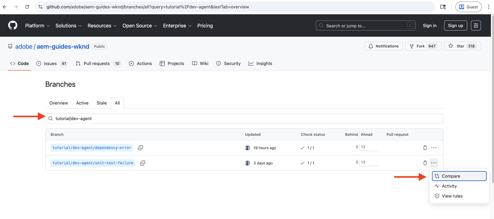

# Troubleshoot CI/CD Pipeline using AEM Development Agent

Learn how to troubleshoot and fix a failed CI/CD pipeline using the AEM Development Agent. 

The AEM Development Agent helps technical teams, including developers, DevOps engineers, and administrators to **accelerate their workflows** by providing _AI-powered guidance and actions_.

>[!TIP]
>
> Also see [Overview of Agents in AEM](https://experienceleague.adobe.com/en/docs/experience-manager-cloud-service/content/ai-in-aem/agents/overview) for a complete list of available Agents in AEM as a Cloud Service, their functionality, and how you can get access to them.


## Overview

The AEM Development Agent offers several capabilities, including the ability to list, troubleshoot, and fix failed CI/CD pipelines. You can invoke the AEM Development Agent through the AI Assistant to address your specific use cases.

This tutorial uses the [WKND Sites Project](https://github.com/adobe/aem-guides-wknd) to demonstrate how to troubleshoot and fix a failed CI/CD pipeline using the AEM Development Agent. The same principles apply to any AEM project.

For simplicity, this tutorial introduces a unit test failure in the `BylineImpl.java` file to showcase the AEM Development Agent's pipeline troubleshooting capabilities.

## Prerequisites

To follow this tutorial, you need:

- AI Assistant and Agents in AEM enabled. See [Set up AI in AEM](./setup.md) for details, and note that playgrounds mentioned in that article won't have AEM Development Agent capabilities.
- Access to Adobe [Cloud Manager](https://my.cloudmanager.adobe.com/) with a Developer or Program Manager role. See [role definitions](https://experienceleague.adobe.com/en/docs/experience-manager-cloud-manager/content/requirements/users-and-roles#role-definitions) for more information.
- An AEM as a Cloud Service environment
- Access to Agents in AEM via the [Beta program](https://experienceleague.adobe.com/en/docs/experience-manager-cloud-service/content/release-notes/release-notes/release-notes-current#aem-beta-programs)
- The [WKND Sites Project](https://github.com/adobe/aem-guides-wknd) cloned to your local machine

### Current Capabilities of AEM Development Agent

Before diving into the tutorial, let's review the current capabilities of the AEM Development Agent:

- List CI/CD pipelines and their status
- Troubleshoot and fix failed **full-stack** pipelines, including both _Code Quality_ and _Deployment_ types.
- The _Build_ (complilation of the code to produce a deployable artifact) and _Code Quality_ (static code analysis via SonarQube rules) steps of the **full-stack** pipelines are supported.

The capabilities of the AEM Development Agent are continuously expanded and updated regularly. For feedback and suggestions, email [aem-devagent@adobe.com](mailto:aem-devagent@adobe.com).

## Setup

Follow these high-level steps to complete this tutorial:

1. Clone the [WKND Sites Project](https://github.com/adobe/aem-guides-wknd) and push it to your Cloud Manager Git repository
2. Create and configure a Code Quality pipeline 
3. Run the pipeline and observe the failed execution
4. Use the AEM Development Agent to troubleshoot and fix the failed pipeline

Let's go through each step in detail.

### Use WKND Sites Project as a Demo Project

This tutorial uses the WKND Sites Project's `tutorial/dev-agent/unit-test-failure` branch to demonstrate how to use the AEM Development Agent. The same principles can be applied to any AEM project.

- A unit test failure has been introduced in the `BylineImpl.java` file as follows. If you're using your own AEM project, you can introduce a similar unit test failure.

    ```java
    ...
    @Override
    public String getName() {
        if (name != null) {
            return "Author: " + name; // This line is intentionally incorrect to introduce a unit test failure.
        }
        return name;
    }
    ...
    ```

- Clone the [WKND Sites Project](https://github.com/adobe/aem-guides-wknd) to your local machine, navigate to the project directory, and switch to the `tutorial/dev-agent/unit-test-failure` branch. 

    ```shell
    git clone https://github.com/adobe/aem-guides-wknd.git
    cd aem-guides-wknd
    git checkout tutorial/dev-agent/unit-test-failure
    ```

- Create a new Cloud Manager Git repository for the WKND Sites Project and add it as a remote to your local Git repository:

    - Navigate to Adobe [Cloud Manager](https://my.cloudmanager.adobe.com/) and select your program.
    - Click **Repositories** in the left sidebar.
    - Click **Add Repository** in the top right corner.
    - Enter a **Repository Name** (for example, "wknd-site-tutorial") and click **Save**. Wait for the repository to be created.

        
    
    - Click **Access Repo Info** in the top right corner and copy the repository URL.
    
        
    
    - Add the newly created Cloud Manager Git repository as a remote to your local Git repository:
    
        ```shell
        git remote add adobe https://git.cloudmanager.adobe.com/<your-adobe-organization>/wknd-site-tutorial/
        ```

- Push your local Git repository to the Cloud Manager Git repository:

    ```shell
    git push adobe
    ```

    When prompted for credentials, provide the **Username** and **Password** from Cloud Manager's **Repository Info** modal.

### Create and Configure a Code Quality Pipeline

This tutorial uses a Code Quality pipeline (non-production) to trigger the pipeline failure for troubleshooting. See [Introduction to CI/CD Pipelines](https://experienceleague.adobe.com/en/docs/experience-manager-cloud-service/content/implementing/using-cloud-manager/cicd-pipelines/introduction-ci-cd-pipelines#introduction) for more information about Code Quality pipelines.

- In Cloud Manager, navigate to the **Pipelines** section and select **Add** > **Add Non-Production Pipeline**.
- In the **Add Non-Production Pipeline** dialog, configure the following:
    
    - **Configuration** step:
        - Keep the default values like **Pipeline Type** as `Code Quality Pipeline` and **Deployment Trigger** as `Manual`.
        - For **Non-Production Pipeline Name**, enter `Code Quality::Fullstack`

        

    - **Source Code** step:
        - Select **Full Stack Code**
        - For **Repository**, select the newly created Cloud Manager Git repository
        - For **Git Branch**, select `tutorial/dev-agent/unit-test-failure`
        - Click **Save**

        

- Run the newly created Code Quality pipeline by clicking **Run** in the three-dot menu of the pipeline entry.

    

    
>[!IMPORTANT]
>
> The Deployment Pipeline is not covered in this tutorial. However, you can follow the same principles to troubleshoot and fix a failed Deployment Pipeline.


### Observe the Failed Pipeline Execution

The Code Quality pipeline fails in the **Artifact Preparation** step with an error:


Without the AEM Development Agent, this pipeline failure requires manual troubleshooting. A developer would need to check the logs and review the code—a tedious and time-consuming process.

Next, you see how Agentic AI can troubleshoot and fix the failed pipeline execution.

## Use AEM Development Agent to Troubleshoot and Fix the Failed Pipeline

You can invoke the AEM Development Agent using the AI Assistant in AEM by describing the pipeline failure in natural language.

- Click the **AI Assistant** icon in the top right corner.

- Enter the pipeline failure details in natural language aka **Prompt**. For example: 

    ```text
    I have a failed pipeline execution on %PROGRAM-NAME% program, help me to troubleshoot and fix it.
    ```

    

    The **AEM Development Agent** is invoked to troubleshoot and fix the failed pipeline execution.

    >[!NOTE]
    >
    > If entered prompt is not clear, the AI Assistant asks for clarification and provides information to help you refine the prompt.

- Once the reasoning is complete, click the **Open in full screen** icon to view the detailed troubleshooting process.

    

    The results contain valuable insights including error details, the source file, line number, and a **How to Fix** section with clear steps to resolve the issue.

- In this case, the agent correctly suggested either changing the implementation (`getName()` method) or updating the unit test (`getNameTest()` method) to fix the issue. It avoided hallucination and used a human-in-the-loop approach while providing actionable code changes for the developer.

    

- Update the `BylineImpl.java` file with the suggested code changes, then commit and push the changes to the Cloud Manager Git repository. 

    ```java
    ...
    @Override
    public String getName() {
        return name;
    }
    ...
    ```

- Run the pipeline again and observe the successful execution.

## Additional Examples

The WKND Sites Project includes additional examples of broken code and configuration issues, such as missing dependencies and incorrect configuration. You can explore these examples by checking out the [branches that start with `tutorial/dev-agent/`](https://github.com/adobe/aem-guides-wknd/branches/all?query=tutorial%2Fdev-agent&lastTab=overview). To see the breaking changes, you can compare the `tutorial/dev-agent/unit-test-failure` branch with the `main` branch by clicking the **Compare** button. Then look for the _changed file_ section.



Also see the [Sample prompts](https://experienceleague.adobe.com/en/docs/experience-manager-cloud-service/content/ai-in-aem/agents/development/overview#sample-prompts) to get more ideas on how to use the AEM Development Agent.

## Summary

In this tutorial, you learned how to use the AEM Development Agent to troubleshoot and fix a failed CI/CD pipeline using the AI Assistant. You also learned how Agentic AI accelerates the technical workflows by providing actionable insights and code changes.

Start using the AEM Development Agent and other Agents in AEM to accelerate your workflows, see [Overview of Agents in AEM](https://experienceleague.adobe.com/en/docs/experience-manager-cloud-service/content/ai-in-aem/agents/overview) for more information.

## Additional Resources

- [AI in Experience Manager](./overview.md)
- [Overview of Agents in AEM](https://experienceleague.adobe.com/en/docs/experience-manager-cloud-service/content/ai-in-aem/agents/overview)
- [Development Agent overview](https://experienceleague.adobe.com/en/docs/experience-manager-cloud-service/content/ai-in-aem/agents/development/overview)
- [Overview of Agents in AEM](https://experienceleague.adobe.com/en/docs/experience-manager-cloud-service/content/ai-in-aem/agents/overview)
