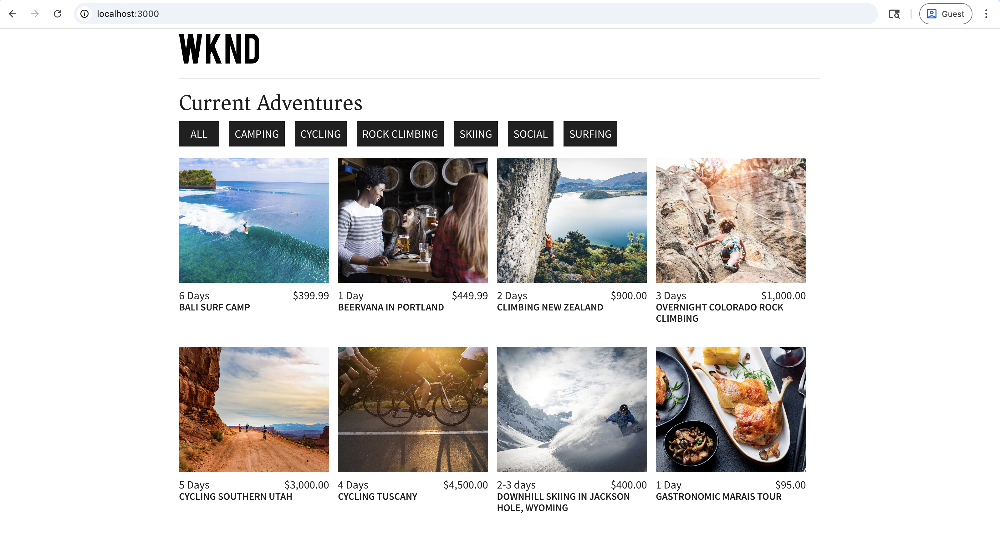

# Accelerate AEM Content Operations Using the Content MCP Server

Use the **Content MCP Server** from an AI-powered IDE such as [Cursor IDE](https://www.cursor.com/) to work with AEM content in natural language, no low-level API code or UI navigation. 

In this tutorial you _review_ Adventure content fragment details, _update_ a fragment (for example, an adventure's price), and _verify_ the change in the [WKND Adventures React app](https://github.com/adobe/aem-guides-wknd-graphql/tree/main/react-app) all from your IDE against a _lower AEM environment_ (RDE or Development) without leaving the MCP flow.

## Overview

AEM as a Cloud Service provides _MCP Servers_ so your IDE or chat app can work with AEM securely. The **Content MCP Server** supports pages, fragments, and assets. See [MCP Servers in AEM](./overview.md) for more information.

## How Developers Can Use It

Connect the [Cursor IDE](https://www.cursor.com/) to the Content MCP Server and run the scenario below.

### Setup - Content MCP Server in Cursor

Let's set up the Content MCP Server in Cursor with these steps.

1. Open Cursor on your machine.

1. Go to **Settings** > **Cursor Settings** from the Cursor menu to open the settings window.
    

1. In the left sidebar, click **Tools & MCP** to open that panel.
    

1. Click **Add Custom MCP** or **New MCP Server** to open `mcp.json`, then paste in this configuration:

    ```json
    {
        "mcpServers": {
            // Use this for create, read, update, and delete operations
            "AEM-RDE-Content": {
                "url": "https://mcp.adobeaemcloud.com/adobe/mcp/content"
            },
            //Use this for read-only operations
            "AEM-RDE-Content-Read-Only": {
                "url": "https://mcp.adobeaemcloud.com/adobe/mcp/content-readonly"
            }
        }
    }
    ```

    >[!CAUTION]
    >
    > For tutorial purpose, the above configuration adds both **Content** and **Content (read-only)** for this tutorial. In practice, **Content** already includes everything **Content (read-only)** offers, plus create/update/delete tools.
    >
    >
    > If you want to avoid any possibility of creating, modifying, or deleting content, configure only **Content (read-only)** (`/content-readonly`) and omit **Content** (`/content`). That way you avoid accidental changes.

    

1. From the Cursor Settings window, click **Connect** to initiate the authentication process. It uses the OAuth 2.0 PKCE flow to get the **User Specific Access Token** to access the AEM MCP Server. 
    

1. Sign in with your Adobe ID, then come back to the Cursor Settings window.
    

1. Confirm that **AEM-RDE-Content-Read-Only** and **AEM-RDE-Content** show as connected. You can expand each server to see its tools.

    

### Setup - WKND Adventures React App

Next, set up the [WKND Adventures React App](https://github.com/adobe/aem-guides-wknd-graphql/tree/main/react-app) in Cursor.

1. Clone these two repos on your machine:

    ```bash
    ## WKND GraphQL repo, the `react-app` folder is the WKND Adventures app
    $ git clone git@github.com:adobe/aem-guides-wknd-graphql.git

    ## WKND Site repo, you deploy this to RDE so the app can use its content fragments data via GraphQL
    $ git clone git@github.com:adobe/aem-guides-wknd.git
    ```

1. Deploy the [WKND Site](https://github.com/adobe/aem-guides-wknd) project to your RDE. For detailed steps, see [How to use the Rapid Development Environment](https://experienceleague.adobe.com/en/docs/experience-manager-learn/cloud-service/developing/rde/how-to-use#deploy-aem-artifacts-using-the-aem-rde-plugin).

1. Open the `react-app` folder in your IDE.

1. Edit `.env.development` and set:
    - `REACT_APP_HOST_URI`: your RDE Author URL
    - `REACT_APP_AUTH_METHOD`: to be `basic`
    - `REACT_APP_BASIC_AUTH_USER` and `REACT_APP_AEM_AUTH_PASSWORD`: to be `aem-headless` (create this user in RDE and add it to the `administrators` group)

1. From the IDE terminal, run:

    ```bash
    $ cd aem-guides-wknd-graphql/react-app
    $ npm install
    $ npm start
    ```

1. In your browser, go to [http://localhost:3000](http://localhost:3000) to view the WKND Adventures app.

    

### Productivity Scenario - AEM Content review and update 

Suppose you need to show a _HOT DEAL_ banner on Adventure cards when a simple rule is met. The usual approach would be:

- Look at the Adventure cards component code
- Add the logic for when to show the banner
- Check the Adventure content fragment model in AEM
- Change one or more Adventure fragment properties to test the rule

To keep things simple, let's show the _HOT DEAL_ banner when the adventure's price is under $100.

Because the React app gets its data from your RDE environment, you need to know the Adventure content fragment model and then update the right fragment properties. That is exactly what the AEM Content MCP Server can help with. Here is how.

1. In Cursor, open a new chat and type:

    ```text
    I want to review my Content Fragment Models from AEM RDE, can you list the Adventure Content Fragment details.
    ```
    
    

    
    Before invoking the Content MCP Server, it asks for confirmation to proceed. Thus, you stay in control of the content operations.

    The AI uses the Content MCP Server to fetch the data and then presents it in a clear, structured way. It includes content fragment model details, the number of fragments, and summary information.

1. To trigger the _HOT DEAL_ banner, update one adventure's price. In the same chat, try:

    ```text
    Can you update adventure Beervana in Portland's price to 99.99
    ```

    

    Similarly, the AI asks for confirmation to proceed before updating the content. It also summarizes the content operation before and after the update.

1. In the React app, confirm that the Beervana card now shows the _HOT DEAL_ banner.

    

### Additional Prompts

Try these content focused prompts in your IDE (with the Content MCP Server connected) to explore more workflows and features.

- Discover content:

    ```text
    List all content fragments in the WKND Adventures folder

    List all WKND Site pages from US English site

    Can you give me page metadata for Tahoe Skiing English page? 

    List assets of Bali Surf camp

    What Content Fragment models are available in this environment?
    ```

- Search for content:

    ```text
    Search for content fragments that mention 'cycling'

    Do we have a magazine page in US English site with "Camping" in it
    ```
  
- Update content:

    ```text
    In WKND US English create a copy of Downhill Skiing Wyoming as "Test Downhill Skiing Wyoming"

    In newly created "Test Downhill Skiing Wyoming" please change title to "Duplicated Page"
    ```
  
- Publish or unpublish:

    ```text
    Can you publish the page at /us/en/adventures/test-downhill-skiing-wyoming and give me publish page URL
    
    Can you unpublish the test-downhill-skiing-wyoming page
    ```

## Summary

You set up the AEM Content MCP Server in Cursor and connected it to your RDE (or Development) environment. You then used the WKND Adventures React app and chatted in natural language to review Adventure content fragment details. You also updated a fragment's price with the AI asking for your confirmation before each content operation. You verified the change in the running app. You can use the same human-centric flow from your IDE to review, update, and create AEM content without switching to the AEM UI or writing low-level API code.
