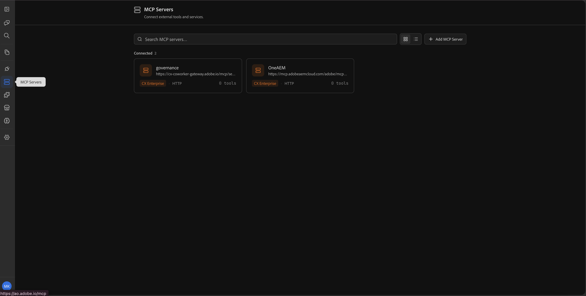
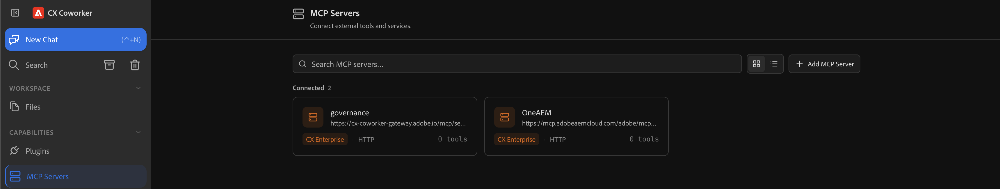
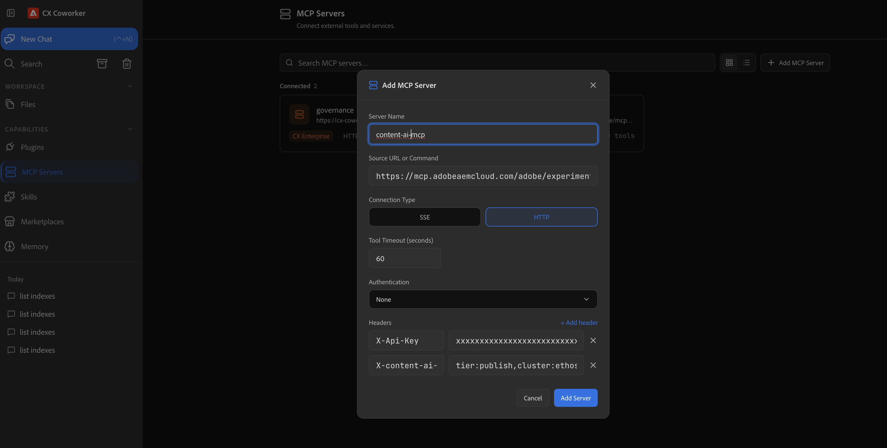
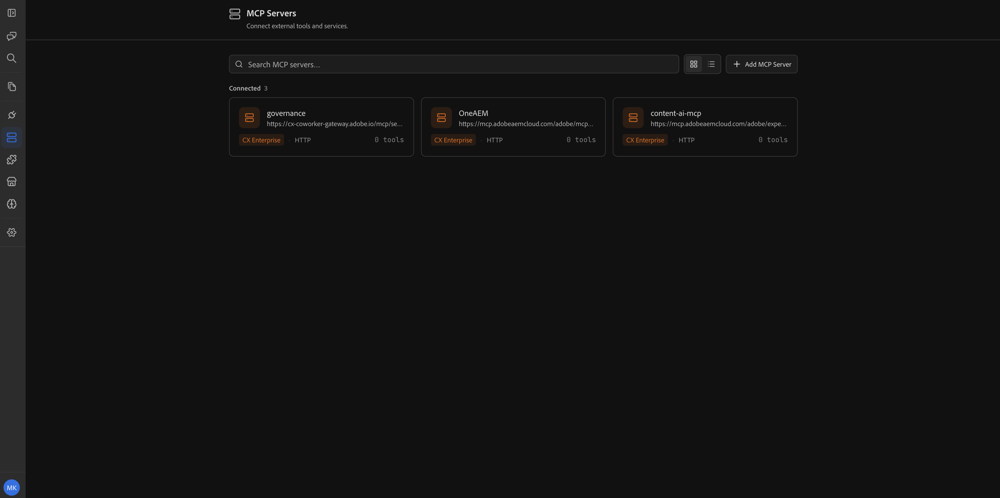
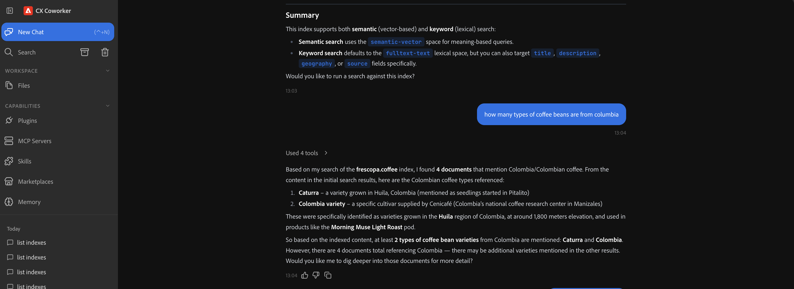

# Search AEM Content Using the Content AI MCP Server

Use the **Content AI MCP Server** from [Adobe CX Coworker](https://experienceleague.adobe.com/en/docs/experience-manager-cloud-service/content/ai-in-aem/using-mcp-with-aem-as-a-cloud-service) to search and analyze Content AI indexes in natural language, no low-level API code or UI navigation.

In this tutorial you _discover_ available indexes, run _keyword_, _semantic_, and _hybrid_ searches, and use _natural language search_ to express complex intent, all from Adobe CX Coworker against a Content AI index.

## Overview

AEM as a Cloud Service provides _MCP Servers_ so your IDE or chat app can work with AEM securely. The **Content AI MCP Server** exposes search and discovery tools over Content AI indexes. See [MCP Servers in AEM](./overview.md) for more information.

The Content AI MCP Server provides six tools:

| Tool | Purpose |
| ---- | ------- |
| `list_indexes` | Discover available indexes in your AEM environment. |
| `get_index_config` | Inspect the raw index configuration and metadata. |
| `fulltext_search` | Keyword-based search with fuzzy matching and field selection. |
| `semantic_search` | Vector-based similarity search for conceptual queries. |
| `hybrid_search` | Combined keyword + semantic search for the best general-purpose recall. |
| `natural_language_search` | Express intent in plain English; the server translates it into structured filters, ranges, and semantics. |

The Content AI MCP Server supports two access modes, selected by which header you configure:

- **Public (anonymous)** — Search public, read-only indexes using the `X-Api-Key` header. Use this for openly available, non-sensitive content. See [Searching Public Indexes](#searching-public-indexes).
- **Authenticated** — Search entitled or access-controlled indexes using the `x-content-ai-mcp-api-key` header together with your signed-in Adobe identity (passed through by CX Coworker). Results respect your permissions.

## How Developers Can Use It

Connect [Adobe CX Coworker](https://ao.adobe.io/#) to the Content AI MCP Server and run the scenario below.

### Setup - Content AI MCP Server in Adobe CX Coworker

Let's set up the Content AI MCP Server in Adobe CX Coworker with these steps.

1. Sign in to Adobe CX Coworker.
    <!-- SCREENSHOT: Adobe CX Coworker sign-in / home -->
    

1. From the side rail, click **MCP Servers**.
    <!-- SCREENSHOT: MCP Servers in the CX Coworker side rail -->
    

1. Click **Add MCP Server**.
    <!-- SCREENSHOT: Add MCP Server button -->
    

1. In the **Add MCP Server** dialog, enter the following details:

    | Field | Value |
    | ----- | ----- |
    | **Server name** | `content-ai-mcp` |
    | **MCP URL** | `https://mcp.adobeaemcloud.com/adobe/experimental/aemagents-expires-20260331/mcp/content-ai` |
    | **Connection type** | `HTTP` |
    | **Authentication type** | `Passthrough` |

    <!-- SCREENSHOT: Add MCP Server dialog with server name, URL, connection type, and authentication type -->
    

    >[!NOTE]
    >
    > **Authentication type** is set to `Passthrough` so CX Coworker forwards your signed-in Adobe identity to the MCP Server. You do not need a separate sign-in or OAuth step.

1. Click **Add headers** and add the headers for the access mode you need:

    **For public indexes (anonymous):**

    | Header | Value |
    | ------ | ----- |
    | `X-Api-Key` | Your public API key. Present this header when you only want to search public indexes. |
    | `x-content-ai-mcp-routing` | _(Optional)_ Environment/routing info, for example `tier=publish,bucket=p12345-e67890,cluster=ethos21-prod-va7,namespace=ns-team-example`. |

    **For non-public (entitled) indexes:**

    | Header | Value |
    | ------ | ----- |
    | `x-content-ai-mcp-api-key` | The API key from the [Adobe Developer Console](https://developer.adobe.com/console). |
    | `x-content-ai-mcp-routing` | _(Optional)_ Environment/routing info, for example `tier=publish,bucket=p12345-e67890,cluster=ethos21-prod-va7,namespace=ns-team-example`. |

    >[!IMPORTANT]
    >
    > When the `X-Api-Key` header is present, the server treats the request as **anonymous** and only searches public indexes. Any signed-in identity is ignored, so there is no accidental escalation to authenticated access. Use `x-content-ai-mcp-api-key` (not `X-Api-Key`) when you intend to search entitled indexes.

    >[!NOTE]
    >
    > If you do not set the `x-content-ai-mcp-routing` header, the server asks for your environment (`tier` and `bucket`) in chat the first time you run a tool, then retries automatically.

1. Click **Add**. The **content-ai-mcp** server now appears in your list of MCP Servers.
    <!-- SCREENSHOT: content-ai-mcp listed in MCP Servers -->
    

1. Click **New chat** to start using the Content AI MCP Server.
    <!-- SCREENSHOT: New chat with Content AI MCP Server -->
    

## Searching Public Indexes

Some Content AI indexes are marked **public** and can be searched anonymously, without an entitled identity. Public indexes are read-only and are intended for openly available, non-sensitive content. Anyone with the public API key can search them.

Use this mode when:

- You want to search openly available content (for example, public documentation or a demo catalog).
- You do not need per-user, permission-scoped results.
- You want a simple setup that only requires an API key.

To search public indexes, add the Content AI MCP Server in CX Coworker exactly as described in [Setup - Content AI MCP Server in Adobe CX Coworker](#setup---content-ai-mcp-server-in-adobe-Coworker), but in the **Add headers** step add only the `X-Api-Key` header (plus an optional `x-content-ai-mcp-routing` header for the environment):

| Header | Value |
| ------ | ----- |
| `X-Api-Key` | Your public API key. |
| `x-content-ai-mcp-routing` | _(Optional)_ Environment/routing info, for example `tier=publish,bucket=p12345-e67890`. |


>[!IMPORTANT]
>
> When the `X-Api-Key` header is present, the server treats the request as **anonymous** and only searches public indexes. Any signed-in identity is ignored. Do not use `X-Api-Key` when you intend to search entitled indexes, use `x-content-ai-mcp-api-key` instead.

With the server connected, discover and search public indexes the same way as authenticated indexes.

1. In CX Coworker, open a new chat and list the public indexes available to your API key:

    ```text
    List all Content AI indexes available in my environment.
    ```
    
    The server searches only public indexes for this request and returns matching results.

## Summary

You set up the AEM Content AI MCP Server in Adobe CX Coworker and used it to search Content AI indexes. You discovered available indexes and searched them in natural language, using keyword, semantic, hybrid, and natural language search. You also learned how to search **public indexes** anonymously with an API key, and how to reduce response size with field selection. You can use the same human-centric flow from CX Coworker to search and analyze Content AI indexes without switching to a UI or writing low-level search API code.
