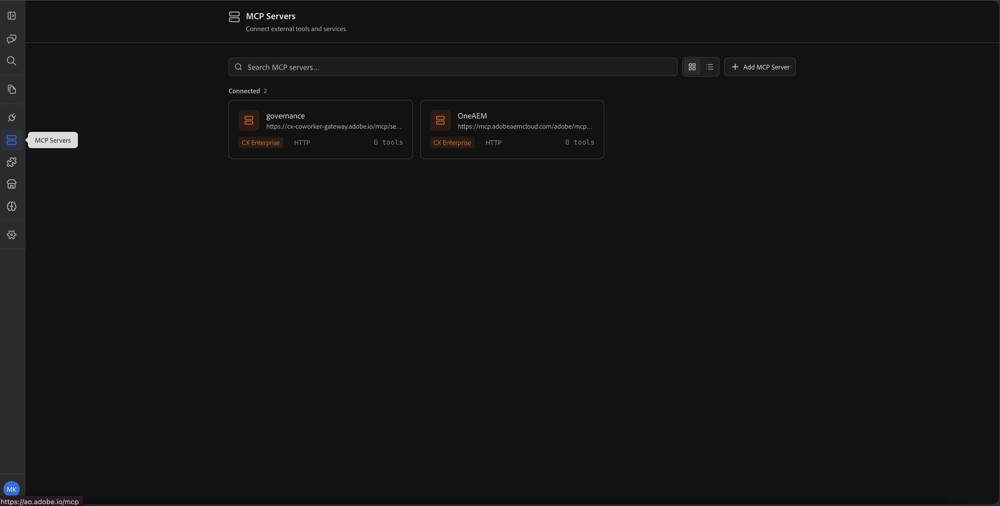
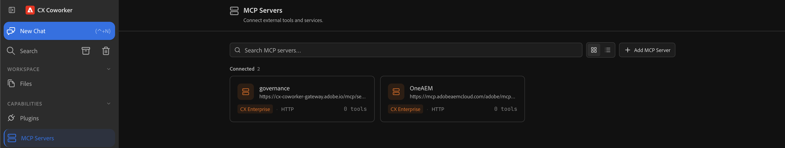
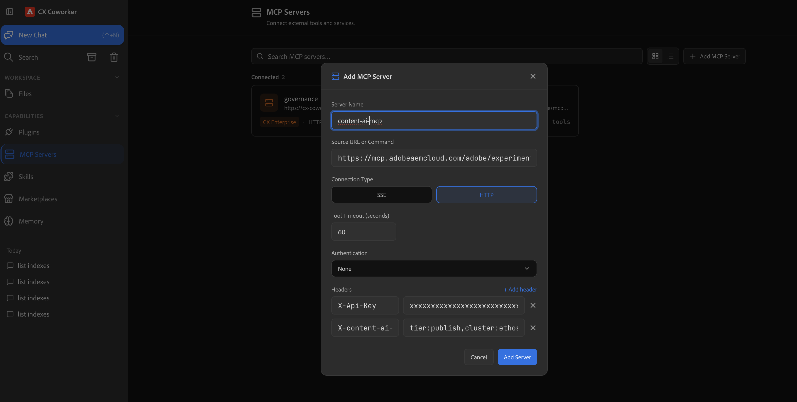
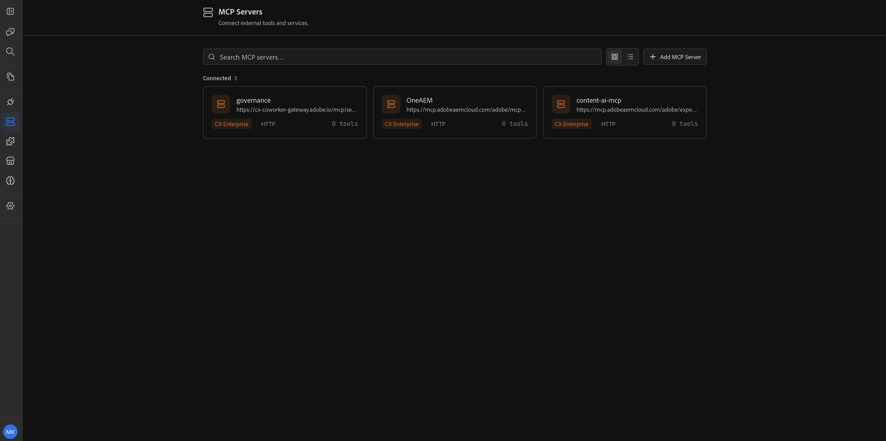
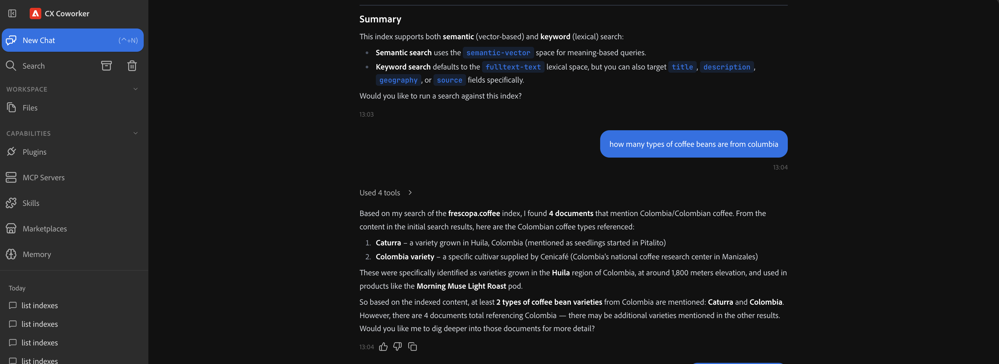

# Search and analyze AEM content with natural language

Use the **Content AI MCP Server**, a companion to the [AEM MCP Server](./overview.md), from [Adobe CX Coworker](https://experienceleague.adobe.com/en/docs/experience-manager-cloud-service/content/ai-in-aem/using-mcp-with-aem-as-a-cloud-service) to search and analyze Content AI content sources in natural language, no low-level API code or UI navigation.

In this tutorial you _discover_ available content sources, run _keyword_, _semantic_, and _hybrid_ searches, and use _generative search_ to get a synthesized answer, all from Adobe CX Coworker against a Content AI content source.

## Tools and access

The Content AI MCP Server provides six tools:

| Tool | Purpose |
| ---- | ------- |
| `list_content_sources` | Discover available content sources in your AEM environment. |
| `get_content_source_config` | Inspect the raw content source configuration and metadata. |
| `fulltext_search` | Keyword-based search with fuzzy matching and field selection. |
| `semantic_search` | Vector-based similarity search for conceptual queries. |
| `hybrid_search` | Combined keyword + semantic search for the best general-purpose recall. |
| `gen_search` | Generate a synthesized answer from matching content, instead of returning raw documents. |

The Content AI MCP Server is **public-source-only**: the `X-Api-Key` header grants source access. An API key is required; a request without it is rejected.

- **Public (anonymous)**: Search public, read-only content sources using the `X-Api-Key` header. Use this for openly available, non-sensitive content. See [Searching public content sources](#searching-public-content-sources).
- **Authenticated**: Search entitled or access-controlled content sources using the `x-content-ai-mcp-api-key` header together with your signed-in Adobe identity (passed through by CX Coworker). Results respect your permissions.

## Add the Content AI MCP Server

Connect [Adobe CX Coworker](https://ao.adobe.io/#) to the Content AI MCP Server and run the scenario below.

Let's set up the Content AI MCP Server in Adobe CX Coworker with these steps.

1. Sign in to Adobe CX Coworker.
    <!-- SCREENSHOT: Adobe CX Coworker sign-in / home -->
    {zoomable="yes"}

1. From the side rail, click **MCP Servers**.
    <!-- SCREENSHOT: MCP Servers in the CX Coworker side rail -->
    {zoomable="yes"}

1. Click **Add MCP Server**.
    <!-- SCREENSHOT: Add MCP Server button -->
    {zoomable="yes"}

1. In the **Add MCP Server** dialog, enter the following details:

    | Field | Value |
    | ----- | ----- |
    | **Server name** | `content-ai-mcp` |
    | **MCP URL** | `https://mcp.adobeaemcloud.com/adobe/experimental/aemagents-expires-20260331/mcp/content-ai` |
    | **Connection type** | `HTTP` |
    | **Authentication type** | `Passthrough` |

    <!-- SCREENSHOT: Add MCP Server dialog with server name, URL, connection type, and authentication type -->
    {zoomable="yes"}

    >[!NOTE]
    >
    > **Authentication type** is set to `Passthrough` so CX Coworker forwards your signed-in Adobe identity to the MCP Server. You do not need a separate sign-in or OAuth step.

1. Click **Add headers** and add the headers for the access mode you need:

    **For public content sources (anonymous):**

    | Header | Value |
    | ------ | ----- |
    | `X-Api-Key` | Your public API key. Present this header when you only want to search public content sources. |
    | `x-content-ai-mcp-routing` | _(Optional)_ Environment/routing info, for example `tier=publish,bucket=p12345-e67890,cluster=ethos21-prod-va7,namespace=ns-team-example`. |

    **For non-public (entitled) content sources:**

    | Header | Value |
    | ------ | ----- |
    | `X-Api-Key` | Your Content AI API key. Required — searches are rejected without it. |
    | `x-content-ai-mcp-routing` | _(Optional)_ Environment/routing info, for example `tier=publish,bucket=p12345-e67890,cluster=ethos21-prod-va7,namespace=ns-team-example`. |

    >[!IMPORTANT]
    >
    > When the `X-Api-Key` header is present, the server treats the request as **anonymous** and only searches public content sources. Any signed-in identity is ignored, so there is no accidental escalation to authenticated access. Use `x-content-ai-mcp-api-key` (not `X-Api-Key`) when you intend to search entitled content sources.

    >[!NOTE]
    >
    > If you do not set the `x-content-ai-mcp-routing` header, the server asks for your environment (`tier` and `bucket`) in chat the first time you run a tool, then retries automatically.
    >
    > `natural_language_search` needs more than the other five tools: it requires **`cluster`** and **`namespace`** in routing, in addition to `tier` and `bucket`. If either is missing, the tool returns a `missing_nls_routing` error — reply with the missing value(s) and the server retries automatically.

1. Click **Add**. The **content-ai-mcp** server now appears in your list of MCP Servers.
    <!-- SCREENSHOT: content-ai-mcp listed in MCP Servers -->
    {zoomable="yes"}

1. Click **New chat** to start using the Content AI MCP Server.
    <!-- SCREENSHOT: New chat with Content AI MCP Server -->
    {zoomable="yes"}

## Searching public content sources

Some Content AI content sources are marked **public** and can be searched anonymously, without an entitled identity. Public content sources are read-only and are intended for openly available, non-sensitive content. Anyone with the public API key can search them.

Use this server when:

- You want to search openly available content (for example, public documentation or a demo catalog).
- You do not need per-user, permission-scoped results.
- You want a simple setup that only requires an API key.

To search public content sources, add the Content AI MCP Server in CX Coworker exactly as described in [Add the Content AI MCP Server](#add-the-content-ai-mcp-server), but in the **Add headers** step add only the `X-Api-Key` header (plus an optional `x-content-ai-mcp-routing` header for the environment):

| Header | Value |
| ------ | ----- |
| `X-Api-Key` | Your public API key. |
| `x-content-ai-mcp-routing` | _(Optional)_ Environment/routing info, for example `tier=publish,bucket=p12345-e67890`. |


>[!IMPORTANT]
>
> When the `X-Api-Key` header is present, the server treats the request as **anonymous** and only searches public content sources. Any signed-in identity is ignored. Do not use `X-Api-Key` when you intend to search entitled content sources, use `x-content-ai-mcp-api-key` instead.

With the server connected, discover and search public content sources the same way as authenticated content sources.

1. In CX Coworker, open a new chat and list the public content sources available to your API key:

    ```text
    List all Content AI content sources available in my environment.
    ```
    
    The server searches only public content sources for this request and returns matching results.

    The server returns the public sources matching your routing/environment.

You set up the Content AI MCP Server in Adobe CX Coworker and used it to search Content AI content sources. You discovered available content sources and searched them in natural language, with keyword, semantic, hybrid, and generative search. You also learned how to search **public content sources** anonymously with an API key, and how to reduce response size with field selection. You can use the same human-centric flow from CX Coworker to search and analyze Content AI content sources without switching to a UI or writing low-level search API code.

