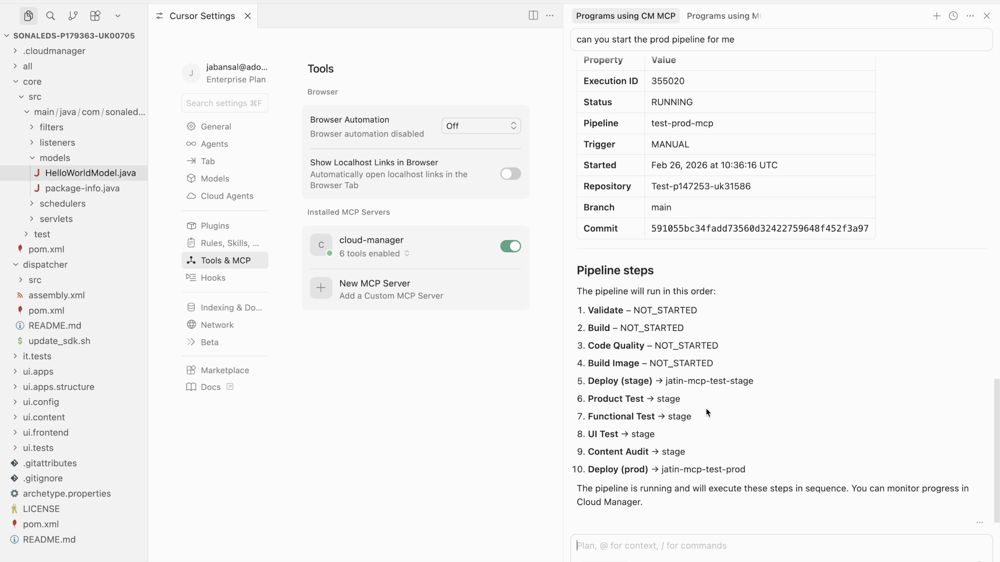
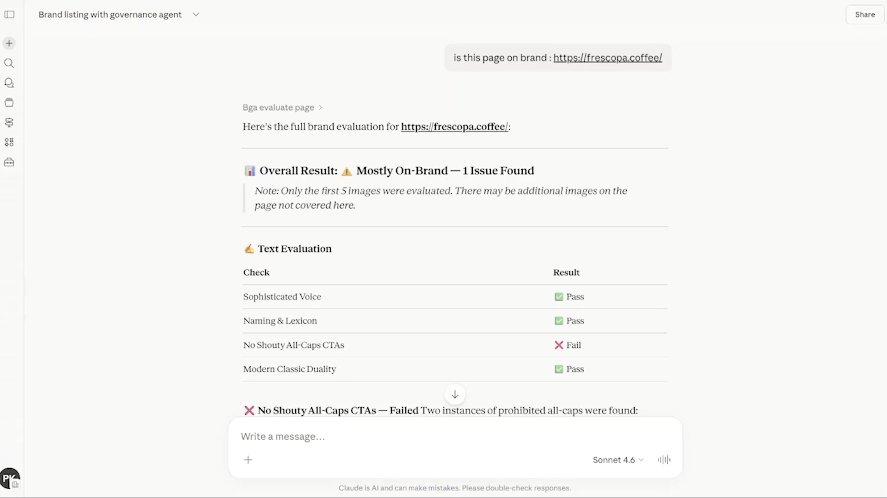
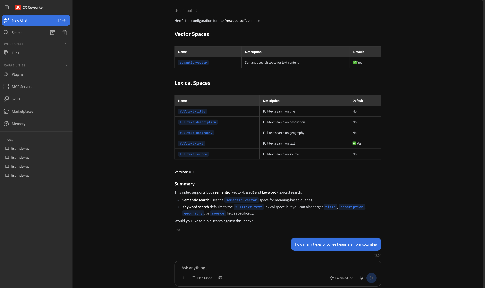

# AEM MCP server

The AEM _Model Context Protocol (MCP) Server_ brings AEM into your preferred AI-powered IDE or Chat-based application, to streamline and accelerate your AEM work. Describe what you want in natural language instead of writing low-level API code or navigating through the AEM UI.

Register a single URL in your AI client to get access to a growing set of AEM capabilities:

```
https://mcp.adobeaemcloud.com/adobe/mcp/aem
```

>[!VIDEO](https://video.tv.adobe.com/v/3497092/?learn=on&enablevpops)

Today, the **AEM MCP Server** covers:

- **Content**: Create, read, update, and delete (CRUD) operations for pages and content fragments, plus asset import, search, and management. Supports both read-write and read-only use; access follows the permissions of your signed-in AEM user.
- **Experience Governance**: Evaluate content (text, images, pages) against your brand governance rules, and list brand configurations and checks. Requires an Agents trial or paid license.

>[!TIP]
>
>The AEM MCP Server's tools will improve and grow over time. To see what's available now, ask your AI to list all AEM MCP tools (for example, `List all AEM MCP tools available from this server and describe what they do`) or type the `tools/list` prompt in your IDE.

The [AEM MCP Server section](https://experienceleague.adobe.com/en/docs/experience-manager-cloud-service/content/ai-in-aem/mcp-support/using-mcp-with-aem-as-a-cloud-service#aem-mcp-server) of the Experience League documentation has the full, up-to-date capability list.

## Connect your AI tool

- **[Coworker](../coworker.md)**: Adobe's conversational AI for AEM.
- **[ChatGPT](https://experienceleague.adobe.com/en/docs/experience-manager-cloud-service/content/ai-in-aem/mcp-support/chat-applications/setup-chatgpt)**: steps to connect the AEM MCP Server.
- **[Claude](https://experienceleague.adobe.com/en/docs/experience-manager-cloud-service/content/ai-in-aem/mcp-support/chat-applications/setup-claude)**: steps to connect the AEM MCP Server.

>[!NOTE]
>
>Cloud Manager and Cloud Migration aren't part of `/aem` yet, so they still need their own registration. The [Domain-Specific MCP Servers](https://experienceleague.adobe.com/en/docs/experience-manager-cloud-service/content/ai-in-aem/mcp-support/using-mcp-with-aem-as-a-cloud-service#mcp-servers-provided-by-aem) section has the details.

## AEM MCP in action

These examples show how to put the AEM MCP Server to work on real tasks: review and update content, run and debug a Cloud Manager pipeline, check a page against your brand guidelines, or search a Content AI index. Each one walks through a specific scenario end to end: connect the server in your tool of choice, then get a concrete result back.

<!-- 
CARDS
{target = _self}

* ./accelerate-content-operations-with-aem-mcp-server.md    
  {title = Create test content without leaving your IDE}
  {description = Create and update AEM test content in natural language, right from your IDE.}
  {image = ../assets/content-mcp-server/update-adventure-price-prompt-response.png}
  {cta = Learn more}

* ./cloud-manager.md
  {title = Run and debug AEM pipelines from your IDE}
  {description = Run pipelines, debug failures, and manage Cloud Manager programs and environments, no context switching.}
  {image = ../assets/cm-mcp-server/start-pipeline.png}
  {cta = Learn more}

* ./experience-governance-mcp-server.md
  {title = Check AEM content for brand compliance}
  {description = Evaluate AEM content against your brand guidelines and compliance requirements in natural language.}
  {image = ../assets/governance-mcp-server/site-on-brand-check.png}
  {cta = Learn more}

* ./content-ai-mcp-server.md
  {title = Search and analyze AEM content with natural language}
  {description = Search and analyze AEM Content AI indexes with keyword, semantic, hybrid, and natural language search.}
  {image = ../assets/content-ai-mcp-server/indexconfig-response.png}
  {cta = Learn more}
-->
<!-- START CARDS HTML - DO NOT MODIFY BY HAND -->
<div class="columns">
    <div class="column is-half-tablet is-half-desktop is-one-third-widescreen" aria-label="Create test content without leaving your IDE">
        <div class="card" style="height: 100%; display: flex; flex-direction: column; height: 100%;">
            <div class="card-image">
                <figure class="image x-is-16by9">
                    <a href="./accelerate-content-operations-with-aem-mcp-server.md" title="Create test content without leaving your IDE" target="_self" rel="referrer">
                        
                    </a>
                </figure>
            </div>
            <div class="card-content is-padded-small" style="display: flex; flex-direction: column; flex-grow: 1; justify-content: space-between;">
                <div class="top-card-content">
                    <p class="headline is-size-6 has-text-weight-bold">
                        <a href="./accelerate-content-operations-with-aem-mcp-server.md" target="_self" rel="referrer" title="Create test content without leaving your IDE">Create test content without leaving your IDE</a>
                    </p>
                    <p class="is-size-6">Create and update AEM test content in natural language, right from your IDE.</p>
                </div>
                <a href="./accelerate-content-operations-with-aem-mcp-server.md" target="_self" rel="referrer" class="spectrum-Button spectrum-Button--outline spectrum-Button--primary spectrum-Button--sizeM" style="align-self: flex-start; margin-top: 1rem;">
                    <span class="spectrum-Button-label has-no-wrap has-text-weight-bold">Learn more</span>
                </a>
            </div>
        </div>
    </div>
    <div class="column is-half-tablet is-half-desktop is-one-third-widescreen" aria-label="Run and debug AEM pipelines from your IDE">
        <div class="card" style="height: 100%; display: flex; flex-direction: column; height: 100%;">
            <div class="card-image">
                <figure class="image x-is-16by9">
                    <a href="./cloud-manager.md" title="Run and debug AEM pipelines from your IDE" target="_self" rel="referrer">
                        
                    </a>
                </figure>
            </div>
            <div class="card-content is-padded-small" style="display: flex; flex-direction: column; flex-grow: 1; justify-content: space-between;">
                <div class="top-card-content">
                    <p class="headline is-size-6 has-text-weight-bold">
                        <a href="./cloud-manager.md" target="_self" rel="referrer" title="Run and debug AEM pipelines from your IDE">Run and debug AEM pipelines from your IDE</a>
                    </p>
                    <p class="is-size-6">Run pipelines, debug failures, and manage Cloud Manager programs and environments, no context switching.</p>
                </div>
                <a href="./cloud-manager.md" target="_self" rel="referrer" class="spectrum-Button spectrum-Button--outline spectrum-Button--primary spectrum-Button--sizeM" style="align-self: flex-start; margin-top: 1rem;">
                    <span class="spectrum-Button-label has-no-wrap has-text-weight-bold">Learn more</span>
                </a>
            </div>
        </div>
    </div>
    <div class="column is-half-tablet is-half-desktop is-one-third-widescreen" aria-label="Check AEM content for brand compliance">
        <div class="card" style="height: 100%; display: flex; flex-direction: column; height: 100%;">
            <div class="card-image">
                <figure class="image x-is-16by9">
                    <a href="./experience-governance-mcp-server.md" title="Check AEM content for brand compliance" target="_self" rel="referrer">
                        
                    </a>
                </figure>
            </div>
            <div class="card-content is-padded-small" style="display: flex; flex-direction: column; flex-grow: 1; justify-content: space-between;">
                <div class="top-card-content">
                    <p class="headline is-size-6 has-text-weight-bold">
                        <a href="./experience-governance-mcp-server.md" target="_self" rel="referrer" title="Check AEM content for brand compliance">Check AEM content for brand compliance</a>
                    </p>
                    <p class="is-size-6">Evaluate AEM content against your brand guidelines and compliance requirements in natural language.</p>
                </div>
                <a href="./experience-governance-mcp-server.md" target="_self" rel="referrer" class="spectrum-Button spectrum-Button--outline spectrum-Button--primary spectrum-Button--sizeM" style="align-self: flex-start; margin-top: 1rem;">
                    <span class="spectrum-Button-label has-no-wrap has-text-weight-bold">Learn more</span>
                </a>
            </div>
        </div>
    </div>
    <div class="column is-half-tablet is-half-desktop is-one-third-widescreen" aria-label="Search and analyze AEM content with natural language">
        <div class="card" style="height: 100%; display: flex; flex-direction: column; height: 100%;">
            <div class="card-image">
                <figure class="image x-is-16by9">
                    <a href="./content-ai-mcp-server.md" title="Search and analyze AEM content with natural language" target="_self" rel="referrer">
                        
                    </a>
                </figure>
            </div>
            <div class="card-content is-padded-small" style="display: flex; flex-direction: column; flex-grow: 1; justify-content: space-between;">
                <div class="top-card-content">
                    <p class="headline is-size-6 has-text-weight-bold">
                        <a href="./content-ai-mcp-server.md" target="_self" rel="referrer" title="Search and analyze AEM content with natural language">Search and analyze AEM content with natural language</a>
                    </p>
                    <p class="is-size-6">Search and analyze AEM Content AI indexes with keyword, semantic, hybrid, and natural language search.</p>
                </div>
                <a href="./content-ai-mcp-server.md" target="_self" rel="referrer" class="spectrum-Button spectrum-Button--outline spectrum-Button--primary spectrum-Button--sizeM" style="align-self: flex-start; margin-top: 1rem;">
                    <span class="spectrum-Button-label has-no-wrap has-text-weight-bold">Learn more</span>
                </a>
            </div>
        </div>
    </div>
</div>
<!-- END CARDS HTML - DO NOT MODIFY BY HAND -->
