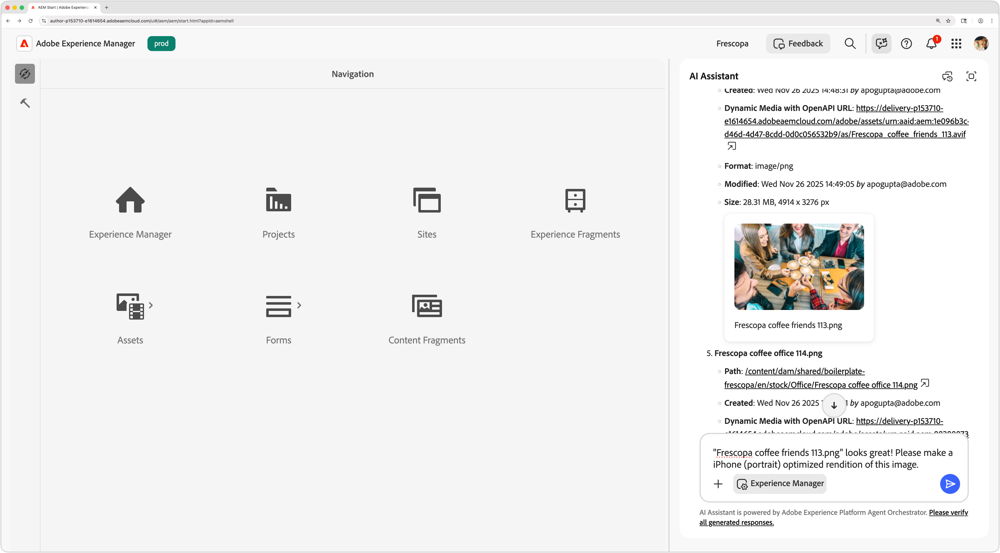

# AI in Experience Manager

Experience Manager as a Cloud Service provides advanced AI capabilities to enhance content management, streamline workflows, and improve user experiences. By integrating AI-powered features such as the AEM AI Assistant and AEM AI Agents, users can automate tasks, gain insights, and optimize content delivery.

<!-- CARDS 

* ./setup.md   
    {title = Set up AI in AEM}
    {description = Learn what access is needed to use AI in AEM.}
    {cta = Set up}
* ./aem-ai-assistant.md
    {title = AEM AI Assistant}
    {description = Learn how AI Assistant provides product knowledge and support in AEM.}
    {cta = Watch}
* ./agents-in-aem.md
    {title = Agents in AEM}
    {description = Discover how AI-powered agents automate tasks and enhance workflows in AEM.}
    {cta = Watch}
* ../../sites/generative-ai/generate-variations.md
    {title = Generate Variations}
    {description = Generate Variations in Adobe Experience Manager optimizes text and images for any experiences.}
    {cta = Watch}

-->
<!-- START CARDS HTML - DO NOT MODIFY BY HAND -->

    

        

            

                <figure class="image x-is-16by9">
                    
                </figure>
            

            

                

                    

                        <a href="./setup.md" target="_blank" rel="referrer" title="Set up AI in AEM">Set up AI in AEM</a>
                    

                    
Learn what access is needed to use AI in AEM.

                

                <a href="./setup.md" target="_blank" rel="referrer" class="spectrum-Button spectrum-Button--outline spectrum-Button--primary spectrum-Button--sizeM" style="align-self: flex-start; margin-top: 1rem;">
                    Set up
                </a>
            

        

    

    

        

            

                <figure class="image x-is-16by9">
                    
                </figure>
            

            

                

                    

                        <a href="./agents-in-aem.md" target="_blank" rel="referrer" title="Agents in AEM">Agents in AEM</a>
                    

                    
Discover how AI-powered agents automate tasks and enhance workflows in AEM.

                

                <a href="./agents-in-aem.md" target="_blank" rel="referrer" class="spectrum-Button spectrum-Button--outline spectrum-Button--primary spectrum-Button--sizeM" style="align-self: flex-start; margin-top: 1rem;">
                    Watch
                </a>
            

        

    

    

        

            

                <figure class="image x-is-16by9">
                    
                </figure>
            

            

                

                    

                        <a href="../../sites/generative-ai/generate-variations.md" target="_blank" rel="referrer" title="Generate Variations">Generate Variations</a>
                    

                    
Generate Variations in Adobe Experience Manager optimizes text and images for any experiences.

                

                <a href="../../sites/generative-ai/generate-variations.md" target="_blank" rel="referrer" class="spectrum-Button spectrum-Button--outline spectrum-Button--primary spectrum-Button--sizeM" style="align-self: flex-start; margin-top: 1rem;">
                    Watch
                </a>
            

        

    

<!-- END CARDS HTML - DO NOT MODIFY BY HAND -->

