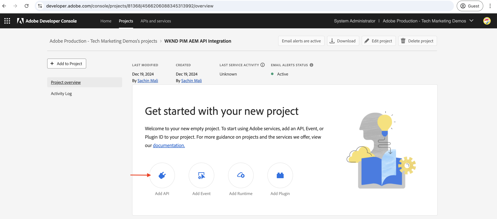
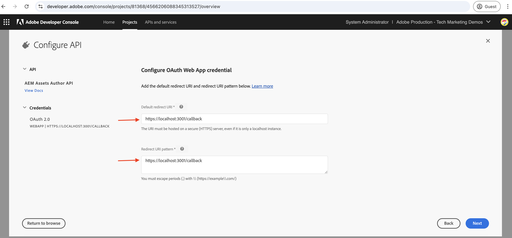
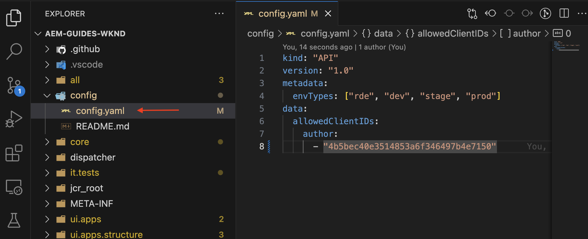

# Invoke OpenAPI-based AEM APIs with user authentication from a web app{#invoke-openapi-based-aem-apis-from-web-app}

Learn how to invoke OpenAPI-based AEM APIs on AEM as a Cloud Service using user-based authentication from an external web app with OAuth Web App authentication.

The OAuth Web App authentication is ideal for web applications with frontend and _backend_ components that need to **access AEM APIs on behalf of a user**. It uses the OAuth 2.0 _authorization_code_ grant type to obtain an access token on behalf of the user to access the AEM APIs. For more information, see [Difference between OAuth Server-to-Server and OAuth Web App/Single Page App credentials](./overview.md#difference-between-oauth-server-to-server-and-oauth-web-appsingle-page-app-credentials)

>[!AVAILABILITY]
>
>OpenAPI-based AEM APIs are available as part of an early access program. If you are interested in accessing them, we encourage you to email [aem-apis@adobe.com](mailto:aem-apis@adobe.com) with a description of your use case.

## Sample web app: WKND-PIM overview and functional flow

Before you start, let's understand the sample web app, WKND Product Information Management (PIM), and its functional flow.

The WKND PIM app is a sample web application designed to manage product attributes and its asset metadata stored within AEM as a Cloud Service. This example demonstrates how web apps can seamlessly integrate with Adobe APIs to deliver efficient, user-centric workflows.

The Adobe Developer Console (ADC) project is configured to access the Assets Author API using the OAuth Web App authentication. It provides the necessary _client_id_ and _client_secret_ to the WKND-PIM web app to initiate the _authorization_code_ grant flow.

The following diagram illustrates the functional flow of the WKND-PIM web app _getting user-specific access tokens to interact with the Assets Author API_.


1. The web app initiates the process by redirecting the user to the Adobe Identity Management System (IMS) for authentication.
1. Along with the redirect, the web app passes the required _client_id_ and _redirect_uri_ to the IMS.
1. IMS authenticates the user and sends them back to the specified _redirect_uri_ with an _authorization_code_.
1. The web app exchanges the _authorization_code_ with IMS for a user-specific access token, using its _client_id_ and _client_secret_.
1. Upon successful validation, IMS issues the user-specific _access token_.
1. The web app securely uses the _access token_ to interact with the Assets Author API, enabling the user to retrieve or update product asset metadata.

The WKND-PIM web app is developed using [Node.js](https://nodejs.org/en) and [Express](https://expressjs.com/). Express acts as the server that securely manages private secrets and user-specific access tokens.

Other web stacks (Java, Python, .NET-based, etc.) can be used to create web apps that integrate with the Adobe APIs using the approaches illustrated in this tutorial.

## What you learn{#what-you-learn}

In this tutorial, you learn how to:

- Create and configure an Adobe Developer Console (ADC) project to access OpenAPI-based AEM APIs using _OAuth Web App_ authentication.
- Implement the OAuth Web App authentication flow in a custom web app.
    - IMS user authentication and app authorization.
    - User-specific access token retrieval.
    - Accessing OpenAPI-based AEM APIs using the user-specific access token.

Before you start, make sure you reviewed the [Accessing Adobe APIs and related concepts](overview.md#accessing-adobe-apis-and-related-concepts) section.

## How to use this tutorial{#how-to-use-this-tutorial}

You can either [Review web app key code snippets](#review-web-app-key-code-snippets) section to understand OAuth Web App authentication flow and API calls code snippets used in the WKND-PIM web app. Or directly proceed to the [Setup and run web app](#setup-run-web-app) section to setup and run the WKND-PIM web app on your local machine.

## Review web app key code snippets{#review-web-app-key-code-snippets}

Let's review the key code snippets used in the WKND-PIM web app to understand the OAuth Web App authentication flow and API calls.

### Download the WKND-PIM web app code

1. Download the [WKND-PIM web app](./assets/web-app/wknd-pim-demo-web-app.zip) zip file and extract it.

1. Navigate to the extracted folder and open the `.env.example` file in your favorite code editor. Review the required configuration parameters.

    ```plaintext
    ########################################################################
    # Adobe IMS, Adobe Developer Console (ADC), and AEM Assets Information
    ########################################################################
    # Adobe IMS OAuth endpoints
    ADOBE_IMS_AUTHORIZATION_ENDPOINT=https://ims-na1.adobelogin.com/ims/authorize/v2
    ADOBE_IMS_TOKEN_ENDPOINT=https://ims-na1.adobelogin.com/ims/token/v3
    ADOBE_IMS_USERINFO_ENDPOINT=https://ims-na1.adobelogin.com/ims/userinfo/v2

    # Adobe Developer Console (ADC) Project's OAuth Web App credential
    ADC_CLIENT_ID=<ADC Project OAuth Server-to-Server credential ClientID>
    ADC_CLIENT_SECRET=<ADC Project OAuth Server-to-Server credential Client Secret>
    ADC_SCOPES=<ADC Project OAuth Server-to-Server credential Scopes>

    # AEM Assets Information
    AEM_ASSET_HOSTNAME=<AEM Assets Hostname, e.g., https://author-p63947-e1502138.adobeaemcloud.com/>
    AEM_ASSET_IDS=< AEM Asset IDs Comma Seperated, e.g., urn:aaid:aem:9f20a8ce-934a-4560-8720-250e529fbb17,urn:aaid:aem:6e0123cd-8a67-4d1f-b721-1b3da987d831>

    ################################################
    # Web App Information
    ################################################
    # The port number on which this server (web app) will run
    PORT = 3000

    # The URL to which the user will be redirected after the OAuth flow is complete
    REDIRECT_URI=https://localhost:3001/callback

    # The Express (express-session) uses this secret to encrypt and verify the authenticity of that cookie
    EXPRESS_SESSION_SECRET=<Express Session Secret>
    ```

    You need to replace the placeholders with the actual values from the Adobe Developer Console (ADC) Project and AEM as a Cloud Service Assets instance.

### IMS user authentication and app authorization

Let's review the code that initiates the IMS user authentication and app authorization. To review or update the asset metadata, the user must authenticate against the Adobe IMS and authorize the WKND-PIM web app to access the Assets Author API on their behalf.

On the very first login attempt, the user must provide the consent to allow the WKND-PIM web app to access the Assets Author API on their behalf.


1. The `routes/update-product-attributes.js` file verifies if the user's [Express session](https://www.npmjs.com/package/express-session) has an access token. If not, it redirects the user to the `/auth` route.

    ```javascript
    ...
    // The update-product-attributes route, shows the product attributes form with tabs
    router.get("/update-product-attributes", async (req, res) => {
      // Check if the user is authenticated, if not redirect to the auth route
      if (!req.session.accessToken) {
          return res.redirect("/auth");
      }
      ...
    });
    ``` 
    
1. In `routes/adobe-ims-auth.js` file, the `/auth` route initiates the IMS user authentication and app authorization flow. Note the _client_id_, _redirect_uri_, and _response_type_ parameters passed to the Adobe IMS authorization endpoint.

    ```javascript
    ...
    // Route to initiate Adobe IMS user authentication
    router.get("/auth", (req, res) => {
      // Redirect user to Adobe IMS authorization endpoint
      try {
          // Constructing the authorization URL
          const params = new URLSearchParams({
          client_id: adobeADCConfig.clientId,
          redirect_uri: redirectUri,
          response_type: "code",
          });

          // Append scopes if defined in configuration
          if (adobeADCConfig?.scopes) params.append("scope", adobeADCConfig.scopes);

          // Redirect user to Adobe IMS authorization URL
          const imsAuthorizationUrl = `${
          adobeIMSConfig.authorizationEndpoint
          }?${params.toString()}`;

          res.redirect(imsAuthorizationUrl);
      } catch (error) {
          console.error("Error initiating Adobe IMS authentication:", error);
          res.status(500).send("Unable to initiate authentication");
      }
    });
    ...
    ```

If the user is not authenticated against the Adobe IMS, the Adobe ID login page is displayed asking the user to authenticate.

If already authenticated, the user is redirected back to the specified _redirect_uri_ of the WKND-PIM web app with an _authorization_code_.

### Access token retrieval

The WKND-PIM web app securely exchanges the _authorization_code_ with the Adobe IMS for a user-specific access token using the _client_id_ and _client_secret_ of the ADC Project's OAuth Web App credential.

In the `routes/adobe-ims-auth.js` file, the `/callback` route exchanges the _authorization_code_ with the Adobe IMS for a user-specific access token.

```javascript
...
// Callback route to exchange authorization code for access token
router.get("/callback", async (req, res) => {
  // Extracting authorization code from the query parameters
  const authorizationCode = req.query.code;

  if (!authorizationCode) {
    return res.status(400).send("Missing authorization code");
  }

  // Exchange authorization code for access token
  try {
    // Fetch access token from Adobe IMS token endpoint
    const response = await fetch(adobeIMSConfig.tokenEndpoint, {
      method: "POST",
      headers: {
        "Content-Type": "application/x-www-form-urlencoded",
        Authorization: `Basic ${Buffer.from(
          `${adobeADCConfig.clientId}:${adobeADCConfig.clientSecret}`
        ).toString("base64")}`,
      },
      body: new URLSearchParams({
        code: authorizationCode,
        grant_type: "authorization_code",
      }),
    });

    if (!response.ok) {
      console.error("Failed to fetch access token:", response.statusText);
      return res.status(500).send("Failed to fetch access token");
    }

    const data = await response.json();

    if (!data.access_token) {
      console.error("Access token missing in the response:", data);
      return res.status(500).send("Invalid response from token endpoint");
    }

    // For debugging purposes
    console.log("Access token:", data.access_token);

    // Store the access token in the session
    req.session.accessToken = data.access_token;

    // Redirect user to update product attributes
    res.redirect("/update-product-attributes");
  } catch (error) {
    console.error("Error exchanging authorization code:", error);
    res.status(500).send("Error during token exchange");
  }
});
```

The access token is stored in the [Express session](https://www.npmjs.com/package/express-session) for subsequent requests to the Assets Author API.

### Accessing OpenAPI-based AEM APIs using the access token

The WKND-PIM web app securely uses the user-specific access token to interact with the Assets Author API, enabling the user to retrieve or update product asset metadata.

In the `routes/invoke-aem-apis.js` file, the `/api/getAEMAssetMetadata` and `/api/updateAEMAssetMetadata` routes invoke the Assets Author APIs using the access token.

```javascript
...
// API Route: Get AEM Asset Metadata
router.get("/api/getAEMAssetMetadata", async (req, res) => {
  const assetId = req.query.assetId;
  const bucketName = getBucketName(aemAssetsConfig.hostname);

  if (!assetId || !bucketName) {
    return res.status(400).json({ error: "Missing AEM Information" });
  }

  // Get the access token from the session
  const accessToken = req.session.accessToken;

  if (!accessToken) {
    return res.status(401).json({ error: "Not Authenticated with Adobe IMS" });
  }

  try {
    const assetMetadata = await invokeGetAssetMetadataAPI(
      bucketName,
      assetId,
      accessToken
    );

    const filteredMetadata = getFilteredMetadata(JSON.parse(assetMetadata));
    res.status(200).json(filteredMetadata);
  } catch (error) {
    console.error("Error getting asset metadata:", error.message);
    res.status(500).json({ error: `Internal Server Error: ${error.message}` });
  }
});

// Helper function to invoke the AEM API to get asset metadata
async function invokeGetAssetMetadataAPI(bucketName, assetId, accessToken) {
  const apiUrl = `https://${bucketName}.adobeaemcloud.com/adobe/assets/${assetId}/metadata`;


  // For debugging purposes
  console.log("API URL:", apiUrl);
  console.log("Access Token:", accessToken);
  console.log("API Key:", adobeADCConfig.clientId);

  try {
    const response = await fetch(apiUrl, {
      method: "GET",
      headers: {
        "If-None-Match": "string",
        "X-Adobe-Accept-Experimental": "1",
        Authorization: `Bearer ${accessToken}`,
        "X-Api-Key": adobeADCConfig.clientId,
      },
    });

    console.log("Response Status:", response.status);

    if (!response.ok) {
      throw new Error(`AEM API Error: ${response.statusText}`);
    }

    return await response.text();
  } catch (error) {
    throw new Error(`Failed to fetch asset metadata: ${error.message}`);
  }
}

// Helper function to filter the metadata properties like pim: and dc:
function getFilteredMetadata(data) {
  if (!data || !data.assetMetadata) {
    throw new Error("Invalid metadata structure received from API");
  }

  const properties = data.assetMetadata;
  return Object.keys(properties).reduce((filtered, key) => {
    if (
      key.startsWith("pim:") ||
      key === "dc:title" ||
      key === "dc:description"
    ) {
      filtered[key] = properties[key];
    }
    return filtered;
  }, {});
}

// API Route: Update AEM Asset Metadata
router.post("/api/updateAEMAssetMetadata", async (req, res) => {
  const { assetId, metadata } = req.body;

  if (!assetId || !metadata || typeof metadata !== "object") {
    return res.status(400).json({ error: "Invalid or Missing Metadata" });
  }

  const bucketName = getBucketName(aemAssetsConfig.hostname);
  if (!bucketName) {
    return res.status(400).json({ error: "Missing AEM Information" });
  }

  const accessToken = req.session.accessToken;
  if (!accessToken) {
    return res.status(401).json({ error: "Not Authenticated with Adobe IMS" });
  }

  try {
    const updatedMetadata = await invokePatchAssetMetadataAPI(
      bucketName,
      assetId,
      metadata,
      accessToken
    );
    res.status(200).json(updatedMetadata);
  } catch (error) {
    console.error("Error updating asset metadata:", error.message);
    res.status(500).json({ error: `Internal Server Error: ${error.message}` });
  }
});

// Helper function to invoke the AEM API to update asset metadata
async function invokePatchAssetMetadataAPI(
  bucketName,
  assetId,
  metadata,
  accessToken
) {
  const apiUrl = `https://${bucketName}.adobeaemcloud.com/adobe/assets/${assetId}/metadata`;
  const headers = {
    "Content-Type": "application/json-patch+json",
    "If-Match": "*",
    "X-Adobe-Accept-Experimental": "1",
    Authorization: `Bearer ${accessToken}`,
    "X-Api-Key": adobeADCConfig.clientId,
  };

  try {
    const response = await fetch(apiUrl, {
      method: "PATCH",
      headers,
      body: JSON.stringify(getTransformedMetadata(metadata)),
    });

    if (!response.ok) {
      throw new Error(`AEM API Error: ${response.statusText}`);
    }

    return await response.json();
  } catch (error) {
    throw new Error(`Failed to update asset metadata: ${error.message}`);
  }
}

// Helper function to transform metadata into JSON Patch format, e.g. [{ op: "add", path: "dc:title", value: "New Title" }]
function getTransformedMetadata(metadata) {
  return Object.keys(metadata).map((key) => ({
    op: "add",
    path: `/${key}`,
    value: metadata[key],
  }));
}
```

The OpenAPI-based AEM API calls are made from the server-side (Express middleware) and not directly from the client-side (browser) to ensure that the access token is securely managed and not exposed to the client-side.

### Refreshing the access token

To refresh the access token before it expires, you can implement the refresh token flow. However, to keep the tutorial simple, the WKND-PIM web app does not implement the refresh token flow.

## Setup and run web app

Let's configure and run the WKND-PIM web app on your local machine to understand the OAuth Web App authentication flow and API calls.

### Prerequisites

To complete this tutorial, you need:

- Modernized AEM as a Cloud Service environment with the following:
    - AEM Release `2024.10.18459.20241031T210302Z` or later.
    - New style Product Profiles (if environment was created before November 2024)

- The sample [WKND Sites](https://github.com/adobe/aem-guides-wknd?#aem-wknd-sites-project) project must be deployed on to it.

- Access to the [Adobe Developer Console](https://developer.adobe.com/developer-console/docs/guides/getting-started/).

- Install [Node.js](https://nodejs.org/en/) on your local machine to run the sample NodeJS application.

- Install a [local-ssl-proxy](https://www.npmjs.com/package/local-ssl-proxy#local-ssl-proxy) on your local machine to create a local SSL HTTP proxy using a self-signed certificate.

### Development steps

The high-level development steps are:

1. Modernization of AEM as a Cloud Service environment.
1. Enable AEM APIs access.
1. Create Adobe Developer Console (ADC) Project.
1. Configure ADC Project
    1. Add desired OpenAPI-based AEM APIs
    1. Configure OAuth Web App credential
1. Configure the AEM instance to enable ADC Project communication
1. Create and apply asset metadata schema
1. Configure and run the WKND-PIM web app
1. Verify the end-to-end flow

### Modernization of AEM as a Cloud Service environment

Refer to the [Modernization of AEM as a Cloud Service environment](invoke-openapi-based-aem-apis.md#modernization-of-aem-as-a-cloud-service-environment) section from the [How to invoke OpenAPI-based AEM APIs](invoke-openapi-based-aem-apis.md) tutorial.

### Enable AEM APIs access

Refer to the [Enable AEM APIs access](invoke-openapi-based-aem-apis.md#enable-aem-apis-access) section from the [How to invoke OpenAPI-based AEM APIs](invoke-openapi-based-aem-apis.md) tutorial.

### Create Adobe Developer Console (ADC) Project

Refer to the [Create Adobe Developer Console (ADC) Project](invoke-openapi-based-aem-apis.md#create-adobe-developer-console-adc-project) section from the [How to invoke OpenAPI-based AEM APIs](invoke-openapi-based-aem-apis.md) tutorial.

### Configure ADC Project

Next, configure the ADC Project to access the Assets Author API using the OAuth Web App authentication.

1. To add AEM APIs, click on the **Add API** button.

    

1. In the _Add API_ dialog, filter by _Experience Cloud_ and select the **AEM Assets Author API** card and click **Next**.

    

1. Next, in the _Configure API_ dialog, select the **User Authentication** authentication option and click **Next**.

    

1. In the next _Configure API_ dialog, select the **OAuth Web App** authentication option and click **Next**.

    

1. In the _Configure OAuth Web App_ dialog, enter the following details and click **Next**.
    - Default redirect URI: `https://localhost:3001/callback`
    - Redirect URI pattern: `https://localhost:3001/callback`

    

1. Review the available scopes and click **Save configured API**.

    

1. Review the AEM API and authentication configuration.

    

    

### Configure the AEM instance to enable ADC Project communication

To enable the ADC Project's OAuth Web App credential ClientID to communicate with the AEM instance, you need to configure the AEM instance.

It is done by defining the configuration in the `config.yaml` file in the AEM Project. Then, deploy the `config.yaml` file using the Config Pipeline in the Cloud Manager.

1. In AEM Project, locate or create the `config.yaml` file from the `config` folder.

    

1. Add the following configuration to the `config.yaml` file.

    ```yaml
    kind: "API"
    version: "1.0"
    metadata: 
        envTypes: ["dev", "stage", "prod"]
    data:
        allowedClientIDs:
            author:
            - "<ADC Project's OAuth Web App credential ClientID>"
    ```

    Replace `<ADC Project's OAuth Web App credential ClientID>` with the actual ClientID of the ADC Project's OAuth Web App credential. The API endpoint that is used in this tutorial is available only on the author tier, but for other APIs, the yaml config can also have a _publish_ or _preview_ node.

1. Commit the config changes to the Git repository and push the changes to the remote repository.

1. Deploy the above changes using the Config Pipeline in the Cloud Manager. Note that the `config.yaml` file can also be installed in an RDE, using command line tooling.

    

### Create and apply asset metadata schema

By default, the WKND Sites project does not have the required asset metadata schema to store product attributes. Let's create and apply the asset metadata schema to an asset folder in the AEM instance.

1. Login to the AEM as a Cloud Service Asset instance. Using the [Asset view](https://experienceleague.adobe.com/en/docs/experience-manager-learn/assets/authoring/switch-views) navigate to the `/content/dam/wknd-shared/en` folder.

    

1. Create **PIM** and within it create the **Camping** folder, then upload [sample images](./assets/web-app/camping-gear-imgs.zip) in the **Camping** folder.

    

Next, let's create the PIM attribute specific metadata schema and apply it to the **PIM** folder.

1. Navigate to the **Settings** > **Metadata Forms** option from the left rail and click the **Create** button.

1. In the **Create Metadata Form** dialog, enter the following details and click **Create**.
    - Name: `PIM`
    - Use existing form structure as template: `Check`
    - Choose from: `default`

    

1. Click the **+** icon to add a new **PIM** tab and add **Single Line Text** components to it. The metadata property names should start with `pim:` prefix.

    

    | Label | Placeholder | Metadata property |
    | --- | --- | --- |
    | SKU | Enter SKU ID | `pim:sku` |
    | Product Type | e.g., Backpack, Tent, Jacket | `pim:productType` |
    | Product Category | e.g., Camping, Hiking, Climbing | `pim:productCategory` |
    | Manufacturer | Enter manufacturer name | `pim:manufacturer` |
    | Model | Enter model name | `pim:model` |
    | Brand Name | Enter brand name | `pim:brandName` |

1. Click **Save** and **Close** to save the metadata form.

1. Finally, apply the **PIM** metadata schema to the **PIM** folder.

    

With the above steps, the assets from the **PIM** folder are ready to store the product attributes metadata.

### Configure and run the WKND-PIM web app

1. Download the [WKND-PIM web app](./assets/web-app/wknd-pim-demo-web-app.zip) zip file and extract it.

1. Navigate to the extracted folder and copy the `.env.example` file to `.env`.

1. Update the `.env` file with the required configuration parameters from the Adobe Developer Console (ADC) Project and AEM as a Cloud Service Assets instance.

    ```plaintext
    ########################################################################
    # Adobe IMS, Adobe Developer Console (ADC), and AEM Assets Information
    ########################################################################
    # Adobe IMS OAuth endpoints
    ADOBE_IMS_AUTHORIZATION_ENDPOINT=https://ims-na1.adobelogin.com/ims/authorize/v2
    ADOBE_IMS_TOKEN_ENDPOINT=https://ims-na1.adobelogin.com/ims/token/v3
    ADOBE_IMS_USERINFO_ENDPOINT=https://ims-na1.adobelogin.com/ims/userinfo/v2

    # Adobe Developer Console (ADC) Project OAuth Web App credential
    ADC_CLIENT_ID=e1adsfsd59384320bbe4f9298f00b7ab
    ADC_CLIENT_SECRET=p8e-Mdfgfdsg43RHugVRTEOyWlmEU5m
    ADC_SCOPES=AdobeID,openid,aem.folders,aem.assets.author

    # AEM Assets Information
    AEM_ASSET_HOSTNAME=https://author-p3947-e1542138.adobeaemcloud.com/
    AEM_ASSET_IDS=urn:aaid:aem:aa689a9f-04da-4fbb-b460-74a5b6a69090,urn:aaid:aem:e4fdb6f6-1007-4e84-9726-a9522931786a

    ################################################
    # Web App Information
    ################################################
    # The port number on which this server (web app) will run
    PORT = 3000

    # The URL to which the user will be redirected after the OAuth flow is complete
    REDIRECT_URI=http://localhost:3000/auth/callback

    # The Express (express-session) uses this secret to encrypt and verify the authenticity of that cookie
    # For demonstration purposes, this is a simple secret. In production, you should use a strong secret
    EXPRESS_SESSION_SECRET=1234554321
    ```    

    The `AEM_ASSET_IDS` are the `jcr:uuid` property value of the uploaded images in the **Camping** folder. Refer to this [section](invoke-openapi-based-aem-apis.md#review-the-api) for more details.

1. Open a terminal and navigate to the extracted folder. Install the required dependencies using the following command.

    ```bash
    $ npm install
    ```

1. Start the WKND-PIM web app using the following command.

    ```bash
    $ npm start
    ```

1. Run the local SSL HTTP proxy using the following command.

    ```bash
    $ local-ssl-proxy --source 3001 --target 3000 --cert ./ssl/server.crt --key ./ssl/server.key
    ```
    
    The local SSL HTTP proxy is used as IMS requires the redirect URI to be HTTPS.

### Verify the end-to-end flow

1. Open a browser and navigate to `https://localhost:3001` to access the WKND-PIM web app. Accept the self-signed certificate warning.

    

1. Click **Try Now** to review and update the product attributes metadata. It initiates the IMS user authentication and app authorization flow.

1. Login with your Adobe ID credentials and provide the consent to allow the WKND-PIM web app to access the Assets Author API on your behalf.

1. From the `https://localhost:3001/update-product-attributes` route/page, click the **AEM Asset Attributes** tab. From the **Asset ID** dropdown, select an Asset ID to view the asset metadata.

    

1. Update the asset metadata and click **Update AEM Asset Attributes** to update the asset metadata.

    

>[!IMPORTANT]
>
>If the authenticated user lacks the necessary permissions to review or update asset metadata, the OpenAPI-based AEM APIs will return a 403 Forbidden error. This ensures that, even if the user is authenticated and possesses a valid IMS access token, they cannot access AEM resources without the required permissions.


### Review the application code

Let's review the high-level code structure and main entry points of the WKND-PIM web app. The application is developed using Node.js + Express.

1. The `app.js` is the main entry point of the application. It initializes the Express app, sets up the session, and mounts the routes.

1. The `public` folder contains the static assets like CSS, JavaScript, and images. The `script.js` file contains the client-side JavaScript code to interact with the Express `/api/getAEMAssetMetadata` and `/api/updateAEMAssetMetadata` routes.

1. The `routes` folder contains the Express routes:
    1. `index.js`: The main route that renders the home page.
    1. `update-product-attributes.js`: The route that renders the product attributes form with tabs, also verifies Express session for access token.
    1. `adobe-ims-auth.js`: The route that initiates the Adobe IMS user authentication and app authorization flow.
    1. `invoke-aem-apis.js`: The route that invokes the OpenAPI-based AEM APIs using the user-specific access token.
    
1. The `views` folder contains the EJS templates to render the HTML pages.

1. The `utils` folder contains the utility functions.

1. The `ssl` folder contains the self-signed certificate and key files to run the local SSL HTTP proxy.

You can develop or integrate the existing web app with the Adobe APIs using other server-side technologies like Java, Python, or .NET.

## Summary

In this tutorial, you learned how to invoke OpenAPI-based AEM APIs on AEM as a Cloud Service from a custom web app using OAuth Web App authentication. You reviewed the key code snippets used in the WKND-PIM web app to understand the OAuth Web App authentication flow.

You can use the tutorial as a reference to integrate the OpenAPI-based AEM APIs with your custom web applications to deliver efficient, user-centric workflows.

## Additional resources

 - [User Authentication Implementation Guide](https://developer.adobe.com/developer-console/docs/guides/authentication/UserAuthentication/implementation/)
 - [Authorize Request](https://developer.adobe.com/developer-console/docs/guides/authentication/UserAuthentication/IMS/#authorize-request)
 - [Fetching Access tokens](https://developer.adobe.com/developer-console/docs/guides/authentication/UserAuthentication/IMS/#fetching-access-tokens)
 - [Refreshing Access tokens](https://developer.adobe.com/developer-console/docs/guides/authentication/UserAuthentication/IMS/#refreshing-access-tokens)
 - [How to invoke OpenAPI-based AEM APIs](invoke-openapi-based-aem-apis.md)