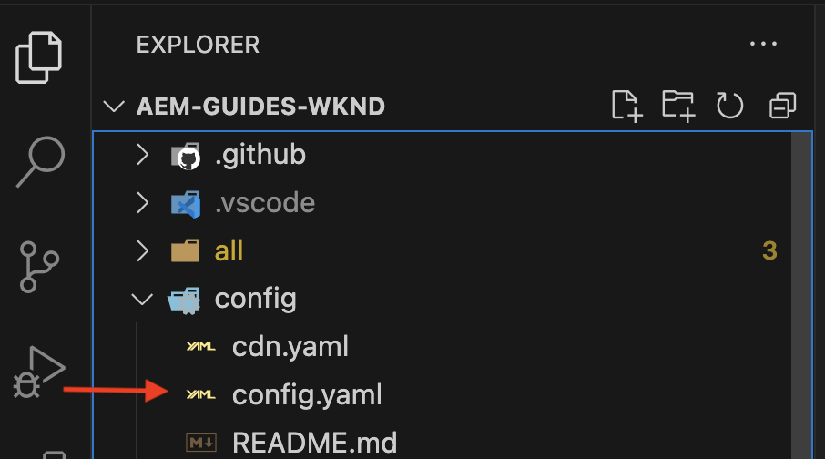

# Invoke OpenAPI-based AEM APIs for server to server authentication{#invoke-openapi-based-aem-apis}

Learn how to configure and invoke OpenAPI-based AEM APIs on AEM as a Cloud Service from custom applications using _OAuth Server-to-Server_ authentication.

The OAuth Server-to-Server authentication is ideal for backend services needing API access without user interaction. It uses the OAuth 2.0 _client_credentials_ grant type to authenticate the client application.

>[!AVAILABILITY]
>
>OpenAPI-based AEM APIs are available as part of an early access program. If you are interested in accessing them, we encourage you to email [aem-apis@adobe.com](mailto:aem-apis@adobe.com) with a description of your use case.

In this tutorial, you learn how to:

- Enable OpenAPI-based AEM APIs access for your AEM as a Cloud Service environment.
- Create and configure an Adobe Developer Console (ADC) project to access AEM APIs using _OAuth Server-to-Server authentication_.
- Develop a sample NodeJS application that calls the Assets Author API to retrieve metadata for a specific asset.

Before you start, make sure you reviewed the [Accessing Adobe APIs and related concepts](overview.md#accessing-adobe-apis-and-related-concepts) section.

## Prerequisites

To complete this tutorial, you need:

- Modernized AEM as a Cloud Service environment with the following:
    - AEM Release `2024.10.18459.20241031T210302Z` or later.
    - New style Product Profiles (if environment was created before November 2024)

- The sample [WKND Sites](https://github.com/adobe/aem-guides-wknd?#aem-wknd-sites-project) project must be deployed on to it.

- Access to the [Adobe Developer Console](https://developer.adobe.com/developer-console/docs/guides/getting-started/).

- Install [Node.js](https://nodejs.org/en/) on your local machine to run the sample NodeJS application. 

## Development steps

The high-level development steps are:

1. Modernization of AEM as a Cloud Service environment.
1. Enable AEM APIs access.
1. Create Adobe Developer Console (ADC) Project.
1. Configure ADC Project
    1. Add desired AEM APIs
    1. Configure its authentication
    1. Associate Product Profile with the authentication configuration
1. Configure the AEM instance to enable ADC Project communication
1. Develop a sample NodeJS application
1. Verify the end-to-end flow

## Modernization of AEM as a Cloud Service environment

Let's start by modernizing the AEM as a Cloud Service environment. This step is only needed if the environment is not modernized.

Modernization of the AEM as a Cloud Service environment is a two-step process, 

- Update to the latest AEM release version 
- Add new Product Profiles to it.

### Update AEM instance

To update the AEM instance, in the Adobe [Cloud Manager](https://my.cloudmanager.adobe.com/)'s _Environments_ section, select the _ellipsis_ icon next to the environment name and select **Update** option.


Then click the **Submit** button and run the suggested Fullstack Pipeline.


In my case, the name of Fullstack Pipeline is _Dev :: Fullstack-Deploy_ and the AEM environment name is _wknd-program-dev_ it may vary in your case.

### Add new Product Profiles

To add new Product Profiles to the AEM instance, in the Adobe [Cloud Manager](https://my.cloudmanager.adobe.com/)'s _Environments_ section, select the _ellipsis_ icon next to the environment name and select the **Add Product Profiles** option. 


You can review the newly added Product Profiles by clicking on the _ellipsis_ icon next to the environment name and selecting **Manage Access** > **Author Profiles**.

The _Admin Console_ window displays the newly added Product Profiles.


The above steps complete the modernization of the AEM as a Cloud Service environment.

## Enable AEM APIs access

New Product Profiles enable OpenAPI-based AEM API access in the Adobe Developer Console (ADC).

The newly added Product Profiles are associated with the _Services_ that represent AEM user groups with predefined Access Control Lists (ACLs). The _Services_ are used to control the level of access to the AEM APIs.

You can also select or deselect the _Services_ associated with the Product Profile to reduce or increase the level of access.

Review the association by clicking on the _View Details_ icon next to the Product Profile name. 


By default, the **AEM Assets API Users** Service is not associated with any Product Profile. Let's associate it with the newly added **AEM Administrators - author - Program XXX - Environment XXX** Product Profile. After this association, the ADC Project's _Asset Author API_ can setup the OAuth Server-to-Server authentication and associate the authentication account with the Product Profile.


It is important to note that before the modernization, in AEM Author instance, two Product Profiles were available, **AEM Administrators-XXX** and **AEM Users-XXX**. It is also possible to associate these existing Product Profiles with the new Services.

## Create Adobe Developer Console (ADC) Project

Next, create an ADC Project to access AEM APIs.

1. Login to the [Adobe Developer Console](https://developer.adobe.com/console) using your Adobe ID.

    

1. From the _Quick Start_ section, click on the **Create new project** button. 

    

1. It creates a new project with the default name.

    

1. Edit the project name by clicking the **Edit project** button in the top right corner. Provide a meaningful name and click **Save**.

    

## Configure ADC Project

Next, configure the ADC Project to add AEM APIs, configure its authentication, and associate the Product Profile.

1. To add AEM APIs, click on the **Add API** button.

    

1. In the _Add API_ dialog, filter by _Experience Cloud_ and select the **AEM Assets Author API** card and click **Next**.

    

1. Next, in the _Configure API_ dialog, select the **Server-to-Server** authentication option and click **Next**. The Server-to-Server authentication is ideal for backend services needing API access without user interaction.

    

1. Rename the credential for easier identification (if needed) and click **Next**. For demo purposes, the default name is used.

    
    
1. Select the **AEM Administrators - author - Program XXX - Environment XXX** Product Profile and click **Save**. As you can see, only the Product Profile associated with the AEM Assets API Users Service is available for selection.

    

1. Review the AEM API and authentication configuration.

    

    


## Configure AEM instance to enable ADC Project communication

To enable the ADC Project's OAuth Server-to-Server credential ClientID to communication with the AEM instance, you need to configure the AEM instance.

It is done by defining the configuration in the `config.yaml` file in the AEM Project. Then, deploy the `config.yaml` file using the Config Pipeline in the Cloud Manager.

1. In AEM Project, locate or create the `config.yaml` file from the `config` folder.

    

1. Add the following configuration to the `config.yaml` file.

    ```yaml
    kind: "API"
    version: "1.0"
    metadata: 
        envTypes: ["dev", "stage", "prod"]
    data:
        allowedClientIDs:
            author:
            - "<ADC Project's OAuth Server-to-Server credential ClientID>"
    ```

    Replace `<ADC Project's OAuth Server-to-Server credential ClientID>` with the actual ClientID of the ADC Project's OAuth Server-to-Server credential. The API endpoint that is used in this tutorial is available only on the author tier, but for other APIs, the yaml config can also have a _publish_ or _preview_ node.

1. Commit the config changes to the Git repository and push the changes to the remote repository.

1. Deploy the above changes using the Config Pipeline in the Cloud Manager. Note that the `config.yaml` file can also be installed in an RDE, using command line tooling.

    

## Develop a sample NodeJS application

Let's develop a sample NodeJS application that calls the Assets Author API.

You can use other programming languages like Java, Python, etc., to develop the application. 

For testing purposes, you can use the [Postman](https://www.postman.com/), [curl](https://curl.se/), or any other REST client to invoke the AEM APIs.

### Review the API

Before developing the application, let's review [deliver the specified asset's metadata](https://developer.adobe.com/experience-cloud/experience-manager-apis/api/experimental/assets/author/#operation/getAssetMetadata) endpoint from the _Assets Author API_. The API syntax is:

```http
GET https://{bucket}.adobeaemcloud.com/adobe/assets/{assetId}/metadata
```

To retrieve the metadata of a specific asset, you need the `bucket` and `assetId` values. The `bucket` is the AEM instance name without the Adobe domain name (.adobeaemcloud.com), for example, `author-p63947-e1420428`. 

The `assetId` is the JCR UUID of the asset with the `urn:aaid:aem:` prefix, for example, `urn:aaid:aem:a200faf1-6d12-4abc-bc16-1b9a21f870da`. There are multiple ways to get the `assetId`:

- Append the AEM asset path `.json` extension to get the asset metadata. For example, `https://author-p63947-e1420429.adobeaemcloud.com/content/dam/wknd-shared/en/adventures/cycling-southern-utah/adobestock-221043703.jpg.json` and look for the `jcr:uuid` property.

- Alternatively, you can get the `assetId` by inspecting the asset in the browser's element inspector. Look for the `data-id="urn:aaid:aem:..."` attribute.

    

### Invoke the API using the browser

Before developing the application, let's invoke the API using the **Try it** feature in the [API documentation](https://developer.adobe.com/experience-cloud/experience-manager-apis/api/experimental/assets/author/#operation/getAssetMetadata). 

1. Open the [Assets Author API documentation](https://developer.adobe.com/experience-cloud/experience-manager-apis/api/experimental/assets/author) in the browser.

1. Expand the _Metadata_ section and click on the **Delivers the specified asset's metadata** option.

1. In the right pane, click on the **Try it** button.
    

1. Enter the following values:
    1. The `bucket` value is the AEM instance name without the Adobe domain name (.adobeaemcloud.com), for example, `author-p63947-e1420428`.
    
    1. The **Security** section related `Bearer Token` and `X-Api-Key` values are obtained from the ADC Project's OAuth Server-to-Server credential. Click **Generate access token** to get the `Bearer Token` value and use the `ClientID` value as the `X-Api-Key`.
        

    1. The **Parameters** section related `assetId` value is the unique identifier for the asset in AEM. The `X-Adobe-Accept-Experimental` is set to 1.

        

1. Click **Send** to invoke the API.

1. Review the **Response** tab to see the API response.

    

The above steps confirm the modernization of the AEM as a Cloud Service environment, enabling AEM APIs access. It also confirms the successful configuration of the ADC Project, and the OAuth Server-to-Server credential ClientID communication with the AEM author instance.

### Sample NodeJS application

Let's develop a sample NodeJS application. 

To develop the application, you can either use the _Run-the-sample-application_ or the _Step-by-step-development_ instructions.


>[!BEGINTABS]

>[!TAB Run-the-sample-application]

1. Download the sample [demo-nodejs-app-to-invoke-aem-openapi](assets/demo-nodejs-app-to-invoke-aem-openapi.zip) application zip file and extract it.

1. Navigate to the extracted folder and install the dependencies.

    ```bash
    $ npm install
    ```

1. Replace the placeholders in the `.env` file with the actual values from the ADC Project's OAuth Server-to-Server credential.

1. Replace the `<BUCKETNAME>` and `<ASSETID>` in the `src/index.js` file with the actual values.

1. Run the NodeJS application.

    ```bash
    $ node src/index.js
    ```

>[!TAB Step-by-step-development]

1. Create a new NodeJS project.

    ```bash
    $ mkdir demo-nodejs-app-to-invoke-aem-openapi
    $ cd demo-nodejs-app-to-invoke-aem-openapi
    $ npm init -y
    ```
    
1. Install the _fetch_ and _dotenv_ library to make HTTP requests and read the environment variables respectively.

    ```bash
    $ npm install node-fetch
    $ npm install dotenv
    ```

1. Open the project in your favorite code editor and update the `package.json` file to add the `type` to `module`.

    ```json
    {
        ...
        "version": "1.0.0",
        "type": "module",
        "main": "index.js",
        ...
    }
    ```

1. Create `.env` file and add the following configuration. Replace the placeholders with the actual values from the ADC Project's OAuth Server-to-Server credential.

    ```properties
    CLIENT_ID=<ADC Project OAuth Server-to-Server credential ClientID>
    CLIENT_SECRET=<ADC Project OAuth Server-to-Server credential Client Secret>
    SCOPES=<ADC Project OAuth Server-to-Server credential Scopes>
    ```

1. Create `src/index.js` file and add the following code, and replace the `<BUCKETNAME>` and `<ASSETID>` with the actual values.

    ```javascript
    // Import the dotenv configuration to load environment variables from the .env file
    import "dotenv/config";

    // Import the fetch function to make HTTP requests
    import fetch from "node-fetch";

    // REPLACE THE FOLLOWING VALUES WITH YOUR OWN
    const bucket = "<BUCKETNAME>"; // Bucket name is the AEM instance name (e.g. author-p63947-e1420428)
    const assetId = "<ASSETID>"; // Asset ID is the unique identifier for the asset in AEM (e.g. urn:aaid:aem:a200faf1-6d12-4abc-bc16-1b9a21f870da). You can get it by inspecting the asset in browser's element inspector, look for data-id="urn:aaid:aem:..."

    // Load environment variables for authentication
    const clientId = process.env.CLIENT_ID; // Adobe IMS client ID
    const clientSecret = process.env.CLIENT_SECRET; // Adobe IMS client secret
    const scopes = process.env.SCOPES; // Scope for the API access

    // Adobe IMS endpoint for obtaining an access token
    const adobeIMSV3TokenEndpointURL =
    "https://ims-na1.adobelogin.com/ims/token/v3";

    // Function to obtain an access token from Adobe IMS
    const getAccessToken = async () => {
        console.log("Getting access token from IMS"); // Log process initiation
        //console.log("Client ID: " + clientId); // Display client ID for debugging purposes

        // Configure the HTTP POST request to fetch the access token
        const options = {
            method: "POST",
            headers: {
            "Content-Type": "application/x-www-form-urlencoded", // Specify form data content type
            },
            // Send client ID, client secret, and scopes as the request body
            body: `grant_type=client_credentials&client_id=${clientId}&client_secret=${clientSecret}&scope=${scopes}`,
        };

        // Make the HTTP request to fetch the access token
        const response = await fetch(adobeIMSV3TokenEndpointURL, options);

        //console.log("Response status: " + response.status); // Log the HTTP status for debugging

        const responseJSON = await response.json(); // Parse the JSON response

        console.log("Access token received"); // Log success message

        // Return the access token
        return responseJSON.access_token;
    };

    // Function to retrieve metadata for a specific asset from AEM
    const getAssetMetadat = async () => {
        // Fetch the access token using the getAccessToken function
        const accessToken = await getAccessToken();

        console.log("Getting asset metadata from AEM");

        // Invoke the Assets Author API to retrieve metadata for a specific asset
        const resp = await fetch(
            `https://${bucket}.adobeaemcloud.com/adobe/assets/${assetId}/metadata`, // Construct the URL with bucket and asset ID
            {
            method: "GET",
            headers: {
                "If-None-Match": "string", // Header to handle caching (not critical for this tutorial)
                "X-Adobe-Accept-Experimental": "1", // Header to enable experimental Adobe API features
                Authorization: "Bearer " + accessToken, // Provide the access token for authorization
                "X-Api-Key": clientId, // Include the OAuth S2S ClientId for identification
            },
            }
        );

        const data = await resp.json(); // Parse the JSON response

        console.log("Asset metadata received"); // Log success message
        console.log(data); // Display the retrieved metadata
    };

    // Call the getAssets function to start the process
    getAssetMetadat();
    ```

1. Run the NodeJS application.

    ```bash
    $ node src/index.js
    ```

>[!ENDTABS]

### API response

Upon successful execution, the API response is displayed in the console. The response contains the metadata of the specified asset.

```json
{
  "assetId": "urn:aaid:aem:9c09ff70-9ee8-4b14-a5fa-ec37baa0d1b3",
  "assetMetadata": {    
    ...
    "dc:title": "A Young Mountain Biking Couple Takes A Minute To Take In The Scenery",
    "xmp:CreatorTool": "Adobe Photoshop Lightroom Classic 7.5 (Macintosh)",
    ...
  },
  "repositoryMetadata": {
    ...
    "repo:name": "adobestock-221043703.jpg",
    "repo:path": "/content/dam/wknd-shared/en/adventures/cycling-southern-utah/adobestock-221043703.jpg",
    "repo:state": "ACTIVE",
    ...
  }
}
```

Congratulations! You have successfully invoked the OpenAPI-based AEM APIs from your custom application using OAuth Server-to-Server authentication.

### Review the application code

The key callouts from the sample NodeJS application code are:

1. **IMS Authentication**: Fetches an access token using OAuth Server-to-Server credentials setup in the ADC Project.

    ```javascript

    // Function to obtain an access token from Adobe IMS
    const getAccessToken = async () => {

        // Configure the HTTP POST request to fetch the access token
        const options = {
            method: "POST",
            headers: {
            "Content-Type": "application/x-www-form-urlencoded", // Specify form data content type
            },
            // Send client ID, client secret, and scopes as the request body
            body: `grant_type=client_credentials&client_id=${clientId}&client_secret=${clientSecret}&scope=${scopes}`,
        };

        // Make the HTTP request to fetch the access token from Adobe IMS token endpoint https://ims-na1.adobelogin.com/ims/token/v3
        const response = await fetch(adobeIMSV3TokenEndpointURL, options);

        const responseJSON = await response.json(); // Parse the JSON response

        // Return the access token
        return responseJSON.access_token;
    };
    ...
    ```

1. **API Invocation**: Invokes the Assets Author API to retrieve metadata for a specific asset by providing the access token for authorization.

    ```javascript
    // Function to retrieve metadata for a specific asset from AEM
    const getAssetMetadat = async () => {
        // Fetch the access token using the getAccessToken function
        const accessToken = await getAccessToken();

        console.log("Getting asset metadata from AEM");

        // Invoke the Assets Author API to retrieve metadata for a specific asset
        const resp = await fetch(
            `https://${bucket}.adobeaemcloud.com/adobe/assets/${assetId}/metadata`, // Construct the URL with bucket and asset ID
            {
            method: "GET",
            headers: {
                "If-None-Match": "string", // Header to handle caching (not critical for this tutorial)
                "X-Adobe-Accept-Experimental": "1", // Header to enable experimental Adobe API features
                Authorization: "Bearer " + accessToken, // Provide the access token for authorization
                "X-Api-Key": clientId, // Include the OAuth S2S ClientId for identification
            },
            }
        );

        const data = await resp.json(); // Parse the JSON response

        console.log("Asset metadata received"); // Log success message
        console.log(data); // Display the retrieved metadata
    };
    ...
    ```

## Summary

In this tutorial, you learned how to invoke OpenAPI-based AEM APIs from custom applications. You enabled AEM APIs access, created and configured an Adobe Developer Console (ADC) project. 
In the ADC Project, you added the AEM APIs, configured its authentication type, and associated the Product Profile. You also configured the AEM instance to enable ADC Project communication and developed a sample NodeJS application that calls the Assets Author API.
