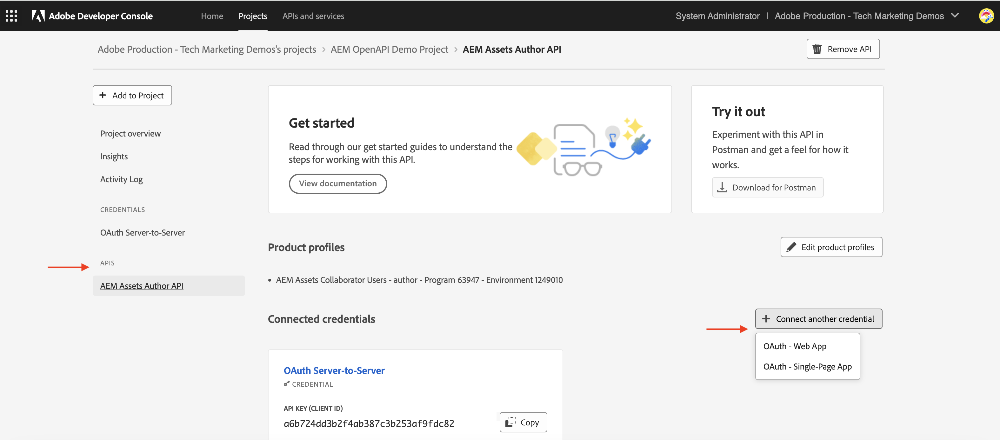
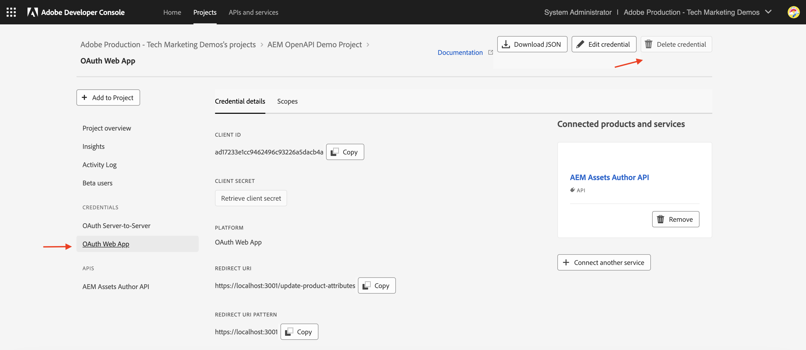
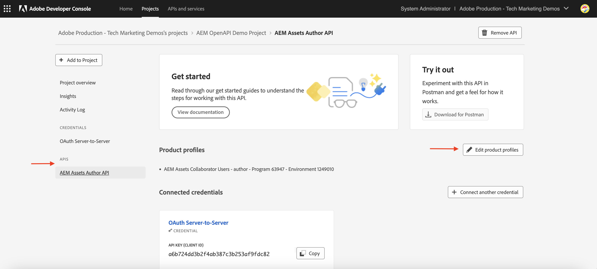
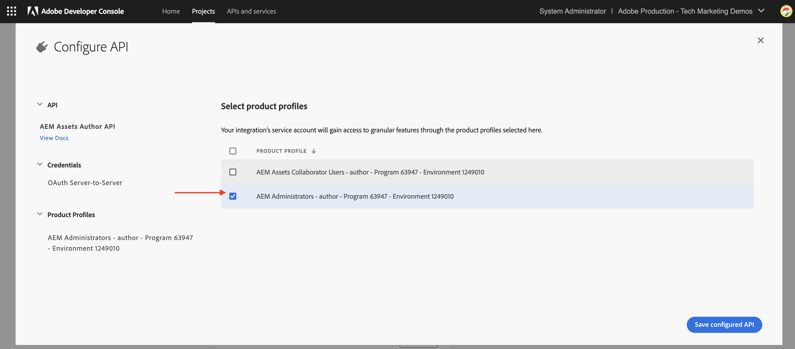
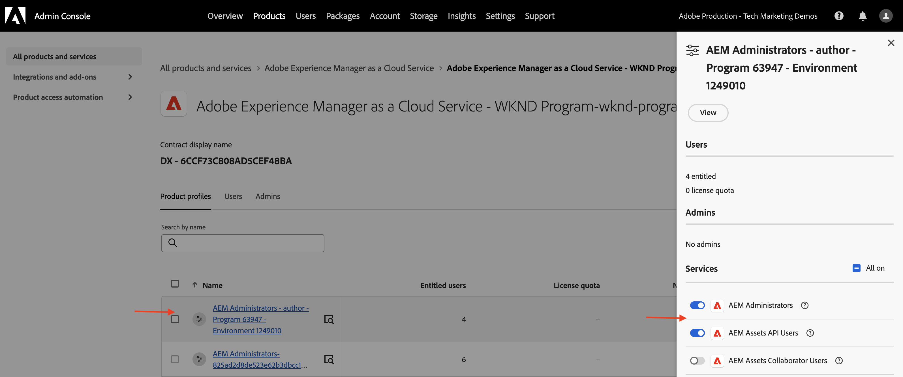
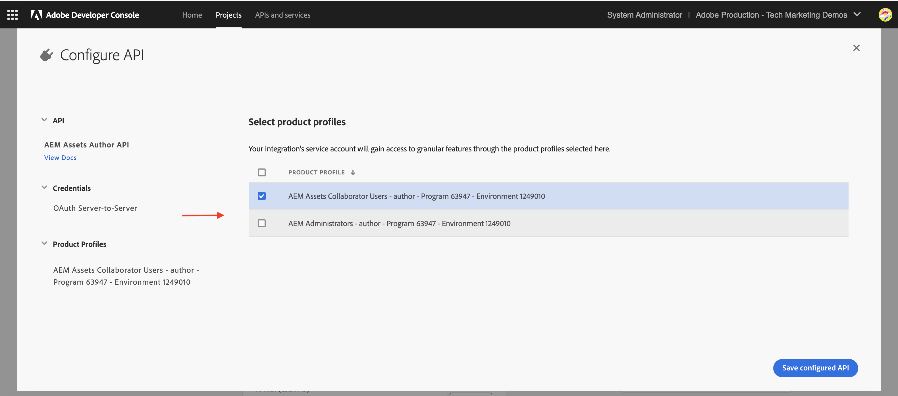

# API Credentials and Product Profile management

Learn how to manage _Credentials and Product Profile_ for OpenAPI-based AEM APIs.

In this tutorial, you learn how to add or remove:

- _Credentials_: Provide authentication for an AEM API.
- _Product Profiles_:  Provide permissions (or authorization) for credentials to access the AEM resources.

## Background

When you use an AEM API, you need to define the _Credentials_ and _Product Profile_ in the Adobe Developer Console (or ADC) project. In the following screenshot, you can see the _Credentials_ and _Product Profile_ for an AEM Assets Author API:

The _Credentials_ provide the authentication mechanism for the API. The _Product Profile_ grants  _permissions (or authorization)_ to the credentials, providing access the AEM resources. The API request could be on behalf of an application or a user. 

A Product Profile is associated with one or more _Services_. In AEM as a Cloud Service, a _Service_ represent user groups with predefined Access Control Lists (ACLs) for repository nodes, allowing granular permission management.

Upon successful API invocation, a user representing the ADC project's credential is created in the AEM Author service, along with the user groups that match the Product Profile and Services configuration.

In above scenario, the user `1323d2...` is created in the AEM Author service, and is a member of the user groups `AEM Assets Collaborator Users - Service` and `AEM Assets Collaborator Users - author - Program XXX - Environment XXX`.

## Add or remove Credentials

The AEM APIs support the following types of credentials for authentication:

1. **OAuth Server-to-Server**: Designed for machine-to-machine interactions.
1. **OAuth Web App**: Designed for user-driven interactions with a backend server in your client application.
1. **OAuth Single Page App**: Designed for user-driven interactions without a backend server in your client application.

You can support various use cases using different types of credentials.

All Credentials are managed in your ADC project. 

>[!BEGINTABS]

>[!TAB Add Credentials]

To add credentials for an AEM API, go to the **APIs** section of your ADC project and click **Connect another credential**. Then, follow the instructions for your specific credential type.

>[!TAB Remove Credentials]

To remove an AEM API credential, select it in the **APIs** section of your ADC project, then click **Delete credential**.

>[!ENDTABS]

## Add or remove Product Profiles

The _Product Profile_ provides the _permissions (or authorization)_ to the credentials to access the AEM resources. The permissions provided by the _Product Profile_ are based on the _Services_ associated with the _Product Profile_. Most of the _Services_ provide the _READ_ permission to the AEM resources, via the user groups in AEM instance that have the same name as the _Service_.

There are times when the credentials (aka technical account user) need additional permissions like _Create, Update, Delete_ (CUD) of AEM resources. In such cases, you need to add a new _Product Profile_ that is associated with the _Services_ that provide the required permissions.

For example, when AEM Assets Author API invocation receives [403 error for non-GET requests](../use-cases/invoke-api-using-oauth-s2s.md#403-error-for-non-get-requests), you can add **AEM Administrators - author - Program XXX - Environment XXX** _Product Profile_ to resolve the issue.

>[!CAUTION]
>
>The **AEM Administrators** service provides _FULL_ administrative access to Experience Manager. Alternatively, you can update [Services permissions](./services-user-group-permission-management.md) to provide only the required permissions.

>[!BEGINTABS]

>[!TAB Add Product Profiles]

To add Product Profiles for an AEM API, click **Edit product profiles** in the **APIs** section of the ADC project, select the desired Product Profile in the **Configure API** dialog, and save your changes.

    

Select the desired Product Profile (e.g., **AEM Administrators - author - Program XXX - Environment XXX**) associated with the required services, then save your changes.

    

Note that the **AEM Administrators - author - Program XXX - Environment XXX** Product Profile is associated with both the **AEM Administrators** service and the **AEM Assets API Users** service. Without the latter, the Product Profile will not appear in the list of available Product Profiles.

    

The **PATCH** request to update the asset metadata should now work without issues.

    

>[!TAB Remove Product Profiles]

To remove Product Profiles for an AEM API, click **Edit product profiles** in the **APIs** section of the ADC project, deselect the desired Product Profile in the **Configure API** dialog, and save your changes.
    

>[!ENDTABS]

## Summary

You learned how to change the authentication mechanism and permissions for AEM APIs using _Credentials and Product Profile_ in the Adobe Developer Console (ADC) project.
