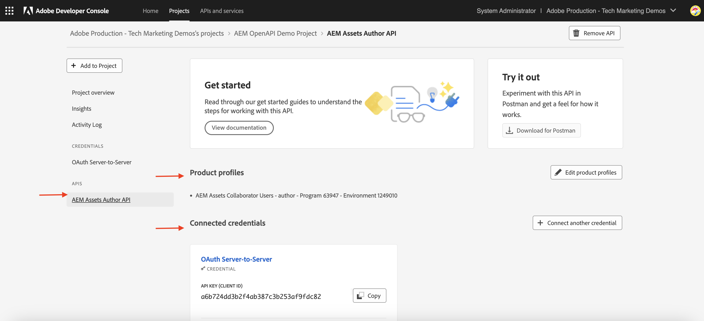
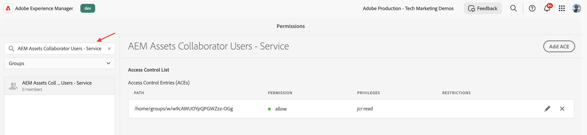
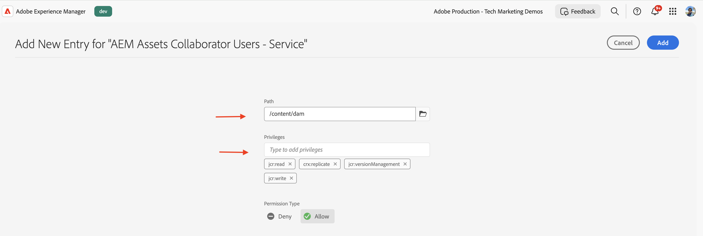
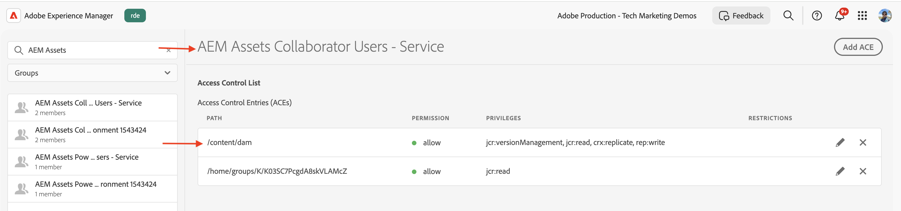
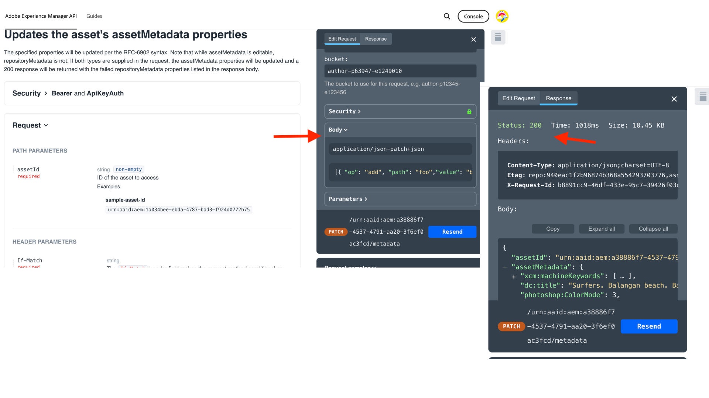

# Product Profile and Services user group permission management

Lean how to manage permissions for the Product Profile and Services user groups in AEM as a Cloud Service.

In this tutorial, you learn:

- Product Profile and its association with Services.
- Updating the Services user group's permissions.

## Background

When you use an AEM API, you need to assign the _Product Profile_ to the _Credentials_ in the Adobe Developer Console (or ADC) project. The _Product Profile_ (and associated Service) provides the _permissions or authorization_ to the credentials to access the AEM resources. In the following screenshot, you can see the _Credentials_ and _Product Profile_ for an AEM Assets Author API:



A Product Profile is associated with one or more _Services_. In AEM as a Cloud Service, a _Service_ represent user groups with predefined Access Control Lists (ACLs) for repository nodes, allowing granular permission management.


Upon successful API invocation, a user representing the ADC project's credential is created in the AEM Author service, along with the user groups that match the Product Profile and Services configuration. 


In above scenario, the user `1323d2...` is created in the AEM Author service, and is a member of the user groups `AEM Assets Collaborator Users - Service` and `AEM Assets Collaborator Users - author - Program XXX - Environment XXX`.

## Update Services user group permissions

Most of the _Services_ provide the _READ_ permission to the AEM resources, via the user groups in AEM instance that have the same name as the _Service_.

There are times when the credentials (aka technical account user) need additional permissions like _Create, Update, Delete_ (CUD) of AEM resources. In such cases, you can update the permissions of the _Services_ user groups in the AEM instance.

For example, when AEM Assets Author API invocation receives a [403 error for non-GET requests](../use-cases/invoke-api-using-oauth-s2s.md#403-error-for-non-get-requests), you can update the permissions of the _AEM Assets Collaborator Users - Service_ user group in the AEM instance. 

Using the permissions user interface or [Sling Repository Initialization](https://sling.apache.org/documentation/bundles/repository-initialization.html) script, you can update the permissions of the out-of-the-box user groups in the AEM instance.

### Update permissions using the permissions user interface

To update the permissions of the services user group (for example `AEM Assets Collaborator Users - Service`) using the permissions user interface, follow these steps:

- Navigate to the **Tools** > **Security** > **Permissions** in the AEM instance.

- Search for the services user group (for example `AEM Assets Collaborator Users - Service`).

    

- Click **Add ACE** to add a new Access Control Entry (ACE) for the user group.

    

### Update permissions using the repository Initialization script

To update the permissions of the services user group (for example `AEM Assets Collaborator Users - Service`) using the repository initialization script, follow these steps:

- Open the AEM project in your favorite IDE.

- Navigate to the `ui.config` module 

- Create a file in `ui.config/src/main/content/jcr_root/apps/<PROJECT-NAME>/osgiconfig/config.author` named `org.apache.sling.jcr.repoinit.RepositoryInitializer-services-group-acl-update.cfg.json`, with the following content:

    ```json
    {
        "scripts": [
            "set ACL for \"AEM Assets Collaborator Users - Service\" (ACLOptions=ignoreMissingPrincipal)",
            "    allow jcr:read,jcr:versionManagement,crx:replicate,rep:write on /content/dam",
            "end"
        ]
    }
    ```

- Commit and push the changes to the repository.

- Deploy the changes to the AEM instance using the [Cloud Manager full-stack pipeline](https://experienceleague.adobe.com/en/docs/experience-manager-cloud-service/content/implementing/using-cloud-manager/cicd-pipelines/introduction-ci-cd-pipelines#full-stack-pipeline).

- You can also verify the permissions of the user group using the **Permissions** view. Navigate to the **Tools** > **Security** > **Permissions** in the AEM instance.

    

### Verify the permissions

After updating the permissions using any of the above methods, the PATCH request to update the asset metadata should now work without any issues.



## Summary

You learned how to manage permissions for the Product Profile and Services user groups in AEM as a Cloud Service. You can update the permissions of the services user groups in the AEM instance using the permissions user interface or repository initialization script.
