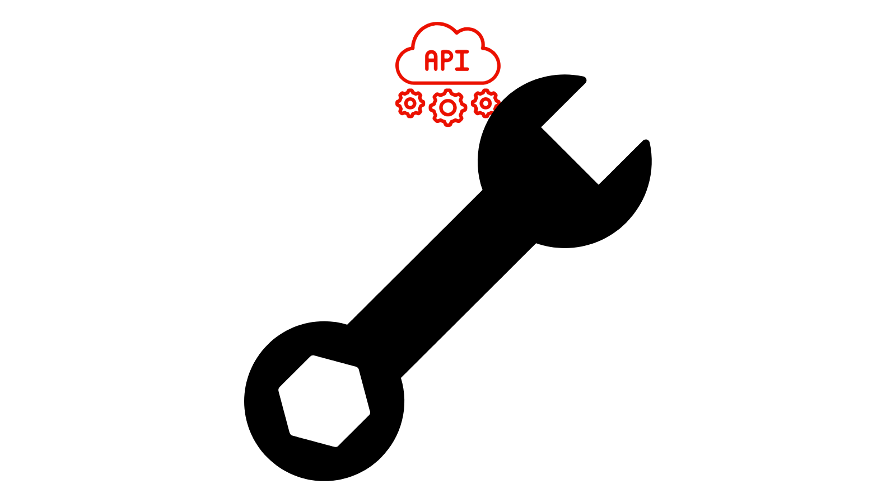

# OpenAPI-based AEM APIs

>[!IMPORTANT]
>
>The OpenAPI-based AEM APIs are only available in AEM as a Cloud Service and are not compatible with AEM 6.X. 

Learn about the OpenAPI-based AEM APIs, including authentication support, key concepts, and how to access Adobe APIs.

The [OpenAPI Specification](https://swagger.io/specification/) (formerly known as Swagger) is a widely used standard for defining RESTful APIs. AEM as a Cloud Service provides several OpenAPI Specification based APIs (or simply OpenAPI-based AEM APIs), making it easier to create custom applications that interact with AEM's author or publish service types. Below are some examples:

**Sites**

- [Sites API](https://developer.adobe.com/experience-cloud/experience-manager-apis/api/stable/sites/): APIs for working with Content Fragments.

**Assets**

- [Folders API](https://developer.adobe.com/experience-cloud/experience-manager-apis/api/experimental/folders/): APIs for working with folders such as create, list and delete folders.

- [Assets Author API](https://developer.adobe.com/experience-cloud/experience-manager-apis/api/experimental/assets/author/): APIs for working with assets and its metadata.

**Forms**

- [Forms Communications APIs](https://developer.adobe.com/experience-cloud/experience-manager-apis/api/experimental/document/): APIs for working with forms and documents.

In future releases, more OpenAPI-based AEM APIs will be added to support additional use cases.

>[!AVAILABILITY]
>
>OpenAPI-based AEM APIs are available as part of an early access program. If you are interested in accessing them, we encourage you to email [aem-apis@adobe.com](mailto:aem-apis@adobe.com) with a description of your use case.

## Authentication support{#authentication-support}

The OpenAPI-based AEM APIs supports OAuth 2.0 authentication, including the following grant types:

- **OAuth Server-to-Server credential**: Ideal for backend services needing API access without user interaction. It uses the _client_credentials_ grant type, enabling secure access management at the server level. For more information, see [OAuth Server-to-Server credential](https://developer.adobe.com/developer-console/docs/guides/authentication/ServerToServerAuthentication/#oauth-server-to-server-credential).

- **OAuth Web App credential**: Suitable for web applications with frontend and _backend_ components accessing AEM APIs on behalf of users. It uses the _authorization_code_ grant type, where the backend server securely manages secrets and tokens. For more information, see [OAuth Web App credential](https://developer.adobe.com/developer-console/docs/guides/authentication/UserAuthentication/implementation/#oauth-web-app-credential).

- **OAuth Single Page App credential**: Designed for SPAs running in the browser, which needs to access APIs on behalf of a user without a backend server. It uses the _authorization_code_ grant type and relies on client-side security mechanisms using PKCE (Proof Key for Code Exchange) to secure the authorization code flow. For more information, see [OAuth Single Page App credential](https://developer.adobe.com/developer-console/docs/guides/authentication/UserAuthentication/implementation/#oauth-single-page-app-credential).

## Difference between OAuth Server-to-Server and OAuth Web App/Single Page App credentials{#difference-between-oauth-server-to-server-and-oauth-web-app-single-page-app-credentials}

| | OAuth server-to-server | OAuth user authentication (web-app) |
| --- | --- | --- |
| Authentication Purpose| Designed for machine-to-machine interactions.  | Designed for user-driven interactions.  |
| Token Behavior | Issues access tokens that represent the client application itself. | Issues access tokens on behalf of an authenticated user. |
| Use Cases | Backend services needing API access without user interaction. | Web applications with frontend and backend components accessing APIs on behalf of users. |
| Security Considerations | Securely store sensitive credentials (`client_id`, `client_secret`) in backend systems. | User's authenticate and are granted their own temporary access token. Securely store sensitive credentials (`client_id`, `client_secret`) in backend systems.   |
| Grant Type | _client_credentials_ | _authorization_code_ |

## Accessing Adobe APIs and related concepts{#accessing-adobe-apis-and-related-concepts}

Before accessing Adobe APIs, it's essential to understand these key constructs:

- **[Adobe Developer Console](https://developer.adobe.com/)**: The developer hub for accessing Adobe APIs, SDKs, real-time events, serverless functions, and more. Note that it is different from the _AEM_ Developer Console, which is used for debugging AEM applications.

- **[Adobe Developer Console Project](https://developer.adobe.com/developer-console/docs/guides/projects/)**: Central place for managing API integrations, events, and runtime functions. Here, you configure APIs, set authentication, and generate required credentials.

- **[Product Profiles](https://helpx.adobe.com/enterprise/using/manage-product-profiles.html)**: Product Profiles provide a permission preset that allows you to control user or application access to Adobe products such as AEM, Adobe Target, Adobe Analytics, and others. Every Adobe product has predefined product profiles associated with it.

- **Services**: Services define the actual permissions and are associated with the Product Profile. To reduce or increase the permissions preset, you can deselect or select the services associated with the Product Profile. Thus, allowing you to control the level of access to the product and its APIs. In AEM as a Cloud Service, services represent user groups with predefined Access Control Lists (ACLs) for repository nodes, allowing granular permission management.

## Get started

Learn how to set up your AEM as a Cloud Service environment and an Adobe Developer Console project to enable access to the OpenAPI-based AEM APIs. Also access AEM API using brower to verify the setup and review the request and response.

<!-- CARDS
{target = _self}

* ./setup.md
  {title = Set up OpenAPI-based AEM APIs}
  {description = Learn how to set up your AEM as a Cloud Service environment to enable access to the OpenAPI-based AEM APIs.}
  {image = ./assets/setup/OpenAPI-Setup.png}
-->
<!-- START CARDS HTML - DO NOT MODIFY BY HAND -->

    

        

            

                <figure class="image x-is-16by9">
                    
                </figure>
            

            

                

                    

                        <a href="./setup.md" target="_self" rel="referrer" title="Set up OpenAPI-based AEM APIs">Set up OpenAPI-based AEM APIs</a>
                    

                    
Learn how to set up your AEM as a Cloud Service environment to enable access to the OpenAPI-based AEM APIs.

                

                <a href="./setup.md" target="_self" rel="referrer" class="spectrum-Button spectrum-Button--outline spectrum-Button--primary spectrum-Button--sizeM" style="align-self: flex-start; margin-top: 1rem;">
                    Learn more
                </a>
            

        

    

<!-- END CARDS HTML - DO NOT MODIFY BY HAND -->
  

## API tutorials

Learn how to use the OpenAPI-based AEM APIs using different OAuth authentication methods:

<!-- CARDS
{target = _self}

* ./use-cases/invoke-api-using-oauth-s2s.md
  {title = Invoke API using Server-to-Server authentication}
  {description = Learn how to invoke OpenAPI-based AEM APIs from a custom NodeJS application using OAuth Server-to-Server authentication.}
  {image = ./assets/s2s/OAuth-S2S.png}
* ./use-cases/invoke-api-using-oauth-web-app.md
  {title = Invoke API using Web App authentication}
  {description = Learn how to invoke OpenAPI-based AEM APIs from a custom web application using OAuth Web App authentication.}
  {image = ./assets/web-app/OAuth-WebApp.png}  
-->
<!-- START CARDS HTML - DO NOT MODIFY BY HAND -->

    

        

            

                <figure class="image x-is-16by9">
                    
                </figure>
            

            

                

                    

                        <a href="./use-cases/invoke-api-using-oauth-s2s.md" target="_self" rel="referrer" title="Invoke API using Server-to-Server authentication">Invoke API using Server-to-Server authentication</a>
                    

                    
Learn how to invoke OpenAPI-based AEM APIs from a custom NodeJS application using OAuth Server-to-Server authentication.

                

                <a href="./use-cases/invoke-api-using-oauth-s2s.md" target="_self" rel="referrer" class="spectrum-Button spectrum-Button--outline spectrum-Button--primary spectrum-Button--sizeM" style="align-self: flex-start; margin-top: 1rem;">
                    Learn more
                </a>
            

        

    

    

        

            

                <figure class="image x-is-16by9">
                    
                </figure>
            

            

                

                    

                        <a href="./use-cases/invoke-api-using-oauth-web-app.md" target="_self" rel="referrer" title="Invoke API using Web App authentication">Invoke API using Web App authentication</a>
                    

                    
Learn how to invoke OpenAPI-based AEM APIs from a custom web application using OAuth Web App authentication.

                

                <a href="./use-cases/invoke-api-using-oauth-web-app.md" target="_self" rel="referrer" class="spectrum-Button spectrum-Button--outline spectrum-Button--primary spectrum-Button--sizeM" style="align-self: flex-start; margin-top: 1rem;">
                    Learn more
                </a>
            

        

    

<!-- END CARDS HTML - DO NOT MODIFY BY HAND -->
