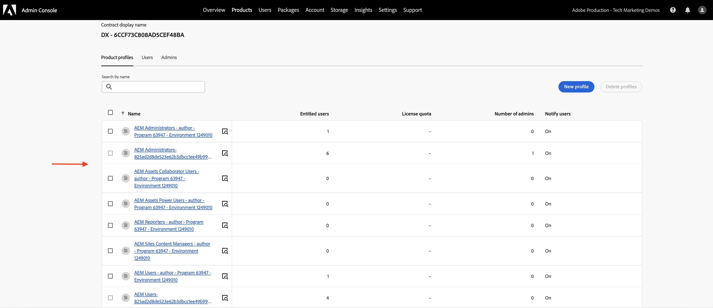

# Set up OpenAPI-based AEM APIs

Learn how to set up your AEM as a Cloud Service environment to enable access to the OpenAPI-based AEM APIs.

>[!AVAILABILITY]
>
>OpenAPI-based AEM APIs are available as part of an early access program. If you are interested in accessing them, we encourage you to email [aem-apis@adobe.com](mailto:aem-apis@adobe.com) with a description of your use case.

>[!VIDEO](https://video.tv.adobe.com/v/3457510?quality=12&learn=on)


The high-level set up process involves the following steps:

1. Modernization of AEM as a Cloud Service environment.
1. Enable AEM APIs access.
1. Create Adobe Developer Console (ADC) Project.
1. Configure ADC Project
1. Configure the AEM instance to enable ADC Project communication.

## Modernization of AEM as a Cloud Service environment{#modernization-of-aem-as-a-cloud-service-environment}

The modernization of AEM as a Cloud Service environment is a one-time per environment activity that involves the following steps:

- Update to the AEM Release **2024.10.18459.20241031T210302Z** or later.
- Add new Product Profiles to it, if environment was created before the release 2024.10.18459.20241031T210302Z.

### Update AEM instance{#update-aem-instance}

To update the AEM instance, in the Adobe [Cloud Manager](https://my.cloudmanager.adobe.com/)'s _Environments_ section, select the _ellipsis_ icon next to the environment name and select **Update** option.


Then click the **Submit** button and run the _suggested_ Fullstack Pipeline.


In my case, the Fullstack Pipeline is named **Dev :: Fullstack-Deploy**, and the AEM environment is called **wknd-program-dev**. Your names may be different.

### Add new Product Profiles{#add-new-product-profiles}

To add new Product Profiles to the AEM instance, in the Adobe [Cloud Manager](https://my.cloudmanager.adobe.com/)'s _Environments_ section, select the _ellipsis_ icon next to the environment name and select the **Add Product Profiles** option. 


You can review the newly added Product Profiles by clicking on the _ellipsis_ icon next to the environment name and selecting **Manage Access** > **Author Profiles**.

The _Admin Console_ window displays the newly added Product Profiles.



The above steps complete the modernization of the AEM as a Cloud Service environment.

## Enable AEM APIs access{#enable-aem-apis-access}

The presence of the _new Product Profiles_ enable OpenAPI-based AEM API access in the Adobe Developer Console (ADC). Recall that [Adobe Developer Console (ADC)](./overview.md#accessing-adobe-apis-and-related-concepts) is the developer hub for accessing Adobe APIs, SDKs, real-time events, serverless functions, and more.

The newly added Product Profiles are associated with the _Services_ that represent _AEM user groups with predefined Access Control Lists (ACLs)_. The _Services_ are used to control the level of access to the AEM APIs.

You can also select or deselect the _Services_ associated with the Product Profile to reduce or increase the level of access.

Review the association by clicking on the _View Details_ icon next to the Product Profile name. 


By default, the **AEM Assets API Users** Service is not associated with any Product Profile. Let's associate it with the newly added **AEM Assets Collaborator Users - author - Program XXX - Environment XXX** Product Profile. After this association, the ADC Project's _Asset Author API_ can setup the desired Server-to-Server authentication and associate the authentication account from ADC project (created in next step) with the Product Profile.


>[!IMPORTANT]
>
>The above step is critical to enable the Server-to-Server authentication for the AEM Assets API. Without this association, the AEM Assets API cannot be used with the Server-to-Server authentication method.

## Create Adobe Developer Console (ADC) Project{#adc-project}

The ADC Project is used to add the desired APIs, set up its authentication, and associate the authentication account with the Product Profile.

To create an ADC Project:

1. Login to the [Adobe Developer Console](https://developer.adobe.com/console) using your Adobe ID.

    

1. From the _Quick Start_ section, click on the **Create new project** button. 

    

1. It creates a new project with the default name.

    

1. Edit the project name by clicking the **Edit project** button in the top right corner. Provide a meaningful name and click **Save**.

    

## Configure ADC Project{#configure-adc-project}

After creating the ADC Project, you have to add the desired AEM APIs, set up its authentication, and associate the authentication account with the Product Profile.

1. To add AEM APIs, click on the **Add API** button.

    

1. In the _Add API_ dialog, filter by _Experience Cloud_ and select the desired AEM API. For example, in this case, the _Asset Author API_ is selected.

    

1. Next, in the _Configure API_ dialog, select the desired authentication option. For example, in this case, the **Server-to-Server** authentication option is selected.

    

    The Server-to-Server authentication is ideal for backend services needing API access without user interaction. The Web App and Single Page App authentication options are suitable for applications needing API access on behalf of users. See [Difference between OAuth Server-to-Server vs Web App vs Single Page App credentials](./overview.md#difference-between-oauth-server-to-server-vs-web-app-vs-single-page-app-credentials) for more information.

1. If needed, you can rename the API for easier identification. For demo purposes, the default name is used.

    

1. In this case, the authentication method is **OAuth Server-to-Server** so you need to associate the authentication account with the Product Profile. Select the **AEM Assets Collaborator Users - author - Program XXX - Environment XXX** Product Profile and click **Save**. 

    

1. Review the AEM API and authentication configuration.

    

    

If you choose the **OAuth Web App** or **OAuth Single Page App** authentication method, the Product Profile association is not prompted but application redirect URI is required. The application redirect URI is used to redirect the user to the application after authentication with an authorization code. The relevent use cases tutorials outline such authentication specific configurations.

## Configure the AEM instance to enable ADC Project communication{#configure-aem-instance}

To enable the ADC Project's ClientID to communication with the AEM instance, you need to configure the AEM instance.

It is done by defining the API configuration in the `config.yaml` file of
the AEM Project and deploying it using the Config Pipeline in the Cloud Manager.

1. In AEM Project, locate or create the `config.yaml` file from the `config` folder.

    

1. Add the following configuration to the `config.yaml` file.

    ```yaml
    kind: "API"
    version: "1.0"
    metadata: 
        envTypes: ["dev", "stage", "prod"]
    data:
        allowedClientIDs:
            author:
            - "<ADC Project's Credentials ClientID>"
    ```

    Replace `<ADC Project's Credentials ClientID>` with the actual ClientID of the ADC Project's Credentials value. The API endpoint that is used in this tutorial is available only on the author tier, but for other APIs, the yaml config can also have a _publish_ or _preview_ node.

    >[!CAUTION]
    >
    > For demo purposes, the same ClientID is used for all environments. It is recommended to use separate ClientID per environment (dev, stage, prod) for better security and control.

1. Commit the config changes and push the changes to the remote Git repository the Cloud Manager pipeline is connected to.

1. Deploy the above changes using the Config Pipeline in the Cloud Manager. Note that the `config.yaml` file can also be installed in an RDE, using command line tooling.

    

## Next steps

Once the AEM instance is configured to enable ADC Project communication, you can start using the OpenAPI-based AEM APIs. Learn how to use the OpenAPI-based AEM APIs using different OAuth authentication methods:

<!-- CARDS
{target = _self}

* ./use-cases/invoke-api-using-oauth-s2s.md
  {title = Invoke API using Server-to-Server authentication}
  {description = Learn how to invoke OpenAPI-based AEM APIs from a custom NodeJS application using OAuth Server-to-Server authentication.}
  {image = ./assets/s2s/OAuth-S2S.png}
* ./use-cases/invoke-api-using-oauth-web-app.md
  {title = Invoke API using Web App authentication}
  {description = Learn how to invoke OpenAPI-based AEM APIs from a custom web application using OAuth Web App authentication.}
  {image = ./assets/web-app/OAuth-WebApp.png}
* ./use-cases/invoke-api-using-oauth-single-page-app.md
  {title = Invoke API using Single Page App authentication}
  {description = Learn how to invoke OpenAPI-based AEM APIs from a custom Single Page App (SPA) using OAuth 2.0 PKCE flow.}
  {image = ./assets/spa/OAuth-SPA.png}  
-->
<!-- START CARDS HTML - DO NOT MODIFY BY HAND -->
<div class="columns">
    <div class="column is-half-tablet is-half-desktop is-one-third-widescreen" aria-label="Invoke API using Server-to-Server authentication">
        <div class="card" style="height: 100%; display: flex; flex-direction: column; height: 100%;">
            <div class="card-image">
                <figure class="image x-is-16by9">
                    <a href="./use-cases/invoke-api-using-oauth-s2s.md" title="Invoke API using Server-to-Server authentication" target="_self" rel="referrer">
                        
                    </a>
                </figure>
            </div>
            <div class="card-content is-padded-small" style="display: flex; flex-direction: column; flex-grow: 1; justify-content: space-between;">
                <div class="top-card-content">
                    <p class="headline is-size-6 has-text-weight-bold">
                        <a href="./use-cases/invoke-api-using-oauth-s2s.md" target="_self" rel="referrer" title="Invoke API using Server-to-Server authentication">Invoke API using Server-to-Server authentication</a>
                    </p>
                    <p class="is-size-6">Learn how to invoke OpenAPI-based AEM APIs from a custom NodeJS application using OAuth Server-to-Server authentication.</p>
                </div>
                <a href="./use-cases/invoke-api-using-oauth-s2s.md" target="_self" rel="referrer" class="spectrum-Button spectrum-Button--outline spectrum-Button--primary spectrum-Button--sizeM" style="align-self: flex-start; margin-top: 1rem;">
                    <span class="spectrum-Button-label has-no-wrap has-text-weight-bold">Learn more</span>
                </a>
            </div>
        </div>
    </div>
    <div class="column is-half-tablet is-half-desktop is-one-third-widescreen" aria-label="Invoke API using Web App authentication">
        <div class="card" style="height: 100%; display: flex; flex-direction: column; height: 100%;">
            <div class="card-image">
                <figure class="image x-is-16by9">
                    <a href="./use-cases/invoke-api-using-oauth-web-app.md" title="Invoke API using Web App authentication" target="_self" rel="referrer">
                        
                    </a>
                </figure>
            </div>
            <div class="card-content is-padded-small" style="display: flex; flex-direction: column; flex-grow: 1; justify-content: space-between;">
                <div class="top-card-content">
                    <p class="headline is-size-6 has-text-weight-bold">
                        <a href="./use-cases/invoke-api-using-oauth-web-app.md" target="_self" rel="referrer" title="Invoke API using Web App authentication">Invoke API using Web App authentication</a>
                    </p>
                    <p class="is-size-6">Learn how to invoke OpenAPI-based AEM APIs from a custom web application using OAuth Web App authentication.</p>
                </div>
                <a href="./use-cases/invoke-api-using-oauth-web-app.md" target="_self" rel="referrer" class="spectrum-Button spectrum-Button--outline spectrum-Button--primary spectrum-Button--sizeM" style="align-self: flex-start; margin-top: 1rem;">
                    <span class="spectrum-Button-label has-no-wrap has-text-weight-bold">Learn more</span>
                </a>
            </div>
        </div>
    </div>
    <div class="column is-half-tablet is-half-desktop is-one-third-widescreen" aria-label="Invoke API using Single Page App authentication">
        <div class="card" style="height: 100%; display: flex; flex-direction: column; height: 100%;">
            <div class="card-image">
                <figure class="image x-is-16by9">
                    <a href="./use-cases/invoke-api-using-oauth-single-page-app.md" title="Invoke API using Single Page App authentication" target="_self" rel="referrer">
                        
                    </a>
                </figure>
            </div>
            <div class="card-content is-padded-small" style="display: flex; flex-direction: column; flex-grow: 1; justify-content: space-between;">
                <div class="top-card-content">
                    <p class="headline is-size-6 has-text-weight-bold">
                        <a href="./use-cases/invoke-api-using-oauth-single-page-app.md" target="_self" rel="referrer" title="Invoke API using Single Page App authentication">Invoke API using Single Page App authentication</a>
                    </p>
                    <p class="is-size-6">Learn how to invoke OpenAPI-based AEM APIs from a custom Single Page App (SPA) using OAuth 2.0 PKCE flow.</p>
                </div>
                <a href="./use-cases/invoke-api-using-oauth-single-page-app.md" target="_self" rel="referrer" class="spectrum-Button spectrum-Button--outline spectrum-Button--primary spectrum-Button--sizeM" style="align-self: flex-start; margin-top: 1rem;">
                    <span class="spectrum-Button-label has-no-wrap has-text-weight-bold">Learn more</span>
                </a>
            </div>
        </div>
    </div>
</div>
<!-- END CARDS HTML - DO NOT MODIFY BY HAND -->
